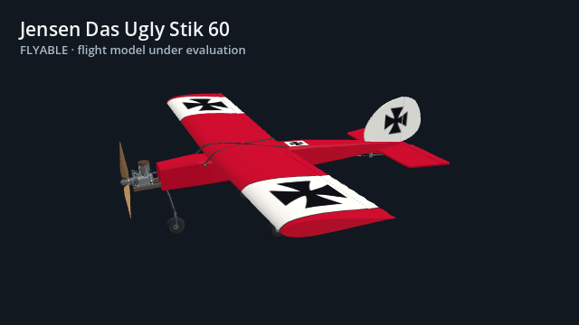
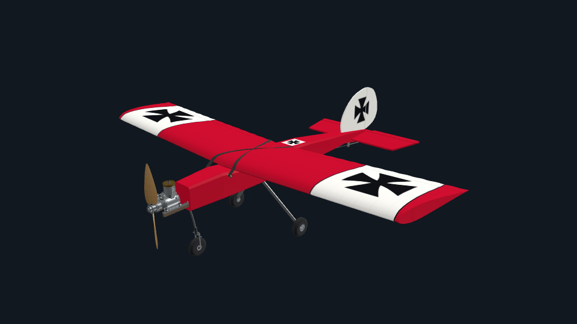
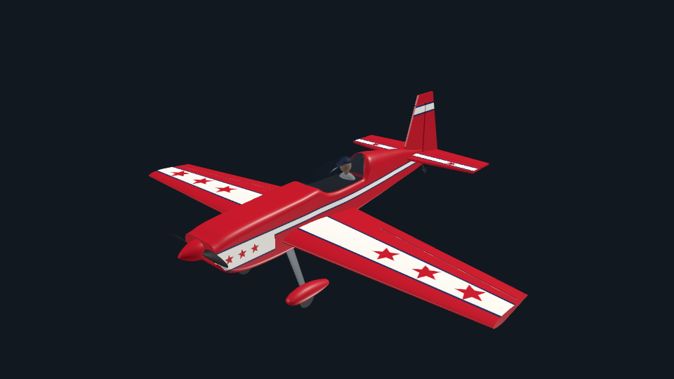
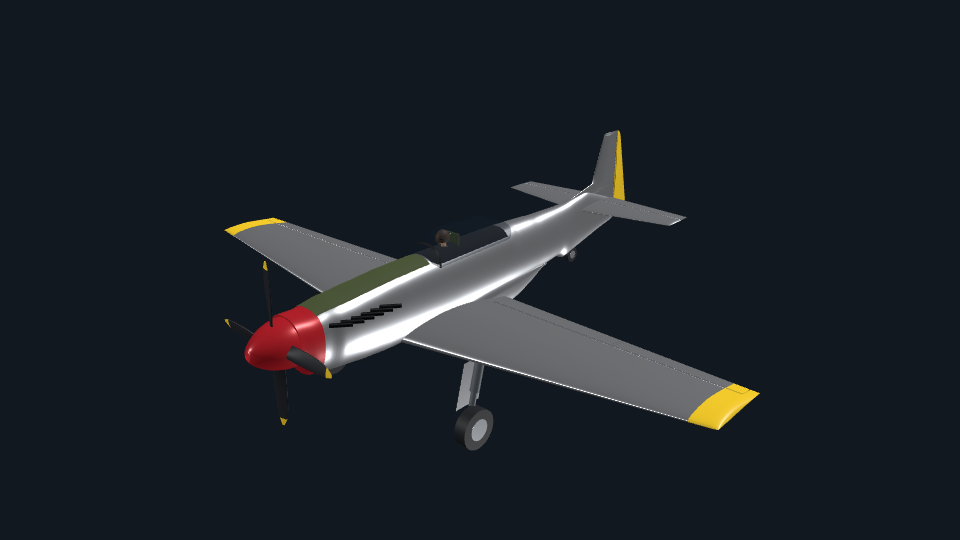
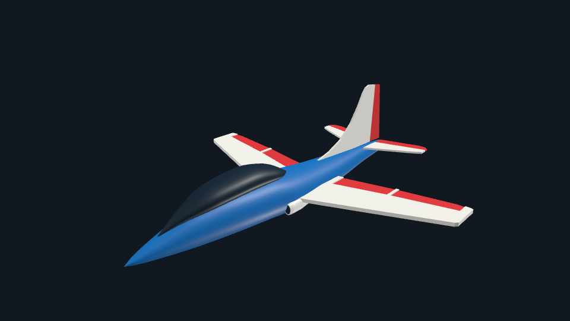
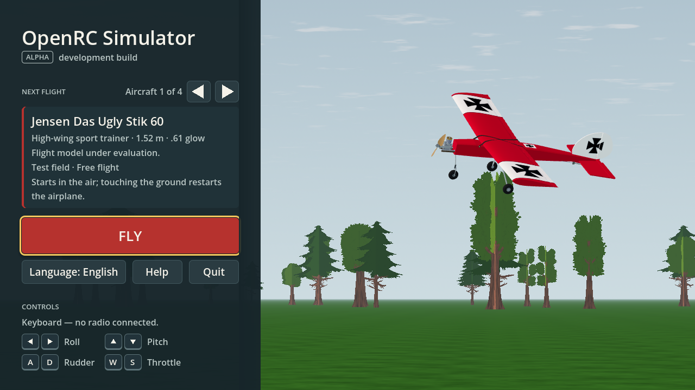
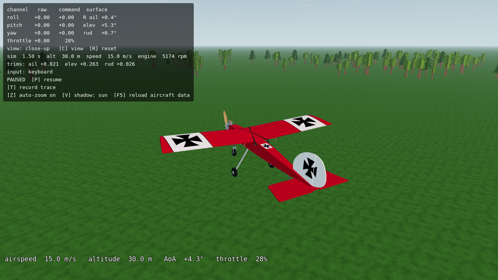

<h1 align="center">OpenRC Simulator</h1>

<p align="center"><strong>RC flight, from the pilot's point of view.</strong><br>
An open-source airplane simulator built with Godot 4.7.2.</p>

<p align="center">
  <a href="https://github.com/bultodepapas/OpenRCsimulator/releases"><strong>Download the alpha</strong></a> ·
  <a href="docs/FIRST-LAUNCH.md">First flight</a> ·
  <a href="#aircraft-hangar">Aircraft hangar</a> ·
  <a href="ROADMAP.md">Roadmap</a> ·
  <a href="CONTRIBUTING.md">Contribute</a>
</p>

<p align="center">
  <a href="https://github.com/bultodepapas/OpenRCsimulator/actions/workflows/ci.yml"></a>
  <br><strong>Windows · Linux · macOS</strong> &nbsp; | &nbsp; USB radio · Gamepad · Keyboard &nbsp; | &nbsp; English · Español
</p>

<p align="center">
  
  <br><sub>Current models rendered in Godot. Studio camera tour; see actual app captures below.</sub>
</p>

## Aircraft hangar

<table>
  <tr>
    <td width="50%" align="center">
      <a href="docs/UGLY-STIK-PLAN.md"></a>
      <br><strong>Jensen Das Ugly Stik 60</strong>
      <br>High-wing sport trainer · 1.52 m · .61 glow
      <br><strong>Flyable</strong> · Flight model under evaluation
    </td>
    <td width="50%" align="center">
      <a href="docs/EXTRA-300-PLAN.md"></a>
      <br><strong>Great Planes Extra 300S .60</strong>
      <br>Low-wing aerobat · 1.63 m · .61 glow
      <br><strong>Experimental</strong> · Physics estimated from plans
    </td>
  </tr>
  <tr>
    <td width="50%" align="center">
      <a href="docs/P51-PLAN.md"></a>
      <br><strong>P-51D Mustang 1/4</strong>
      <br>Giant-scale warbird · 2.82 m · 120 cc gasoline
      <br><strong>Experimental</strong> · Physics scaled from full size
    </td>
    <td width="50%" align="center">
      <a href="docs/AVANTI-S-PLAN.md"></a>
      <br><strong>SebArt Avanti S</strong>
      <br>Sport jet · 2.00 m · JetCat P100-RX
      <br><strong>Visual preview</strong> · Fly disabled
    </td>
  </tr>
</table>

The experimental aircraft have automated checks but have **not been validated against real flight**. Avanti S awaits turbine simulation. [Catalog and data files](app/app_state/aircraft_catalog.gd) · [How these images were captured](docs/media/README.md)

## Inside the simulator

| Choose your aircraft | Fly over the test field |
| :---: | :---: |
|  |  |
| Home, Help and pause menus in English and Spanish | Pilot view, close-up camera, auto-zoom and flight traces |

## Play the alpha

1. Open [Releases](https://github.com/bultodepapas/OpenRCsimulator/releases) and download the ZIP for **Windows**, **Linux x86_64** or **macOS Intel / Apple Silicon**. These are prereleases; choose the newest test build.
2. Extract the archive and follow the [first-launch guide](docs/FIRST-LAUNCH.md). No Godot installation is needed for a release build. `SHA256SUMS` accompanies each release.
3. Choose an aircraft on Home and press **Fly**. The airplane starts in the air, trimmed for level flight. **Esc** opens the pause menu. Home and Help support **English and Spanish**.

Connect a USB radio before flying, move its throttle to low to arm it, and press **K** to calibrate if needed. While connected, the radio controls flight; menus use the keyboard or mouse. Unplugging the radio pauses the simulation.

<details>
<summary><strong>Keyboard controls</strong> — sticks, camera, traces and radio calibration</summary>


Keyboard letters refer to physical QWERTY positions; the in-game Help displays labels for your keyboard layout.

| Key | Action |
| --- | --- |
| ← / → | Aileron / roll |
| ↓ / ↑ | Elevator / pitch; ↓ pulls the stick back |
| A / D | Rudder |
| W / S | Increase / decrease throttle |
| Esc | Pause menu; cancel radio calibration |
| R | Restart flight |
| P | Resume after a radio failsafe |
| C | Pilot view / close-up |
| Z | Toggle auto-zoom |
| V | Ground shadow: sun / vertical / off |
| K · Enter | Start radio calibration · advance a step |
| T | Start / save a flight trace |
| F3 | Toggle performance numbers |

</details>

## Flight, scenery and validation

- **Flight simulation:** fixed 240 Hz, 64-bit state, six-degree-of-freedom aerodynamics, stall and spin behavior, propeller torque, gyroscopic effects, servos and trimmed starts.
- **Pilot view:** auto-zoom, HUD, engine sound and a projected ground shadow. A shared field supplies grass, sky, haze, clouds and a deterministic treeline with three tree variants.
- **Repeatable validation:** unit and input tests, golden flights, trimmed-flight traces, frame-rate independence, capture comparisons and exported-pack checks. [CI results](https://github.com/bultodepapas/OpenRCsimulator/actions) and [visual evidence](docs/research/visual-quality-implementation/L6b/README.md) are public.

This is an **early alpha**. Takeoff, landing and wind are not implemented; touching the ground restarts the flight. Trees are visual scenery without collisions. Pilot acceptance of aircraft visibility against the new trees and performance measurements on real GPUs are still pending. Scalable quality settings are part of the [visual-quality plan](docs/VISUAL-QUALITY-PLAN.md).

The next flight-model milestone is feedback from RC pilots, starting with the Stik. Automated regression checks establish consistency; pilot testing must establish how it feels.

<details>
<summary><strong>Build and test from source</strong> — Godot setup and developer commands</summary>


On Linux, with Git, Python 3, curl and unzip available:

```sh
git clone https://github.com/bultodepapas/OpenRCsimulator.git
cd OpenRCsimulator

app/get-godot.sh  # downloads the pinned, SHA-512-verified engine into .tools/
"$(app/get-godot.sh)" --headless --path app --import
"$(app/get-godot.sh)" --path app
```

The last command needs a display. On Windows or macOS, use **Godot 4.7.2**, import `app/project.godot` in the editor and run the project. The Godot app in `app/` is the simulator; the three.js prototype is archived.

| Task | Command |
| --- | --- |
| Full headless checks | `app/test.sh` |
| Capture suite, with `xvfb-run` and Mesa installed | `app/capture.sh` |
| Three-second flight trace | `"$(app/get-godot.sh)" --headless --path app -- --trace=/tmp/flight.csv --t=3` |
| Windows, Linux and macOS release packages | `app/export.sh` |

Exports go to `dist/`, include checksums and use `git describe` as their build identity. The first export downloads about 1.28 GB of verified Godot templates. See [CONTRIBUTING.md](CONTRIBUTING.md) for the development workflow and [AGENTS.md](AGENTS.md) for the full command reference.

</details>

## Explore the project

| Location | Contents |
| --- | --- |
| [`app/`](app/) | Godot app, flight physics, controls, UI, rendering and tests |
| [`assets/`](assets/) | Aircraft source data, geometry generators and asset provenance |
| [`docs/`](docs/) | Implementation plans, release notes and research evidence |
| [`research/`](research/) · [`tools/`](tools/) | Reproducible experiments and asset-processing tools |
| [`prototypes/stage0/three/`](prototypes/stage0/three/) | Archived three.js bake-off prototype |

[Roadmap](ROADMAP.md) · [Architecture decisions](DECISIONS.md) · [Stack](STACK.md) · [Practical lessons](LEARNINGS.md) · [Research](RESEARCH.md) · [Visual-quality plan](docs/VISUAL-QUALITY-PLAN.md) · [Menu plan](docs/MENU-PLAN.md)

## Contribute

RC pilot feedback, reproducible bug reports, aircraft references and measured performance reports are especially useful. Read the [contribution guide](CONTRIBUTING.md) before changing code or adding assets. Development is heavily AI-assisted; changes still need sources, review and evidence.

## License

Project code is licensed under [MIT](LICENSE). Third-party assets retain their own licenses; see the [landscape provenance](assets/landscape/PROVENANCE.json) and [bundled tree license](app/assets/landscape/trees/LICENSE.txt). Reference plans and scans kept locally in the ignored `references/` folder are not bundled with the simulator.
