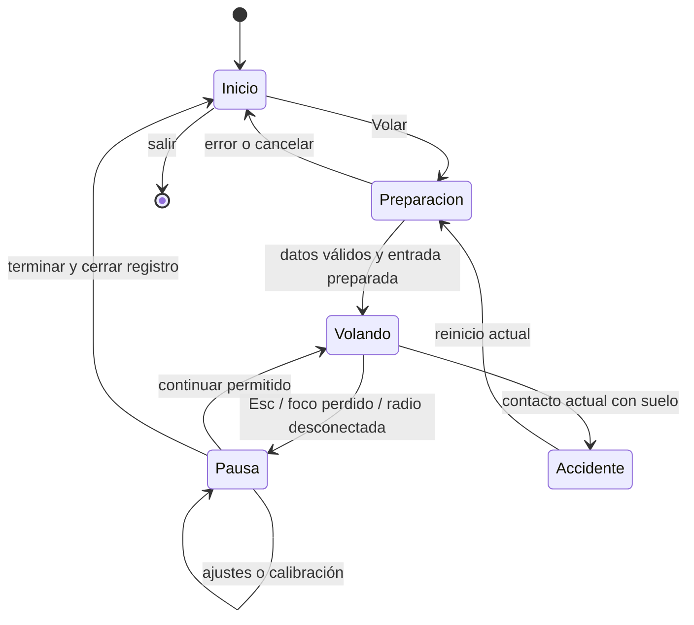

# OpenRC Simulator — entrada, menús y evolución del producto

**Fecha:** 2026-10-05. **Revisión 2:** ampliada mediante [diez investigaciones en internet](research/menu-investigations/README.md). **Estado:** propuesta de diseño e implementación; este documento no implementa pantallas ni cambia la física. **Base de la auditoría inicial:** `bc078ef`, con desarrollo paralelo activo.

**Propuesta:** abrir el simulador en una pantalla tranquila que muestre nuestro avión, permita entrar a volar en una acción y ofrezca Aviones, Escenarios y Ajustes desde la primera entrega. Empezar con el Ugly Stik y el campo existentes. Ampliar el contenido cuando tenga pruebas y una experiencia de vuelo propia.

El menú es una nueva línea de trabajo **UI**, subordinada a las pruebas con pilotos de [ROADMAP.md](../ROADMAP.md). No sustituye M1–M5, Gate 2, Gate F ni el [plan del paisaje](LANDSCAPE-PLAN.md). La solicitud actual cambia la prioridad de los menús, que el roadmap había dejado fuera de la primera alpha; la numeración de versiones que sigue es una propuesta, no un lanzamiento aprobado.

## Cambios tras las diez investigaciones

| Investigación | Mejora incorporada | Paso que la comprueba |
| --- | --- | --- |
| [01 · Ciclo de vida](research/menu-investigations/01-godot-shell-lifecycle.md) | Raíz persistente y vuelo creado bajo demanda; carga en hilos solo si una medición la justifica | UI-01/03 |
| [02 · Input y foco](research/menu-investigations/02-input-focus-radio-isolation.md) | Quitar navegación joypad predeterminada; separar pausa voluntaria, lectura de ejes y failsafe | UI-01/02/10a |
| [03 · Ajustes](research/menu-investigations/03-settings-content-versioning.md) | Confirmación de pantalla con reloj de UI, recuperación de settings y versión de build separada del motor | UI-04/07/09b |
| [04 · Simuladores RC](research/menu-investigations/04-rc-simulator-navigation.md) | Volar destacado y resumen de avión/campo; catálogos pequeños sin filtros innecesarios | UI-01/05/06 |
| [05 · Radio](research/menu-investigations/05-radio-onboarding.md) | Cuatro estados comprensibles y verificación de Classic/Advanced antes de cambiar recomendaciones | UI-10a/b |
| [06 · Aprendizaje](research/menu-investigations/06-training-modes-progression.md) | Ayuda optativa de orientación primero; lecciones solo con objetivos y feedback comprobables | UI-04; entrenamiento futuro |
| [07 · Estilo](research/menu-investigations/07-visual-direction-assets.md) | Campo tranquilo como dirección inicial; club y banco de trabajo tienen usos posteriores definidos | UI-01/05 |
| [08 · Accesibilidad](research/menu-investigations/08-accessibility-legibility.md) | Paleta calculada, foco separado del rojo y objetivo de ampliación de texto al 200 % | UI-01/09a |
| [09 · Resoluciones e idiomas](research/menu-investigations/09-responsive-localization.md) | Reflujo, Theme común y pseudolocalización antes de ofrecer traducciones | UI-01/09a |
| [10 · Pruebas y export](research/menu-investigations/10-testing-performance-export.md) | Eventos reales en pruebas, captura sincronizada y comprobación del Inicio exportado | UI-00/03/11 |

Se mantiene el alcance de una primera alpha pequeña. La investigación concreta cómo construirla y probarla; no añade diez sistemas nuevos al juego.

## 1. El alma del proyecto y cómo debe sentirse la entrada

OpenRC es un simulador abierto de aeromodelismo que crece mediante entregas pequeñas, evidencia y vuelo real del propietario. Su centro es reconocer un avión a distancia, entender su orientación y sentir los mandos de una radio desde tierra. El detalle del modelo, el paisaje y la interfaz sirven a esa experiencia.

Esto lleva a seis decisiones de producto:

1. **Volar es la acción principal.** Sin cuenta, conexión, selección obligatoria de perfil ni recorrido por cinco pantallas.
2. **Mostrar nuestro avión desde el inicio.** El Ugly Stik existente es la identidad; una captura propia ya sirve para la primera entrega.
3. **Ayudar a conectar la radio sin impedir el teclado.** Estado del dispositivo y acceso a calibración visibles, con instrucciones cortas.
4. **Una sola física.** Las ayudas cambian visibilidad e información. No crear un modo «realista» y otro que altere fuerzas silenciosamente.
5. **Cada botón debe resolver algo.** Un catálogo con un avión es válido si permite verlo, conocerlo y seleccionarlo. Una colección de candados «próximamente» aporta poco.
6. **Crecer con el vuelo.** Despegues aparecen al completar M2; viento al existir viento físico; más aviones cuando cada uno tenga datos, modelo y pruebas propios.

## 2. Qué existe de verdad

Inspección de código y documentos, sin ejecutar una nueva suite durante esta planificación. Los resultados históricos pertenecen a sus registros originales.

| Área | Estado observado | Consecuencia para el menú |
| --- | --- | --- |
| Inicio | `project.godot` carga `main.tscn`; `main.gd._ready()` construye el mundo y arranca una sesión | Hay que añadir una entrada; no existe un sistema de navegación que completar |
| Vuelo | `FlightSession` carga datos, resuelve trim, mantiene mandos y ejecuta la simulación a 240 Hz | «Volar» puede reutilizar el vuelo nivelado actual a 15 m/s, iniciado en el aire |
| Avión | Un archivo físico: `jensen_ugly_stik_60.json`; un constructor visual integrado | Un único avión seleccionable. Las revisiones visuales v3/v4/v5 no son tres aviones |
| Campo | Mundo construido desde `main.gd`, `spec.gd` y `render/`; cielo y neblina L1/L2 ya integrados | Una ficha del campo actual. No describirlo como el antiguo fondo azul plano ni como un club completo |
| Datos de campo | `app/data/fields/` y el cargador `openrc-field v1` siguen siendo trabajo L5 | No inventar otro formato de terreno para llenar el selector |
| Condiciones iniciales | `sim/scenarios.gd` contiene lanzamiento balístico, planeo trimado y vuelo nivelado | Son inicios de simulación, no mapas. El lanzamiento balístico es histórico/técnico |
| Radio | Ejes crudos, perfiles, armado por acelerador bajo, desconexión que pausa, calibración K/Enter/Esc | Reutilizar lógica y perfiles; falta una presentación cómoda y selección explícita de dispositivo |
| Preferencias | La calibración ya se guarda en `user://rc_calibration.cfg`; autozoom y rendimiento son variables de la escena | Separar ajustes generales nuevos de los perfiles existentes |
| Cámaras | Piloto fijo e inspección; autozoom disponible | Son opciones de cámara, no modos de juego. No anunciar FPV o cámara de seguimiento independiente |
| Suelo | Contacto con el casco de choque produce accidente; espera 1,5 s y reinicio | La pista visual todavía no permite rodaje, despegue ni aterrizaje |
| Pausa | La simulación pausa por pérdida de foco; la sesión aplica failsafe al desconectar o calibrar | Falta menú de pausa y una política común para varias causas simultáneas |
| Sonido | Motor posicional sintetizado ligado a rpm | Es viable añadir volumen/silencio; aún no hay mezcla de ambiente, música ni grabaciones de motor |
| Registro | T inicia/finaliza CSV; existen golden flights para regresión | Un registro técnico no es una repetición reproducible desde el menú |
| Distribución | Exportación de Windows/Linux/macOS y smoke test del binario Linux | El nuevo inicio debe conservar los comandos de automatización y funcionar en el paquete exportado |

**Diferencias documentales relevantes:** el resumen inicial del roadmap conserva referencias antiguas a la entrega y al modelo; las filas de ejecución y el código son más específicos. `AGENTS.md` menciona traza v2, pero `sim/trace.gd` declara **`openrc-trace v3`**. No copiar esas versiones antiguas a la interfaz. El tag local observado es `v0.1.0-rc1`; el árbol contiene trabajo posterior y no equivale automáticamente a ese binario publicado.

Referencias: [entrada actual](../app/main.gd), [sesión](../app/sim/flight_session.gd), [inicios](../app/sim/scenarios.gd), [cámara](../app/render/pilot_camera.gd), [modelo visual vigente](UGLY-STIK-VISUAL-PLAN.md), [primera ejecución](FIRST-LAUNCH.md).

## 3. Primera experiencia propuesta

### Pantalla de inicio

Sin splash obligatorio ni «pulsa una tecla para empezar». Fondo con captura real del avión y el campo, y un panel opaco que garantice lectura. El vuelo no corre detrás del menú.

```text
┌────────────────────────────────────────────────────────────────┐
│ OpenRC Simulator                                  Alpha · versión│
│                                                                │
│  [ VOLAR ]                       Nuestro Ugly Stik              │
│                                  sobre el campo actual         │
│  Aviones                                                       │
│  Escenarios                      Jensen Das Ugly Stik 60       │
│  Ajustes                         Campo de pruebas              │
│  Ayuda y acerca de               Vuelo libre · Inicio en el aire│
│  Salir                                                         │
│                                                                │
│  Control: teclado   [Configurar radio]                          │
└────────────────────────────────────────────────────────────────┘
```

La imagen anterior describe distribución, no dimensiones finales; «Control: teclado» ilustra el caso sin radio, y esa línea cambia con el dispositivo real. **Volar** inicia la combinación válida ya seleccionada; junto a su resumen habrá «Configurar vuelo» para cambiarla. La primera ejecución usa los valores actuales. Volver otro día reutiliza la última selección válida, no la posición anterior del avión.

Si la radio necesita armado, mostrar «Baja el acelerador para habilitar el motor». En la entrega mínima se conserva la prioridad actual de radio conectada; para usar teclado habrá que desconectarla, y la ayuda debe indicarlo. UI-12 añade elegir teclado sin desenchufar la radio. No confundir radio detectada, perfil calibrado y acelerador armado: son estados distintos.

### Flujos principales

| Intención | Recorrido | Resultado |
| --- | --- | --- |
| Probar con teclado, sin radio conectada | Inicio → Volar | Vuelo actual, sin asistente obligatorio |
| Usar radio | Inicio → Configurar radio → comprobar mandos → Volar | Sesión con dispositivo elegido y regla de armado conservada |
| Elegir avión | Aviones → ficha → Usar este avión | Actualiza la selección y vuelve; no inicia vuelo accidentalmente |
| Elegir lugar | Escenarios → ficha → Usar este escenario | Actualiza el campo; cambiar la condición inicial se hace en Configurar vuelo |
| Ajustar mientras vuelo | Esc → Ajustes → Volver → Continuar | Sesión congelada, sin perder su estado |
| Cambiar avión o campo durante vuelo | Pausa → Terminar vuelo → Inicio | Cierra el registro y termina la sesión; la nueva selección crea otro vuelo |

**Configurar vuelo** presenta cuatro conceptos: avión, escenario, modalidad e inicio. En la primera entrega modalidad = «Vuelo libre» e inicio = «En el aire» se muestran como resumen fijo; no necesitan desplegables con una sola opción. Un botón Volar confirma la combinación.

**Continuar** solamente aparece cuando existe una sesión pausada en memoria. No prometer guardado de partidas entre ejecuciones.

Las referencias RC investigadas respaldan un resumen visible de avión/campo junto a Volar, con controles y selección accesibles sin bloquear la entrada. Adoptar ese patrón de [aerofly RC 10 y los manuales comparados](research/menu-investigations/04-rc-simulator-navigation.md); dejar búsqueda, filtros y favoritos para cuando exista un catálogo que los necesite. Las capturas ajenas inspiran la jerarquía, pero la imagen de Inicio sale de nuestro campo y nuestro avión.

### Pausa, accidente y regreso

Pausa: **Continuar**, **Reiniciar vuelo**, **Ajustes**, **Ayuda**, **Terminar vuelo**, **Salir**. Esc abre pausa y vuelve dentro de menús; durante calibración cancela primero ese proceso. P continúa únicamente si las condiciones de la sesión lo permiten.

Conservar inicialmente el reinicio automático de accidente y su duración actual. Si se abre un menú durante esa espera, detener también su contador. Una pantalla de accidente con reintento manual puede evaluarse después del playtest, sin cambiar ahora ese comportamiento por motivos cosméticos.

Al terminar o salir con grabación activa: intentar guardar, mostrar el resultado y cerrar la conexión del grabador. Si falla el guardado, conservar la sesión y ofrecer reintentar o descartar explícitamente. Una salida normal sin grabación ni cambios pendientes no necesita un diálogo adicional. No prometer recuperación frente a cierre forzado del proceso.

## 4. Aviones y escenarios: pequeños catálogos reales

### Aviones

Primera tarjeta: **Jensen Das Ugly Stik 60**, imagen propia, configuración .61 glow y acceso a una ficha breve. Mostrar dimensiones procedentes del modelo/datos, tipo de avión y una nota «Modelo de vuelo en evaluación». Evitar convertir coeficientes provisionales en una afirmación de fidelidad certificada.

La primera ficha puede usar una imagen estática. La vista 3D giratoria viene después, reutilizando el constructor y sus articulaciones; no exige un hangar modelado, otro avión ni una sesión física. Mantener `airplane`, `propeller` y `*_hinge` según el contrato del equipo del modelo.

Una pintura nueva será una apariencia del mismo avión. Un cambio de masa, geometría o motorización requiere una variante física identificable y validada. El Ultra Stick 120 y otros archivos de referencia no son contenido seleccionable por estar presentes en `references/`.

Para incorporar el segundo avión se exige: identidad estable, datos con procedencia, cargador válido, modelo compatible, trim o inicio válido, pruebas de manejo y ficha propia. No construir ahora categorías vacías de jets, helicópteros, drones o planeadores.

### Escenarios

Usar «Escenarios» como etiqueta de navegación y «Campo de pruebas» como nombre propuesto del lugar actual. La ficha indica la posición fija del piloto y explica: **«Por ahora el vuelo empieza en el aire; el contacto con el suelo reinicia el avión»**.

Correspondencia fija: **Escenarios → campo → `field_id`**; **Modalidad → `activity_id`**; **Inicio → `start_id`**. «Escenarios» es el rótulo de producto para lugares, mientras el archivo existente `sim/scenarios.gd` conserva su función de condiciones iniciales. El catálogo de campos no se añade a ese archivo ni se convierte una ubicación en una maniobra.

La evolución del mismo campo con cielo, árboles o césped sigue siendo el mismo escenario. No duplicar «campo básico», «campo con cielo» y «campo con árboles» para aparentar catálogo. Las comparaciones de desarrollo siguen en capturas y herramientas.

El selector empezará con un registro del campo existente que referencia su constructor actual. Al completar L5, ese registro apuntará al archivo `openrc-field v1`. L12 añade relieve físico; L14 añade obstáculos físicos. La ficha debe distinguir elementos visuales y obstáculos con colisión mientras esa diferencia exista.

Un segundo campo exige una razón de vuelo: otra orientación de pista, referencias visuales diferentes o, más adelante, el campo del propietario de L17. No añadir editor de mundos ni descargas de escenarios en esta entrega.

## 5. Modos: ordenar lo existente y habilitar lo que tenga soporte

| Experiencia | Primera entrega | Evolución y condición de entrada |
| --- | --- | --- |
| **Vuelo libre** | Única modalidad jugable; inicio nivelado en el aire, sin viento | Sigue siendo el centro del producto |
| **Práctica de planeo** | Fuera de la primera entrega; existe solver/inicio de planeo, falta integración de producto | Preset de inicio dentro de Vuelo libre, tras comprobar reset, motor parado, cámara y metadatos de traza |
| **Despegue y aterrizaje** | No seleccionable | Inicio en pista tras E0a/E0b/E1–E4 y PT2; no basta con dibujar la pista |
| **Entrenamiento** | Ayuda básica de mandos, sin cursos ni puntuación | Primera lección de orientación/circuito cuando existan instrucciones, detección de objetivos y evaluación humana; lecciones de aterrizaje dependen de M2 |
| **Retos** | No visible en navegación | Después de objetivos fiables: circuito, precisión, recuperación; definir reinicio, éxito y fracaso antes de premios |
| **Condiciones de viento** | Aire en calma fijo | Selector de condiciones tras viento físico M5 y coherencia con paisaje L15; no son otro modo de juego |
| **Repeticiones / historial** | Registro CSV en herramientas de diagnóstico | Futuro formato que conserve condiciones, entradas, versiones y compatibilidad; golden tests no resuelven por sí solos un reproductor |
| **Laboratorio** | Herramientas técnicas existentes, bajo Diagnóstico o CLI | Exposición gradual de trazas, métricas y recarga; fuera del recorrido básico |
| **Multijugador** | Fuera de alcance | Requiere propuesta separada de red, autoridad, sincronización y coste; no reservar servidor ni cuentas ahora |

El círculo `--scripted` es una demostración técnica. Si se expone después, se llama «Demostración» y deja claro que no responde como un vuelo libre. Los modos longitudinales/laterales de `test_modes.gd` son propiedades dinámicas del avión, no modalidades del menú.

**Ayudas, no niveles ficticios de realismo:** conservar autozoom activado inicialmente; permitir mostrar/ocultar HUD y métricas. Un futuro preset «Aprender» puede combinar ayudas y una condición inicial más cómoda. No modifica aerodinámica, servos, expo o rates de una radio sin decirlo y sin pruebas. La decisión pendiente sobre trims del simulador sumados a los de la radio corresponde a D6d/Gate 2.

**Primera ayuda útil:** una tarjeta optativa en Ayuda explica alerón/elevador/timón/acelerador, la posición del piloto y cómo pausar o reiniciar si se pierde orientación. Antes de crear una lección, escribir su objetivo observable, feedback, criterio de éxito/fallo y reinicio. Una grabación demostrativa, una práctica libre y un reto puntuado requieren implementaciones diferentes; los manuales de SeligSIM/aerofly aportan ejemplos, no contenido ya disponible para OpenRC. [Investigación 06](research/menu-investigations/06-training-modes-progression.md).

## 6. Ajustes: alcance honesto por entrega

«Disponible para integrar» significa que existe la capacidad de fondo; la pantalla y, salvo calibración, su persistencia aún deben implementarse.

| Sección | Primera entrega útil | Después |
| --- | --- | --- |
| **Controles** | Dispositivo actual, monitor de ejes/mando aplicado, calibración existente y tabla de teclado | Selección entre varios dispositivos y teclado explícito; asignación manual de canales F5; remapeo de teclas |
| **Cámara y ayudas** | Autozoom, cámara piloto/inspección, visibilidad del HUD y métricas | Mantener suelo en encuadre, otros FOV y cámaras según pruebas de lectura |
| **Audio** | Volumen general y silencio; añadir el enlace con audio existente | Mezcla por categorías cuando existan; motor realista G3 |
| **Pantalla** | Ventana/pantalla completa y escala de interfaz, después de implementar y comprobar su aplicación | VSync, límite de fps y MSAA cuando cada opción esté validada en Compatibility y plataformas objetivo |
| **Diagnóstico** | Mostrar rendimiento y explicación de grabación CSV; acceso a T o botón equivalente | Informe local copiable con versión y contexto de sesión; gestión de archivos |

No ofrecer presets Bajo/Medio/Ultra sin diferencias implementadas y mediciones. Ocultar opciones gráficas de renderizadores que el proyecto no utiliza. Volumen, HUD y autozoom pueden cambiar inmediatamente; tamaño/modo de ventana requiere confirmación con reversión. **15 s** es un tiempo inicial propuesto para esa reversión, pendiente de prueba humana.

Cada ajuste visible debe tener valor predeterminado, aplicación real, restauración y comportamiento al reiniciar. Guardar opciones simples al cambiarlas; la configuración de pantalla se guarda solo al confirmarla. Si no se puede escribir, mantener el cambio durante la sesión y mostrar «No se pudo guardar».

La cuenta atrás de Confirmar/Revertir usa tiempo real de UI y sigue funcionando con el vuelo pausado; su plazo no depende de ticks de simulación. Un cierre o pérdida de foco durante la prueba revierte la pantalla pendiente y mantiene el vuelo pausado. Conservar modo y tamaño anteriores hasta completar la confirmación. Esta es una política propuesta, no una función automática de `Window`; comprobarla por plataforma. [Investigación 03](research/menu-investigations/03-settings-content-versioning.md).

Restaurar ajustes generales **no borra calibraciones**. El perfil de cada radio mantiene su acción separada. No aplicar deadzone/expo de mando de consola a radios RC: el lector actual ya distingue ambos casos.

### Primera conexión de radio

1. Detectar y mostrar dispositivo; en la entrega mínima se conserva la selección automática actual del primero conectado.
2. Mostrar movimientos en vivo y qué acción del avión producen.
3. «Calibrar» presenta gráficamente el asistente ya existente, con Siguiente, Cancelar y sus errores.
4. Al completarlo, conservar el guardado por dispositivo y exigir nuevamente el armado que ya aplica `RcInput.use_profile()`.
5. Volver a la pantalla desde la que se abrió; iniciar/reanudar requiere acción del piloto.

La selección explícita del dispositivo es un paso propio. Mientras no exista, la pantalla informa la limitación si hay varios conectados. La radio controla el avión; sus sticks **no navegan menús** por defecto. Ratón y teclado deben cubrir el flujo completo; navegación con gamepad se incorpora con asignación explícita y prueba de que una radio identificada como gamepad no mueve el foco.

El panel separa **conectado**, **perfil**, **movimiento observado** y **armado**. Reconocer el nombre EdgeTX no prueba que los canales o sus signos sean correctos. Mostrar una acción por paso del asistente, error recuperable y acceso a cancelar. La documentación EdgeTX y el setup recomendado actualmente por el repo no priorizan el mismo modo USB: conservar la configuración del proyecto hasta comparar Classic/Advanced con el dispositivo y firmware reales; no cambiar mapeos desde el menú basándose solo en el nombre. [Investigación 05](research/menu-investigations/05-radio-onboarding.md).

**Esto necesita configuración activa:** el código de [Godot 4.7.2 `InputMap::get_builtins()`](https://github.com/godotengine/godot/blob/4.7.2-stable/core/input/input_map.cpp) ya asigna los ejes `LEFT_X/LEFT_Y` a `ui_left/right/up/down`. UI-01 debe retirar de la navegación los eventos joypad no autorizados, conservando teclado/ratón y la lectura cruda de radio para volar/calibrar. No basta con evitar añadir mappings nuevos. UI-12 podrá habilitar navegación con un gamepad expresamente elegido. [Investigación 02](research/menu-investigations/02-input-focus-radio-isolation.md).

## 7. Dirección visual y accesibilidad

Identidad sobria de campo de aeromodelismo: cielo y vegetación reales de la app, superficies claras/oscuras de buen contraste y un acento tomado del rojo del Ugly Stik. Evitar tableros de cabina de avión comercial: el piloto RC está fuera del avión.

| Dirección visual investigada | Uso propuesto | Condición |
| --- | --- | --- |
| **Campo tranquilo** | Inicio: captura propia del Ugly Stik y el campo, panel opaco, acción principal clara | Elegida para el primer diseño; sin física ni cámara animada de fondo |
| **Club y línea de vuelo** | Evolución del paisaje, contexto de pits y actividad de club | Esperar a que esos elementos existan en el campo; no prometerlos con una foto ajena |
| **Banco de trabajo** | Fichas y preparación: imagen, características breves y selección | Metáfora de organización; no requiere construir un taller 3D |

La [investigación 07](research/menu-investigations/07-visual-direction-assets.md) documenta imágenes oficiales inspeccionadas de RealFlight y un club AMA, con sus límites. Las fotos e interfaces de referencia no se empaquetan. Usar `StyleBox`/Theme nativos y capturas originales; un pack CC0 puede servir para un prototipo si hace falta, pero no es dependencia de esta entrega. Cualquier recurso externo adoptado debe registrar archivo, fuente, licencia y revisión/hash.

- Construir con controles nativos Godot, `Container`, márgenes y un `Theme` compartido; no colocar cada botón con coordenadas absolutas.
- Base de composición: los 1280 × 720 actuales. Revisar también 1920 × 1080, ventana pequeña y formato ancho; son casos propuestos de validación, no soporte ya comprobado.
- Texto legible, foco visible y mensajes con palabras además de color. Preferencias con scroll antes que controles fuera de pantalla.
- Navegación completa por Tab/flechas/Enter/Esc, foco inicial explícito y retorno al botón que abrió una pantalla. La documentación de Godot advierte que los `ui_*` de foco no deben reutilizarse para gameplay. [Navegación y foco](https://docs.godotengine.org/en/stable/tutorials/ui/gui_navigation.html).
- Textos preparados con claves de traducción. Propuesta inicial: español coherente para la nueva interfaz; traducción inglesa en un paso posterior, antes de mostrar selector de idioma. La nomenclatura técnica y las unidades físicas se conservan.
- Fondo estático primero: arranque económico, capturas repetibles y sin movimiento obligatorio. Una escena 3D ambiental se justifica solo si mejora la presentación y cumple el presupuesto en el equipo del propietario.

**Ayuda y acerca de** reúne mandos, conexión de radio, límites actuales, versión, licencia y créditos. «Novedades» puede vivir allí; no hace falta abrir un navegador ni consultar internet para iniciar.

### Texto, reflujo e idiomas

Adoptar como objetivo de producto que el texto pueda ampliarse hasta **200 %** conservando acciones y contenido mediante reflujo/scroll. La [investigación 08](research/menu-investigations/08-accessibility-legibility.md) distingue las guías Xbox y web de las unidades Godot: medir altura renderizada en capturas, no copiar un número de píxeles a `font_size` sin comprobarlo. El foco permanece visible mientras un control esté seleccionado; radio/errores usan palabras además de color. El fondo estático evita necesitar un ajuste de movimiento en esta primera entrega.

Probar `canvas_items` y aspecto `expand` para la UI junto a un Theme común, manteniendo 1280 × 720 como composición base. No adoptar esa configuración sin comprobar también viewport/cámara y captura del vuelo. En ventana estrecha, una columna con scroll y acción principal accesible; en formato ancho, limitar el ancho de lectura y aprovechar el resto para la imagen. Cambiar escala de UI no cambia el paso físico ni es un preset de calidad 3D. [Investigación 09](research/menu-investigations/09-responsive-localization.md).

Matriz propuesta para UI-09a: **1280 × 720, 1920 × 1080, 1024 × 576 y 2560 × 1080**, con escala 100/150/200 %. Son casos de ensayo, no soporte ya validado. Probar español y una pseudolocalización con expansión de **30 %**, elegida como estrés de layout; cuando entre inglés, repetir con su traducción real. Incluir `áéíóúüñ¿¡`, nombres largos de dispositivos y errores. Usar mensajes completos con marcadores, sin concatenar fragmentos traducidos ni incrustar texto en imágenes. Inglés y selector de idioma siguen siendo un paso posterior; las claves y la prueba de expansión empiezan antes.

### Paleta candidata: contraste calculado antes de implementar

Propuesta inicial para el `Theme`, no colores definitivos de la app. Panel opaco `#17252A`, texto `#F5F2E9`, texto secundario `#BBC8C6`, acento del botón Volar `#B6322E` y foco `#F5C65D`.

| Uso | Contraste calculado | Decisión |
| --- | --- | --- |
| Texto crema / panel | 14,06:1 | Candidato para texto principal |
| Texto secundario / panel | 9,14:1 | Candidato para descripciones |
| Texto crema / botón rojo | 5,38:1 | Mantener etiqueta explícita de Volar |
| Foco ámbar / panel y botón rojo | 9,83:1 y 3,77:1 | Candidato para contorno de foco visible |
| Rojo / panel | **2,61:1** | No usar rojo como único borde identificador, indicador de selección o texto pequeño |

Los objetivos adoptados son ≥ 4,5:1 para texto y ≥ 3:1 para información visual necesaria de controles/estados, tomados como guía de diseño de [WCAG contraste](https://www.w3.org/WAI/WCAG22/Understanding/contrast-minimum.html) y [contraste no textual](https://www.w3.org/WAI/WCAG22/Understanding/non-text-contrast.html). No constituyen una declaración de conformidad del videojuego. El botón rojo llevará etiqueta crema y, donde su contorno sea necesario, borde claro; el foco añade un contorno distinto. Un color rojo de marca no sustituye la palabra «Error».

Evidencia: [cálculo reproducible](research/menu-investigations/check_contrast.py) y [resultados completos](research/menu-investigations/contrast-check.json). Se compararon valores sin redondear; la tabla solo redondea para lectura. Son superficies sRGB planas y opacas: fuentes, tamaños, capturas y percepción humana todavía deben evaluarse. No colocar estos textos directamente sobre el cielo suponiendo que mantienen esos ratios.

## 8. Diseño técnico en Godot

### Una entrada alrededor del vuelo existente

Estructura propuesta; los nombres nuevos no describen archivos que ya existan:

```text
app/
  app_root.tscn / app_root.gd    # nueva entrada: ruta interactiva o automatización
  main.tscn / main.gd            # escena actual de vuelo, conservada inicialmente
  ui/
    home.tscn                   # inicio
    flight_setup.tscn           # selección de vuelo
    pause_menu.tscn
    settings.tscn
    radio_setup.tscn
    theme.tres
  app_state/
    preferences.gd              # cargar, validar, aplicar y guardar preferencias
    catalog.gd                  # entradas instaladas y selección válida
  input/device_session.gd       # coordinación compartida de radio/calibración, al llegar UI-10a
  sim/flight_session.gd          # sigue siendo dueño del vuelo
```

No crear todos estos archivos en el primer paso. `app_root` empieza con Inicio/Volar/Salir; las demás escenas se añaden con su funcionalidad. No hacen falta un bus global, un framework de pantallas, múltiples autoloads ni un sistema de plugins.

El **module** de navegación mantiene una **interface** pequeña: iniciar un vuelo validado, abrir/cerrar una pantalla y terminar la sesión. `FlightSession` conserva datos, trim, mandos y simulación. Los controles emiten intenciones; no editan posiciones, fuerzas ni arrays del integrador. La **seam** entre UI y vuelo está en esa sesión, no dentro de RK4.

`main.gd` ya hace muchas tareas. Extraer solo lo necesario para controlar creación/activación y aplicar preferencias; una reescritura completa del mundo o el modelo no es requisito del menú. Conservar el orden de ejecución de sesión y simulación y toda la regla float64.

La raíz mantiene su contenedor de vuelo y libera su contenido al terminar; no conserva un mundo activo escondido debajo del Inicio. Empezar con carga normal. La carga en hilos queda condicionada a una espera medida: `load_threaded_get()` puede bloquear si se pide antes de completarse, y no resuelve por sí solo el coste de construir nodos del avión procedural. Si se introduce, consultar estado por frames, mantener la UI receptiva y activar la sesión una sola vez. [Investigación 01](research/menu-investigations/01-godot-shell-lifecycle.md).

**Calibrar desde Inicio necesita una extracción concreta:** hoy la conexión, el perfil y el asistente viven dentro de `FlightSession`. En UI-10a mover esa coordinación a un único dueño de dispositivo compartido por Inicio y vuelo, conservando `RcInput` y `RcCalibration`. Su interface entrega estado/mandos y permite iniciar, avanzar o cancelar calibración. La sesión aplica esos mandos solo cuando procede; el monitor no necesita mundo, motor ni integrador activos. Evitar dos lectores sondeando la misma radio o dos conexiones a `joy_connection_changed`. Esta extracción responde a dos consumidores reales y debe conservar las pruebas de radio existentes.

### Ciclo de vida



Es un mapa de navegación; el detalle de causas de pausa se resuelve en la sesión. Preparar el vuelo **antes de activar sus ticks**: cargar/validar contenido, conectar grabador, aplicar opciones y dispositivo, establecer inicio y activar. Hoy `_ready()` y `reset()` arrancan por sí mismos; habrá que permitir preparación inactiva sin crear un primer tick accidental ni cambiar el arranque directo que prueban los tests.

Al terminar: guardar si corresponde, `Recorder.detach()`, desconectar suscripciones y liberar escena de vuelo/audio. Probar varios ciclos Inicio → Volar → Inicio sin duplicar sonidos, sesiones ni señales.

### Pausa e input: el riesgo principal

**No basta con dibujar un panel encima del vuelo.** `FlightSession._physics_process()` lee el teclado/radio incluso si `sim.paused` es verdadero; el contador de accidente también avanza. Consumir un evento en `_gui_input()` no anula la consulta posterior al estado global de `Input`. [Flujo de InputEvent](https://docs.godotengine.org/en/stable/tutorials/inputs/inputevent.html).

Propuesta para la primera implementación:

- Mantener pausa de sesión/simulación como mecanismo central; no introducir a la vez una segunda pausa global con `SceneTree.paused`.
- Separar muestreo de dispositivos de aplicación de mandos: la calibración sigue leyendo ejes mientras el vuelo y los comandos aplicados están congelados.
- La pausa voluntaria conserva el último estado aplicado; no es una orden de recentrar la radio ni bajar acelerador. Desconexión y calibración mantienen su failsafe existente como causas diferentes. Al cerrar el menú se liberan teclas de navegación, no se exige recentrar continuamente los sticks de una radio ya armada.
- Representar causas simultáneas de bloqueo: menú, foco, calibración, desconexión, accidente y datos inválidos. Cerrar Ajustes no elimina la causa «radio desconectada» ni reanuda un avión inválido.
- Canalizar Esc, P, R y cierre de pantallas por una política común. `resume()` hoy despausa sin comprobar todas esas condiciones; el menú no debe usarlo como permiso incondicional.
- Suspender el reinicio automático por accidente mientras haya una pantalla o pérdida de foco que deba impedirlo.
- Reanudar por acción explícita, sin recuperar el tiempo transcurrido en pausa. Liberar entradas de navegación antes de volver a aplicar teclas de vuelo; conservar la regla de armado de radio y probar cambios de dispositivo/perfil.
- Congelar también hélice, reloj visual y sonido cuando corresponda. Hoy `main.gd._process()` puede seguir avanzando presentación aunque la simulación esté pausada; silenciar el generador sin drenar o limpiar correctamente su cola puede dejar audio pendiente.

Godot ofrece pausa global y modos de procesamiento; son una alternativa válida, pero adoptarlos aquí exigiría comprobar también lector de radio, calibración y audio. La elección anterior es una inferencia del código existente, no una limitación del motor. [Pausa y process mode](https://docs.godotengine.org/en/stable/tutorials/scripting/pausing_games.html).

### Preferencias, catálogo y sesión

| Información | Propuesta | Regla |
| --- | --- | --- |
| Preferencias del usuario | `user://settings.cfg`, con versión de esquema | Valores por defecto, tipos/rangos validados y migraciones pequeñas |
| Calibración | `user://rc_calibration.cfg` existente | Conservar formato y claves por dispositivo; no copiarlo dentro de settings |
| Selección | IDs estables de avión/campo/inicio | Resolver al cargar; si desaparece contenido, avisar y volver a una combinación instalada |
| Vuelo activo | Configuración resuelta al iniciar | Cambiar una selección del catálogo no muta un vuelo en curso |
| Datos físicos | JSON actual y futuros archivos de campo/terreno | Mantener procedencia, validación y propiedad de cada frente |

`ConfigFile` ya encaja con almacenamiento local por secciones/claves y errores de carga/guardado. La propuesta añade validación y migración propias; la clase no las proporciona automáticamente. Conservar un archivo ilegible como respaldo antes de reemplazarlo y no sobrescribir silenciosamente un esquema más nuevo. [ConfigFile](https://docs.godotengine.org/en/stable/classes/class_configfile.html).

El catálogo inicial puede ser una lista pequeña de entradas en código. No duplicar masa, envergadura ni geometría en tarjetas: leerlas de la fuente válida. Con una sola entrada no hace falta diseñar instaladores de paquetes. Al crecer, los IDs separan nombre visible, presentación, referencia a datos y constructor compatible.

Ejemplo conceptual de selección futura: `aircraft_id`, `field_id`, `activity_id`, `start_id`. Añadir condiciones meteorológicas y revisiones de contenido cuando se usen. No son nuevos parámetros libres del integrador.

## 9. Automatización, versiones y compatibilidad

### Arranque interactivo y arranque técnico

La nueva escena de entrada decide la ruta **antes** de cargar menús o preferencias:

| Invocación | Comportamiento propuesto |
| --- | --- |
| Sin argumentos de tarea | Inicio interactivo |
| `--trace`, `--capture`, `--frametimes`, `--scripted` | Conservar la ruta técnica directa actual, sus argumentos y su salida |
| `--inspect`, `--look_az` y demás parámetros de vistas actuales | Mantener compatibilidad con los usos existentes; verificar consumidores en scripts antes de cambiar el enrutado |
| `-- --quick-flight` | Nuevo atajo propuesto para vuelo directo con defaults; documentarlo cuando exista |

Las pruebas que instancian `main.tscn` siguen pudiendo hacerlo sin navegar menús. Añadir pruebas separadas sobre la nueva raíz, para que conservar esas pruebas no oculte un inicio roto del producto. La automatización ignora preferencias personales y utiliza rutas de prueba aisladas para perfiles; ninguna configuración local puede cambiar un golden o una captura de referencia.

El formato de traza sigue siendo v3 mientras no cambien sus columnas/semántica. Al introducir inicios o aviones seleccionables, corregir `FlightSession.trace_meta()`, que hoy describe siempre vuelo nivelado y referencia el avión fijo. No permitir que un planeo se grabe como vuelo a motor. Comparar datos deterministas de traza normalizando solo metadatos volátiles declarados, como fecha de creación.

### Versiones del producto

| Entrega | Contenido | Relación con el roadmap |
| --- | --- | --- |
| **UI-A · primera entrada** | Inicio, vuelo directo, pausa, retorno, ayuda breve e identidad de build | Entrega pequeña encima de M1; no retrasa la evaluación del vuelo |
| **UI-B · alpha navegable** | Aviones y Escenarios con contenido real, Ajustes persistentes y calibración accesible | Completa la primera experiencia solicitada; cada parte se integra en pasos pequeños |
| **UI-C · configuración ampliada** | Selector de dispositivo F5, monitor completo, inspección 3D opcional y preset de planeo | Se ordena con el resultado de Gate 2 y las prioridades M2/M3 |
| **v0.2 objetivo existente** | Inicio en pista y circuito completo tras pruebas | M2/PT2; el menú habilita capacidades ya validadas |
| **M3, M4 y M5** | Radio completa, nitro, viento y pulido | Mantener el orden revisable del roadmap; no asignar fechas desde este documento |
| **v1.0** | Criterios por decidir con pilotos: alcance, estabilidad y calidad de lanzamiento | No declararla por cantidad de pantallas ni prometerla aquí |

Mientras la primera alpha siga en revisión, empaquetar trabajo aprobado en un `v0.1.0-rcN` nuevo; después de cerrar `v0.1.0`, una entrega de menú podría ser `v0.1.1`. Son ejemplos de secuencia: comprobar tags y decisión de release al publicar. **No usar v0.2 para un menú aislado**, porque ya identifica despegue/aterrizaje en el roadmap.

No crear ediciones Free/Pro, «realismo premium» ni un launcher de versiones. Una misma app y, cuando haga falta distribuirlas, builds de desarrollo/prueba/estables. Sin actualizador automático en este alcance.

Separar cuatro números: **versión de app**, **versión de Godot**, **revisión del avión** y **versión de cada esquema** (`openrc-aircraft v1`, `openrc-trace v3`, preferencias, etc.). Mostrar solo versión de app y estado alpha en Inicio; el detalle vive en Acerca de/Diagnóstico.

Hoy `export.sh` obtiene `git describe` para los paquetes, pero `project.godot` no declara versión de producto y el preset macOS conserva `0.1.0`. Proponer una única información de build generada al exportar, con SHA y estado de desarrollo, empaquetada también en el binario. Probar consistencia entre Inicio, diagnóstico y nombre de ZIP; mapear el prerelease a los campos de plataforma que admitan formatos distintos. El ejecutable no debe necesitar Git instalado.

## 10. Implementación en pasos pequeños

IDs propuestos para incorporar a ROADMAP cuando empiece la ejecución. Ninguno se declara completado por escribir este plan. Cada paso deja una app utilizable, añade su aprendizaje a LEARNINGS y termina con un mensaje de commit que indique su prueba.

| ID | Cambio acotado | Dependencia | Prueba de aceptación |
| --- | --- | --- | --- |
| UI-00 | Registrar baseline de vuelo, entrada, capturas y consumidores CLI | Antes de cambiar arranque | Suite actual y traza/captura de referencia; registrar fallos previos sin atribuirlos al menú |
| UI-01 | Añadir raíz con Inicio, Volar y Salir; conservar escena de vuelo | UI-00 | Inicio sin física; Volar crea una sesión; foco visible; radio no navega con mappings implícitos; captura del Inicio |
| UI-02 | Habilitar pausa voluntaria y resolver causas junto a foco/failsafe | UI-01 | Estado/tick no avanzan; cerrar menú no elimina otra causa; datos inválidos nunca reanudan |
| UI-03 | Volver al inicio y cerrar sesión/registro correctamente | UI-02 | Repetir cinco ciclos, sin nodos/señales/audio duplicados; fallo de guardado conserva opción de recuperar |
| UI-04 | Añadir Ayuda y versión de build consistente | UI-01 | Acerca de coincide con paquete y controles reales en un export |
| UI-05 | Ficha Aviones con el Ugly Stik y selección estable | UI-01 | Selección crea el mismo avión/datos; captura y ausencia de copias de parámetros físicos |
| UI-06 | Ficha Escenarios con campo actual y Configurar vuelo | UI-05 | Misma escena/posición inicial tras elegir; campo inválido se rechaza; ninguna promesa de aterrizaje |
| UI-07 | Preferencias versionadas y autozoom persistente | UI-02 | Reiniciar conserva ajuste; archivo roto/futuro y error de escritura tienen salida definida; CLI no cambia |
| UI-08 | Ajustes de HUD/métricas y volumen | UI-07 | Efecto observable y restauración; el estado físico coincide para mismas entradas |
| UI-09a | Escala de interfaz, reflujo y pseudolocalización | UI-07 | Matriz de resoluciones/escala hasta 200 %, texto expandido, sin acciones inaccesibles ni pérdida de foco |
| UI-09b | Ventana/pantalla completa con confirmación y reversión | UI-09a | Confirmar/revertir/timeout/pérdida de foco en plataformas objetivo, también con vuelo pausado |
| UI-10a | Extraer coordinación de dispositivo/calibración compartida | UI-02, UI-07 | Tests de radio siguen pasando; muestreo funciona sin escena de vuelo y solo hay un dueño del dispositivo |
| UI-10b | Presentar calibración existente y monitor de mandos | UI-10a | Radio falsa: avance/cancelación/desconexión/guardado/rearmado; prueba con radio real D6d |
| UI-11 | Cerrar integración y distribuir UI-B para playtest | UI-03–10b | Suite completa, capturas UI, smoke de export y prueba humana del recorrido |
| UI-12 | Selección explícita de dispositivo/teclado | UI-10b, coordinación F5 | Dos dispositivos: solo controla el elegido, incluso tras desconexión; preferencias por identidad estable |
| UI-13 | Planeo como preset de inicio | UI-06, decisión de prioridad | Motor parado, reset correcto y traza con identidad de escenario/inicio correcta |
| UI-14 | Vista 3D de ficha, si el playtest la justifica | UI-05, coordinación modelo | Sin física activa ni cambios al contrato de articulación; medir coste al abrir/cerrar |

UI-05/06 exponen el contenido actual y **no dependen de terminar L5 ni de fabricar un segundo avión**. El registro se migra a los datos del campo cuando ese trabajo esté listo. UI-12 adelanta o satisface parte de F5 y debe registrarse como tal, evitando dos asistentes de radio diferentes.

**Primer cambio recomendado:** UI-00 → UI-01. Ver un Inicio con nuestro avión y poder entrar al vuelo actual prueba el rumbo antes de construir el resto de pantallas.

## 11. Qué significa terminar la primera entrega

No basta con capturas de botones. UI-B está lista cuando:

- Una instalación limpia, sin radio conectada, abre Inicio, muestra el avión y permite volar con teclado sin configurar nada; con radio conectada identifica ese control y explica el armado.
- Aviones y Escenarios muestran contenido que realmente se carga; la selección por defecto es válida.
- Pausar congela vuelo y temporizadores; ajustes/calibración responden; foco perdido y radio desconectada no permiten reanudación involuntaria.
- Navegar con teclado no aplica mandos al vuelo. Con radio, se mantiene el armado y el cambio de perfil no produce aceleración inesperada.
- Los ajustes visibles producen efectos y sobreviven al reinicio, con errores de archivos tratados sin impedir el acceso al menú.
- Terminar vuelo guarda una traza activa o comunica su fallo; iniciar de nuevo no deja una sesión o un sonido anterior.
- El export contiene imágenes, fuentes y datos nuevos. Revisar filtros y recursos desde clon limpio; no depender de `.godot/` ni capturas ignoradas en `app/captures/`.
- Pasan `app/test.sh`, las rutas CLI actuales y el smoke test exportado. No regrabar golden flights para hacer pasar un cambio exclusivamente de interfaz.
- Capturas bajo Xvfb verifican distribución/foco y tamaños; el propietario evalúa legibilidad y coste en su equipo. El render dummy headless no demuestra calidad visual ni rendimiento GPU.
- El propietario completa: abrir → volar → pausar → cambiar autozoom → continuar → terminar → reiniciar app. Con radio: conectar → comprobar → calibrar si hace falta → armar → volar. Registrar confusiones y tiempo observado, sin inventar un objetivo de segundos antes de medir.

El presupuesto de física del roadmap sigue intacto. Medir arranque hasta Inicio, Inicio hasta vuelo, p95 de frame y memoria tras varios ciclos. Empezar con fondo estático y recursos pequeños; una escena de hangar no debe consumir el presupuesto destinado a leer el avión en vuelo.

**Pruebas precisadas por la investigación [10](research/menu-investigations/10-testing-performance-export.md):** enviar pulsación y liberación mediante `Input.parse_input_event`, sin sustituir la navegación por emitir señales de botones. La prueba de Alt-Tab real y cambio de modo de pantalla pertenece al sistema operativo/equipo del piloto. Esperar a `frame_post_draw` para capturas y estabilizar recuentos tras el calentamiento; no interpretar contadores exclusivos de debug que devuelven cero en release como evidencia de ausencia de fugas. Probar Inicio en el export además del vuelo por `--trace`, porque son rutas distintas.

## 12. Fuentes y límites de esta propuesta

**Del repositorio:** [README](../README.md), [ROADMAP](../ROADMAP.md), [STACK](../STACK.md), [DECISIONS](../DECISIONS.md), [LEARNINGS](../LEARNINGS.md), [LANDSCAPE-PLAN](LANDSCAPE-PLAN.md), [plan visual](UGLY-STIK-VISUAL-PLAN.md) y código enlazado. Puntos especialmente sensibles: [lector RC](../app/input/rc_input.gd), [calibración](../app/input/rc_calibration.gd), [grabador](../app/sim/recorder.gd), [traza](../app/sim/trace.gd), [simulación y foco](../app/sim/simulation.gd), [pruebas de entrada](../app/tests/test_e2e_input.gd), [radio](../app/tests/test_e2e_radio.gd), [ayudas](../app/tests/test_pilot_aids.gd), [exportación](../app/export.sh).

**Ampliación de revisión 2:** [índice de diez investigaciones](research/menu-investigations/README.md), con fuentes primarias enlazadas junto a cada hallazgo. Incluye documentación Godot 4.7/stable, inspección del `InputMap` del tag exacto 4.7.2, manuales de simuladores RC, EdgeTX, XAG y W3C; las referencias visuales distinguen imágenes de producto, fotos de campo y capturas de interfaces históricas. El único experimento ejecutado en esta ronda es el cálculo sRGB de la paleta; no es una prueba del menú en Godot.

**Documentación primaria consultada el 2026-10-05:** navegación/foco, InputEvent, pausa y ConfigFile de Godot, enlazadas en las secciones correspondientes. Las páginas `stable` son móviles: sirven para fundamentar el diseño, no para afirmar que se ejecutó cada comportamiento en el Godot 4.7.2 fijado por este proyecto. Cada implementación deberá verificarse con ese binario y sin actualizar el motor como requisito del menú.

**Decisiones de diseño propuestas, no resultados de pruebas:** jerarquía de pantallas, nombres visibles, IDs UI, secuencia de entregas, español inicial, duración de confirmación de pantalla y agrupación de preferencias. No se ejecutaron benchmarks ni pruebas de usabilidad en esta planificación. La evidencia disponible permite empezar con una entrada pequeña; los playtests decidirán cuánto ampliar.
