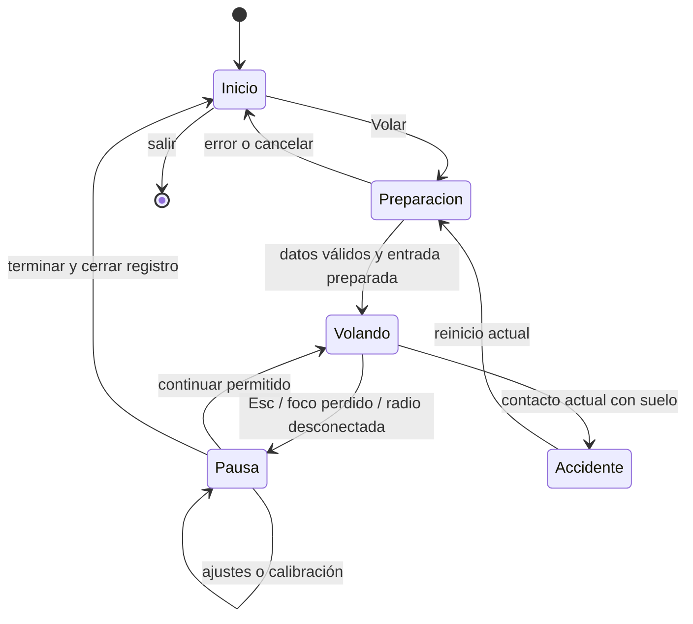

# OpenRC Simulator — entrada, menús y evolución del producto

**Fecha:** 2026-10-05. **Revisión 3:** análisis crítico del plan contra el código y [doce investigaciones más](research/menu-investigations/README.md#ronda-3-doce-preguntas-más-motor-herramientas-librerías-ejemplos) (11–22) sobre motor, herramientas, librerías y ejemplos, con sondas ejecutadas en el Godot 4.7.2 fijado. **Revisión 2:** [diez investigaciones en internet](research/menu-investigations/README.md) (01–10). **Estado (2026-10-06):** UI-00…05 implementados (Inicio, idioma, pausa, fin de vuelo, identidad de build, Ayuda, selector de avión; registro de ejecución al final); siguientes UI-06/07/08. El resto del documento conserva la propuesta original y su auditoría de 2026-10-05. **Base de la auditoría inicial:** `bc078ef`; revisión 3 contrastada con `90374d2`, con desarrollo paralelo activo.

**Propuesta:** abrir el simulador en una pantalla tranquila que muestre nuestro avión y permita entrar a volar en una acción. La primera entrada (UI-A) trae Inicio, Volar, pausa, regreso y ayuda; Aviones, Escenarios y Ajustes llegan con la alpha navegable (UI-B). Empezar con el Ugly Stik y el campo existentes. Ampliar el contenido cuando tenga pruebas y una experiencia de vuelo propia.

El menú es una nueva línea de trabajo **UI**, subordinada a las pruebas con pilotos de [ROADMAP.md](../ROADMAP.md). No sustituye M1–M5, Gate 2, Gate F ni el [plan del paisaje](LANDSCAPE-PLAN.md). La solicitud actual cambia la prioridad de los menús, que el roadmap había dejado fuera de la primera alpha; la numeración de versiones que sigue es una propuesta, no un lanzamiento aprobado.

## Cambios tras las diez investigaciones

| Investigación | Mejora incorporada | Paso que la comprueba |
| --- | --- | --- |
| [01 · Ciclo de vida](research/menu-investigations/01-godot-shell-lifecycle.md) | Raíz persistente y vuelo creado bajo demanda; carga en hilos solo si una medición la justifica | UI-01/03 |
| [02 · Input y foco](research/menu-investigations/02-input-focus-radio-isolation.md) | Quitar navegación joypad predeterminada; separar pausa voluntaria, lectura de ejes y failsafe | UI-01/02/10a |
| [03 · Ajustes](research/menu-investigations/03-settings-content-versioning.md) | Confirmación de pantalla con reloj de UI, recuperación de settings y versión de build separada del motor | UI-04/07/09b |
| [04 · Simuladores RC](research/menu-investigations/04-rc-simulator-navigation.md) | Volar destacado y resumen de avión/campo; catálogos pequeños sin filtros innecesarios | UI-01/05/06 |
| [05 · Radio](research/menu-investigations/05-radio-onboarding.md) | Cuatro estados comprensibles y verificación de Classic/Advanced antes de cambiar recomendaciones | UI-10a/b |
| [06 · Aprendizaje](research/menu-investigations/06-training-modes-progression.md) | Ayuda optativa de orientación primero; lecciones solo con objetivos y feedback comprobables | UI-04; entrenamiento futuro |
| [07 · Estilo](research/menu-investigations/07-visual-direction-assets.md) | Campo tranquilo como dirección inicial; club y banco de trabajo tienen usos posteriores definidos | UI-01/05 |
| [08 · Accesibilidad](research/menu-investigations/08-accessibility-legibility.md) | Paleta calculada, foco separado del rojo y objetivo de ampliación de texto al 200 % | UI-01/09a |
| [09 · Resoluciones e idiomas](research/menu-investigations/09-responsive-localization.md) | Reflujo, Theme común y pseudolocalización antes de ofrecer traducciones | UI-01/09a |
| [10 · Pruebas y export](research/menu-investigations/10-testing-performance-export.md) | Eventos reales en pruebas, captura sincronizada y comprobación del Inicio exportado | UI-00/03/11 |

Se mantiene el alcance de una primera alpha pequeña. La investigación concreta cómo construirla y probarla; no añade diez sistemas nuevos al juego.

## Revisión 3: análisis del plan y doce investigaciones más

### Lo que el análisis confirmó y lo que encontró

*Auditoría sobre `bc078ef` (2026-10-05): las líneas de código citadas han cambiado desde entonces y los tres defectos medidos se corrigieron en UI-02 y UI-04a.*

Confirmado en código el 2026-10-05: Godot fijado 4.7.2 ([get-godot.sh](../app/get-godot.sh)), traza `openrc-trace v3` ([trace.gd:8](../app/sim/trace.gd#L8)), `FlightSession._physics_process()` descuenta el accidente con la simulación pausada ([flight_session.gd:223](../app/sim/flight_session.gd#L223)), `resume()` despausa sin condiciones ([flight_session.gd:152](../app/sim/flight_session.gd#L152)) y Esc solo cancela la calibración ([main.gd:219](../app/main.gd#L219)). La base del plan es sólida; estas son las carencias que corrige la revisión 3:

| Carencia | Corrección |
| --- | --- |
| La tabla de teclas omite Z (autozoom), V (sombra), F3 (rendimiento) y F5 (recargar datos) de [main.gd:199-228](../app/main.gd#L199-L228). «F5» es a la vez una tecla y un paso del roadmap | Ayuda y pausa listan todas las teclas reales desde una sola tabla; el paso del roadmap se escribe «paso F5» |
| HUD y panel están en inglés y usan `SystemFont("monospace")` ([hud.gd:11](../app/render/hud.gd#L11)), que cambia de fuente según el sistema operativo | Decisión explícita de idioma (§7) y de fuente (UI-09c); las capturas del HUD no son comparables entre plataformas hasta entonces |
| La imagen de Inicio sale de «una captura propia», pero `app/captures/` no se versiona | UI-01 versiona una imagen generada por un comando reproducible, con su comando y SHA anotados; la coordina el equipo del modelo |
| UI-01 juntaba raíz, enrutado CLI, aislamiento de joypads, Inicio, foco y captura | Se divide en UI-01a y UI-01b (§10) |
| La propuesta prometía Aviones/Escenarios/Ajustes «desde la primera entrega», pero UI-A no los trae | Propuesta corregida arriba |

**Defectos actuales que la investigación midió fuera del menú.** No pertenecen a una pantalla nueva; se notifican a la línea principal para decidir si se corrigen antes de UI-02:

1. **El motor suena y la hélice gira durante cualquier pausa** (failsafe, accidente, calibración): `main.gd._process()` avanza `_prop_angle` y alimenta el sonido sin mirar `sim.paused` ([main.gd:131-133](../app/main.gd#L131-L133)). Medido con la [sonda 19](research/menu-investigations/probes/19-audio-pause-probe.gd) y reproducido en esta revisión: con el tick congelado en 144, la hélice pasa de 325 a 971 rad en 1,2 s y el bus Master sigue a −34 dB.
2. **Actualizar EdgeTX podría borrar en silencio la calibración:** `RcInput.key_for()` incluye la GUID ([rc_input.gd:89](../app/input/rc_input.gd#L89)), y la GUID de SDL3 incorpora `bcdDevice`, donde EdgeTX escribe su versión de firmware. Deducido del código de SDL y EdgeTX ([12](research/menu-investigations/12-identidad-joypads-sdl3.md)); **pendiente de confirmar con la radio del propietario**.
3. **La versión del paquete no identifica la build:** CI llama `export.sh "${GITHUB_REF_NAME}"`, de modo que los ZIP de `main` no llevan SHA, y el `.exe` de Windows declara `1.0.0.0` ([21](research/menu-investigations/21-version-build-export.md)).

### Cambios tras las doce investigaciones nuevas

| Investigación | Mejora incorporada | Paso |
| --- | --- | --- |
| [11 · Novedades GUI 4.4–4.7](research/menu-investigations/11-godot-ui-novedades-4x.md) | Foco **de teclado** siempre visible (4.6+ oculta el de ratón); `follow_focus=true` en todo scroll; `custom_maximum_size` para la columna de lectura; desactivar foco/ratón de la pantalla de debajo con los modos recursivos; `accessibility_name`/`accessibility_live` sin anunciar soporte de lector de pantalla | UI-01/02/09a/10b |
| [12 · Radios y SDL3](research/menu-investigations/12-identidad-joypads-sdl3.md) | Identidad en tres niveles: índice (sesión), clave exacta, familia `vid:pid\|raw_name`; detectar EdgeTX por `1209:4F54`; retirar también los botones joypad 11–14 y 3 de `ui_*` | UI-01b/10a/10b/12 |
| [13 · Plantillas](research/menu-investigations/13-plantillas-menus-godot.md) | No adoptar plantillas ni addons; la automatización no lee **ni escribe** preferencias | §8, §9, UI-07 |
| [14 · Demos oficiales](research/menu-investigations/14-demos-oficiales-godot.md) | Validar tipo y rango por clave (`ConfigFile.get_value` devuelve el tipo del archivo); prohibido `store_var`/`get_var(true)`; formato de traducción decidido antes de UI-09a | UI-07/09a |
| [15 · Pruebas de UI](research/menu-investigations/15-herramientas-pruebas-ui.md) | Arnés propio con `tests/ui_driver.gd`; esperar `process_frame` tras `parse_input_event`; foco comprobable en headless; capturas con el `compare_captures.py` existente | UI-00/01/11 |
| [16 · Tipografía](research/menu-investigations/16-tipografia-fuentes.md) | UI-01 usa la fuente predeterminada (Open Sans SemiBold, OFL, cubre español); Atkinson Hyperlegible Next en un paso propio con su OFL dentro del paquete | UI-09c |
| [17 · Theme](research/menu-investigations/17-theme-autoria.md) | `ui/ui_theme.gd` genera el Theme; test de contraste sobre el Theme resuelto; escala con `content_scale_factor`; Theme aplicado al `Control` superior de cada capa | UI-01/09a |
| [18 · Pantalla](research/menu-investigations/18-pantalla-ventana-plataformas.md) | Confirmar modo/tamaño de ventana, no resolución; sin pantalla exclusiva; VSync solo activado/desactivado; límite de fps nunca < 30 | UI-09b |
| [19 · Audio](research/menu-investigations/19-audio-ajustes-pausa.md) | `stream_paused` al pausar, `stop()+play()` si el estado cambió; volumen guardado como valor lineal 0–100 y silencio aparte | UI-02/03/08 |
| [20 · Simuladores abiertos](research/menu-investigations/20-simuladores-abiertos-ui.md) | Volar ignora una segunda pulsación; si está desactivado dice por qué; calibración con Atrás y confirmación antes de guardar incompleta; nunca usar otra radio cuando falta la guardada | UI-01/06/10b/12 |
| [21 · Versión de build](research/menu-investigations/21-version-build-export.md) | `build_info.json` inyectado por un `EditorExportPlugin` desde `export.sh`; `config/version` numérico para Windows/macOS | UI-04a |
| [22 · Referencias UX](research/menu-investigations/22-referencias-ux-juegos.md) | Remapeo de teclado adelantado; etiquetas de tecla según la distribución real; pista breve en el primer vuelo; texto ≥ 17 px de ascendente a descendente a 720p | UI-04b/09a/15 |

Las decisiones centrales siguen en pie: Volar sin pantallas previas, una sola física, pausa de sesión en lugar de `SceneTree.paused` y catálogos pequeños con contenido real. Las investigaciones 13, 14 y 22 las respaldan con código y guías externas.

## 1. El alma del proyecto y cómo debe sentirse la entrada

OpenRC es un simulador abierto de aeromodelismo que crece mediante entregas pequeñas, evidencia y vuelo real del propietario. Su centro es reconocer un avión a distancia, entender su orientación y sentir los mandos de una radio desde tierra. El detalle del modelo, el paisaje y la interfaz sirven a esa experiencia.

Esto lleva a seis decisiones de producto:

1. **Volar es la acción principal.** Sin cuenta, conexión, selección obligatoria de perfil ni recorrido por cinco pantallas.
2. **Mostrar nuestro avión desde el inicio.** El Ugly Stik existente es la identidad; una captura propia ya sirve para la primera entrega.
3. **Ayudar a conectar la radio sin impedir el teclado.** Estado del dispositivo y acceso a calibración visibles, con instrucciones cortas.
4. **Una sola física.** Las ayudas cambian visibilidad e información. No crear un modo «realista» y otro que altere fuerzas silenciosamente.
5. **Cada botón debe resolver algo.** Un catálogo con un avión es válido si permite verlo, conocerlo y seleccionarlo. Una colección de candados «próximamente» aporta poco.
6. **Crecer con el vuelo.** Despegues aparecen al completar M2; viento al existir viento físico; más aviones cuando cada uno tenga datos, modelo y pruebas propios.

## 2. Qué existe de verdad

Inspección de código y documentos, sin ejecutar una nueva suite durante esta planificación. Los resultados históricos pertenecen a sus registros originales.

| Área | Estado observado | Consecuencia para el menú |
| --- | --- | --- |
| Inicio | `project.godot` carga `main.tscn`; `main.gd._ready()` construye el mundo y arranca una sesión | Hay que añadir una entrada; no existe un sistema de navegación que completar |
| Vuelo | `FlightSession` carga datos, resuelve trim, mantiene mandos y ejecuta la simulación a 240 Hz | «Volar» puede reutilizar el vuelo nivelado actual a 15 m/s, iniciado en el aire |
| Avión | Un archivo físico: `jensen_ugly_stik_60.json`; un constructor visual integrado | Cuatro aviones en el catálogo (UI-05 con EX-03, AV-03 y P51-03); las revisiones visuales de un avión no son aviones distintos |
| Campo | Mundo construido desde `main.gd`, `spec.gd` y `render/`; cielo y neblina L1/L2 ya integrados | Una ficha del campo actual. No describirlo como el antiguo fondo azul plano ni como un club completo |
| Datos de campo | `app/data/fields/` y el cargador `openrc-field v1` (L5, hecho) | No inventar otro formato de terreno para llenar el selector |
| Condiciones iniciales | `sim/scenarios.gd` contiene lanzamiento balístico, planeo trimado y vuelo nivelado | Son inicios de simulación, no mapas. El lanzamiento balístico es histórico/técnico |
| Radio | Ejes crudos, perfiles, armado por acelerador bajo, desconexión que pausa, calibración K/Enter/Esc | Reutilizar lógica y perfiles; falta una presentación cómoda y selección explícita de dispositivo |
| Preferencias | La calibración ya se guarda en `user://rc_calibration.cfg`; autozoom y rendimiento son variables de la escena | Separar ajustes generales nuevos de los perfiles existentes |
| Cámaras | Piloto fijo e inspección; autozoom disponible | Son opciones de cámara, no modos de juego. No anunciar FPV o cámara de seguimiento independiente |
| Suelo | Contacto con el casco de choque produce accidente; espera 1,5 s y reinicio | La pista visual todavía no permite rodaje, despegue ni aterrizaje |
| Pausa | La simulación pausa por pérdida de foco; la sesión aplica failsafe al desconectar o calibrar | Falta menú de pausa y una política común para varias causas simultáneas |
| Sonido | Motor posicional sintetizado ligado a rpm | Es viable añadir volumen/silencio; aún no hay mezcla de ambiente, música ni grabaciones de motor |
| Registro | T inicia/finaliza CSV; existen golden flights para regresión | Un registro técnico no es una repetición reproducible desde el menú |
| Distribución | Exportación de Windows/Linux/macOS y smoke test del binario Linux | El nuevo inicio debe conservar los comandos de automatización y funcionar en el paquete exportado |

**Diferencias documentales relevantes:** el resumen inicial del roadmap conserva referencias antiguas a la entrega y al modelo; las filas de ejecución y el código son más específicos. `AGENTS.md` menciona traza v2, pero `sim/trace.gd` declara **`openrc-trace v3`**. No copiar esas versiones antiguas a la interfaz. El tag local observado es `v0.1.0-rc1`; el árbol contiene trabajo posterior y no equivale automáticamente a ese binario publicado.

Referencias: [entrada actual](../app/main.gd), [sesión](../app/sim/flight_session.gd), [inicios](../app/sim/scenarios.gd), [cámara](../app/render/pilot_camera.gd), [modelo visual vigente](UGLY-STIK-VISUAL-PLAN.md), [primera ejecución](FIRST-LAUNCH.md).

## 3. Primera experiencia propuesta

### Pantalla de inicio

Sin splash obligatorio ni «pulsa una tecla para empezar». Fondo con captura real del avión y el campo, y un panel opaco que garantice lectura. El vuelo no corre detrás del menú.

```text
┌────────────────────────────────────────────────────────────────┐
│ OpenRC Simulator                                  Alpha · versión│
│                                                                │
│  [ VOLAR ]                       Nuestro Ugly Stik              │
│                                  sobre el campo actual         │
│  Aviones                                                       │
│  Escenarios                      Jensen Das Ugly Stik 60       │
│  Ajustes                         Campo de pruebas              │
│  Ayuda y acerca de               Vuelo libre · Inicio en el aire│
│  Salir                                                         │
│                                                                │
│  Control: teclado   [Configurar radio]                          │
└────────────────────────────────────────────────────────────────┘
```

La imagen anterior describe distribución, no dimensiones finales; «Control: teclado» ilustra el caso sin radio, y esa línea cambia con el dispositivo real. **Volar** inicia la combinación válida ya seleccionada; junto a su resumen habrá «Configurar vuelo» para cambiarla. La primera ejecución usa los valores actuales. Volver otro día reutiliza la última selección válida, no la posición anterior del avión.

Si la radio necesita armado, mostrar «Baja el acelerador para habilitar el motor». En la entrega mínima se conserva la prioridad actual de radio conectada; para usar teclado habrá que desconectarla, y la ayuda debe indicarlo. UI-12 añade elegir teclado sin desenchufar la radio. No confundir radio detectada, perfil calibrado y acelerador armado: son estados distintos.

### Flujos principales

| Intención | Recorrido | Resultado |
| --- | --- | --- |
| Probar con teclado, sin radio conectada | Inicio → Volar | Vuelo actual, sin asistente obligatorio |
| Usar radio | Inicio → Configurar radio → comprobar mandos → Volar | Sesión con dispositivo elegido y regla de armado conservada |
| Elegir avión | Aviones → ficha → Usar este avión | Actualiza la selección y vuelve; no inicia vuelo accidentalmente |
| Elegir lugar | Escenarios → ficha → Usar este escenario | Actualiza el campo; cambiar la condición inicial se hace en Configurar vuelo |
| Ajustar mientras vuelo | Esc → Ajustes → Volver → Continuar | Sesión congelada, sin perder su estado |
| Cambiar avión o campo durante vuelo | Pausa → Terminar vuelo → Inicio | Cierra el registro y termina la sesión; la nueva selección crea otro vuelo |

**Configurar vuelo** presenta cuatro conceptos: avión, escenario, modalidad e inicio. En la primera entrega modalidad = «Vuelo libre» e inicio = «En el aire» se muestran como resumen fijo; no necesitan desplegables con una sola opción. Un botón Volar confirma la combinación.

**Continuar** solamente aparece cuando existe una sesión pausada en memoria. No prometer guardado de partidas entre ejecuciones.

Las referencias RC investigadas respaldan un resumen visible de avión/campo junto a Volar, con controles y selección accesibles sin bloquear la entrada. Adoptar ese patrón de [aerofly RC 10 y los manuales comparados](research/menu-investigations/04-rc-simulator-navigation.md); dejar búsqueda, filtros y favoritos para cuando exista un catálogo que los necesite. Las capturas ajenas inspiran la jerarquía, pero la imagen de Inicio sale de nuestro campo y nuestro avión.

### Pausa, accidente y regreso

Pausa: **Continuar**, **Reiniciar vuelo**, **Ajustes**, **Ayuda**, **Terminar vuelo**, **Salir**. Esc abre pausa y vuelve dentro de menús; durante calibración cancela primero ese proceso. P continúa únicamente si las condiciones de la sesión lo permiten.

Conservar inicialmente el reinicio automático de accidente y su duración actual. Si se abre un menú durante esa espera, detener también su contador. Una pantalla de accidente con reintento manual puede evaluarse después del playtest, sin cambiar ahora ese comportamiento por motivos cosméticos.

Al terminar o salir con grabación activa: intentar guardar, mostrar el resultado y cerrar la conexión del grabador. Si falla el guardado, conservar la sesión y ofrecer reintentar o descartar explícitamente. Una salida normal sin grabación ni cambios pendientes no necesita un diálogo adicional. No prometer recuperación frente a cierre forzado del proceso.

## 4. Aviones y escenarios: pequeños catálogos reales

### Aviones

Primera tarjeta: **Jensen Das Ugly Stik 60**, imagen propia, configuración .61 glow y acceso a una ficha breve. Mostrar dimensiones procedentes del modelo/datos, tipo de avión y una nota «Modelo de vuelo en evaluación». Evitar convertir coeficientes provisionales en una afirmación de fidelidad certificada.

La primera ficha puede usar una imagen estática. La vista 3D giratoria viene después, reutilizando el constructor y sus articulaciones; no exige un hangar modelado, otro avión ni una sesión física. Mantener `airplane`, `propeller` y `*_hinge` según el contrato del equipo del modelo.

Una pintura nueva será una apariencia del mismo avión. Un cambio de masa, geometría o motorización requiere una variante física identificable y validada. El Ultra Stick 120 y otros archivos de referencia no son contenido seleccionable por estar presentes en `references/`.

Para incorporar el segundo avión se exige: identidad estable, datos con procedencia, cargador válido, modelo compatible, trim o inicio válido, pruebas de manejo y ficha propia. No construir ahora categorías vacías de jets, helicópteros, drones o planeadores.

### Escenarios

Usar «Escenarios» como etiqueta de navegación y «Campo de pruebas» como nombre propuesto del lugar actual. La ficha indica la posición fija del piloto y explica: **«Por ahora el vuelo empieza en el aire; el contacto con el suelo reinicia el avión»**.

Correspondencia fija: **Escenarios → campo → `field_id`**; **Modalidad → `activity_id`**; **Inicio → `start_id`**. «Escenarios» es el rótulo de producto para lugares, mientras el archivo existente `sim/scenarios.gd` conserva su función de condiciones iniciales. El catálogo de campos no se añade a ese archivo ni se convierte una ubicación en una maniobra.

La evolución del mismo campo con cielo, árboles o césped sigue siendo el mismo escenario. No duplicar «campo básico», «campo con cielo» y «campo con árboles» para aparentar catálogo. Las comparaciones de desarrollo siguen en capturas y herramientas.

El selector empezará con un registro del campo existente que referencia su constructor actual. Al completar L5, ese registro apuntará al archivo `openrc-field v1`. L12 añade relieve físico; L14 añade obstáculos físicos. La ficha debe distinguir elementos visuales y obstáculos con colisión mientras esa diferencia exista.

Un segundo campo exige una razón de vuelo: otra orientación de pista, referencias visuales diferentes o, más adelante, el campo del propietario de L17. No añadir editor de mundos ni descargas de escenarios en esta entrega.

## 5. Modos: ordenar lo existente y habilitar lo que tenga soporte

| Experiencia | Primera entrega | Evolución y condición de entrada |
| --- | --- | --- |
| **Vuelo libre** | Única modalidad jugable; inicio nivelado en el aire, sin viento | Sigue siendo el centro del producto |
| **Práctica de planeo** | Fuera de la primera entrega; existe solver/inicio de planeo, falta integración de producto | Preset de inicio dentro de Vuelo libre, tras comprobar reset, motor parado, cámara y metadatos de traza |
| **Despegue y aterrizaje** | No seleccionable | Inicio en pista tras E0a/E0b/E1–E4 y PT2; no basta con dibujar la pista |
| **Entrenamiento** | Ayuda básica de mandos, sin cursos ni puntuación | Primera lección de orientación/circuito cuando existan instrucciones, detección de objetivos y evaluación humana; lecciones de aterrizaje dependen de M2 |
| **Retos** | No visible en navegación | Después de objetivos fiables: circuito, precisión, recuperación; definir reinicio, éxito y fracaso antes de premios |
| **Condiciones de viento** | Aire en calma fijo | Selector de condiciones tras viento físico M5 y coherencia con paisaje L15; no son otro modo de juego |
| **Repeticiones / historial** | Registro CSV en herramientas de diagnóstico | Futuro formato que conserve condiciones, entradas, versiones y compatibilidad; golden tests no resuelven por sí solos un reproductor |
| **Laboratorio** | Herramientas técnicas existentes, bajo Diagnóstico o CLI | Exposición gradual de trazas, métricas y recarga; fuera del recorrido básico |
| **Multijugador** | Fuera de alcance | Requiere propuesta separada de red, autoridad, sincronización y coste; no reservar servidor ni cuentas ahora |

El círculo `--scripted` es una demostración técnica. Si se expone después, se llama «Demostración» y deja claro que no responde como un vuelo libre. Los modos longitudinales/laterales de `test_modes.gd` son propiedades dinámicas del avión, no modalidades del menú.

**Ayudas, no niveles ficticios de realismo:** conservar autozoom activado inicialmente; permitir mostrar/ocultar HUD y métricas. Un futuro preset «Aprender» puede combinar ayudas y una condición inicial más cómoda. No modifica aerodinámica, servos, expo o rates de una radio sin decirlo y sin pruebas. La decisión pendiente sobre trims del simulador sumados a los de la radio corresponde a D6d/Gate 2.

**Primera ayuda útil:** una tarjeta optativa en Ayuda explica alerón/elevador/timón/acelerador, la posición del piloto y cómo pausar o reiniciar si se pierde orientación. Antes de crear una lección, escribir su objetivo observable, feedback, criterio de éxito/fallo y reinicio. Una grabación demostrativa, una práctica libre y un reto puntuado requieren implementaciones diferentes; los manuales de SeligSIM/aerofly aportan ejemplos, no contenido ya disponible para OpenRC. [Investigación 06](research/menu-investigations/06-training-modes-progression.md).

## 6. Ajustes: alcance honesto por entrega

«Disponible para integrar» significa que existe la capacidad de fondo; la pantalla y, salvo calibración, su persistencia aún deben implementarse.

| Sección | Primera entrega útil | Después |
| --- | --- | --- |
| **Controles** | Dispositivo actual, monitor de ejes/mando aplicado, calibración existente y tabla de teclado con la etiqueta de la distribución real (las teclas son físicas: en AZERTY no se rotula «W/A/S/D») | Remapeo de teclado justo tras UI-B (UI-15: solo `InputEventKey`, `physical_keycode` como entero en `settings.cfg`, Esc reservado, conflictos detectados); selección entre varios dispositivos y teclado explícito; asignación manual de canales del paso F5 |
| **Cámara y ayudas** | Autozoom, cámara piloto/inspección, visibilidad del HUD y métricas | Mantener suelo en encuadre, otros FOV y cámaras según pruebas de lectura |
| **Audio** | Volumen general (guardado lineal 0–100, curva de 60 dB) y silencio aparte; bus `Engine` → Master preparado | Mezcla por categorías cuando existan; motor realista G3. Atenuar con filtro en pausa queda aplazado: una pausa que congela el tiempo encaja con silencio |
| **Pantalla** | Ventana / pantalla completa (`MODE_FULLSCREEN`, nunca exclusiva) con tecla fija de salida y escala de interfaz, después de implementar y comprobar su aplicación | VSync solo activado/desactivado (Compatibility no tiene Adaptive ni Mailbox), mostrando el estado leído; límite de fps nunca < 30 (por debajo de 20 fps la física de 240 Hz va a cámara lenta); MSAA validado por plataforma. No hay selector de resolución ni frecuencia: Godot 4.7.2 no cambia el modo de vídeo del monitor |
| **Diagnóstico** | Mostrar rendimiento y explicación de grabación CSV; acceso a T o botón equivalente | Informe local copiable con versión y contexto de sesión; gestión de archivos |

No ofrecer presets Bajo/Medio/Ultra sin diferencias implementadas y mediciones. Ocultar opciones gráficas de renderizadores que el proyecto no utiliza. Volumen, HUD y autozoom pueden cambiar inmediatamente; tamaño/modo de ventana requiere confirmación con reversión. **15 s** es un tiempo inicial propuesto para esa reversión, pendiente de prueba humana.

Cada ajuste visible debe tener valor predeterminado, aplicación real, restauración y comportamiento al reiniciar. Guardar opciones simples al cambiarlas; la configuración de pantalla se guarda solo al confirmarla. Si no se puede escribir, mantener el cambio durante la sesión y mostrar «No se pudo guardar».

La cuenta atrás de Confirmar/Revertir usa tiempo real de UI y sigue funcionando con el vuelo pausado; su plazo no depende de ticks de simulación. Lo que se confirma es **modo y tamaño de ventana**, no una resolución del monitor: el riesgo real es una pantalla completa en el monitor equivocado o una ventana mayor que la pantalla. Implementarlo como copia de la configuración al entrar y restauración al cancelar; releer `window_get_mode()` tras aplicar y durante la cuenta atrás; aplicar el modo guardado después del primer frame; ajustar tamaño y posición restaurados a `screen_get_usable_rect` y no posicionar en Wayland. Un cierre durante la prueba revierte la pantalla pendiente y mantiene el vuelo pausado. **Pendiente:** la regla «pérdida de foco revierte» puede dispararse con la propia transición a pantalla completa (Spaces de macOS, Windows); comprobarla por plataforma antes de adoptarla. Esta es una política propuesta, no una función automática de `Window`. [Investigaciones 03](research/menu-investigations/03-settings-content-versioning.md) y [18](research/menu-investigations/18-pantalla-ventana-plataformas.md).

Restaurar ajustes generales **no borra calibraciones**. El perfil de cada radio mantiene su acción separada. No aplicar deadzone/expo de mando de consola a radios RC: el lector actual ya distingue ambos casos.

### Primera conexión de radio

1. Detectar y mostrar dispositivo; en la entrega mínima se conserva la selección automática actual del primero conectado.
2. Mostrar movimientos en vivo y qué acción del avión producen.
3. «Calibrar» presenta gráficamente el asistente ya existente, con Siguiente, Cancelar y sus errores.
4. Al completarlo, conservar el guardado por dispositivo y exigir nuevamente el armado que ya aplica `RcInput.use_profile()`.
5. Volver a la pantalla desde la que se abrió; iniciar/reanudar requiere acción del piloto.

La selección explícita del dispositivo es un paso propio. Mientras no exista, la pantalla informa la limitación si hay varios conectados. La radio controla el avión; sus sticks **no navegan menús** por defecto. Ratón y teclado deben cubrir el flujo completo; navegación con gamepad se incorpora con asignación explícita y prueba de que una radio identificada como gamepad no mueve el foco.

El panel separa **conectado**, **perfil**, **movimiento observado** y **armado**. La cadena USB de una radio EdgeTX dice «OpenTX», no «EdgeTX»; todas comparten VID:PID `1209:4F54`, que es la señal fiable de detección (el nombre queda de respaldo). Reconocerla no prueba que los canales o sus signos sean correctos. Si aparece como «gamepad SDL» en lugar de joystick, avisar «usa Advanced → Joystick»: en Linux con Classic, SDL reordena los ejes y el acelerador llega como gatillo 0…1 ([12](research/menu-investigations/12-identidad-joypads-sdl3.md), deducido del código, pendiente con hardware).

**Identidad del dispositivo, en tres niveles:** el índice solo vale dentro de la sesión; la **clave exacta** actual busca la calibración; la **familia** `vid:pid|raw_name`, sin GUID, sobrevive a una actualización de firmware. Si falla la clave exacta, ofrecer el perfil de la misma familia **con confirmación**; nunca aplicar en silencio la calibración de otra radio ni usar la primera conectada cuando falta la guardada (el error de EdgeTX Companion, [20](research/menu-investigations/20-simuladores-abiertos-ui.md)). Dos radios idénticas comparten familia: preguntar.

**Asistente:** «Atrás» en los pasos que no borran nada; una calibración incompleta no se guarda sin confirmación; opcionalmente una vista sin física de las superficies moviéndose, como hace CRRCsim. La etiqueta de estado lleva `accessibility_live` = Polite. Mostrar una acción por paso del asistente, error recuperable y acceso a cancelar. La documentación EdgeTX y el setup recomendado actualmente por el repo no priorizan el mismo modo USB: conservar la configuración del proyecto hasta comparar Classic/Advanced con el dispositivo y firmware reales; no cambiar mapeos desde el menú basándose solo en el nombre. [Investigación 05](research/menu-investigations/05-radio-onboarding.md).

**Esto necesita configuración activa:** el código de [Godot 4.7.2 `InputMap::get_builtins()`](https://github.com/godotengine/godot/blob/4.7.2-stable/core/input/input_map.cpp) ya asigna los ejes `LEFT_X/LEFT_Y` y los botones 11–14 (D-pad) a `ui_left/right/up/down`, y el botón 3 a `ui_select`. **Ejecutado** en la revisión 3 ([15](research/menu-investigations/15-herramientas-pruebas-ui.md)): con mapeo AETR, el eje de profundidad mueve el foco arriba/abajo y el de alerones a los lados; tras retirar esos eventos el foco no se mueve y `Input.get_joy_axis` sigue leyendo. UI-01b debe retirar de la navegación **todos** esos eventos joypad (ejes y botones), sin usar `SDL_GAMECONTROLLER_IGNORE_DEVICES`, que oculta la radio entera, conservando teclado/ratón y la lectura cruda de radio para volar/calibrar. No basta con evitar añadir mappings nuevos. UI-12 podrá habilitar navegación con un gamepad expresamente elegido. [Investigación 02](research/menu-investigations/02-input-focus-radio-isolation.md).

## 7. Dirección visual y accesibilidad

Identidad sobria de campo de aeromodelismo: cielo y vegetación reales de la app, superficies claras/oscuras de buen contraste y un acento tomado del rojo del Ugly Stik. Evitar tableros de cabina de avión comercial: el piloto RC está fuera del avión.

| Dirección visual investigada | Uso propuesto | Condición |
| --- | --- | --- |
| **Campo tranquilo** | Inicio: nuestro Ugly Stik y nuestro campo renderizados en vivo y fijos (UI-01c), columna casi opaca, acción principal clara | Implementada; sin física ni cámara animada de fondo. Un render en vivo sustituye a la captura: la app no importa texturas y la imagen mejora sola con el modelo y el paisaje |
| **Club y línea de vuelo** | Evolución del paisaje, contexto de pits y actividad de club | Esperar a que esos elementos existan en el campo; no prometerlos con una foto ajena |
| **Banco de trabajo** | Fichas y preparación: imagen, características breves y selección | Metáfora de organización; no requiere construir un taller 3D |

La [investigación 07](research/menu-investigations/07-visual-direction-assets.md) documenta imágenes oficiales inspeccionadas de RealFlight y un club AMA, con sus límites. Las fotos e interfaces de referencia no se empaquetan. Usar `StyleBox`/Theme nativos y capturas originales; un pack CC0 puede servir para un prototipo si hace falta, pero no es dependencia de esta entrega. Cualquier recurso externo adoptado debe registrar archivo, fuente, licencia y revisión/hash; lo mismo vale para un fragmento de código copiado de una demo o plantilla MIT, que conserva su aviso.

- Construir con controles nativos Godot, `Container`, márgenes y un `Theme` compartido; no colocar cada botón con coordenadas absolutas.
- Base de composición: los 1280 × 720 actuales. Revisar también 1920 × 1080, ventana pequeña y formato ancho; son casos propuestos de validación, no soporte ya comprobado.
- Texto legible, foco **de teclado** siempre visible y mensajes con palabras además de color. Desde Godot 4.6 el foco ganado con ratón no se dibuja (`gui/common/show_focus_state_on_pointer_event` = 1, que se conserva); las pruebas usan `has_focus(true)`. Preferencias con scroll antes que controles fuera de pantalla, y **todo `ScrollContainer` con controles lleva `follow_focus=true`**: con el valor por defecto las flechas no alcanzan lo que queda fuera de la vista ([11](research/menu-investigations/11-godot-ui-novedades-4x.md), ejecutado).
- Navegación completa por Tab/flechas/Enter/Esc, foco inicial explícito (`grab_focus.call_deferred()`) y retorno al botón que abrió una pantalla. Al apilar Ajustes o Pausa, la pantalla de debajo pasa a `focus_behavior_recursive`/`mouse_behavior_recursive` Disabled. Esc actúa con `pressed and not echo`.
- Ninguna opción a más de dos niveles de Inicio o Pausa. Las confirmaciones se limitan a pérdidas reales: grabación activa al terminar o salir, y «Restaurar ajustes» ([22](research/menu-investigations/22-referencias-ux-juegos.md)).
- Accesibilidad del motor: Godot 4.5+ incluye AccessKit (experimental). Controles nativos con texto, `accessibility_name` en la imagen y en controles sin texto, soporte en Auto. No anunciar compatibilidad con lectores de pantalla hasta probar con Orca o NVDA. La documentación de Godot advierte que los `ui_*` de foco no deben reutilizarse para gameplay. [Navegación y foco](https://docs.godotengine.org/en/stable/tutorials/ui/gui_navigation.html).
- Textos preparados con claves de traducción. Propuesta inicial: español coherente para la nueva interfaz; traducción inglesa en un paso posterior, antes de mostrar selector de idioma. La nomenclatura técnica y las unidades físicas se conservan. **Decidido por el propietario (2026-10-06): inglés por defecto, multiidioma.** El inglés es el idioma fuente de todos los textos y el predeterminado aunque el sistema operativo esté en otro idioma (el motor arranca en el idioma del sistema: `app_root` fija el inglés o la preferencia guardada). Cada idioma adicional es un catálogo gettext `i18n/<código>.po`; el español es el primero. Selector en Inicio, recordado en `user://settings.cfg`. HUD y panel de mandos siguen solo en inglés hasta pasarlos por el catálogo (pendiente).
- Fuente: UI-01 usa la predeterminada de Godot 4.7.2 (Open Sans SemiBold, OFL, embebida; cubre todo el español y sus cifras son tabulares), marcando jerarquía con tamaño y color, no con su negrita sintética. UI-09c introduce Atkinson Hyperlegible Next ([16](research/menu-investigations/16-tipografia-fuentes.md)). MSDF queda para `Label3D` o zoom continuo; la nitidez a 150–200 % depende de `canvas_items` y del oversampling por viewport.
- Fondo estático primero: arranque económico, capturas repetibles y sin movimiento obligatorio. Una escena 3D ambiental se justifica solo si mejora la presentación y cumple el presupuesto en el equipo del propietario.

**Ayuda y acerca de** reúne mandos, conexión de radio, límites actuales, versión, licencia y créditos. «Novedades» puede vivir allí; no hace falta abrir un navegador ni consultar internet para iniciar.

### Texto, reflujo e idiomas

Adoptar como objetivo de producto que el texto pueda ampliarse hasta **200 %** conservando acciones y contenido mediante reflujo/scroll. La [investigación 08](research/menu-investigations/08-accessibility-legibility.md) distingue las guías Xbox y web de las unidades Godot: medir altura renderizada en capturas, no copiar un número de píxeles a `font_size` sin comprobarlo. Criterio medible por defecto: **≥ 17 px de ascendente a descendente en la captura a 1280 × 720** (AGI «Clear Text», que da «todo a 18 px» como ejemplo de fallo a 1080p; [22](research/menu-investigations/22-referencias-ux-juegos.md)). La escala se aplica con `Window.content_scale_factor`, que escala también los overrides y no altera los valores del Theme; `default_theme_scale` solo se lee al arrancar. Decidir si el HUD de vuelo comparte esa escala. En macOS Retina una ventana de 1280 × 720 se ve a la mitad; la escala inicial puede derivarse de `screen_get_scale` en macOS y Wayland ([17](research/menu-investigations/17-theme-autoria.md), [18](research/menu-investigations/18-pantalla-ventana-plataformas.md)). El foco permanece visible mientras un control esté seleccionado; radio/errores usan palabras además de color. El fondo estático evita necesitar un ajuste de movimiento en esta primera entrega.

Probar `canvas_items` y aspecto `expand` para la UI junto a un Theme común, manteniendo 1280 × 720 como composición base. No adoptar esa configuración sin comprobar también viewport/cámara y captura del vuelo. En ventana estrecha, una columna con scroll y acción principal accesible; en formato ancho, limitar el ancho de lectura y aprovechar el resto para la imagen. Cambiar escala de UI no cambia el paso físico ni es un preset de calidad 3D. [Investigación 09](research/menu-investigations/09-responsive-localization.md).

Matriz propuesta para UI-09a: **1280 × 720, 1920 × 1080, 1024 × 576 y 2560 × 1080**, con escala 100/150/200 %. Son casos de ensayo, no soporte ya validado. Probar español y una pseudolocalización con expansión de **30 %**, elegida como estrés de layout; cuando entre inglés, repetir con su traducción real. Incluir `áéíóúüñ¿¡`, los símbolos que la interfaz ya usa (`° % ± µ`, distinguiendo µ U+00B5 de μ U+03BC), nombres largos de dispositivos y errores. En formato ancho, `custom_maximum_size` (nuevo en 4.7) limita la columna de lectura. Formato de traducción decidido en UI-01d: **gettext PO**. Con CSV, los `.translation` generados no se versionan y la primera importación desde un clon limpio da errores ([14](research/menu-investigations/14-demos-oficiales-godot.md)); un `.po` carga sin importar y entra en el export con `all_resources` ([sonda 23](research/menu-investigations/probes/23-po-translation-probe.sh)). La pseudolocalización se activa desde la prueba con `TranslationServer.pseudolocalization_enabled` y `reload_pseudolocalization()`, sin tocar `project.godot`. Usar mensajes completos con marcadores, sin concatenar fragmentos traducidos ni incrustar texto en imágenes. Inglés y selector de idioma siguen siendo un paso posterior; las claves y la prueba de expansión empiezan antes.

### Paleta candidata: contraste calculado antes de implementar

Propuesta inicial para el `Theme`, no colores definitivos de la app. Panel opaco `#17252A`, texto `#F5F2E9`, texto secundario `#BBC8C6`, acento del botón Volar `#B6322E` y foco `#F5C65D`.

| Uso | Contraste calculado | Decisión |
| --- | --- | --- |
| Texto crema / panel | 14,06:1 | Candidato para texto principal |
| Texto secundario / panel | 9,14:1 | Candidato para descripciones |
| Texto crema / botón rojo | 5,38:1 | Mantener etiqueta explícita de Volar |
| Foco ámbar / panel y botón rojo | 9,83:1 y 3,77:1 | Candidato para contorno de foco visible |
| Rojo / panel | **2,61:1** | No usar rojo como único borde identificador, indicador de selección o texto pequeño |

Los objetivos adoptados son ≥ 4,5:1 para texto y ≥ 3:1 para información visual necesaria de controles/estados, tomados como guía de diseño de [WCAG contraste](https://www.w3.org/WAI/WCAG22/Understanding/contrast-minimum.html) y [contraste no textual](https://www.w3.org/WAI/WCAG22/Understanding/non-text-contrast.html). No constituyen una declaración de conformidad del videojuego. El botón rojo llevará etiqueta crema y, donde su contorno sea necesario, borde claro; el foco añade un contorno distinto. Un color rojo de marca no sustituye la palabra «Error».

**Falta en la paleta:** colores de hover, pulsado, desactivado y botón secundario, con su contraste. Un hover rojo de prueba `#C43B36` da 4,66:1 con texto crema, casi en el límite. En la implementación, el contraste se comprueba con un test que lee el **Theme resuelto** sobre controles reales (la [sonda 17](research/menu-investigations/probes/17-theme-variation-probe.gd) reproduce en Godot 5,384, 9,830 y 2,611); el script Python queda como registro de esta investigación.

Evidencia: [cálculo reproducible](research/menu-investigations/check_contrast.py) y [resultados completos](research/menu-investigations/contrast-check.json). Se compararon valores sin redondear; la tabla solo redondea para lectura. Son superficies sRGB planas y opacas: fuentes, tamaños, capturas y percepción humana todavía deben evaluarse. No colocar estos textos directamente sobre el cielo suponiendo que mantienen esos ratios.

## 8. Diseño técnico en Godot

### Una entrada alrededor del vuelo existente

Estructura propuesta; los nombres nuevos no describen archivos que ya existan:

```text
app/
  app_root.tscn / app_root.gd    # nueva entrada: ruta interactiva o automatización
  main.tscn / main.gd            # escena actual de vuelo, conservada inicialmente
  ui/
    home.tscn                   # inicio
    flight_setup.tscn           # selección de vuelo
    pause_menu.tscn
    settings.tscn
    radio_setup.tscn
    ui_theme.gd                 # paleta en hex y medidas al 100 %; static func build() -> Theme
  app_state/
    preferences.gd              # cargar, validar, aplicar y guardar preferencias
    catalog.gd                  # entradas instaladas y selección válida
  input/device_session.gd       # coordinación compartida de radio/calibración, al llegar UI-10a
  sim/flight_session.gd          # sigue siendo dueño del vuelo
```

No crear todos estos archivos en el primer paso. `app_root` empieza con Inicio/Volar/Salir; las demás escenas se añaden con su funcionalidad. No hacen falta un bus global, un framework de pantallas, múltiples autoloads ni un sistema de plugins. **No se adoptan plantillas ni addons de menús de terceros** ([13](research/menu-investigations/13-plantillas-menus-godot.md)): Maaack Menus/Game Template y GGT pausan con `SceneTree.paused`, añaden autoloads y botones joypad a `ui_*`, y al ejecutarse headless con el Godot fijado escribieron preferencias (una ventana de 64 × 64 o pantalla completa por defecto). Se aprende de sus patrones y de las demos oficiales en el commit `6ad6167` ([14](research/menu-investigations/14-demos-oficiales-godot.md)): devolver el foco al control que abrió una pantalla, copiar los ajustes al entrar y restaurarlos al cancelar.

**Theme:** generado por código, no guardado como `.tres`: dos guardados del mismo Theme difieren en 16 líneas por ids aleatorios sin cambiar ningún valor, y el `.tres` pierde los colores en hex. Botón Volar como variación de tipo `PrimaryButton` de `Button`, que hereda el foco. El Theme se asigna al `Control` superior de cada pantalla o capa: `Window.theme` no atraviesa un `CanvasLayer`. Las consultas al Theme necesitan un frame tras entrar al árbol ([17](research/menu-investigations/17-theme-autoria.md), ejecutado).

El **module** de navegación mantiene una **interface** pequeña: iniciar un vuelo validado, abrir/cerrar una pantalla y terminar la sesión. `FlightSession` conserva datos, trim, mandos y simulación. Los controles emiten intenciones; no editan posiciones, fuerzas ni arrays del integrador. La **seam** entre UI y vuelo está en esa sesión, no dentro de RK4.

`main.gd` ya hace muchas tareas. Extraer solo lo necesario para controlar creación/activación y aplicar preferencias; una reescritura completa del mundo o el modelo no es requisito del menú. Conservar el orden de ejecución de sesión y simulación y toda la regla float64.

La raíz mantiene su contenedor de vuelo y libera su contenido al terminar; no conserva un mundo activo escondido debajo del Inicio. Empezar con carga normal. La carga en hilos queda condicionada a una espera medida: `load_threaded_get()` puede bloquear si se pide antes de completarse, y no resuelve por sí solo el coste de construir nodos del avión procedural. Si se introduce, consultar estado por frames, mantener la UI receptiva y activar la sesión una sola vez. [Investigación 01](research/menu-investigations/01-godot-shell-lifecycle.md).

**Calibrar desde Inicio necesita una extracción concreta:** hoy la conexión, el perfil y el asistente viven dentro de `FlightSession`. En UI-10a mover esa coordinación a un único dueño de dispositivo compartido por Inicio y vuelo, conservando `RcInput` y `RcCalibration`. Su interface entrega estado/mandos y permite iniciar, avanzar o cancelar calibración. La sesión aplica esos mandos solo cuando procede; el monitor no necesita mundo, motor ni integrador activos. Evitar dos lectores sondeando la misma radio o dos conexiones a `joy_connection_changed`. Esta extracción responde a dos consumidores reales y debe conservar las pruebas de radio existentes.

### Ciclo de vida



Es un mapa de navegación; el detalle de causas de pausa se resuelve en la sesión. Preparar el vuelo **antes de activar sus ticks**: cargar/validar contenido, conectar grabador, aplicar opciones y dispositivo, establecer inicio y activar. Hoy `_ready()` y `reset()` arrancan por sí mismos; habrá que permitir preparación inactiva sin crear un primer tick accidental ni cambiar el arranque directo que prueban los tests.

Al terminar: guardar si corresponde, `Recorder.detach()`, desconectar suscripciones y liberar escena de vuelo/audio. Probar varios ciclos Inicio → Volar → Inicio sin duplicar sonidos, sesiones ni señales.

### Pausa e input: el riesgo principal

**No basta con dibujar un panel encima del vuelo.** `FlightSession._physics_process()` lee el teclado/radio incluso si `sim.paused` es verdadero; el contador de accidente también avanza. Consumir un evento en `_gui_input()` no anula la consulta posterior al estado global de `Input`. [Flujo de InputEvent](https://docs.godotengine.org/en/stable/tutorials/inputs/inputevent.html).

Propuesta para la primera implementación:

- Mantener pausa de sesión/simulación como mecanismo central; no introducir a la vez una segunda pausa global con `SceneTree.paused`.
- Separar muestreo de dispositivos de aplicación de mandos: la calibración sigue leyendo ejes mientras el vuelo y los comandos aplicados están congelados.
- La pausa voluntaria conserva el último estado aplicado; no es una orden de recentrar la radio ni bajar acelerador. Desconexión y calibración mantienen su failsafe existente como causas diferentes. Al cerrar el menú se liberan teclas de navegación, no se exige recentrar continuamente los sticks de una radio ya armada.
- Representar causas simultáneas de bloqueo: menú, foco, calibración, desconexión, accidente y datos inválidos. Cerrar Ajustes no elimina la causa «radio desconectada» ni reanuda un avión inválido.
- Canalizar Esc, P, R y cierre de pantallas por una política común. `resume()` hoy despausa sin comprobar todas esas condiciones; el menú no debe usarlo como permiso incondicional.
- Suspender el reinicio automático por accidente mientras haya una pantalla o pérdida de foco que deba impedirlo.
- Reanudar por acción explícita, sin recuperar el tiempo transcurrido en pausa. Liberar entradas de navegación antes de volver a aplicar teclas de vuelo; conservar la regla de armado de radio y probar cambios de dispositivo/perfil.
- Congelar también hélice, reloj visual y sonido (hecho en UI-02). Antes `main.gd._process()` **seguía** avanzando la hélice y alimentando el motor a las rpm de vuelo durante cualquier pausa (medido; ver revisión 3). Al pausar: `stream_paused = true` (Godot baja a 0 en un bloque de mezcla y deja de vaciar la cola) y `_prop_angle` quieto. Al reanudar sin cambios de estado: `stream_paused = false`. Si el estado cambió durante la pausa (R, reinicio tras accidente, F5 recarga, calibración): `stop()` + `play()`, que crea una cola vacía, y fase del motor a 0. `clear_buffer()` falla mientras suena. La cola real es de 4095 frames (~0,19 s), así que el sonido va ese tiempo por detrás de las rpm ([19](research/menu-investigations/19-audio-ajustes-pausa.md)).
- Volar ignora una segunda pulsación mientras arranca la sesión; si Volar está desactivado, el texto dice por qué (FlightGear, [20](research/menu-investigations/20-simuladores-abiertos-ui.md)).

Godot ofrece pausa global y modos de procesamiento; son una alternativa válida, pero adoptarlos aquí exigiría comprobar también lector de radio, calibración y audio. La elección anterior es una inferencia del código existente, no una limitación del motor. [Pausa y process mode](https://docs.godotengine.org/en/stable/tutorials/scripting/pausing_games.html).

### Preferencias, catálogo y sesión

| Información | Propuesta | Regla |
| --- | --- | --- |
| Preferencias del usuario | `user://settings.cfg`, con versión de esquema | Valores por defecto, tipos/rangos validados y migraciones pequeñas |
| Calibración | `user://rc_calibration.cfg` existente | Conservar formato y claves por dispositivo; no copiarlo dentro de settings |
| Selección | IDs estables de avión/campo/inicio | Resolver al cargar; si desaparece contenido, avisar y volver a una combinación instalada |
| Vuelo activo | Configuración resuelta al iniciar | Cambiar una selección del catálogo no muta un vuelo en curso |
| Datos físicos | JSON actual y futuros archivos de campo/terreno | Mantener procedencia, validación y propiedad de cada frente |

`ConfigFile` ya encaja con almacenamiento local por secciones/claves y errores de carga/guardado. La propuesta añade validación y migración propias; la clase no las proporciona automáticamente. Conservar un archivo ilegible como respaldo antes de reemplazarlo y no sobrescribir silenciosamente un esquema más nuevo. `get_value()` devuelve el tipo que haya en el archivo, no el del valor por defecto: validar tipo y rango por clave. Comprobar el `Error` de `save()`. Prohibido `store_var`/`get_var(true)`, que la documentación de 4.7.2 señala como vía de ejecución de código; el remapeo futuro guarda `physical_keycode` como entero, no objetos `InputEvent` ([14](research/menu-investigations/14-demos-oficiales-godot.md)). El volumen se guarda como valor lineal 0–100 más `muted`, nunca en dB (`set_bus_volume_linear(0)` da −inf, que no cabe en JSON).

La selección válida se guarda al pulsar Volar, no solo al salir. Si `--quick-flight` u otro argumento fija la selección, Inicio lo indica y no la guarda como preferencia. [ConfigFile](https://docs.godotengine.org/en/stable/classes/class_configfile.html).

El catálogo inicial puede ser una lista pequeña de entradas en código. No duplicar masa, envergadura ni geometría en tarjetas: leerlas de la fuente válida. Con una sola entrada no hace falta diseñar instaladores de paquetes. Al crecer, los IDs separan nombre visible, presentación, referencia a datos y constructor compatible.

Ejemplo conceptual de selección futura: `aircraft_id`, `field_id`, `activity_id`, `start_id`. Añadir condiciones meteorológicas y revisiones de contenido cuando se usen. No son nuevos parámetros libres del integrador.

## 9. Automatización, versiones y compatibilidad

### Arranque interactivo y arranque técnico

La nueva escena de entrada decide la ruta **antes** de cargar menús o preferencias:

| Invocación | Comportamiento propuesto |
| --- | --- |
| Sin argumentos de tarea | Inicio interactivo |
| `--trace`, `--capture`, `--frametimes`, `--scripted` | Conservar la ruta técnica directa actual, sus argumentos y su salida |
| `--inspect`, `--look_az` y demás parámetros de vistas actuales | Mantener compatibilidad con los usos existentes; verificar consumidores en scripts antes de cambiar el enrutado |
| `-- --quick-flight` | Nuevo atajo propuesto para vuelo directo con defaults; documentarlo cuando exista |

Las pruebas que instancian `main.tscn` siguen pudiendo hacerlo sin navegar menús. Añadir pruebas separadas sobre la nueva raíz, para que conservar esas pruebas no oculte un inicio roto del producto. La automatización ignora preferencias personales **y no las escribe**, y utiliza rutas de prueba aisladas para perfiles; ninguna configuración local puede cambiar un golden o una captura de referencia. Una ventana headless mide 64 × 64: si la ruta técnica guardara el tamaño de ventana, estropearía la configuración del piloto (lo hizo la plantilla de Maaack, [13](research/menu-investigations/13-plantillas-menus-godot.md)).

El formato de traza sigue siendo v3 mientras no cambien sus columnas/semántica. Al introducir inicios o aviones seleccionables, corregir `FlightSession.trace_meta()`, que hoy describe siempre vuelo nivelado y referencia el avión fijo. No permitir que un planeo se grabe como vuelo a motor. Comparar datos deterministas de traza normalizando solo metadatos volátiles declarados, como fecha de creación.

### Versiones del producto

| Entrega | Contenido | Relación con el roadmap |
| --- | --- | --- |
| **UI-A · primera entrada** | Inicio, vuelo directo, pausa, retorno, ayuda breve e identidad de build | Entrega pequeña encima de M1; no retrasa la evaluación del vuelo |
| **UI-B · alpha navegable** | Aviones y Escenarios con contenido real, Ajustes persistentes y calibración accesible | Completa la primera experiencia solicitada; cada parte se integra en pasos pequeños |
| **UI-C · configuración ampliada** | Selector de dispositivo F5, monitor completo, inspección 3D opcional y preset de planeo | Se ordena con el resultado de Gate 2 y las prioridades M2/M3 |
| **v0.2 objetivo existente** | Inicio en pista y circuito completo tras pruebas | M2/PT2; el menú habilita capacidades ya validadas |
| **M3, M4 y M5** | Radio completa, nitro, viento y pulido | Mantener el orden revisable del roadmap; no asignar fechas desde este documento |
| **v1.0** | Criterios por decidir con pilotos: alcance, estabilidad y calidad de lanzamiento | No declararla por cantidad de pantallas ni prometerla aquí |

Mientras la primera alpha siga en revisión, empaquetar trabajo aprobado en un `v0.1.0-rcN` nuevo; después de cerrar `v0.1.0`, una entrega de menú podría ser `v0.1.1`. Son ejemplos de secuencia: comprobar tags y decisión de release al publicar. **No usar v0.2 para un menú aislado**, porque ya identifica despegue/aterrizaje en el roadmap.

No crear ediciones Free/Pro, «realismo premium» ni un launcher de versiones. Una misma app y, cuando haga falta distribuirlas, builds de desarrollo/prueba/estables. Sin actualizador automático en este alcance.

Separar cuatro números: **versión de app**, **versión de Godot**, **revisión del avión** y **versión de cada esquema** (`openrc-aircraft v1`, `openrc-trace v3`, preferencias, etc.). Mostrar solo versión de app y estado alpha en Inicio; el detalle vive en Acerca de/Diagnóstico.

Hoy `export.sh` usa `git describe` solo cuando se ejecuta a mano: en CI recibe `${GITHUB_REF_NAME}`, así que los ZIP de `main` se llaman `…-main-…` sin SHA, y el job hace checkout sin tags. `project.godot` no declara versión de producto, el preset macOS conserva `0.1.0` y el `.exe` de Windows se presenta como `1.0.0.0`.

Propuesta verificada con una [sonda de export](research/menu-investigations/probes/21-build-info-probe.sh) en el Godot fijado ([21](research/menu-investigations/21-version-build-export.md)): `export.sh` calcula una vez `describe`, SHA, estado sucio y fecha del commit y los pasa como `OPENRC_BUILD_*`; un `EditorExportPlugin` pequeño en `app/addons/build_info/`, excluido del paquete, añade `res://build_info.json` con `add_file()`, sin escribirlo en el árbol y sin `include_filter`. `application/config/version` queda numérico (`0.1.0`) como fuente de los campos de Windows (cuatro enteros) y macOS (tres). La app identifica la build por `build_info.json`; sin él (`--path app`) muestra «desarrollo». `export.sh` falla si la base del tag no coincide con `config/version`.

| Dónde | Formato |
| --- | --- |
| Inicio | `0.1.0-rc2 · alpha` |
| Diagnóstico | `describe` completo, SHA, Godot |
| SemVer | `0.1.0-rc2+5.gabc1234.dirty` |
| Windows / macOS | `0.1.0.0` / `0.1.0` |

**Decisiones pendientes:** usar `rc.N` en tags futuros (en SemVer `rc10` ordena antes que `rc2`) y dar a CI el historial con tags. El ejecutable no necesita Git instalado.

## 10. Implementación en pasos pequeños

IDs propuestos para incorporar a ROADMAP cuando empiece la ejecución. Ninguno se declara completado por escribir este plan. Cada paso deja una app utilizable, añade su aprendizaje a LEARNINGS y termina con un mensaje de commit que indique su prueba.

| ID | Cambio acotado | Dependencia | Prueba de aceptación |
| --- | --- | --- | --- |
| UI-00 | Registrar baseline de vuelo, entrada, capturas y consumidores CLI; añadir `tests/ui_driver.gd` (`tap(key)` con evento nuevo que lleva `keycode` y `physical_keycode` y espera dos `process_frame`; `joy(axis, value)`; `focus_name()`; `settle()`) | Antes de cambiar arranque | Suite actual y traza/captura de referencia; registrar fallos previos sin atribuirlos al menú; el driver mueve el foco entre dos botones en headless |
| UI-01a | Añadir raíz con Inicio, Volar y Salir; conservar escena de vuelo y rutas CLI; Theme en código con fuente predeterminada; imagen de Inicio versionada con su comando y SHA | UI-00 | Inicio sin física; Volar crea **una** sesión aunque reciba dos pulsaciones; foco de teclado visible (`has_focus(true)`) en Volar al abrir; test de contraste sobre el Theme resuelto; `--trace`/`--capture` sin cambios; captura del Inicio |
| UI-01b | Retirar de `ui_*` todos los eventos joypad (ejes 0/1, botones 11–14 y 3) | UI-01a | Con el `InputMap` del proyecto (`--path app`; sin proyecto la prueba pasaría en falso): `JoypadMotion` ±1,0 en ejes 0/1 y esos botones no mueven el foco; `get_joy_axis` sigue leyendo; teclado y ratón navegan; `project.godot` sin `override.cfg` ni eventos joypad en `ui_*` |
| UI-01d | Inglés por defecto y multiidioma: catálogo `i18n/es.po`, selector en Inicio, preferencia en `user://settings.cfg` (esquema 1) | UI-01a | Inglés aunque el sistema esté en español; cambio inmediato y recordado; todos los textos traducibles de Inicio tienen traducción; archivo ilegible → copia `.bad`; esquema futuro nunca sobrescrito; la ruta directa no lee ni escribe preferencias y sigue en inglés |
| UI-01c | Nuestro Ugly Stik sobre nuestro campo como fondo de Inicio, y rediseño visual tras revisar las capturas | UI-01a, contrato del equipo del modelo (`AirplaneBuilder.build()`) | Escena fija renderizada con los mismos constructores del vuelo (sin PNG ni importación); sin simulación; la cámara de Inicio está activa y se libera al volar; contraste de cada etiqueta sobre su superficie; coste medido |
| UI-02 | Habilitar pausa voluntaria y resolver causas junto a foco/failsafe; congelar hélice y sonido | UI-01b | Estado/tick no avanzan; cerrar menú no elimina otra causa; datos inválidos nunca reanudan; durante la pausa `_prop_angle` no cambia y el pico del bus Master ≤ −150 dB (`--audio-driver Dummy`); la pantalla de debajo no recibe foco ni ratón |
| UI-03 | Volver al inicio y cerrar sesión/registro correctamente | UI-02 | Cinco ciclos sin nodos/señales duplicados; exactamente un `AudioStreamPlayer3D` y `get_skips() == 0`; fallo de guardado conserva opción de recuperar |
| UI-04a | Identidad de build: `OPENRC_BUILD_*` desde `export.sh`, plugin `build_info` excluido del paquete, `config/version` numérico, CI con historial y tags | UI-01a | Test del parser (`v0.1.0-rc2`, `…-5-gabc1234-dirty`, SHA suelto, `main`); el binario Linux exportado escribe `app_version` en la cabecera de traza del smoke y coincide con el ZIP; `Info.plist` y versión del `.exe` comprobados; sin `build_info.json` muestra «desarrollo»; goldens intactos |
| UI-04b | Ayuda con las teclas reales (todas, incluidas Z/V/F3/F5) rotuladas según la distribución del teclado, y pista optativa en el primer vuelo (≤ 3 elementos, se recuerda al descartarla) | UI-01a | Ayuda generada desde la misma tabla que usa la entrada; prueba con distribución no QWERTY donde sea posible; la pista no reaparece tras descartarla |
| UI-05 | Ficha Aviones con el Ugly Stik y selección estable | UI-01a | Selección crea el mismo avión/datos; captura y ausencia de copias de parámetros físicos |
| UI-06 | Ficha Escenarios con campo actual y Configurar vuelo | UI-05 | Misma escena/posición inicial tras elegir; campo inválido se rechaza; ninguna promesa de aterrizaje; la selección se guarda al pulsar Volar |
| UI-07 | Preferencias versionadas y autozoom persistente | UI-02 | Reiniciar conserva ajuste; archivo roto/futuro y error de escritura tienen salida definida; tipo y rango validados por clave; una ejecución `--trace`/headless no crea ni modifica `settings.cfg`; CLI no cambia |
| UI-08 | Ajustes de HUD/métricas y volumen | UI-07 | Efecto observable y restauración; volumen lineal 0–100 con curva de 60 dB y silencio aparte; cambiar en pausa → efecto inmediato al continuar → se conserva tras relanzar; el estado físico coincide para mismas entradas |
| UI-09c | Fuente de interfaz: Atkinson Hyperlegible Next (`wght` 400/700, sin MSDF, `allow_system_fallback=false`) con su `OFL.txt` dentro del PCK, visible en Acerca de y copiado a los ZIP | UI-04a | `has_char()` sobre todas las cadenas traducibles; archivo, URL, versión, licencia y SHA-256 registrados; capturas 100/150/200 % frente a la fuente predeterminada evaluadas por el propietario |
| UI-09a | Escala de interfaz con `content_scale_factor`, reflujo y pseudolocalización; formato de traducción decidido | UI-07, UI-09c | Matriz de resoluciones/escala hasta 200 % (más Retina 2,0 y Windows 125/150 % cuando haya equipo); ≥ 17 px de ascendente a descendente a 720p; las flechas alcanzan el último ajuste al 200 %; texto expandido sin acciones inaccesibles ni pérdida de foco |
| UI-09b | Ventana/pantalla completa (no exclusiva) con confirmación y reversión | UI-09a | Confirmar/revertir/timeout en plataformas objetivo, también con vuelo pausado; Alt+Tab, Cmd+Tab, multimonitor y Wayland nativo (`--display-driver wayland`) además de XWayland; la pérdida de foco durante la transición no revierte por error |
| UI-10a | Extraer coordinación de dispositivo/calibración compartida, con identidad en tres niveles | UI-02, UI-07 | Tests de radio siguen pasando; muestreo funciona sin escena de vuelo y solo hay un dueño del dispositivo; VID/PID normalizados a entero en un solo sitio; detección por `1209:4F54` antes que por nombre |
| UI-10b | Presentar calibración existente y monitor de mandos | UI-10a | Radio falsa: avance/Atrás/cancelación/desconexión/guardado/rearmado; incompleta no se guarda sin confirmar; perfil de la misma familia solo con confirmación; prueba con radio real D6d (GUID antes y después de actualizar firmware, `raw_name`, número de ejes) |
| UI-11 | Cerrar integración y distribuir UI-B para playtest | UI-03–10b | Suite completa, capturas UI comparadas con el `compare_captures.py` existente, smoke de export del Inicio y prueba humana del recorrido |
| UI-15 | Remapeo de teclado | UI-11 | Solo `InputEventKey`; `physical_keycode` como entero en `settings.cfg`; Esc reservado; conflicto detectado; restaurar teclas no borra calibraciones |
| UI-12 | Selección explícita de dispositivo/teclado | UI-10b, coordinación del paso F5 | Dos dispositivos: solo controla el elegido, incluso tras desconexión; preferencia por familia + nombre visible, nunca índice; dos radios idénticas → preguntar; nunca otra radio cuando falta la guardada |
| UI-13 | Planeo como preset de inicio | UI-06, decisión de prioridad | Motor parado, reset correcto y traza con identidad de escenario/inicio correcta |
| UI-14 | Vista 3D de ficha, si el playtest la justifica | UI-05, coordinación modelo | Sin física activa ni cambios al contrato de articulación; medir coste al abrir/cerrar |

UI-05/06 exponen el contenido actual y **no dependen de terminar L5 ni de fabricar un segundo avión**. El registro se migra a los datos del campo cuando ese trabajo esté listo. UI-12 adelanta o satisface parte del paso F5 y debe registrarse como tal, evitando dos asistentes de radio diferentes. UI-15 sube de prioridad porque las guías de accesibilidad de juegos tratan el remapeo de teclado como requisito básico ([22](research/menu-investigations/22-referencias-ux-juegos.md)). Los IDs son identificadores, no orden: UI-09c va antes que UI-09a.

### Registro de ejecución

| Paso | Estado (2026-10-05/06) | Prueba |
| --- | --- | --- |
| UI-00 | Hecho | Suite completa en verde antes del cambio (71 s); traza de 3 s y captura de vuelo con SHA-256 registrados; [ui_driver.gd](../app/tests/ui_driver.gd) |
| UI-01a | Hecho | [app_root](../app/app_root.gd) elige Inicio o vuelo directo; [Inicio](../app/ui/home.gd) y [Theme](../app/ui/ui_theme.gd) en código. [test_ui_home.gd](../app/tests/test_ui_home.gd): 25 comprobaciones (ruta, contraste sobre el Theme resuelto, texto de 23 px, foco visible, flechas, doble Enter → una sesión). Mutaciones: sin las tres protecciones salen 2 sesiones; foco con relleno, sin foco inicial, borde solo rojo y hover claro fallan. Traza y captura de vuelo **idénticas byte a byte** al baseline a través de la nueva entrada. Suite completa en verde en un clon limpio. `capture.sh` guarda las capturas de Inicio |
| UI-01c | Hecho (2026-10-06) | Crítica de las capturas de UI-01a: faltaba nuestro avión (dos tercios de degradado vacío), la ficha estaba a 800 px de VOLAR, el idioma tenía el mismo peso que Salir, VOLAR tenía tres contornos y la leyenda de teclas era un párrafo. Cambios: [home_scene.gd](../app/ui/home_scene.gd) renderiza el Ugly Stik real del equipo del modelo en un pase bajo, con teleobjetivo de 12°, avión en el tercio derecho y horizonte en el tercio inferior; columna lateral única con «Próximo vuelo» encima de VOLAR, Idioma y Salir como fila secundaria y teclas dibujadas ([key_cap.gd](../app/ui/key_cap.gd); la fuente no tiene flechas). Cuatro iteraciones de encuadre y dos de panel, revisadas en captura. Pruebas: contraste de **cada** etiqueta sobre su superficie, con las translúcidas evaluadas sobre blanco y negro (peor caso 7,74:1); texto mínimo de 18 px; cámara del fondo activa y liberada al volar. Mutaciones: texto secundario oscuro, panel al 55 %, etiquetas de 10 px y fondo que sobrevive al volar fallan (la cámara sin `current` es equivalente: Godot activa la única cámara). Coste en esta VM: unos 0,35–0,45 s de CPU (césped ≈ 220 ms, avión ≈ 240 ms) y +1,4 s y +145 MB hasta el primer fotograma con llvmpipe; **pendiente de medir en el equipo del propietario** |
| UI-04a | Hecho (2026-10-06) | Diseño de la [investigación 21](research/menu-investigations/21-version-build-export.md). `export.sh` calcula una vez la identidad (`git describe`, commit, cambios locales, fecha del commit), comprueba que el x.y.z del tag coincide con `config/version="0.1.0"` y la pasa al [plugin de export](../app/addons/build_info/export_plugin.gd), que escribe `build_info.json` en el paquete sin tocar el árbol; los scripts del plugin no viajan (`exclude_filter`). CI deja de pasar el nombre de la rama. [build_info.gd](../app/app_state/build_info.gd) lo lee y lo convierte en SemVer; [test_build_info.gd](../app/tests/test_build_info.gd): 14 comprobaciones (tag, commits, SHA suelto, cambios locales, export manual, rama). **Ejecutado `export.sh` completo** en un clon limpio: el binario Linux exportado declara `v0.1.0-rc2-7-gee1f7d6-dirty`, igual que los ZIP; el `.exe` pasa de `1.0.0.0` a `0.1.0.0` y el `Info.plist` dice `0.1.0` ([check_build_versions.py](../app/tests/check_build_versions.py), que falla con una versión equivocada). Captura de la ventana real del binario exportado: el Inicio muestra la versión y la escena 3D funciona empaquetada |
| UI-04b | Hecho (2026-10-06) | [Investigación 25](research/menu-investigations/25-etiquetas-teclado.md): `keyboard_get_label_from_physical` da el carácter impreso (A física = Q en AZERTY, Ф en ruso); headless, web y Android no lo implementan e imprimen `ERROR`, por eso se consulta antes `keyboard_get_current_layout()`. [Ayuda](../app/ui/help_screen.gd) desde Inicio y desde la pausa, con atajos, vuelo, radio, límites y «Acerca de» (versión, commit, Godot, licencia). Una [tabla única](../app/ui/controls_reference.gd) alimenta Inicio, Ayuda y la [pista del primer vuelo](../app/ui/first_flight_hint.gd); [test_controls_reference.gd](../app/tests/test_controls_reference.gd) lee el código de `keyboard.gd` y `main.gd` y falla si una tecla manejada falta en la tabla o sobra. La pista: tres elementos, sin foco de teclado, solo cuenta tiempo volado, recordada en `settings.cfg`. [test_ui_help.gd](../app/tests/test_ui_help.gd): 27 comprobaciones, incluido que la Ayuda **cabe sin scroll** en inglés y español (nada enfocable bajo Cerrar permitiría llegar a lo que quede oculto). Revisión visual en tres rondas: teclas estiradas, «Acerca de» bajo el pliegue y la pista tapando el panel técnico, corregidos. Hallado y evitado: una lambda guardada en una variable `static` hace abortar el motor al salir (código 134, tres de tres) |
| UI-05 | Hecho (2026-10-06), con EX-03/EX-11 y AV-03 | Sin pantalla aparte: la tarjeta «Próximo vuelo» de Inicio es la ficha, con flechas Anterior/Siguiente (dibujadas: la fuente no tiene flechas) y «Avión n de 3». ←/→ desde Volar llevan a las flechas. Un [catálogo](../app/app_state/aircraft_catalog.gd) de cuatro entradas (P-51D añadido el 2026-10-06) (Ugly Stik volable, Extra experimental, Avanti vista previa) sin parámetros físicos; el fondo muestra el avión elegido; la elección se guarda en `settings.cfg` (`[flight] aircraft`, validada; un ID retirado vuelve al Stik). Una vista previa desactiva Volar y lo explica. [test_ui_aircraft.gd](../app/tests/test_ui_aircraft.gd): 16 comprobaciones con teclas reales, también Volar con el Extra → modelo y física del Extra. Captura en español de los tres: un resumen largo ensanchaba la columna; corregido con salto de línea |
| UI-02 | Hecho (2026-10-06) | [Investigación 24](research/menu-investigations/24-pausa-foco-entrada.md) antes de implementar. `FlightSession` gana retenciones con nombre (`hold`/`release`): con el menú abierto no muestrea mandos ni descuenta el accidente, y `resume()` se niega con menú o accidente visibles (antes P despausaba sobre un accidente). Esc o la pérdida de foco abren el [menú de pausa](../app/ui/pause_menu.gd), que se traga todas las teclas (un botón enfocado no consume Enter ni Espacio: llegaban a los atajos del vuelo). `main.gd` congela hélice y sonido en **cualquier** pausa (`stream_paused` cada frame) y vacía la cola de audio al reiniciar: corrige el defecto medido en la investigación 19. Las teclas mantenidas al continuar no vuelan hasta soltarse ([held_keys.gd](../app/ui/held_keys.gd)). [test_ui_pause.gd](../app/tests/test_ui_pause.gd): 33 comprobaciones con eventos reales y la pérdida de foco por el camino real del `SceneTree`. La prueba encontró dos defectos antes de entregar: el menú se liberaba dentro de su propio manejador de entrada y abrir el menú durante la propagación del foco fallaba (`add_child` bloqueado; ahora diferido). Seis mutaciones, todas detectadas. Revisión visual: el menú centrado tapaba el avión y el panel técnico decía «[P] resume»; ahora es una columna lateral como Inicio, con el panel y el HUD ocultos y el avión visible. Traza y captura de vuelo idénticas al HEAD; suite completa en verde en un clon limpio |
| UI-03 | Hecho (2026-10-06) | «Terminar vuelo» guarda una traza activa y vuelve a Inicio; si el guardado falla, el menú lo dice y una segunda pulsación termina sin ella (descarte explícito). Igual con Salir. La ruta directa (`--`) no ofrece Terminar vuelo: no tiene Inicio. Cinco ciclos Inicio → Volar → Terminar con el mismo número de nodos en cada Inicio (199) y sin sesiones, sonidos ni menús residuales |
| UI-01d | Hecho (2026-10-06) | Decisión del propietario: inglés por defecto, multiidioma. [preferences.gd](../app/app_state/preferences.gd), [es.po](../app/i18n/es.po), selector en [Inicio](../app/ui/home.gd). [test_ui_language.gd](../app/tests/test_ui_language.gd): 22 comprobaciones. Mutaciones: sin fijar el idioma (ruta interactiva o directa), con un texto fuera del catálogo, sin reconstruir textos dinámicos y sobrescribiendo un esquema futuro, la prueba falla. Traza idéntica al baseline incluso con `LANG=es_ES.UTF-8`. Capturas `ui-home-en.png` y `ui-home-es.png`: el español, más largo, cabe sin cortes |
| UI-01b | Hecho | [ui_input.gd](../app/ui/ui_input.gd) retira de `ui_*` los 10 eventos joypad del motor al arrancar. [test_ui_input.gd](../app/tests/test_ui_input.gd): 17 comprobaciones con el InputMap del proyecto; la precondición demuestra que sin aislar el eje de profundidad mueve el foco. Mutaciones: sin la llamada en `app_root` y conservando botones fallan |

El fondo de Inicio es una escena 3D fija construida con los mismos módulos del vuelo; `home_scene.gd` replica la preparación del mundo de `main.gd` y debe seguirla cuando el paisaje cambie. Los textos fuente están en inglés; Labels y Buttons se traducen solos al cambiar de idioma y las frases construidas en ejecución se rehacen con `NOTIFICATION_TRANSLATION_CHANGED`.

**Primer cambio recomendado (2026-10-05, hecho):** UI-00 → UI-01a → UI-01b; el defecto de sonido y hélice en pausa se resolvió en UI-02. Ver un Inicio con nuestro avión y poder entrar al vuelo actual prueba el rumbo antes de construir el resto de pantallas.

## 11. Qué significa terminar la primera entrega

No basta con capturas de botones. UI-B está lista cuando:

- Una instalación limpia, sin radio conectada, abre Inicio, muestra el avión y permite volar con teclado sin configurar nada; con radio conectada identifica ese control y explica el armado.
- Aviones y Escenarios muestran contenido que realmente se carga; la selección por defecto es válida.
- Pausar congela vuelo y temporizadores; ajustes/calibración responden; foco perdido y radio desconectada no permiten reanudación involuntaria.
- Navegar con teclado no aplica mandos al vuelo. Con radio, se mantiene el armado y el cambio de perfil no produce aceleración inesperada.
- Los ajustes visibles producen efectos y sobreviven al reinicio, con errores de archivos tratados sin impedir el acceso al menú.
- Terminar vuelo guarda una traza activa o comunica su fallo; iniciar de nuevo no deja una sesión o un sonido anterior.
- El export contiene imágenes, fuentes y datos nuevos, y los textos de licencia que exigen (una fuente OFL obliga a incluir su copyright y su `OFL.txt`; hoy los ZIP solo llevan el binario). Revisar filtros y recursos desde clon limpio; no depender de `.godot/` ni capturas ignoradas en `app/captures/`.
- Pasan `app/test.sh`, las rutas CLI actuales y el smoke test exportado. No regrabar golden flights para hacer pasar un cambio exclusivamente de interfaz.
- Foco, navegación por teclado y aislamiento de la radio se verifican en headless (ejecutado en la revisión 3). Capturas bajo Xvfb verifican distribución, tamaños y ratón; el propietario evalúa legibilidad y coste en su equipo. El render dummy headless no demuestra calidad visual ni rendimiento GPU.
- El propietario completa: abrir → volar → pausar → cambiar autozoom → continuar → terminar → reiniciar app. Con radio: conectar → comprobar → calibrar si hace falta → armar → volar. Registrar confusiones y tiempo observado, sin inventar un objetivo de segundos antes de medir.

El presupuesto de física del roadmap sigue intacto. Medir arranque hasta Inicio, Inicio hasta vuelo, p95 de frame y memoria tras varios ciclos. Empezar con fondo estático y recursos pequeños; una escena de hangar no debe consumir el presupuesto destinado a leer el avión en vuelo.

**Pruebas precisadas por la investigación [10](research/menu-investigations/10-testing-performance-export.md):** enviar pulsación y liberación mediante `Input.parse_input_event`, sin sustituir la navegación por emitir señales de botones. La prueba de Alt-Tab real y cambio de modo de pantalla pertenece al sistema operativo/equipo del piloto. Esperar a `frame_post_draw` para capturas y estabilizar recuentos tras el calentamiento; no interpretar contadores exclusivos de debug que devuelven cero en release como evidencia de ausencia de fugas. Probar Inicio en el export además del vuelo por `--trace`, porque son rutas distintas.

**Precisado en la revisión 3 ([15](research/menu-investigations/15-herramientas-pruebas-ui.md)):** tras `parse_input_event`, esperar al menos un `process_frame` (no `physics_frame`); sin esa espera el evento se aplica dentro de la prueba siguiente. Crear un evento nuevo por envío. `Input.action_press()` no mueve el foco. **Sin framework de pruebas por ahora:** gdUnit4 v6.2.1 entrega cada evento dos veces al nodo raíz (P alterna la pausa dos veces) e imprime errores de fuga que `test.sh` cuenta como fallo; GUT v9.7.1 crea teclas sin `physical_keycode`, que es lo que lee OpenRC; y ambos añadirían 22–118 s al parse-check. Revisar la decisión si aparecen más de unas 20 pruebas UI o CI necesita JUnit; entonces GUT con teclas físicas, nunca SceneRunner tal cual. Las capturas reutilizan [compare_captures.py](../app/tests/compare_captures.py) (SHA-256 con el mismo renderer, FLIP entre renderers).

## 12. Fuentes y límites de esta propuesta

**Del repositorio:** [README](../README.md), [ROADMAP](../ROADMAP.md), [STACK](../STACK.md), [DECISIONS](../DECISIONS.md), [LEARNINGS](../LEARNINGS.md), [LANDSCAPE-PLAN](LANDSCAPE-PLAN.md), [plan visual](UGLY-STIK-VISUAL-PLAN.md) y código enlazado. Puntos especialmente sensibles: [lector RC](../app/input/rc_input.gd), [calibración](../app/input/rc_calibration.gd), [grabador](../app/sim/recorder.gd), [traza](../app/sim/trace.gd), [simulación y foco](../app/sim/simulation.gd), [pruebas de entrada](../app/tests/test_e2e_input.gd), [radio](../app/tests/test_e2e_radio.gd), [ayudas](../app/tests/test_pilot_aids.gd), [exportación](../app/export.sh).

**Ampliación de revisión 2:** [índice de diez investigaciones](research/menu-investigations/README.md), con fuentes primarias enlazadas junto a cada hallazgo. Incluye documentación Godot 4.7/stable, inspección del `InputMap` del tag exacto 4.7.2, manuales de simuladores RC, EdgeTX, XAG y W3C; las referencias visuales distinguen imágenes de producto, fotos de campo y capturas de interfaces históricas. El único experimento ejecutado en esa ronda fue el cálculo sRGB de la paleta.

**Ampliación de revisión 3:** [doce investigaciones más](research/menu-investigations/README.md#ronda-3-doce-preguntas-más-motor-herramientas-librerías-ejemplos) sobre motor, herramientas, librerías y ejemplos: novedades GUI 4.4–4.7, SDL3 y radios, plantillas de menús, demos oficiales, gdUnit4/GUT, fuentes OFL, Theme, pantalla por plataforma, audio, FlightGear/CRRCsim/PicaSim/EdgeTX Companion, versión de build y guías UX de juegos. [sources.json](research/menu-investigations/sources.json) indexa 242 páginas citadas por los 22 informes. Sondas ejecutadas con el Godot 4.7.2 fijado (headless, Xvfb sin gestor de ventanas, audio Dummy), guardadas en [probes/](research/menu-investigations/probes/) fuera de `app/`; esta revisión reprodujo las sondas 11, 12 y 19. Código de terceros leído en commits fijos. **Sigue pendiente con hardware:** radio real (GUID antes y después de actualizar firmware, Classic frente a Advanced en Linux, `raw_name`, número de ejes), Windows, macOS, Wayland nativo, lector de pantalla, escucha humana de clics al pausar y legibilidad en el monitor del propietario.

**Documentación primaria consultada el 2026-10-05:** navegación/foco, InputEvent, pausa y ConfigFile de Godot, enlazadas en las secciones correspondientes. Las páginas `stable` son móviles: sirven para fundamentar el diseño, no para afirmar que se ejecutó cada comportamiento en el Godot 4.7.2 fijado por este proyecto. Cada implementación deberá verificarse con ese binario y sin actualizar el motor como requisito del menú.

**Decisiones de diseño propuestas, no resultados de pruebas:** jerarquía de pantallas, nombres visibles, IDs UI, secuencia de entregas, español inicial, duración de confirmación de pantalla y agrupación de preferencias. No se ejecutaron benchmarks ni pruebas de usabilidad en esta planificación. La evidencia disponible permite empezar con una entrada pequeña; los playtests decidirán cuánto ampliar.
