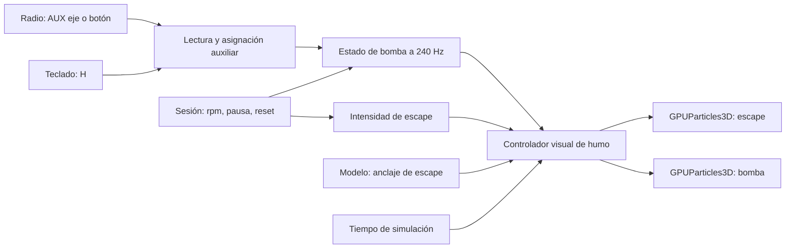

# Humo RC: escape tenue y bomba en canal auxiliar

**Fecha:** 2026-10-05. **Revisión 2:** ampliada con [doce investigaciones de herramientas, Godot, repositorios y técnicas](research/smoke-investigations/README.md). **Estado:** plan de implementación, sin efecto integrado ni rendimiento de vuelo medido. **Base inicial:** `a78cda3`; segunda revisión sobre `0f002aa` y árbol con desarrollo paralelo. **Motor fijado:** Godot **4.7.2-stable**, renderizador **Compatibility / OpenGL**.

**Resultado buscado:** el Ugly Stik deja un poco de humo cuando funciona su motor glow. Un canal auxiliar de la radio activa una bomba que produce una estela blanca abundante para acrobacia. Al apagar la bomba vuelve a quedar solamente el escape tenue; el humo ya emitido se disipa en el mundo.

La investigación está en [rc-exhaust-smoke.md](research/rc-exhaust-smoke.md). Este plan usa pasos **SM-00…SM-09**, una línea visual y de controles complementaria a [ROADMAP.md](../ROADMAP.md), sin renumerar sus hitos. Se coordina con [paisaje](LANDSCAPE-PLAN.md), [menús](MENU-PLAN.md) y [modelo visual](UGLY-STIK-VISUAL-PLAN.md). Cada paso termina funcionando, con una prueba y una entrada en `LEARNINGS.md`.

## Cambios tras las doce investigaciones

| Estudio | Consecuencia concreta | Paso |
| --- | --- | --- |
| [01 · Backends y APIs](research/smoke-investigations/01-godot-backends.md) | Mantener GPU nativo en Compatibility; excluir trails, subemisores y emisión manual por partícula | SM-00 |
| [02 · Reloj y capturas](research/smoke-investigations/02-clock-captures.md) | Un propietario del avance; verificar consumo de solicitudes y vuelta a cámara | SM-00/05 |
| [03 · Emisor rápido](research/smoke-investigations/03-moving-emitter.md) | Separar suavizado de partículas de distribución de nacimientos; prueba a 30 fps y 40 m/s | SM-00/06 |
| [04 · Repositorios y addons](research/smoke-investigations/04-repositories-addons.md) | Usar demos como referencia; no incorporar escenas Forward+ ni addons sin beneficio probado | SM-00/06 |
| [05 · Material y transparencia](research/smoke-investigations/05-materials-transparency.md) | Distinguir profundidad opaca, orden dentro de emisor y orden entre objetos; probar fade nativo | SM-06 |
| [06 · Autoría de texturas](research/smoke-investigations/06-authoring-textures.md) | Máscara pequeña reproducible primero; pipeline offline avanzado solo si falla la lectura | SM-02/06/08 |
| [07 · AUX y perfiles](research/smoke-investigations/07-aux-radio.md) | Validar AUX separado de AETR, preservar asignación al recalibrar y limpiar eventos vistos al cambiar perfil | SM-04 |
| [08 · Bombas reales](research/smoke-investigations/08-pump-behavior.md) | OFF corta nacimientos; la cola queda en el aire. No copiar caudales comerciales al .61 | SM-03/04 |
| [09 · Advección y viento](research/smoke-investigations/09-wind-advection.md) | V1 en calma; viento futuro actúa sobre partículas antiguas desde el mismo servicio que usa el avión | SM-09 |
| [10 · Secuencias y regresión](research/smoke-investigations/10-testing-sequences.md) | Movie Maker/PNG, FLIP existente, máscara de avión separada y casos negativos en copia | SM-05/06 |
| [11 · Profiling](research/smoke-investigations/11-profiling-budgets.md) | Release sin grabador; separar scripts/render, primer uso/estable y limitaciones macOS | SM-07 |
| [12 · Git, recursos y export](research/smoke-investigations/12-git-assets-export.md) | Procedencia por recurso, commit de upstream, import reproducible y paquete probado desde clon limpio | SM-08 |

La investigación aumenta precisión del plan, no el alcance del juego: se mantienen escape tenue y bomba AUX. No se instalan herramientas ni se cambia de renderizador en esta revisión.

## 1. Dos fenómenos y dos comportamientos

| | Escape del motor | Bomba de humo |
| --- | --- | --- |
| Activación | Automática con motor funcionando | Canal auxiliar, interruptor/botón o teclado |
| Aspecto | Blanco grisáceo, muy translúcido, dispersión rápida | Blanco, continuo, voluminoso por superposición, claramente visible |
| Propósito | Dar vida y escala al pequeño motor | Marcar la trayectoria durante acrobacia |
| Al cortar | Terminan los nacimientos y desaparecen las partículas existentes | Cesan nacimientos; la estela permanece unos segundos |
| Dependencia | Rpm efectivas | Orden de bomba y permiso del motor |
| Primera entrega | Perfil visual de motor glow .61 | Accesorio virtual instalado en este avión, inicialmente apagado |

El manual de O.S. para la familia FX, incluida la .61, relaciona el exceso y la falta de humo con la riqueza de mezcla; también especifica combustible con lubricante. **Las rpm no determinan por sí solas cuánto humo produce un motor real.** Aquí sirven como aproximación porque no existe todavía un modelo de mezcla. No inferir mezcla pobre, avería o temperatura a partir de esta representación. [O.S., combustible y ajuste de mezcla](https://www.os-engines.co.jp/english/line_up/engine/air/aircraft/manual/50sx_40-91fx.pdf).

Una bomba real dosifica líquido de humo hacia el escape; hay equipos con caudal gobernado por canal y con activación por interruptor. Esto respalda el control pedido. No demuestra que nuestro silenciador .61 concreto produzca una estela acrobática de estas dimensiones: la instalación virtual será una elección de producto, con datos visuales estimados. La identidad comercial exacta del motor fotografiado tampoco está confirmada. [PowerBox, instrucciones](https://www.powerbox-systems.com/data/dokumente/00001024/EN/Downloads/Bedienungsanleitung/Operating%20instructions%20PowerBox%20Smokepump.pdf), [Sullivan SkyWriter](https://sullivanproducts.com/products/s753-skywriter-smoke-pump), [motor visual del repositorio](research/ugly-stik-engine-v5.md).

**Alcance inicial:** ambos efectos, canal asignable, tecla alternativa, pausa/reinicio correctos, capturas reproducibles y presupuesto medido. Depósito, masa de aceite, consumo, temperatura del escape y termodinámica quedan para una ampliación deliberada. La bomba visual no cambia fuerzas, masa, CG ni trim. Aviones eléctricos futuros no heredarán humo de escape por defecto.

## 2. Auditoría: dónde conectar el sistema

| Código actual | Hecho observado | Decisión |
| --- | --- | --- |
| `app/get-godot.sh`, `app/project.godot` | 4.7.2; `gl_compatibility` | Probar en este motor y backend, sin exigir Vulkan |
| `app/aircraft/ugly_stik_equipment.gd` | Construye silenciador y extremos `outlet_start/outlet_end` | Obtener el anclaje del mismo constructor |
| `app/render/airplane.gd` | Devuelve modelo con raíz, hélice, bisagras, tren y controles | Añadir un anclaje opcional, conservando nombres y contratos existentes |
| `app/main.gd._render_pose()` | Sitúa modelo con corrección del CG e interpolación | Colocar emisores después de actualizar esa pose |
| `app/sim/flight_session.gd` | `engine_running`, `crash`, `resetting`; rpm en `sim.aux[AUX_RPM]` | Consumir estado real de sesión, nunca simular otro motor |
| `app/sim/simulation.gd` | Señales `stepped` y `paused_changed`; pausa propia | No asumir que `SceneTree.paused` congela partículas |
| `app/input/rc_input.gd` | Diez ejes leídos; cuatro canales de vuelo; sin botones | Extender entrada auxiliar sin alterar AETR |
| `app/input/rc_calibration.gd` | Guarda perfil por identidad del dispositivo; valida cuatro mandos | Mantener perfiles antiguos; bloque auxiliar opcional |
| `app/main.gd._capture()` | Avanza toda la física sin dibujar y luego captura | El humo necesita reproducir poses intermedias |
| `app/render/shader_clock.gd` | Tiempo visual de simulación y viento cero | Respetar ese reloj; nada animado con `TIME` |
| `app/sim/trace.gd` | CSV `openrc-trace v3` | Conservar contrato y golden flights físicos |

Estos son hallazgos de lectura, no pruebas ejecutadas del efecto integrado. Hay trabajo paralelo en paisaje, modelo, viento y otros planes; implementar con revisión del diff y sin reemplazar archivos completos. La propuesta de [viento](research/wind-godot-integration.md) aún no convierte `wind_vec` en un campo físico disponible.

## 3. Arquitectura propuesta



**Dos emisores independientes.** Cambiar continuamente la vida o la capacidad de un único emisor para pasar de tenue a denso puede reiniciar o alterar el humo existente. Cada emisor mantiene su perfil; el controlador modifica cuánto emite. Ambos parten del mismo escape para esta instalación virtual. No ubicar el humo acrobático arbitrariamente en la cola.

Archivos propuestos, todavía inexistentes:

| Archivo | Responsabilidad |
| --- | --- |
| `app/render/aircraft_smoke.gd` | Crear dos emisores, seguir anclaje, aplicar parámetros, avanzar tiempo y limpiar |
| `app/render/smoke_profiles.gd` | Parámetros visuales, unidades, procedencia y curvas; ningún coeficiente aerodinámico |
| `app/sim/smoke_system.gd` | Estado escalar de bomba: pedido, permiso, caudal y rearme; sin nodos de render ni `Vector3` |
| `app/input/aux_channel.gd` | Normalizar eje/botón asignado, detectar OFF y aplicar histéresis; probar sin hardware |
| `app/tests/test_smoke_system.gd` | Transiciones y respuesta temporal |
| `app/tests/test_e2e_smoke_input.gd` | Eventos de radio/teclado en la sesión real |
| `research/smoke/` | Experimento aislado y herramientas de capturas; no dependencias de ejecución |

Integración pequeña en `FlightSession`, lector/calibrador, `main.gd` y contrato del modelo. Evitar introducir un framework genérico de efectos o de accesorios para dos emisores.

### Anclaje del escape

El equipo de modelo expone `attachments.exhaust: Marker3D`, hijo estable de `airplane`, usando las mismas variables que construyen la boquilla. Convención propuesta: **+Z local del marcador apunta hacia fuera del escape**. Con `outlet_start` y `outlet_end` actuales:

```text
posición = outlet_end
dirección = normalize(outlet_end - outlet_start)
```

La posición actual es `Vector3(0.064, shaft_y - 0.018, engine_z + 0.041)` y el origen del tubo es `Vector3(0.056, shaft_y - 0.009, engine_z + 0.030)`, en metros del modelo. Son referencias de auditoría, **no constantes que copiar al controlador**. La salida interior construida tiene radio 0.0029 m: usarlo para evitar nacimientos fuera de la boca. Geometría visual estimada en el modelo, no medición del motor real.

Emitir aproximadamente 1 mm después de la boca, sobre ese eje, con radio inicial de posición ≤ 2 mm; tolerancias propuestas. Verificar marcador contra la malla en el contrato. Si falta el anclaje, desactivar efecto para ese avión e informar una vez en diagnóstico; no emitir desde el origen mundial.

Los emisores pueden ser hijos de un nodo de efectos del vuelo y copiar el transform global del marcador. Deben excluirse del cálculo de `_extent` y de la sombra proyectada: el humo no aumenta la envergadura, el autozoom ni la silueta del avión.

## 4. Elección de render: partículas nativas primero

Usaría **`GPUParticles3D` + `ParticleProcessMaterial` + `QuadMesh`**, con un solo pase por emisor. Compatibility soporta partículas GPU, aunque su conjunto de funciones es menor. El backend de la versión fijada implementa el procesamiento solicitado por tiempo y rechaza los particle trails; la API también limita `emit_particle()` a otros renderizadores. [Backend GLES3 4.7.2](https://raw.githubusercontent.com/godotengine/godot/4.7.2-stable/drivers/gles3/storage/particles_storage.cpp), [API GPUParticles3D](https://docs.godotengine.org/en/stable/classes/class_gpuparticles3d.html).

Esto permite construir la estela mediante partículas que quedan en el espacio, sin `RibbonTrailMesh`, `TubeTrailMesh`, simulación de fluidos, colisiones de partículas ni niebla volumétrica. `CPUParticles3D` queda como alternativa si un fallo medido de la plataforma lo requiere; cambiar de clase no resuelve automáticamente sincronización o capturas.

**SM-00 es una comprobación técnica pequeña antes de integrar:** emisión visible con OpenGL, control temporal, parada, semilla, orden de transparencia y movimiento. Si falla una función necesaria, documentar el caso mínimo y elegir entonces otra implementación. Una reserva de quads gestionada explícitamente sería la última alternativa para un historial determinista, no el punto de partida.

### Material y dibujo

- `StandardMaterial3D`, transparencia alpha convencional, billboard de partículas y color de vértice habilitado. El material de dibujo debe respetar el color/alpha generado por el material de proceso.
- Textura RGBA pequeña de borde suave: primero un gradiente radial procedural; si se ven discos repetidos, máscara irregular de ruido estático con semilla. Sin dependencia de imágenes generadas ni atlas animado para el primer paso.
- Blanco grisáceo ligeramente cálido como punto de partida; sin emisión luminosa, mezcla aditiva ni bloom. Primera prueba con material sin iluminación y niebla de escena habilitada; comparar también respuesta iluminada antes de cerrar apariencia densa.
- Profundidad probada contra sólidos; sin escritura opaca de profundidad ni sombras del humo. Un ala delante debe ocultar el humo; humo delante puede cubrir el ala por transparencia.
- Rotación inicial aleatoria, crecimiento y desvanecimiento durante la vida. Probar orden por profundidad para bomba en escritorio. Una estela cruzada en un looping es la prueba decisiva de orden, no una vista estática.

**Intersecciones suaves, condicionadas a SM-06:** ensayar primero los controles nativos de proximidad del material y, solo si hace falta, un shader mínimo de depth fade. Compatibility permite consultar profundidad, pero eso no incluye otras transparencias ni resuelve su orden. Probar ala atravesando humo, contacto con suelo y cámara entrando en la nube; son problemas distintos. No activar alpha scissor/hash para un aerosol suave ni deshabilitar profundidad para ocultar artefactos. [Investigación 05](research/smoke-investigations/05-materials-transparency.md).

Las opciones de billboard/transparencia y sus limitaciones están documentadas en [materiales 3D](https://docs.godotengine.org/en/stable/tutorials/3d/standard_material_3d.html); las curvas pertenecen al [material de partículas](https://docs.godotengine.org/en/stable/tutorials/3d/particles/process_material_properties.html). Los materiales de proceso serán recursos propios de cada emisor: una modificación de la bomba no debe modificar el escape.

## 5. Parámetros de partida, explícitamente estimados

**Toda cifra de esta sección es `kind = estimated`, fuente `SM-PLAN/lookdev-v0`.** Son valores para iniciar pruebas, no densidades medidas ni caudales reales. Guardar nombre, valor, unidad y procedencia junto al perfil visual. Si más adelante aparece consumo real, sus parámetros físicos sí pertenecerán al formato validado de aeronave.

| Parámetro | Escape tenue | Bomba abundante |
| --- | --- | --- |
| Capacidad fija `amount` | 128 | 1024 |
| Vida máxima | 0.60 s | 4.0 s |
| `amount_ratio` activo | 0.20…0.80 según rpm | 0…1 según caudal |
| Tasa nominal a ratio 1 | 213 partículas/s | 256 partículas/s |
| Diámetro visual inicial | 0.02 m | 0.06 m |
| Diámetro visual final | 0.25 m | 1.10 m |
| Alpha máximo por partícula | 0.035 | 0.18 |
| Velocidad inicial residual, eje de salida | 0.5…1.5 m/s | 0.8…2.0 m/s |
| Apertura inicial `spread` | 10° | 14° |
| Gravedad visual inicial | `(0, 0, 0)` | `(0, 0, 0)` |
| `inherit_velocity_ratio` inicial | 0 | 0 |
| `explosiveness` | 0 | 0 |
| `local_coords` | false | false |
| Paso de partículas | 60 Hz inicial | 60 Hz inicial |

La tasa nominal se calcula `amount × amount_ratio / lifetime`; mantener capacidad y vida fijas durante el vuelo. No tocar `amount` al mover AUX, porque reinicia el sistema. [API GPUParticles3D](https://docs.godotengine.org/en/stable/classes/class_gpuparticles3d.html).

Curvas sugeridas, interpolación lineal inicial y edad normalizada `a = edad / vida`:

| `a` | 0 | 0.08 | 0.25 | 0.60 | 1 |
| --- | --- | --- | --- | --- | --- |
| Alpha relativo, escape | 0 | 1 | 0.50 | 0.10 | 0 |
| Alpha relativo, bomba | 0 | 1 | 0.95 | 0.45 | 0 |

Definir el tamaño en metros con un quad base de 1 m y una curva de escala que produzca los diámetros de tabla; no aplicar el tamaño dos veces entre mesh y curva. El alpha final es máscara × alpha del perfil × curva de edad. Inicialmente modificar **solo tasa** con las rpm/caudal, evitando multiplicar inadvertidamente por ese factor en tres sitios.

Para escape, normalizar `r = clamp((rpm - idle_rpm) / (max_rpm - idle_rpm), 0, 1)` y usar `amount_ratio = lerp(0.20, 0.80, r)`. Leer límites de `aircraft.model.propulsion`; no duplicarlos. Motor parado o datos inválidos → no emitir. Cero acelerador con motor al ralentí **sí** deja algo de humo.

La opacidad acumulada importa más que la de una partícula: como aproximación, `A = 1 - (1 - alpha)^n` para `n` capas iguales. Diez capas de 0.18 alcanzan ≈ 0.86; no hace falta convertir cada sprite en una mancha opaca para conseguir mucho humo. Esto es una estimación de mezcla alpha, no un modelo óptico de aerosol.

## 6. Movimiento y longitud de las estelas

**`local_coords = false` es obligatorio.** El avión cambia de posición/orientación, pero las partículas anteriores conservan su trayectoria mundial. En un viraje no debe girar toda la nube como una pieza del avión. [Coordenadas y propiedades de partículas](https://docs.godotengine.org/en/stable/tutorials/3d/particles/properties.html).

Primera aproximación: partículas ya mezcladas parcialmente con el aire, con velocidad residual pequeña hacia fuera de la boquilla y poca herencia del avión. No representan el chorro de gas a escala milimétrica. Una velocidad mundial cercana a cero ya deja humo atrás porque el avión avanza; sumar además `-velocidad_avión` duplicaría artificialmente esa separación.

Con vuelo a 15 m/s y aire quieto, 0.60 s abarcan hasta unos 9 m de historial; el escape será perceptible sobre todo al comienzo por su curva alpha. Cuatro segundos abarcan unos 60 m: la bomba deja una trayectoria larga, como pide la ampliación. Son longitudes geométricas aproximadas, no alcance visible garantizado. Afinar primero transparencia y vida mirando desde el piloto.

**Continuidad entre frames:** a 30 fps y 40 m/s el escape avanza aproximadamente 1.33 m por frame. Aumentar `fixed_fps` de partículas no garantiza por sí solo nuevas posiciones intermedias del emisor. SM-00 debe comprobar si el backend interpola suficientemente los nacimientos al moverlo; delta fraccional e interpolación visual tampoco equivalen automáticamente a ese historial. Si aparecen grupos separados, el siguiente experimento será un material de proceso de partículas que distribuya nacimientos sobre el segmento entre las dos poses presentadas, con orientación interpolada y edad de nacimiento coherente. Mantener ese arreglo dentro del emisor y probar un giro rápido; no tapar el defecto aumentando el diámetro o llamando a `emit_particle()` en Compatibility. Si ese experimento es necesario, revisar la estimación de esfuerzo antes de integrar la bomba.

**Evidencia ya obtenida:** el [experimento aislado](research/smoke-investigations/godot-evidence/README.md) mostró grupos separados con quads de 0.35 m a 40 m/s y límite de 30 fps, tanto con interpolación como con paso de partículas de 60 Hz. Es una prueba sintética en llvmpipe, no del perfil de humo final. Por ello SM-00 empieza comparando nacimientos puntuales con una forma nativa de emisión alargada y orientada sobre el segmento recorrido; esta segunda opción distribuye posiciones, pero todavía debe demostrar edad y orientación correctas. Si falla, probar shader de nacimiento propio antes de integrar. La interpolación visual por sí sola ya no es una solución asumida.

Si en inspección se ve una salida desconectada, añadir una zona de arrastre inicial breve, probada aparte. `inherit_velocity_ratio` existe, pero no basta por sí solo: sin disipación, el humo puede viajar con el avión. [API del material de proceso](https://docs.godotengine.org/en/stable/classes/class_particleprocessmaterial.html). No inventar un campo de propwash global antes de demostrar que esa mejora se percibe.

**Viento:** v1 usa cero, igual que la sesión actual. Cuando M5 tenga viento físico, compartir una única velocidad mundial convertida mediante `Frames`, aplicada también al humo antiguo; no crear viento decorativo distinto del que vuela el avión. Si se implementa un shader de advección, validar primero el transporte de una nube con velocidad constante conocida.

**Culling:** calcular una caja conservadora para toda la estela, incluida la situada detrás de la cámara o del emisor. Estimación de radio: `R ≥ (V_avión_max + V_partícula_max) × vida_max + diámetro_max/2 + margen`. Para bomba, una velocidad de ensayo de 40 m/s da más de 168 m antes del margen; el AABB predeterminado de unos metros no sirve. Verificar velocidad de cobertura contra la envolvente del proyecto antes de fijarlo. Ampliar cobertura si se superan supuestos. No usar solo la posición presente del avión para decidir visibilidad ni para eliminar humo todavía visible.

## 7. Canal extra: asignación y experiencia de uso

### Control propuesto

- Acción de producto: **Bomba de humo**. Identificador interno: `smoke_pump`.
- Radio: canal auxiliar asignable, inicial **sin asignación**. El usuario mueve su interruptor o potenciómetro durante «Asignar bomba de humo».
- Interruptor de dos posiciones: OFF/ON por nivel. Tres posiciones, opcional: OFF/50 %/100 %. Potenciómetro: caudal 0…1.
- Teclado: **H**, alterna OFF/ON; descartar repetición automática de tecla. Está libre en la entrada auditada; revalidar conflictos al implementar menú.
- Botón momentáneo: modalidad explícita «mantener» o «alternar»; predeterminar mantener. Un interruptor de radio presentado como botón usa su nivel, no un toggle en cada evento.
- HUD discreto: `Humo OFF`, `Humo 70 %` o `Humo: motor al ralentí`. «Apagado» se refiere a nuevos nacimientos; la nube anterior puede seguir visible.

EdgeTX Classic transmite ocho ejes analógicos y 24 botones digitales; Advanced permite configurarlos. Esto no equivale a prometer que el canal 5 sea siempre el eje 4 de Godot después del mapeo del sistema operativo. Detectar el evento efectivo y conservar la identidad del dispositivo. [Mapeo oficial EdgeTX](https://manual.edgetx.org/edgetx-how-to/joystick-mapping-information-for-game-developers), [configuración Advanced](https://manual.edgetx.org/edgetx-how-to/configure-advanced-joystick-with-edgetx).

### Perfil y captura de asignación

Extender el perfil guardado con un bloque opcional `aux.smoke`, que distingue `axis` y `button`; contiene índice, inversión, extremos cuando corresponda y modo de uso. Los perfiles de cuatro canales existentes siguen siendo válidos: ausencia de bloque significa bomba sin asignar.

El asistente pide OFF, ON y vuelta a OFF; registra extremos y dispositivo. Rechaza ejes usados por alerón, profundidad, dirección o acelerador y cambios ambiguos de varios controles. Para botones, ampliar `_input()` con `InputEventJoypadButton`; el lector actual solo recibe movimiento de ejes. Filtrar siempre por dispositivo activo. Una asignación auxiliar inválida se descarta sin inutilizar la calibración de vuelo válida.

Guardar el bloque junto al perfil por dispositivo; preservar auxiliares al recalibrar AETR y comprobar conflictos tras el cambio. No modificar silenciosamente las funciones de los cuatro canales principales. No necesita esperar al menú completo: se puede añadir un paso opcional al asistente de radio existente y mostrar su estado en el panel; UI-10 podrá presentar la misma operación.

La asignación AUX será una operación opcional separable de la calibración AETR, aunque comparta presentación. Si el nuevo AETR ocupa su eje, inhabilitar solo AUX y mostrar el conflicto. Al aplicar un perfil nuevo, borrar también el historial de eventos vistos para AUX: un OFF recibido para el eje anterior no arma el eje recién asignado. Probar especialmente estos dos casos con perfiles guardados. [Investigación 07](research/smoke-investigations/07-aux-radio.md).

**Autoridad de entrada:** con radio conectada y AUX asignado, manda AUX; H no contradice un interruptor físico. Sin AUX asignado, H funciona también mientras se vuela con radio. Mostrar cuál controla la bomba. Una captura automatizada puede inyectar un programa por tick mediante un adaptador de pruebas, nunca mediante eventos de una segunda radio accidental.

### Rearme y normalización

Como los ejes pueden comenzar reportando cero sin haber recibido posición, la bomba permanece OFF hasta observar su control en OFF. Repetir este requisito al conectar/reconectar, cambiar perfil, reiniciar vuelo y salir de calibración/failsafe.

Para eje proporcional: normalizar con extremos/inversión a 0…1; OFF confirmado ≤ 0.10. Para interruptor mapeado como eje: encender ≥ 0.70, apagar ≤ 0.30, conservar estado entre ambos. Umbrales `estimated` para evitar oscilación. Botón: confirmar liberado; si el backend no entrega un evento inicial, el recorrido ON→OFF establece estado sin activar la bomba durante el rearme.

## 8. Modelo mínimo de bomba y ciclo de vida

`smoke_system.gd` mantiene `requested`, `armed`, `flow` y motivo de inhibición. Es un modelo funcional ligero a 240 Hz, con `float` de 64 bits y sin clases gráficas. No añadir una quinta componente a `sim.inputs` ni desplazar `AUX_RPM`/servos: los contratos físicos actuales siguen intactos.

Integración propuesta: tomar la petición antes del paso y avanzar bomba desde `sim.stepped`, leyendo las rpm de ese tick. El evento de tick 0 inicializa sin avanzar. No avanzar desde `_process()`, ni sumar otro filtro de motor: las rpm ya tienen su retardo físico.

```text
r = rpm normalizadas entre ralentí y máximo
permiso_motor = smoothstep(0.08, 0.25, r) si engine_running; si no, 0
objetivo = requested × permiso_motor si armado y sesión válida; si no, 0
flow = objetivo + (flow - objetivo) × exp(-dt / tau)
tau = 0.18 s al subir; 0.10 s al bajar
si objetivo == 0 y flow < 0.01: flow = 0
```

**Prioridad de corte, revisada:** antes de ese filtro, petición OFF, permiso de motor cero, datos inválidos, failsafe, calibración o reset fuerzan `flow = 0` y no permiten nacimientos nuevos. `tau = 0.10 s` solo suaviza una reducción entre caudales positivos, por ejemplo 100 %→50 %. La persistencia tras OFF procede de partículas existentes; v1 no emula aceite residual en el tubo. Pausa congela el estado y se trata aparte; al reanudar se reevalúan estas condiciones antes de emitir. [Comportamiento de bomba y límites de la analogía](research/smoke-investigations/08-pump-behavior.md).

Valores **estimados de jugabilidad**: producen arranque breve y evitan una nube densa ilimitada al ralentí. El permiso basado en rpm sustituye provisionalmente temperatura disponible; no simula calentamiento. No copiar caudales máximos de una bomba comercial grande a nuestro .61 ni presentar `flow` como ml/min.

| Evento | Bomba | Partículas existentes |
| --- | --- | --- |
| Inicio normal | OFF; escape sigue rpm de trim | Sin precarga ficticia en la nueva posición |
| AUX ON y motor permitido | Subida corta de caudal | Crecen ambas estelas |
| AUX OFF | Caudal cero y corte de nacimientos desde ese tick | La nube densa se disipa; escape continúa |
| Motor parado / inicio en planeo | Caudal efectivo cero, sin nacimientos | Se disipan si el tiempo avanza |
| Pausa voluntaria o pérdida de foco | Congelar estado, no consumir tiempo | Congelar edades y posiciones |
| Reanudar pausa ordinaria | Reevaluar entrada actual antes del primer paso | Continuar desde el mismo instante |
| Desconectar radio / iniciar calibración | Forzar OFF inmediato, desarmar | Congeladas mientras la sesión pause; luego disipación |
| Accidente | Parar nacimientos, respetar congelado actual de impacto | Limpiar al reinicio automático |
| R, recarga válida F5, cambio de avión/vuelo | OFF, desarmar y restablecer reloj | Vaciar ambos emisores; nada une vuelos distintos |
| Ocultar avión para métricas | Desactivar dibujo de ambos efectos | No contaminar captura de fondo |
| Inspección estática / menú | Bomba OFF; escape solo en preview explícito con motor | No simular vuelo detrás del menú |

«Desactivado» en ajustes gráficos limpia y detiene ambos renderizadores; no modifica aerodinámica. La lógica del canal puede conservarse y el HUD indicar que el efecto está oculto. La primera entrega puede exponer únicamente activado/desactivado; añadir calidad reducida solo si la medición lo exige.

## 9. Tiempo, pausas y capturas reproducibles

Separar **determinismo físico**, **determinismo del estado de bomba** y **repetibilidad de imágenes en el mismo entorno**. No prometer partículas bit a bit iguales entre GPUs o a distintas tasas de render.

Ruta propuesta para Godot fijado:

1. Mantener `speed_scale = 0` en los emisores y pedir explícitamente avance mediante `request_particles_process()`. El controlador es el único propietario de su reloj.
2. En vuelo, obtener incremento del tiempo presentado de simulación, coherente con la pose interpolada; actualizar transform antes de solicitar avance. En pausa, incremento cero. En reset, limpiar e inicializar origen temporal, sin interpretar el salto como velocidad.
3. Con nacimientos habilitados, solicitar el intervalo de emisión. Al cortar, usar avance residual sin nacimientos. Asignar `emitting` explícitamente al volver a activar; el backend lo modifica al procesar residual.
4. Una solicitud por emisor y frame efectivamente procesado. Las solicitudes sucesivas antes del render **se sobrescriben** en GLES3; no llamar desde los 240 ticks esperando que se acumulen. Conservar los intervalos/transiciones pendientes en el controlador, no solo el último valor AUX del frame.
5. Usar semilla fija para comparaciones y ninguna aleatoriedad global que afecte a física. Probar `fixed_fps = 60`, interpolación de partículas y delta fraccional en SM-00; desactivar la interpolación interna si interfiere con el avance manual, según evidencia.

Los dos tiempos de la API representan emisión seguida de residual; no una lista arbitraria de cambios OFF→ON→OFF. El harness debe renderizar cada tramo en orden. SM-00 debe cerrar también la política de vuelo para varios cambios dentro de un frame: segmentación soportada o aproximación visual acotada y documentada, conservando el estado exacto de bomba por tick. No acumular una cola indefinida ni afirmar precisión subframe solo por sumar duraciones.

La API documenta la combinación de `speed_scale = 0` con solicitudes temporales; el detalle de sobrescritura y el apagado durante el residual aparecen en el código del backend. [API](https://docs.godotengine.org/en/stable/classes/class_gpuparticles3d.html), [implementación 4.7.2](https://raw.githubusercontent.com/godotengine/godot/4.7.2-stable/drivers/gles3/storage/particles_storage.cpp). La lectura de código verifica disponibilidad, no reemplaza el ensayo renderizado SM-00.

**Nueva condición crítica: actualizar también fuera de cámara.** La solicitud de tiempo no equivale a encolar el sistema para su actualización. El procesamiento normalmente depende del culling; un AABB correcto evita cortar humo visible, pero no garantiza que una nube totalmente fuera del frustum siga envejeciendo. Ensayar la vía pública `RenderingServer.particles_request_process(emitter.get_base())` después de pedir tiempo; `get_base()` identifica el recurso de partículas, no la instancia visual. La existencia de esta API está documentada; su comportamiento completo con pausa/inactividad debe verificarse en SM-00. [RenderingServer](https://docs.godotengine.org/en/4.7/classes/class_renderingserver.html#class-renderingserver-method-particles-request-process), [VisualInstance3D](https://docs.godotengine.org/en/4.7/classes/class_visualinstance3d.html#class-visualinstance3d-method-get-base), [investigación 02](research/smoke-investigations/02-clock-captures.md).

La prueba lleva la nube fuera de cámara durante más de su vida, vuelve y exige que la antigua haya desaparecido; una segunda salida más corta verifica continuidad. No resolverlo poniendo un AABB infinito ni aplicando todo el tiempo perdido en la última pose. Si el procesamiento explícito falla, cerrar esta decisión en SM-00 con un caso mínimo antes de integrar, comparando una alternativa de estado de partículas controlado en CPU.

**Captura nueva de humo:** el harness desactiva avance automático y ejecuta cuatro ticks físicos, presenta la pose correspondiente, avanza partículas 1/60 s y espera el procesamiento de render; repite hasta el tick de captura. Aplicar el programa AUX por tick, de forma que un cambio en medio de un bloque no se pierda. Si hace falta precisión de ese cambio, dividir el bloque y dibujar la transición. Congelar después sin solicitar más avance y guardar PNG/manifest. Verificar el tick final de forma explícita.

No sirve avanzar tres segundos de física y hacer `preprocess = 3` con el emisor en la posición final: dibujaría todo el humo en un punto que no recorrió el vuelo. Mantener la captura rápida histórica para vistas sin efectos mediante opción explícita `--smoke=off`; la suite propia de humo prueba el historial real. Toda bandera nueva que aquí se propone requiere implementación: no son comandos ya disponibles.

Manifest de humo: commit/estado de árbol, Godot, backend, GPU/Mesa, resolución, semilla, perfiles, paso temporal, tick final, programa AUX, cámara y contadores. Comparar imágenes por hash solo con entorno y configuración iguales; entre drivers usar tolerancias visuales y revisión de secuencia.

**Herramientas elegidas:** Movie Maker/PNG para secuencias de revisión, el entorno FLIP 1.7 + NumPy 2.5.3 + Pillow 12.3.0 ya fijado para comparaciones y FFmpeg opcional para empaquetar clips. No comparar imágenes extraídas de un vídeo con pérdida como si fueran los PNG originales. Cada clip debe acompañarse de datos de tick/orden/caudal, y la matriz se ejecuta sin efectos temporales añadidos solo para la grabación. El modo de captura y la medición de fps reales son ejecuciones diferentes. [Investigación 10](research/smoke-investigations/10-testing-sequences.md).

`T` conserva por ahora la traza física v3: **no será una repetición completa de los efectos**. Para depurar el smoke harness guardar petición y caudal por tick en un archivo auxiliar. Si se decide grabarlos en vuelos normales, versionar ese registro en un paso específico, sin cambiar silenciosamente las columnas de las golden flights.

## 10. Presupuesto y degradación

Presupuestos iniciales **estimados**, a medir en la máquina del propietario a 1280×720 y con bomba llenando buena parte de pantalla:

| Métrica incremental frente a efecto OFF | Objetivo |
| --- | --- |
| Capacidad total | ≤ 1152 partículas, dos emisores |
| Pases visibles | Objetivo +2 draw calls; medir ordenación/backend |
| Trabajo CPU de control | p95 ≤ 0.10 ms/frame, sin asignaciones crecientes |
| Tiempo total de frame, escape | Diferencia de p95 ≤ 0.30 ms |
| Tiempo total de frame, bomba | Diferencia de p95 ≤ 1.50 ms |
| Memoria del efecto | ≤ 8 MiB adicionales, sin crecimiento tras 100 reinicios |
| Física | Mismas filas de traza/golden; medir sobrecoste del controlador de bomba |

Medir al menos tres pares OFF/ON del mismo recorrido tras calentamiento, registrar hardware y p50/p95/p99. El contador de partículas no mide el coste de dibujar muchas transparencias sobre los mismos píxeles. La cámara entrando en una nube y un looping que cruza su propia estela son casos obligatorios. llvmpipe en Xvfb prueba corrección, no cumplimiento del presupuesto de GPU del usuario.

El ensayo de rendimiento usa build de release, sin Movie Maker ni guardado/lectura de imágenes. Separar compilación del primer uso y rendimiento estable; empezar con 5 s de calentamiento y 30 s de muestras, estimados. Probar 720p y también 1080p si se pretende soportar esa resolución. Registrar tiempo GPU donde exista y `unavailable` donde no: Visual Profiler no está disponible en Compatibility/macOS. Usar Profiler para lógica y Visual Profiler para render; RenderDoc queda como diagnóstico opcional de un frame en Windows/Linux, no como requisito de CI. [Investigación 11](research/smoke-investigations/11-profiling-budgets.md).

Si falla: reducir primero duración/ancho de la nube lejana y solapamiento; luego evaluar perfil reducido de bomba con 512 partículas y 3 s. Ajustar continuidad con capturas, no compensar una reducción de partículas poniendo sprites completamente opacos. Un LOD futuro debe considerar distancia/proyección del humo, no solamente del avión. No rebajar la física para sostener el efecto.

Al desactivar la bomba, parar emisión y seguir procesando hasta morir la última partícula. No hacer `visible = false` inmediatamente. Reutilizar nodos/materiales entre activaciones; recrear recursos solamente en reset si el ensayo demuestra que es necesario para una limpieza fiable.

## 11. Entregas pequeñas y pruebas

| Paso | Cambio concreto | Prueba de cierre |
| --- | --- | --- |
| **SM-00** | Experimento fuera de `app/`: OpenGL, dos perfiles mínimos, marcador móvil y control temporal | Continuidad a 40 m/s y 30 fps; pausa/reset/semilla; corte/reactivación; nube fuera de cámara más de su vida; transparencia y registro de backend |
| **SM-01** | Exponer anclaje de escape desde modelo | Marcador coincide con boca y apunta fuera en varias actitudes; contrato del modelo verde |
| **SM-02** | Escape tenue integrado, perfil único ligado a rpm | Inspección y vuelo desde piloto; ralentí/crucero/pleno/planeo; prueba de pausa y reset; suite general verde |
| **SM-03** | Estado de bomba y teclado H; segundo emisor | H ON produce mucha más cobertura que escape; H OFF conserva nube anterior y luego desaparece; mismas trazas físicas |
| **SM-04** | Canal auxiliar eje/botón, asignación y persistencia | Radio falsa en escena real: OFF/ON/proporcional, perfil viejo, inversión, reconexión y conflictos |
| **SM-05** | Harness de historial, Movie Maker/PNG y capturas aisladas | Mismo tick/semilla/entorno repiten; maniobra forma estela curva; máscaras separadas de avión y humo; mutaciones en copia detectadas |
| **SM-06** | Apariencia, textura/import y ensayo de intersecciones | Matriz visual completa; bordes y sorting al cruzar estela; conservar material más sencillo que pase |
| **SM-07** | Culling, memoria y rendimiento real | Estela con emisor fuera de pantalla y nube cercana; pares OFF/ON en release sin grabador; 100 resets estables |
| **SM-08** | Procedencia de assets, export y cierre integrado | `app/test.sh`, capturas del paquete Linux; prueba visual Windows/macOS cuando haya equipo; recursos/licencias/importación desde clon limpio |
| **SM-09**, posterior | Mejoras que una prueba justifique: viento M5, temperatura/depósito o apariencia avanzada | Fuente y criterio independientes antes de cada ampliación |

**Primera parada útil:** SM-02 entrega el «poquito» pedido inicialmente. **Entrega que satisface ambos pedidos:** hasta SM-08, incluido canal auxiliar real; H por sí sola es una etapa intermedia.

Estimación inicial de planificación, no compromiso: 1 día SM-00/01; 1 día SM-02; 1–2 días SM-03/04; 1–2 días SM-05/06; 1 día SM-07/08. Total **5–7 días de desarrollo concentrado si la ruta nativa pasa SM-00**. El ensayo de emisión detectó huecos: la estimación debe revisarse al cerrar continuidad/reloj, especialmente si hace falta shader propio o historial en CPU. Persisten incertidumbres en USB y ordenación/capturas. No condicionar toda la entrega a construir primero los menús completos.

Cada commit referencia su paso y evidencia real, por ejemplo: `SM-04: map smoke AUX axis/button; proof: fake-radio lifecycle tests and unchanged flight hashes`. No afirmar una prueba que todavía no corrió. Añadir lo aprendido a `LEARNINGS.md` al terminar cada paso.

### Matriz mínima de verificación

| Caso | Resultado comprobable |
| --- | --- |
| Motor parado frente a ralentí | Cero nuevos nacimientos frente a escape mínimo; bomba inhibida |
| Rpm trim frente a máxima | Más escape dentro del rango del perfil, sin reinicio brusco |
| AUX OFF/50 %/100 % | Caudal y tasa ordenados; curvas de respuesta verificadas con tiempo simulado |
| AUX en ON al conectar | No aparece humo de bomba hasta completar OFF→ON |
| Eventos de otro joystick | No modifican bomba ni canales de vuelo |
| H sostenida | Una transición, no múltiples toggles por autorepeat |
| Desconectar/calibrar/cambiar perfil | Bomba OFF y desarmada; AETR conserva su comportamiento |
| Pausa 10 s de reloj real | Mismo estado de bomba y nube al reanudar, sin ráfaga acumulada |
| R/F5/crash/reentrada a vuelo | Desaparece humo del vuelo anterior; ningún puente entre posiciones |
| Viraje/tonel/looping | Humo antiguo permanece en el mundo; se distingue la curva de vuelo |
| Vuelo a 30/60/144 fps | Física y caudal por tick iguales; continuidad visual aceptable, sin exigir hash gráfico entre fps |
| Emisor fuera de cámara | Parte visible de la estela no desaparece por culling |
| Cielo, nube, horizonte y césped | Escape discreto; bomba identificable sin material luminoso ni bordes rectangulares |
| Avión oculto / métrica paisaje | Humo excluido del fondo y de la máscara usada para medir contraste del avión |
| Captura por historial repetida | Imagen repetible en entorno fijado y manifiestos comparables |
| Export fresco | Recursos/curvas presentes; sin depender de caché `.godot` ni rutas de investigación |

La aceptación visual requiere **secuencias**, no solo PNG. Capturar al menos cinco segundos de escape y diez segundos con bomba ON→OFF, cámara piloto y close-up, más una pasada lateral y una curva que cruce humo anterior. Revisar a velocidad normal y cuadro a cuadro.

Para valorar «tenue» y «abundante», comparar OFF/escape/bomba con misma pose/cámara y máscaras propias del avión y de la estela. El escape debe preservar las métricas de legibilidad del paisaje; la bomba puede ocultar el avión si este atraviesa físicamente su nube. No evaluar humo tenue exigiendo que sea visible desde toda distancia ni hacer al avión renderizar por encima de la nube para ganar contraste artificialmente.

La máscara actual del comparador se deduce por diferencias visible/oculto: si al ocultar el avión también desaparece el humo, se contamina. **Capturar una máscara de avión sin humo** y reutilizarla al evaluar la imagen con efecto. El humo usa una región independiente. No trasladar sin calibración al aerosol el umbral de 50 píxeles del comparador de paisaje. [Investigación 10](research/smoke-investigations/10-testing-sequences.md).

## 12. Decisiones pendientes de evidencia

1. **Compatibilidad práctica del avance manual y sorting:** resolver en SM-00 con el binario fijado y render real.
2. **Cantidad visual final:** ajustar los perfiles propuestos con clips; documentación de motor/bomba no proporciona opacidad ni vida de sprites.
3. **Control del propietario:** comprobar qué eje/botón entrega su radio y guardar perfil; no bloquear investigación o teclado por desconocer el número de canal.
4. **Instalación real del .61:** no está validada. Un futuro modelo de depósito/masa requerirá dimensiones, montaje y comportamiento independientes.
5. **Viento y temperatura:** coordinar con M5/G2 cuando existan; la v1 no puede declarar esas propiedades simuladas.

La decisión de partida es concreta: **dos emisores GPU nativos en Compatibility, escape gobernado por rpm y bomba por AUX, con reloj de simulación, anclaje del modelo y pruebas del historial de vuelo**. Cualquier alternativa más compleja deberá resolver un fallo observado de esta implementación mínima.
