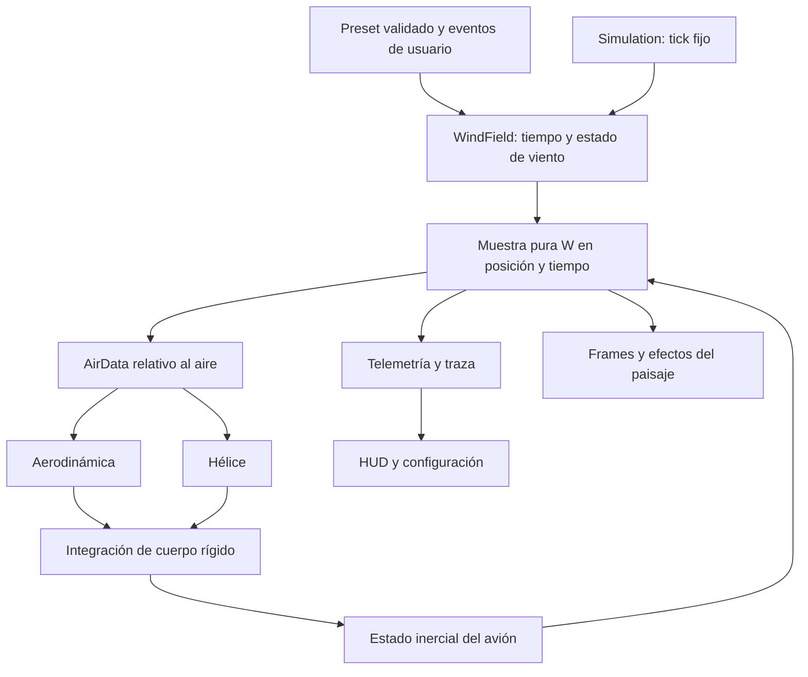

# Viento configurable para OpenRC Simulator

**Fecha:** 2026-10-05. **Estado:** investigación y plan; viento todavía no implementado. **Base inspeccionada:** `0f002aa` y árbol de trabajo con desarrollo paralelo. **Motor:** Godot 4.7.2-stable, Compatibility, física propia float64 a 240 Hz.

> Nota 2026-10-06: la auditoría de código (§2 y §4.5) es anterior a la reparación D9-R2. Ya no hay seis estaciones con déficit de pérdida: ala y colas son elementos locales (`physics/dynamics.gd`, `physics/aero.gd`). Releer el código antes de W01; W05c debe rediseñarse sobre el modelo actual.

**Propuesta:** representar el viento como velocidad del aire en el mundo, consultada por el avión, y crecer desde viento constante hasta ráfagas, dirección variable, turbulencia y diferencias espaciales. La configuración debe expresar magnitudes físicas comprensibles y permitir repetir exactamente un ejercicio dentro de una misma versión. El realismo se evalúa mediante pruebas matemáticas, comparación independiente y vuelo de pilotos RC; un efecto convincente en pantalla no basta.

Este documento desarrolla **M5 — Air and polish** de [ROADMAP.md](../ROADMAP.md) en pasos `M5-Wxx`. No cambia el orden de hitos aprobado ni declara completos aterrizajes, menús, humo o el Extra 300. Puede investigarse el viento en paralelo; adelantar su entrega jugable sería una decisión explícita del roadmap.

Fuentes y auditorías: [física y bibliografía primaria](research/wind-physics-primary-sources.md), [Godot, código y prueba ejecutada](research/wind-godot-integration.md). Los valores señalados como **estimados** son propuestas de desarrollo, no mediciones atmosféricas.

**Ampliación de investigación:** [doce investigaciones de Godot, herramientas y librerías](research/wind-investigations/README.md). Esta ronda concreta persistencia sin pérdida de precisión, edición sin efectos laterales, análisis estadístico, oráculos independientes, diagnóstico espacial y transporte de partículas. Las decisiones aplicables están incorporadas en las secciones correspondientes; no añade dependencias al juego.

## 1. El alma del simulador aplicada al viento

El centro es un piloto en tierra que aprende a orientar y controlar su pequeño avión con una radio. El viento debe cambiar la deriva, la corrección necesaria y la lectura del campo, sin hacer que volar dependa de completar una pantalla de meteorología. Mantener «Calma» como inicio predeterminado y ofrecer presets editables desde «Condiciones».

La dirección de producto ya está en [AGENTS.md](../AGENTS.md), [DECISIONS.md](../DECISIONS.md) y [MENU-PLAN.md](MENU-PLAN.md): pasos pequeños, una sola física, números con procedencia y pruebas antes de crecer. Por eso:

- Un principiante elige calma o brisa; un experto abre magnitudes avanzadas. Ambos usan las mismas ecuaciones.
- Aumentar «dificultad» cambia condiciones visibles, nunca masas, autoridad de mandos o fuerzas ocultas.
- La manga, vegetación y humo ayudan a leer el aire que afecta al avión. El HUD detallado es una ayuda opcional.
- Una condición se puede repetir con la misma semilla. «Otro viento» es una acción distinta de «Repetir intento».
- La primera entrega debe poder volarse con el Ugly Stik existente. El viento no necesita otro avión ni rehacer la escena.

## 2. Qué hay y qué falta realmente

| Base existente | Hallazgo | Consecuencia |
| --- | --- | --- |
| `physics/air_data.gd` | Calcula correctamente `v_air = v_ground_body − Rᵀ·wind_ned` | Conservar ese punto de entrada |
| `sim/flight_session.gd` | `_loads` pasa viento cero; `_t` no se utiliza | Hace falta un proveedor de viento de la sesión |
| `physics/propulsion.gd` | El avance de hélice ya recibe velocidad relativa al aire | Alimentarlo con el mismo AirData que aerodinámica |
| `sim/simulation.gd`, `physics/integrator.gd` | Cinco llamadas a cargas por tick; las cuatro RK4 comparten t | RNG fuera de consultas; añadir tiempos de etapa antes de ráfagas temporales |
| `physics/aero.gd` | Modelo global de seis ejes; seis estaciones corrigen pérdidas asimétricas | No existe aún respuesta completa al viento distinto entre puntas y cola |
| `sim/scenarios.gd`, `physics/trim.gd` | Arranque trimado en calma | Inicializar velocidad sobre el suelo preservando velocidad respecto al aire |
| `main.gd` | El HUD vuelve a calcular aire con viento cero | Corregir telemetría junto con la primera integración |
| `sim/trace.gd` | CSV real `openrc-trace v3`; velocidad actual es inercial | Versionar traza y distinguir tiempos de cargas/estado, TAS, GS y viento |
| `render/shader_clock.gd` | `sim_clock` y `wind_vec` ya existen | Conectar, no crear otro reloj |
| `render/atmosphere.gd` | Nubes con deriva artística en celdas/s | Su movimiento actual no representa viento meteorológico |
| [Paisaje](LANDSCAPE-PLAN.md), [menú](MENU-PLAN.md), [humo](SMOKE-PLAN.md), [Extra](EXTRA-300-PLAN.md) | Hay planes relacionados, con estados diferentes | Coordinar interfaces y comprobar qué existe al implementar |

Se ejecutó `tests/test_air_data.gd` con el motor local: **11 comprobaciones, 0 fallos**. El resto de conclusiones de esta sección procede de lectura. La auditoría enlazada conserva comando y límites. No se han medido aún coste de viento, respuesta a ráfagas ni opinión de pilotos.

## 3. Contrato físico: qué es viento y cómo lo siente el avión

### 3.1 Convenciones, unidades y dirección

Conservar mundo **NED**: norte, este, abajo. Cuerpo **FRD**: adelante, derecha, abajo. El cuaternión `q` transforma cuerpo → NED. El campo `W(x,t)` devuelve **m/s hacia donde se mueve el aire**, en NED.

La UI muestra dirección meteorológica **desde donde viene**, grados horarios desde norte verdadero del escenario. No hay declinación magnética en el campo local. Para intensidad horizontal `U ≥ 0`, dirección desde `θ` y velocidad vertical positiva hacia arriba `w_up`:

```text
W_N = −U cos θ
W_E = −U sin θ
W_D = −w_up
render(W) = (W_E, −W_D, −W_N)
```

| Configuración | Vector NED esperado | Movimiento del aire |
| --- | --- | --- |
| Desde N, 0°, 5 m/s | (−5, 0, 0) | Hacia sur |
| Desde E, 90°, 5 m/s | (0, −5, 0) | Hacia oeste |
| Desde S, 180°, 5 m/s | (+5, 0, 0) | Hacia norte |
| Desde O, 270°, 5 m/s | (0, +5, 0) | Hacia este |
| Ascendencia 2 m/s | (0, 0, −2) | Hacia arriba |

La flecha de transporte y la cola de la manga apuntan **a sotavento**; el texto «desde» marca el origen. A intensidad horizontal cero, mostrar «Calma» o dirección indeterminada, conservando la selección para cuando vuelva a soplar. `359° → 1°` recorre 2°, no 358°. Conversiones solo en bordes: `km/h = m/s × 3.6`; `kt = m/s × 3600/1852`.

Convención respaldada por la fuente meteorológica y análisis de ejes en la [investigación física](research/wind-physics-primary-sources.md); la conversión a Godot está implementada en [`frames.gd`](../app/render/frames.gd).

### 3.2 Velocidad del aire, fuerzas y estado inercial

```text
v_air_body = v_ground_body − R(q)ᵀ W(x_CG,t)
TAS = |v_air_body|
α = atan2(w_air,u_air)
β = atan2(v_air,sqrt(u_air²+w_air²))
qbar = ½ ρ TAS²
dx_NED/dt = R(q) v_ground_body
```

Las cargas salen de `Aero.loads` usando estos datos. **No sumar después otra fuerza de viento ni añadir W otra vez a la posición.** El estado actual guarda velocidad inercial en ejes de cuerpo; por ello tampoco necesita un término inventado `−dW/dt` en `RigidBody.derivative`. Ese término aparece al reformular ecuaciones en velocidad relativa al aire, que no es nuestro estado.

Derivación ilustrativa propia: con avión orientado al norte, `v_ground=(15,0,0)` y aire hacia sur a 5 m/s, TAS vale 20 m/s. Si en cambio se inicia ya trimado a TAS=15 en ese viento, GS longitudinal será 10 m/s. Mantener ambos experimentos separados: activar viento sobre un estado inercial fijo causa un transitorio; iniciar dentro de una masa de aire en movimiento no exige ese salto.

Un viento uniforme constante cambia trayectoria sobre el campo; no es por sí mismo una turbulencia ni crea un momento arbitrario. Una ráfaga vertical altera α; una lateral altera β, fuerza lateral y momentos por las derivadas del avión. El cruzado requiere crab o resbale para seguir una referencia terrestre. Virar a favor del viento no produce por sí solo una pérdida si se conserva TAS y maniobra relativa al aire; la velocidad visual sobre el suelo puede engañar al piloto.

**Límite de respuesta:** `aero.gd` declara pendiente `CLα̇` y emplea coeficientes instantáneos con amortiguamiento por rates. Resolver una ráfaga rápida a 240 Hz no añade automáticamente aerodinámica no estacionaria, histéresis de pérdida, penetración de ráfaga o flexión del ala. Reservar esos efectos para investigación propia; aumentar frecuencia/amplitud más allá de los casos probados no aumenta por sí mismo el realismo.

### 3.3 Hélice, arranque, suelo y cada avión

**Hélice:** mantener `J = V_axial_air/(n·D)` usando el flujo axial que admite el modelo. En la primera versión se utiliza el aire en CG, coherente con viento uniforme. El modelo actual aproxima flujo negativo y extrapola tablas: registrar sus límites cuando ráfagas fuertes llevan fuera de rango; no afirmar que reproduce entrada lateral, descarga de rpm o hélice en molinete. Muestreo en disco y eje inclinado pertenecen a una mejora coordinada con M4/Extra.

**Arranque en el aire:** resolver trim a TAS objetivo; tomar una muestra inicial del viento; construir `v_ground_body_initial = v_air_body_trim + Rᵀ W(x₀,0)`. Mantener attitude y mandos trimados. En viento vertical esto puede iniciar una trayectoria que asciende/desciende sobre el suelo; «nivelado» se debe etiquetar respecto al aire. Viento variable o gradientes no garantizan equilibrio después de t=0. No recalcular trim continuamente para anular las perturbaciones. En calma, conservar exactamente el camino numérico actual.

**Contacto con suelo:** velocidad de choque, ruedas y fricción usan velocidad respecto al suelo; sustentación y mandos siguen usando velocidad respecto al aire. Actualmente tocar suelo es accidente y reinicio. Despegues, rodaje, aterrizajes con viento cruzado y límites de componente cruzada se prueban cuando M2 implemente contacto. Un avión inmóvil en tierra con viento puede tener carga aerodinámica; ello no autoriza simular rodaje sin reacciones del tren.

**Ugly Stik y Extra:** comparten el mismo campo de aire. Cambian masa, inercia, carga alar, geometría, estabilidad, coeficientes, trim y mandos. No añadir «sensibilidad al viento ×2» por avión. Para comparar, usar la misma ruta/condiciones y registrar TAS, configuración y semilla; distinta trayectoria atraviesa distinto aire cuando el campo es espacial. El [research del Extra](research/extra-300-integration-audit.md) advierte que su ala trapezoidal y eje motor no están representados automáticamente por los supuestos del Stik.

## 4. Componentes del modelo meteorológico

```text
W(x,t) = W_mean(h,t) + W_discrete_gust(x,t) + W_turbulence(x,t) + W_local(x,t)
```

Cada componente es activable y trazable por separado. Los presets iniciales no apilan varios modelos que describan la misma energía de perturbación. La densidad permanece en `1.225 kg/m³`, como hoy; temperatura, presión y densidad variables necesitarán otro paso atmosférico coherente con motor y aerodinámica.

### 4.1 Viento medio y dirección que cambia

Primero uniforme a toda altura. Después añadir cambios lentos mediante una agenda de objetivos generados con semilla: velocidad y rumbo nuevos cada intervalo configurable, con transición suave de pendiente nula en extremos. Interpolar rumbo por el arco corto, con desempate documentado de +180°, y velocidad por separado; no promediar grados sin tratar la circularidad.

Configurar amplitud del cambio angular, amplitud de velocidad, intervalo mínimo/máximo y duración de transición. La agenda depende de tiempo de simulación y puede inspeccionarse/reproducirse. Su interpolación es una elección de ingeniería, no un modelo sinóptico de evolución meteorológica.

### 4.2 Ráfaga discreta: un evento finito

Primera forma elegida: pulso **1−cos**, sin salto al principio ni al final. Para inicio `t₀`, duración total `T>0`, amplitud pico `A` y dirección unitaria fija `d` en NED:

```text
ξ = (t−t₀)/T
g(t) = A/2 · [1−cos(2πξ)]  si 0≤ξ≤1; 0 fuera
W_gust(t) = g(t) d
```

Esta es nuestra parametrización temporal de un pulso suave; no confundir duración total T con la distancia hasta el máximo usada en definiciones aeronáuticas. La relación con perfiles espaciales y fuentes NASA/JSBSim está en la [nota física](research/wind-physics-primary-sources.md). No copiar intensidades de certificación de aviones grandes como condiciones habituales RC.

Ofrecer eventos longitudinales, laterales y verticales, y vector personalizado avanzado. «+2 m/s» significa incremento pico del componente indicado, no intensidad total ni desviación estándar. La dirección se fija al crear el evento en marco NED; no gira con el avión ni con un cambio posterior del viento base.

Primero evento manual a t conocido; luego secuencia aleatoria con amplitud y duración dentro de intervalos y separación configurada **entre el final y el siguiente comienzo**, evitando solapamientos en la v1. Los eventos explícitos futuros podrán superponerse por suma vectorial y mostrar el pico resultante. Cualquier límite de intensidad debe ser explícito: recortar cada componente silenciosamente cambia el modelo.

### 4.3 Turbulencia: fluctuación correlacionada, distinta de una ráfaga

No sortear tres velocidades independientes en cada frame ni aplicar impulsos de rotación al avión. Una señal así cambia con FPS, concentra energía inadecuada y hace imposible investigar una respuesta.

**Primera aproximación propuesta:** tres procesos de Ornstein–Uhlenbeck (OU) en un marco horizontal fijado por la dirección de referencia del preset, más vertical. Para cada componente, desviación estándar `σ` en m/s y tiempo de correlación `τ` en segundos:

```text
a = exp(−dt/τ)
x_next = a·x + σ·sqrt(1−a²)·N(0,1)
```

Es una discretización exacta de esa recurrencia gaussiana a pasos constantes, no un modelo completo de turbulencia atmosférica. Inicializar estacionariamente (`x₀~N(0,σ²)`) o declarar el calentamiento; no medir RMS al inicio de una serie arrancada artificialmente en cero. El modelo se publica como **«turbulencia correlacionada aproximada»**, nunca como Dryden. La fórmula y los ensayos de covarianza son parte de la especificación matemática propia.

Para consultas dentro del tick, interpolar los extremos precomputados sin nuevos sorteos. Esa interpolación modifica el contenido de alta frecuencia entre muestras y **no vuelve diferenciable un proceso estocástico ni le otorga convergencia RK4 de cuarto orden**. Comprobar estadísticas del modelo discretizado. Limitar configuraciones a tiempos resolubles; detener o rechazar una configuración inviable antes del vuelo, sin modificar dt global.

**Evolución:** incorporar Dryden como backend alternativo cuando haya una referencia fijada y pruebas de espectro, varianza, autocorrelación y conversión espacial/temporal. Exponer `σ_u/v/w` y escalas `L_u/v/w` en metros. `L/V` depende de la velocidad de encuentro y de hipótesis de campo congelado; no reutilizar τ del OU como si fueran metros. Von Kármán queda para una comparación que justifique su coste. La [investigación primaria](research/wind-physics-primary-sources.md) detalla límites a baja velocidad, cerca del suelo y fuera de vuelo rectilíneo.

La herramienta offline de discretización debe tratar por separado dinámica determinista e innovaciones estocásticas: `cont2discrete` no decide por sí sola la covarianza del ruido blanco discretizado. Para estado `dx=A·x dt+L dB`, obtener `Qd=∫ exp(A s)·L·Qc·Lᵀ·exp(Aᵀ s) ds` en el intervalo del paso y una inicialización estacionaria apropiada. La recurrencia OU exacta ya es el caso escalar de contraste. En W06a verificar matrices y covarianzas antes del vuelo. [Investigación 06](research/wind-investigations/05-08-analysis-tools.md).

La primera serie OU es **uniforme en todo el campo**: sirve para perturbar un avión de manera controlable, pero no representa un remolino que alcanza primero un ala. Informar esa limitación en diagnóstico. Tampoco generar un RNG independiente en cada ala: produciría discontinuidad y ausencia de coherencia espacial.

### 4.4 Altura, cizalladura y terreno

Definir altura **AGL**, distancia vertical al suelo físico en esa posición; hoy el suelo de contacto es plano. No utilizar altura del mesh decorativo para unas funciones y plano cero para otras. El contrato futuro de campo debe suministrar la misma elevación al viento y a contacto.

Orden propuesto:

1. Perfil uniforme, predeterminado y comprobable.
2. Perfil de capas configuradas por `(h_AGL, velocidad, dirección)` con interpolación suave y reglas explícitas fuera del intervalo; útil para ejercicios y sin atribuirle climatología universal.
3. Perfil logarítmico neutral sobre terreno homogéneo, solo con dominio y parámetros validados: rugosidad `z₀`, desplazamiento `d`, altura de referencia y tratamiento inferior/superior. No evaluarlo en singularidades ni extrapolarlo dentro de árboles. Si faltan datos, el perfil de capas es más honesto.
4. Zonas locales de turbulencia a sotavento, térmicas y sustentación de ladera, como experimentos separados después de disponer de terreno físico y muestreo espacial.

La capa inferior debe hacer explícita la condición de no penetración del suelo para componente vertical cuando se anuncie un modelo cercano a superficie; atenuarla con altura es una aproximación a verificar, no un sustituto de flujo alrededor de obstáculos. Un ruido 3D suave no garantiza un campo sin divergencia. No prometer wake de árboles, rotor de ladera o conservación de masa por añadir ruido cerca de una malla. El modelo NASA de térmicas citado en [RESEARCH](../RESEARCH.md#wind-thermals-and-inexpensive-validation) es una investigación posterior, no una pieza necesaria del viento inicial.

### 4.5 Relación espacial con ala, cola y hélice

Cuando el tamaño de las estructuras turbulentas es comparable a la envergadura, una única muestra en CG es insuficiente. Para una estación `rᵢ` medida desde CG en cuerpo:

```text
xᵢ_world = x_CG + R rᵢ
v_air_i_body = v_ground_CG_body + ω_body × rᵢ − Rᵀ W(xᵢ_world,t)
M_i = rᵢ × F_i
```

El `ω×r` es velocidad local del avión, no otro viento atmosférico. El propwash es un flujo inducido por el avión y se mantiene separado de W para no acabar moviendo árboles con el escape de la hélice.

La adaptación de las seis estaciones actuales requiere un paso propio. Hoy solo aplican **déficit de pérdida** sobre aerodinámica global. Introducir allí viento local únicamente en α no resuelve variación de presión dinámica, fuerzas en régimen adherido o cola, y puede duplicar amortiguamiento.

Probar primero una corrección incremental:

```text
carga_total = carga_global_actual(W_CG)
            + Σ [carga_estación(flujo_local) − carga_estación(flujo_con_W_CG)]
```

Ambas evaluaciones de cada estación incluyen el mismo `ω×r`, controles y modelo local. Así la corrección se anula cuando todas reciben el mismo viento. La fórmula es una estrategia propuesta de compatibilidad, no validación de fuerzas distribuidas: reparto de superficies, coeficientes seccionales y momentos necesitan datos propios. No dividir todos los coeficientes globales por seis y asumir que se ha identificado un ala.

Primer caso: campo vertical afín conocido `W_D(y)`, avión sin rates, signos de momento comprobados e inversión al reflejar el gradiente. Después viento homogéneo, que debe conservar las cargas previas incluso en giro y pérdida. No añadir además velocidades angulares aleatorias Dryden si ya se representan sus gradientes con estaciones. Para el Extra, posiciones, áreas y brazos deben salir de su geometría, nunca de constantes del Stik.

## 5. Configuración: contrato que debe poder usar una persona

### 5.1 Pantalla básica

«Condiciones → Viento»: preset, intensidad con unidad, dirección desde N/E/S/O y grados, ráfagas activas e intensidad, turbulencia y dirección variable. Un resumen legible acompaña al preset: por ejemplo «Desde O 4 m/s; ráfagas hasta +2 m/s; dirección ±10°». Si hay componentes laterales/verticales, no reducir su resumen a un único pico longitudinal.

«Avanzado» ofrece parámetros físicos, semilla y perfil por altura. «Repetir» conserva semilla; «Nueva realización» genera otra, la muestra y la registra. Guardar presets propios, duplicar uno instalado y restaurar valores. Los campos disponibles corresponden a capacidades implementadas; no habilitar un control que todavía no cambia el vuelo.

### 5.2 Catálogo de parámetros

Todos los rangos siguientes son **rangos iniciales de UI estimados para ejercicios**, no límites de seguridad de un avión real ni evidencia de validez aerodinámica. La validación distingue tipo/dominio matemático, rango probado y rango de interfaz. El modo de investigación puede ampliar el segundo solo de forma explícita y con trazas.

| Grupo/campo propuesto | Unidad y semántica | Predeterminado / intervalo inicial | Disponibilidad |
| --- | --- | --- | --- |
| `mean.speed_mps` | Magnitud horizontal a altura de referencia | 0; UI 0–12 | Primera entrega |
| `mean.from_deg` | Desde norte horario | 270; [0,360) normalizado | Primera entrega |
| `mean.reference_height_m` | AGL de referencia | 10; >0; sin efecto con perfil uniforme | Al añadir altura |
| `mean.vertical_up_mps` | Velocidad vertical media, + arriba | 0; UI −3…+3 | Avanzado; flujo homogéneo de laboratorio |
| `direction.enabled` | Cambios lentos | false | Dirección variable |
| `direction.half_range_deg` | Desviación máxima desde dirección base | 10 si se activa; UI 0–90 | Dirección variable |
| `direction.interval_min/max_s` | Entre objetivos | 20 / 60 | Dirección variable |
| `direction.transition_s` | Tiempo hasta siguiente objetivo | 10; ≤ intervalo mínimo | Dirección variable |
| `mean_variation.amplitude_mps` | Variación lenta de magnitud | 0; ≤ velocidad media para esta modalidad | Dirección variable |
| `gust.enabled` | Eventos discretos | false | Ráfagas |
| `gust.peak_min/max_mps` | Incremento pico longitudinal | 1 / 2 si se activa; UI 0–6 | Ráfagas |
| `gust.duration_min/max_s` | Duración total de cada pulso | 2 / 4; UI 0.25–10 | Ráfagas |
| `gust.gap_min/max_s` | Espera tras terminar evento | 5 / 15; ≥0 | Ráfagas |
| `gust.axis` | Longitudinal/lateral/vertical/vector NED | Longitudinal, siguiendo dirección al crearse | Ráfagas |
| `gust.start_s` | Inicio de evento de prueba único | 5; ≥0 | Investigación |
| `turbulence.model` | `off`, `correlated_ou`; después `dryden` | `off` | Según backend implementado |
| `turbulence.sigma_mps[3]` | RMS fluctuación longitudinal, lateral, vertical | (0,0,0); UI 0–2 por componente | Turbulencia |
| `turbulence.tau_s[3]` | Correlación temporal OU | (2,2,1); UI 0.1–20; >0 | Solo OU |
| `turbulence.length_m[3]` | Escalas integrales del modelo espectral | Sin default validado; >0 | Solo Dryden posterior |
| `profile.kind` | Uniforme/capas/logarítmico neutral | Uniforme | Por etapas |
| `profile.layers` | Alturas únicas ascendentes, velocidades y rumbos | Vacío si uniforme | Capas |
| `profile.roughness_m`, `displacement_m` | Parámetros de superficie | Sin preset físico validado | Logarítmico posterior |
| `spatial.model`, escalas, advección | Correlación espacial, no «cantidad de sacudida» | Desactivado; especificación en su paso | Campo distribuido |
| `seed` | Identificador exacto de realización | Cadena decimal `20261005` | Desde primer preset |
| `restart_policy` | Repetir condiciones / nueva realización explícita | Repetir | Desde primer preset |
| `apply_transition_s` | Suavizado de cambios en vuelo | 3 s estimados; ≥0 | Edición en vuelo |
| `units`, `show_wind_aid` | Presentación, no física | m/s; ayuda opcional | UI |

Cada backend valida solo su esquema y rechaza combinaciones ambiguas; no interpretar `tau_s` como `length_m`. Los parámetros de topes/bandas físicas deben declararse también cuando se añadan perfiles complejos. Controlar amplitudes por componente y documentar el sentido de valores firmados de eventos laterales/verticales.

### 5.3 Presets de trabajo, todos estimados

| Preset | Media | Ráfaga longitudinal | Cambios de dirección | Turbulencia σ longitudinal/lateral/vertical |
| --- | --- | --- | --- | --- |
| Calma | 0 | No | No | (0,0,0) |
| Brisa constante | 2 m/s desde O | No | No | (0,0,0) |
| Cruzado constante | 4 m/s a 90° del rumbo de ejercicio | No | No | (0,0,0) |
| Ráfagas de práctica | 4 m/s desde O | +1…2 m/s, 2…4 s, espera 5…15 s | No | (0,0,0) |
| Variable suave | 4 m/s desde O | No inicialmente | ±10°, objetivos cada 20…60 s | (0.3,0.3,0.2) m/s; τ=(2,2,1) s |

«Cruzado» necesita una referencia terrestre/rumbo del ejercicio y se convierte una vez en dirección absoluta; no permanece mágicamente perpendicular al morro durante un viraje. No clasificar estos presets como certificados, meteorología local medida o límites recomendados de operación del Stik.

### 5.4 Datos, persistencia y aplicación

Proponer `app/data/weather/*.json` con formato **`openrc-weather v1`**, validado por `physics/wind_config.gd`. Separar configuración meteorológica de `openrc-aircraft v1`. Los valores físicos instalados llevan `{value,unit,kind,source}` como en el avión; `kind=estimated` para nuestros presets. En ejecución compilar a floats/arrays, sin recorrer metadatos en cada carga. IDs, enumeraciones y formato son estructura, no magnitudes físicas.

Fragmento ilustrativo de procedencia, **no archivo completo cargable**:

```json
{
  "format": "openrc-weather v1",
  "id": "practice-breeze-v1",
  "seed": "20261005",
  "mean": {
    "speed": {"value": 2.0, "unit": "m/s", "kind": "estimated", "source": "WIND-PLAN: preset de práctica, pendiente de playtest"},
    "from": {"value": 270.0, "unit": "deg", "kind": "estimated", "source": "WIND-PLAN: dirección elegida para el ejercicio"}
  }
}
```

Guardar preferencias y último preset con el servicio `user://settings.cfg` previsto en UI-07; presets personalizados bajo `user://weather/`. Si ese servicio todavía no existe, definir un adaptador mínimo reutilizable, no un segundo propietario de preferencias. Guardar seed como cadena evita redondearla al pasar por JSON numérico. Conservar versión, procedencia y hash del contenido resuelto; si el usuario edita un preset medido, sus valores nuevos pasan a ser elegidos/estimados, no conservan una procedencia falsa.

**Precisión comprobada en la ronda 2:** el JSON predeterminado perdió dígitos de un float64 de prueba; `JSON.stringify(data, "", true, true)` los conservó. Un entero mayor que 2⁵³ cambió al parsearse como número y se conservó como texto. Por eso seed **y estado RNG** se guardan como cadenas decimales validadas, y los floats de checkpoint con precisión completa. Definir versión y normalización antes de hashear; ordenar claves no garantiza el mismo texto en todos los lenguajes. [Investigación 09 y resultado del probe](research/wind-investigations/09-12-config-render.md).

Validar números finitos, unidades, tamaños de arrays, enumeraciones, versión, σ≥0, τ/L>0, min≤max, duración resoluble, capas ordenadas y dominio de perfil. Rechazar versiones futuras sin sobrescribir; preservar archivo corrupto y mostrar recuperación. Error al cargar clima explícito no se convierte silenciosamente en calma. La sesión anterior válida puede continuar; un inicio inválido presenta el error antes de volar.

Usar `JSON.new().parse()` para informar línea y causa. Godot acepta comas finales: los presets distribuidos deben pasar también un parser estricto si los consumen herramientas externas. JSON Schema Draft 2020-12 y `python-jsonschema` son una opción **offline** al crecer el catálogo, con fixtures compartidos; no sustituyen restricciones físicas entre campos ni el loader GDScript. [Investigación 09](research/wind-investigations/09-12-config-render.md).

Aplicar cambios en una frontera de tick con un evento registrado. En UI se edita una copia: «Aplicar al reanudar» cambia condiciones mediante transición configurable; «Reiniciar con estas condiciones» reconstruye vuelo y clima. No tocar el estado al arrastrar cada pixel del slider. Cambiar backend o seed requiere reinicio en la primera versión; variar intensidad/dirección en vuelo puede interpolarse y no modifica la velocidad inercial instantáneamente. Cancelar preserva todo. Persistir ajustes no implica reanudar una sesión pausada por desconexión de radio.

**Controles nativos, comprobación de ronda 2:** `set_value_no_signal()` evita señales, pero sigue cuantizando según `step`. Mantener configuración activa, borrador preciso y valores de presentación separados; abrir/cancelar o alternar m/s↔kt no copia de vuelta el redondeo. Antes de Aplicar, consolidar el texto pendiente de SpinBox y validar una sola vez. Un test de señales requiere controles dentro del SceneTree. W03b debe comprobar guardar sin edición, texto pendiente, precisión y aislamiento de radio/teclado. [Investigación 10](research/wind-investigations/09-12-config-render.md).

## 6. Implementación en Godot y arquitectura

`Area3D.wind_*` solo afecta SoftBody3D según la [referencia del motor fijado](https://raw.githubusercontent.com/godotengine/godot/4.7.2-stable/doc/classes/Area3D.xml). OpenRC tiene su propio integrador; construir el campo como objeto de datos GDScript sin nodos de física nativa. No añadir `RigidBody3D`, un plugin meteorológico o compute shaders para resolver el viento básico.



### 6.1 Módulos propuestos

| Archivo | Responsabilidad |
| --- | --- |
| `app/physics/wind_config.gd` | Carga/validación y conversión de unidades/convenciones |
| `app/physics/wind_field.gd` | Media, perfiles, ráfagas y consultas de velocidad; float64 |
| `app/physics/wind_turbulence.gd` | Estado estadístico y discretización, cuando exista turbulencia |
| `app/sim/flight_session.gd` | Posee clima del vuelo, resetea y suministra muestras a cargas/telemetría |
| `app/sim/simulation.gd` | Límite de tick, preparación de clima y tiempos de integración |
| `app/sim/trace.gd`, `recorder.gd` | Metadatos, muestreo y checkpoints del entorno |
| `app/render/…` | Conversión e indicadores; consume muestras, no gobierna meteorología |
| `app/tests/test_wind_*.gd` | Pruebas independientes, integración y configuración |

Son nombres propuestos, no archivos ya creados. Mantener pequeño el primer módulo; extraer turbulencia cuando tenga estado propio. El modelo visual y sus nombres `airplane`, `propeller`, `*_hinge` permanecen como contrato con el otro equipo.

Interfaz conceptual:

```text
reset(config_resolved, seed, initial_context)
prepare_tick(tick, dt, encounter_context)       # única evolución RNG/estado
sample_ned(position_ned, time_s) -> float64[3] # pura: repetir consulta no cambia nada
snapshot() / restore(snapshot)                 # para reinicio/replay
```

En viento uniforme `position_ned` no altera el resultado; conservar el argumento prepara una extensión concreta. La muestra devuelve copia o buffer con propiedad explícita para evitar que un consumidor modifique la fuente. El contexto Dryden futuro puede incluir velocidad de encuentro y AGL; no permitir que una consulta desde el árbol cambie esos parámetros del avión.

### 6.2 Orden del tick y RK4

1. Leer mandos y eventos de configuración programados.
2. Preparar una vez clima para `[t,t+dt]`, con estado y agenda propios. Se integra en el camino `sim.step()`, también cuando la llamada sea síncrona.
3. Avanzar rpm y servos como hoy, sin cambiar su contrato por este trabajo.
4. Evaluar cargas con el estado y tiempo solicitado por cada etapa: `t`, `t+dt/2`, `t+dt/2`, `t+dt`.
5. Confirmar el paso del avión y del entorno. Emitir telemetría coherente y registrar.
6. Render lee estado/interpolación. No consume RNG físico ni vuelve a avanzar filtros.

Añadir una función RK4 dependiente del tiempo y conservar la vía autónoma actual; compartir álgebra donde mantenga orden de operaciones en calma. Prueba con ecuación escalar no autónoma y solución exacta más una suave de error no nulo, antes de integrarla con el avión. En caso de error durante preparación, no dejar avión y clima en ticks diferentes.

Las consultas de telemetría y de la manga pueden ejecutarse muchas veces sin alterar el vuelo. RNG privado por componente; aspecto visual con otra semilla. El [RNG de Godot](https://docs.godotengine.org/en/stable/classes/class_randomnumbergenerator.html) permite semilla y estado, pero no garantiza un algoritmo inmutable entre versiones. Registrar motor, versión de viento y contenido. Identidad de bits se exige en el mismo entorno fijado; entre arquitecturas se miden tolerancias. Replay permanente entre cambios de motor requiere algoritmo propio fijado o entradas de viento grabadas.

La fuente del motor fijado expone las muestras RNG como `real_t`, float32 en el build estándar. Mantener estados y filtros en float64; si se usa `randfn`, pedir una normal estándar y aplicar σ en GDScript64. Medir cuantización/estadística antes de decidir que hace falta un PRNG propio. Restaurar primero seed y luego state guardado, más filtros y agenda; abrir un panel o monitor no consume muestras. [Investigación 02](research/wind-investigations/01-04-godot-runtime.md).

La protección interna del logaritmo en `randfn` también modifica la cola extrema: evaluar estadística de la realización discretizada, sin atribuirle probabilidades exactas de eventos raros de una normal ideal. Las ráfagas fuertes controladas siguen siendo eventos configurados por separado, no dependen de esperar una muestra extrema.

FastNoiseLite no ofrece por su nombre fidelidad atmosférica ni garantiza nuestra precisión: su [interfaz usa real_t](https://raw.githubusercontent.com/godotengine/godot/4.7.2-stable/modules/noise/fastnoise_lite.h). El generador físico se implementa en escalares float64; ruido GPU y shaders quedan en presentación.

### 6.3 Pausa, reset y trazas

Pausa, pérdida de foco y radio desconectada congelan clima y eventos junto con el tick. No recuperar tiempo real acumulado al volver. Reinicio manual y tras accidente repiten la realización por defecto; «Nueva realización» es explícito. Reset debe preparar t=0 antes de que `sim.reset()` evalúe cargas. El menú propuesto y captura/headless deben ejercer esas mismas rutas.

La prioridad de nodos solo ordena callbacks de SceneTree, no llamadas directas a `sim.step()`. El máximo actual de 12 pasos/fotograma puede ralentizar tiempo simulado bajo 20 fps; clima y avión se ralentizan juntos. Añadir una prueba de N pasos síncronos y otra de pausa propia, sin introducir un Timer ni un nodo meteorológico `PROCESS_MODE_ALWAYS`. [Investigación 01](research/wind-investigations/01-04-godot-runtime.md).

Proponer siguiente revisión de traza (**v4 si sigue libre al implementar; coordinar con humo/otros trabajos**) con:

- Viento total N/E/D en CG y componentes media/ráfaga/turbulencia; perfil/altura de muestreo.
- TAS, velocidad terrestre horizontal GS, velocidad inercial 3D, α, β y qbar. `speed_mps` histórico no se redefine silenciosamente.
- Tiempo de estado `t_s` y tiempo de las cargas `loads_t_s`; las cargas actuales corresponden al inicio del paso, mientras el estado emitido es final. Las muestras de viento/aire de ambas instancias deben diferenciarse o elegirse explícitamente.
- Configuración resuelta/hash, seed, modelo/versiones, dt, eje/dirección, avión y estado inicial. Eventos de edición con tick exacto.
- Checkpoint de avión, auxiliares, RNG, filtros y agenda al iniciar grabación en medio del vuelo. Guardar como sidecar versionado si no cabe razonablemente en cabecera CSV.

No consumir aleatoriedad al registrar. El CSV redondeado a nueve decimales es diagnóstico, no garantiza restauración bit a bit; usar representación suficiente en checkpoint. Mantener lector de v3 o migración explícita y fixtures históricos. Regrabar goldens solo por cambios físicos deliberados, nunca para ocultar un fallo introducido por viento desactivado.

## 7. Que el viento pueda verse y entenderse

**HUD:** TAS y GS claramente distintos, dirección/intensidad en CG como ayuda avanzada, condición a altura de referencia en el panel básico. Identificar posición y altura de la lectura: manga al suelo y avión a 30 m pueden marcar velocidades diferentes de manera correcta. No inferir viento del desplazamiento del avión ni suavizar el dato que usa la física para que la pantalla parezca tranquila.

**Manga:** muestrear en su propia posición y altura. Desde la primera entrega jugable basta un indicador sencillo; integrar la manga L10/L15 cuando exista, sin bloquear física. La [FAA AC 150/5345-27E](https://www.faa.gov/documentlibrary/media/advisory_circular/150_5345_27e.pdf) aporta referencias de alineación desde 3 kt y extensión completa a 15 kt. Curva intermedia, lag y flutter se etiquetan aparte; el research anterior no valida un anemómetro preciso ni «una franja = 3 kt».

**Vegetación:** publicar por [`ShaderClock`](../app/render/shader_clock.gd) `wind_vec` en ejes de render. Con campo uniforme basta una global; con campo espacial, muestras por región/instancia o una representación de campo compartida. Elegir la muestra del lugar, no usar el viento que casualmente encuentra el avión para mover todos los árboles. Calidad gráfica reduce animación/detalle, nunca cambia viento físico.

**Diagnóstico espacial:** antes de integrar ruido distribuido, dibujar muestras conocidas en CG, puntas, cola y manga; después una cuadrícula pequeña a dos alturas. Empezar con ImmediateMesh para pocos segmentos. MultiMesh es candidato si el número lo justifica, con culling por regiones y sus datos empaquetados exclusivamente visuales. La escala de flechas no cambia W. Activar esta vista debe conservar hash de vuelo/clima. [Investigación 11](research/wind-investigations/09-12-config-render.md).

**Humo:** coordinar con [SMOKE-PLAN](SMOKE-PLAN.md). Las partículas ya emitidas siguen el viento en su posición mundial, no solo la velocidad del emisor al nacer. No aplicar m/s como aceleración m/s². Si se modela relajación hacia aire, definir esa constante y conservar movimiento mundial; verificar transporte de una nube con viento constante conocido antes de ruido decorativo.

**Nubes:** la deriva actual en celdas/s es artística y no puede igualarse directamente a m/s. Definir altura de capa y conversión métrica. Con viento variable, desplazamiento es `∫W_aloft dt`, no `W_actual·t`; el segundo reposiciona bruscamente todo el cielo al girar el viento. Integrar y envolver el offset en CPU con precisión suficiente y conservar la frecuencia reducida de actualización del cielo. Nubes altas no tienen por qué moverse a velocidad de manga.

**Propiedad del avance de partículas:** el GLES3 fijado desplaza partículas con su velocidad antes de ejecutar `process()` del shader. W07 debe elegir integración nativa por `VELOCITY` o posición explícita con `disable_velocity`; sumar ambas duplicaría transporte. El ensayo de viento constante y giro por tramos debe comparar con una referencia CPU antes de integrar el humo. Un shader espacial necesita una representación compartida del campo, no otro RNG. [Investigación 12](research/wind-investigations/09-12-config-render.md).

**Reloj:** el `sim_clock` existente envuelve a 1024 s para shaders; nunca usarlo como tiempo meteorológico ni integrar advección como `v·sim_clock`. En caso contrario habría repetición/salto cada 17 minutos. Fases periódicas y desplazamientos acumulados tienen contratos diferentes. Mantener la prohibición de `TIME` ya comprobada en `app/test.sh`.

**Audio:** viento ambiental según posición del piloto y exposición, con atenuación y mezcla propia. Un sonido de aire relativo montado en avión usa TAS y es otro efecto. Evitar cámara sacudida o rotación artificial del modelo como sustituto de fuerzas.

## 8. Entregas pequeñas y pruebas de aceptación

Los pasos siguientes son propuestos, salvo W00 documental. Cada uno termina con prueba registrada, entrada en `LEARNINGS.md` y mensaje de commit que identifique esa prueba. Antes de escribir scripts bajo `app/`, prepararlos y verificar parseo fuera del árbol compartido; respetar los guardrails y contratos vigentes.

| Paso | Cambio concreto | Prueba para cerrarlo |
| --- | --- | --- |
| **M5-W00 — este documento** | Auditar código, integrar research y fijar alcance/configuración | Fuentes y doce investigaciones revisadas; AirData 11/11 previo; ensayo de configuración 10/10 y cálculos SciPy conservados |
| **M5-W01a** | Loader de clima mínimo, convenciones NED/from, preset calma/constante | Datos inválidos rechazados; cuatro cardinales y unidades; round-trip float64/seed; sin cambio de vuelo |
| **M5-W01b** | Campo uniforme y conexión AirData/hélice; viento cero por defecto | Calma conserva goldens; cargas conocidas con viento; consultas sin efectos laterales |
| **M5-W01c** | Arranque trimado en aire en movimiento | Invariancia galileana: misma actitud/TAS/cargas y desplazamiento relativo `W·t` |
| **M5-W01d** | Telemetría/HUD/traza con tiempos y velocidades explícitos; selección por archivo/CLI | App real muestra TAS≠GS correcto; headless y export cargan preset; lectores versionados |
| **Gate W-A** | Vuelo con calma, frente, cola y cruzado constante | Propietario aprecia deriva/corrección; repetir estado y semilla; no se requiere M2 |
| **M5-W02a** | RK4 con tiempos de etapa para forcing temporal | Oráculo no autónomo, convergencia determinista y goldens autónomos intactos |
| **M5-W02b** | Evento 1−cos conocido | Inicio/mitad/final, pico y área temporal conocidos; sin salto de viento |
| **M5-W02c** | Agenda de ráfagas con seed y rangos | Misma secuencia en 30/60/144 fps y con consultas extra; sin solapes por contrato |
| **M5-W03a** | Variación lenta de dirección/intensidad | Cruce 359→1; límites y continuidad; giro del avión no cambia dirección mundial |
| **M5-W03b** | UI de condiciones, persistencia y aplicación por tick | Editar/cancelar/aplicar/reiniciar; apertura sin redondeo, texto pendiente confirmado; radio/pausa intactas |
| **M5-W04a** | Turbulencia OU, estado/checkpoint y metadatos | Covarianza/PSD/RMS con ventana y detrend declarados; pausa/reset/replay; σ=0 sin perturbación; coste medido |
| **M5-W04b** | Indicador/manga y enlace visual al viento local | Dirección y magnitud coherentes; capturas repetibles; consumo visual no altera traza |
| **Gate W-B** | Primera entrega de viento configurable variable | Pilotos evalúan drift, timing y recuperación; parámetros etiquetados; coste medido |
| **M5-W05a** | Perfil por altura y contrato AGL físico | Capas continuas, límites, lectura a altura de referencia; sin NaN cerca del suelo |
| **M5-W05b** | Fixture espacial analítico y muestreo en estaciones | Campo afín conocido, continuidad espacial y momento con signo esperado |
| **M5-W05c** | Corrección distribuida sobre aero actual | Viento uniforme anula delta incluso en rates/pérdida; gradiente simétrico/asimétrico; presupuesto |
| **M5-W06a, investigación condicionada** | Implementación Dryden comparada con referencia fijada | PSD, RMS, correlación, longitud-tiempo/unidades y límites de velocidad; decidir si aporta |
| **M5-W06b, si aporta** | Backend espectral y configuración madura | Sustituye OU en el preset seleccionado; no suma ambos por defecto; replay y coste |
| **M5-W07, por consumidor** | Humo, vegetación, nubes/sonido consumen campo coherente | Advección contra referencia CPU, sin doble integración; GPU objetivo y captura; un efecto por cambio |
| **M5-W08, posterior** | Terreno/obstáculos/térmicas o mediciones locales | Hipótesis, datos y validación específicos antes de ampliar publicidad de realismo |

No hacer depender W01 de W05 ni del motor de humo. W04b coordina L15, W03b coordina UI-07 y selector de condiciones; no crear controles competidores. W05 exige revisar geometría con el equipo de modelo. W06 puede adelantarse como investigación aislada, pero no reemplaza la necesidad espacial si el objetivo es una ráfaga en una sola semiala.

La primera implementación recomendada es **M5-W01a**. Mensaje de commit propuesto al cerrar el paso: `M5-W01a: add validated calm/steady weather data; proof: cardinal, units and invalid-config checks + app/test.sh`. El mensaje real debe reflejar pruebas que efectivamente hayan pasado.

## 9. Matriz de verificación: qué debe fallar si está mal

| Caso | Resultado/oráculo esperado |
| --- | --- |
| Clima calma | Mismas muestras y goldens físicos que la base; campos nuevos de traza no cambian estado |
| Viento cardinal desde N/E/S/O | Tabla de §3.1, tolerancia inicial 1e−12 m/s para conversiones locales |
| TAS con estado fijo | Norte a GS=15, viento de frente 5 → TAS=20; cruzado 3 → TAS=√234 y signo de β correcto |
| Flujo relativo cero | Fuerzas/ángulos finitos; sin división por TAS; no NaN |
| Galileana, campo uniforme | Sumar W mundial a velocidad inicial conserva vuelo relativo; posiciones difieren W·t; gravedad igual; comparar con tolerancias de acumulación medidas |
| Reset trimado | TAS inicial objetivo; el viento no genera transitorio por velocidad mal inicializada |
| Ráfaga 1−cos | g(0)=0, g(T/2)=A, g(T)=0; integral A·T/2; derivada cero en extremos |
| Ráfaga vertical conocida | Antes del movimiento, ascendencia aumenta w_air/α para actitud nivelada; carga según mismo modelo aero |
| Dirección variable | Módulo/rango correctos, continuidad, 359→1 por arco corto |
| RK4 temporal | Forcing suave `dv/dt=sin(t)` contra solución exacta; disminución del error de orden 4 en rango asintótico, sin ruido estocástico |
| OU estacionario | Media 0, varianza σ², correlación de lag k `exp(−k·dt/τ)`; intervalos estadísticos considerando muestras correlacionadas |
| Seed reproducible | Mismos valores a ticks iguales; más llamadas a sample, HUD o render no alteran serie |
| FPS | App real con mandos inyectados a 30/60/144: mismo estado, meteorología y eventos por tick |
| Pausa/desconexión | Esperar tiempo real no avanza clima; reanudar sin ráfaga acumulada |
| Checkpoint intermedio | Restaurar avión+clima+inputs a tick n reproduce cola de ejecución |
| Campo distribuido | Mismo punto/tiempo devuelve mismo aire; diferencia espacial decae al acercar puntos; fixture uniforme produce delta cero |
| Humo/nubes | Cambio de viento curva transporte futuro sin saltar posición acumulada; sin reinicio a 1024 s |
| Configuración | NaN/Inf, versión desconocida, unidades erróneas, τ≤0, min>max y capas repetidas fallan visiblemente |
| Calidad gráfica | Desactivar vegetación, audio y partículas no modifica hash de vuelo |
| Avión futuro | Mismo entorno resuelto al cambiar Stik→Extra→Stik; geometría y coeficientes determinan respuesta |

Para OU/Dryden, seleccionar antes de medir duración, warm-up, seeds y bandas de confianza basadas en tamaño efectivo de muestra; no exigir «RMS exacto» en diez segundos ni aflojar tolerancias hasta pasar. Comparar contra una implementación independiente, no contra otra llamada a la misma función. Guardar scripts, parámetros y gráficos bajo `docs/research/` o enlazados desde allí.

**Análisis offline propuesto:** `scipy.signal.welch` para densidad espectral, `csd`/`coherence` para pares de muestras, junto con RMS y autocorrelación. Fijar `fs=240 Hz` para traza por tick, ventana, `nperseg`, solape, detrend y `scaling="density"`; documentar el área espectral y unidades `(m/s)²/Hz`. Una curva de referencia en rad/s necesita conversión con jacobiano, no cambiar solamente el rótulo del eje. La separación de bins por zero-padding no añade resolución física; duración de segmento debe resolver las escalas lentas. `coherence` no suministra por sí sola bandas de confianza. [Investigación 05](research/wind-investigations/05-08-analysis-tools.md).

**Referencia externa por componente:** JSBSim se evalúa offline para un pulso coseno conocido y filtros meteorológicos con parámetros iguales, guardando versión, unidades ft/s↔m/s y convención de ejes. Una semilla igual en otro RNG no exige la misma serie; comparar propiedades y casos deterministas. No comparar el vuelo de un F-18 de ejemplo con el Stik para validar viento. TurbSim/OpenFAST queda como candidato posterior para fixtures espaciales: documentar rejilla, ejes, muestreo y velocidad de advección, sin importar parámetros IEC como condiciones RC medidas. [Investigaciones 07–08](research/wind-investigations/05-08-analysis-tools.md).

Para pruebas nuevas, usar framework headless existente. Correr `app/test.sh` al integrar, incluyendo señales/input, goldens y captura según cambio. Mutaciones útiles: invertir signo de viento, usar reloj del frame o consumir RNG en `sample`; siempre en copia aislada. Exportar y probar configuración en paquete Linux; ventanas/radio y rendimiento final se verifican también en el equipo del propietario.

`--fixed-fps` mantiene su papel en pruebas de app real; `--disable-render-loop` solo sirve para rutas que no necesitan dibujo. No esperar `frame_post_draw` ni verificar manga con render deshabilitado. Ampliar el smoke del ejecutable exportado para cargar el preset empaquetado y producir una traza con viento conocido. La evaluación de GUT/GdUnit4 no encontró una necesidad que justifique reemplazar el arnés actual. [Investigación 04](research/wind-investigations/01-04-godot-runtime.md).

## 10. Realismo: validación y rendimiento

**Tres afirmaciones diferentes:** pasar ecuaciones verifica software; reproducir PSD/RMS verifica el generador estadístico elegido; parecerse a condiciones RC exige evidencia externa. Ni el nombre Dryden ni que «se sienta difícil» prueban realismo del campo.

Validación incremental propuesta:

1. Registrar vuelo simulado en calma como referencia de autoridad/trim; los límites conocidos del avión no se deben esconder calibrando viento.
2. Pilotos prueban condiciones constantes y ráfagas aisladas con valores/seed ocultos durante comparación, registrando después avión, radio, rates, TAS y condiciones. Separar facilidad de orientación, respuesta de mando y plausibilidad de perturbaciones.
3. Si se dispone de observación de campo, guardar instrumento, altura, exposición, frecuencia y promedio del anemómetro, obstáculos y hora. Una medición escalar lenta al suelo no identifica tres componentes turbulentas en todo el volumen. Vídeo y manga aportan evidencia cualitativa, no series 3D calibradas.
4. Ajustar un conjunto de casos y reservar otros para comprobar. Publicar qué condiciones se validaron y cuáles son aproximadas; no convertir puntuación de pilotos en exactitud numérica.

El presupuesto heredado es **≤0.5 ms de física por tick a 240 Hz en el equipo más lento del propietario**, equivalente a 2 ms por frame a 60 fps para cuatro ticks. Medir media/p95/p99 además del suavizado del HUD; guardar hardware, motor y escenario. Objetivo adicional inicial **estimado** para viento uniforme/temporal: ≤10 % de coste sobre base, subordinado al presupuesto total. No se ha medido todavía.

El benchmark actual conserva el mejor de tres runs: antes de aceptar viento, añadir ventanas de medida y percentiles, calentamiento y configuración fija. Distinguir percentiles de coste por tick de percentiles de promedios por ventana. Usar el profiler para localizar gasto y medir aceptación con profiler apagado. Monitores `Performance` opcionales muestran contadores ya calculados, sin llamar al generador: consultas por tick, tiempo agregado y estaciones activas. No inferir ausencia de allocations de una gráfica de memoria plana. [Investigación 03](research/wind-investigations/01-04-godot-runtime.md).

Los monitores custom recortan valores negativos: reservarlos para coste/recuentos; componentes firmadas N/E/D se inspeccionan en traza o gráfica propia. Un viento negativo mostrado como cero por la herramienta sería un error de diagnóstico, no un fallo del campo.

RK4 llama repetidamente al campo y el espacial multiplica estaciones: contar consultas, allocations y acceso a Dictionary antes de ampliar. Compilar presets una vez, buffers float64 pequeños, compartir extremos del tick y precalcular agenda. Si excede presupuesto, simplificar discretización/resolución con pruebas; la salida C++/GDExtension de [STACK](../STACK.md) se considera solo tras medición. Nunca reducir calidad de física automáticamente según FPS.

## 11. Decisiones propuestas y preguntas abiertas

**Propuestas para empezar:** calma por defecto; W en NED y m/s; dirección UI «desde»; velocidad inercial del cuerpo conservada; módulo float64 por sesión; RNG privado; eventos al tick; misma realización al reiniciar; primer producto con viento constante, luego ráfagas y variación; turbulencia OU etiquetada como aproximación; perfiles espaciales y Dryden sujetos a sus pruebas.

**Pendientes de evidencia:** parámetros de turbulencia de un campo RC concreto; curva dinámica de manga; reparto aerodinámico local para la geometría del Stik/Extra; tratamiento validado muy cerca de suelo y obstáculos; mejora perceptible de Dryden frente al modelo inicial; coste en hardware objetivo. Esas preguntas no bloquean M5-W01.

**Cierre de esta investigación:** auditoría inicial de física, sesión, render y research, con AirData 11/11 comprobado; ampliación de [doce investigaciones](research/wind-investigations/README.md) sobre motor, herramientas, bibliotecas y documentación. En esta ampliación se ejecutaron diez comprobaciones de configuración/controles en Godot (10/10) y dos experimentos SciPy de espectro/discretización. Las notas conservan fuentes, parámetros y límites. La física de viento, los playtests y las medidas de rendimiento siguen pendientes de implementación.
