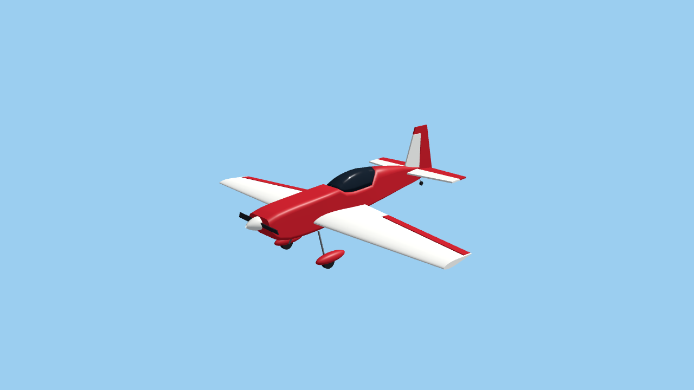

# Extra 300S .60: metrología del plano (EX-01) y vista previa en Godot (EX-02)

2026-10-06 · [Plan](../EXTRA-300-PLAN.md) · [Recursos](extra-300-resources.md) · Datos: [picks](../../research/extra-300/ex01/picks.json), [metrología](../../research/extra-300/ex01/metrology.json), [geometry.json](../../assets/aircraft/extra-300s-60/geometry.json) · Capturas: [EX-02](../../research/extra-300/ex02/captures/)

**Estado:** EX-01 y EX-02 hechos. El Extra existe como **vista previa visual** en un inspector propio. No tiene datos físicos, no se puede seleccionar en la app y no vuela.

## 1. Qué fuente manda para cada cota

| Fuente | Escala | Uso |
| --- | --- | --- |
| Hoja de ala EXT6P01 (escaneo 400 ppp) | **399,88 px/in**, medida con su regla impresa de 36 in (residuo máximo de marca: 1 px) | Planta del ala, alerones y estabilizador/elevador (dibujado a tamaño real) |
| Hoja de fuselaje EXT6P02 | **300,56 px/in**: está dibujada a escala reducida. Se calibra con la cuerda de la costilla de raíz que aparece en la vista lateral, igual a la cuerda en 2D medida en la hoja de ala | Perfil lateral, anchos en la vista inferior, deriva/timón, tren, cabina |
| Dos vistas p.47 del manual (vectorial) | Croquis para planificar la decoración | **Solo** proporciones de la cabina en planta. No da cotas |

El escaneo del plano es 1-bit CCITT; `measure.py` lo extrae con `pdfimages` a una caché bajo `references/` (no versionada) tras comprobar el SHA-256 de cada PDF.

## 2. Ala

- Bordes de ataque y de salida: rectas por mínimos cuadrados sobre 13–14 columnas de la línea gruesa (residuo ≤ 1,05 px ≈ 0,07 mm). BA en flecha (0,0472), BS hacia delante (−0,1809).
- **Envergadura 63,92 in** (marginal a 31,96 in de ℄), cuerda en ℄ 15,30 in, en la punta 8,01 in, estrechamiento 0,523, alargamiento 5,49.
- Alerones: de AR4 (10,32 in de ℄) a la punta (31,66 in), **cuerda constante de 2,07 in**, bisagra paralela al BS.
- Perfil: el contorno exterior de la costilla de raíz dibujada a 0° en la vista lateral. Simétrico, **13,1 %** de espesor máximo hacia el 25–30 % de la cuerda. No se le asigna nombre NACA ni polar. Se usa el mismo perfil normalizado hasta la punta, sin medir la costilla exterior.
- Diedro y calado 0°: el manual une las semialas planas con pesos encima, y la vista lateral rotula el ala a 0°.

**Datum y CG.** La nota del plano pide el CG «a 4⅛ in medido en la costilla 2D». 2D es la costilla de raíz junto al lateral del fuselaje (3,39 in de ℄). El símbolo «CG Range» del plano queda a 4,116 in de su BA. El origen del modelo es esa estación: plano de simetría, 4⅛ in detrás del BA en 2D y altura del eje del cono.

**Referencias para EX-05** (derivadas, no usadas por la malla): `S/b` = 0,2959 m sigue siendo la cuerda de referencia del cargador v1. La **CMA es 12,03 in (0,3056 m)** a 14,31 in de ℄. El CG nominal queda al **30,0 % de la CMA**.

## 3. Fuselaje, cola y tren

- Perfil lateral: 15 puntos arriba y 16 abajo tomados a mano sobre recortes con rejilla (±20 px ≈ ±1,7 mm). Bajo la cabina, «arriba» es el borde de la cabina; la burbuja es una pieza aparte.
- Semianchos: carenado 2,99 in (tomado a mano); de 6200 a 13 700 px se detectan como **pares de líneas simétricos** respecto a la línea central de la vista inferior (2,98 → 1,07 in, monótonos). Se descartaron las columnas en que el detector atrapaba el contorno del ala o el motor.
- Las esquinas redondeadas de la sección (arriba/abajo, como fracción del semiancho) son **estimaciones** a partir de las cuadernas 6/25, 9/29 y 10/30 dibujadas en el plano, sin trazarlas.
- Cola: estabilizador y elevador del dibujo a tamaño real (semienvergadura 12,30 in, cuerda de raíz 7,68 in, corte en V del elevador para el timón). Deriva y timón tomados en la lateral, incluido el compensador aerodinámico superior.
- Tren: eje principal, raíz de la pata, carenas y eje de la rueda de cola tomados en la lateral; ruedas de 2¾ in y 1 in según el plano y el manual. **Vía 0,32 m, separación de las patas y ancho de carena son estimados**: el plano no tiene vista frontal.
- Hélice: el manual remite al motor. Se usa una hélice visual de 12 in, **estimada**. Los 2° a la derecha y ½° hacia abajo del plano solo orientan cono y hélice en el render; el empuje físico sigue axial hasta EX-06.

## 4. Controles reservados

Ninguno de estos valores entra en la calibración. Las tolerancias están escritas en `measure.py`, y el script falla si alguno queda fuera. Aviso honesto: las tolerancias se fijaron después de haber visto lecturas aproximadas de envergadura, área y longitud durante la exploración. No son un prerregistro ciego.

| Control | Medido | Referencia | Error |
| --- | ---: | ---: | ---: |
| Envergadura (hoja de ala) | 63,92 in | 64 in, cartucho | −0,13 % |
| Área del trapecio hasta ℄ | 744,7 in² | 744 in², cartucho | +0,10 % |
| Longitud, punta del cono → BS del timón | 54,61 in | 54¼ in, cartucho | +0,67 % |
| Marcador de CG tras el BA de 2D | 4,116 in | 4⅛ in, manual p.43 | −0,22 % |
| Diámetro del cono | 2,56 in | 2½ in, plano y manual p.3 | +2,5 % |
| Trasera del cono → cortafuegos | 6,18 in | 6¼ in, manual p.32 | −1,1 % |
| Cuerda de raíz del estabilizador, lateral frente a tamaño real | 7,72 in | 7,68 in | +0,5 % |

La longitud también decidió una interpretación: si la costilla dibujada en la lateral fuera la de ℄ (15,30 in) y no la de 2D (14,52 in), el avión mediría 57,5 in (+5,6 %). Queda registrado como elección guiada por un control, no como medida independiente.

**El croquis p.47 no sirve para cotas.** Escalado por su propia envergadura y longitud, sitúa la rueda de cola a 1,21 in del plano, el eje principal a ~0,5 in y la bisagra del timón a 0,74 in. Su fuselaje en el ala es un 2,3 % más estrecho. Se registra como comprobación informativa, no de aceptación.

## 5. EX-02: modelo en Godot

`assets/aircraft/extra-300s-60/geometry.json` → `compile_geometry.py` → `app/aircraft/extra_300s_geometry.gd` → constructor nativo `app/aircraft/extra_300s_model.gd`. Sin importadores ni dependencias nuevas.

- Fuselaje por estaciones (anillos rectangulares redondeados), cabina opaca tintada, ala por secciones con alerón de nariz biselada, cola en placas, tren convencional con carenas y rueda de cola orientable, cono y hélice en un marco de empuje.
- Interfaz igual a la del Stik: `build()` → `{root, propeller, hinges, gear}`; nodos `airplane`, `propeller` y `*_hinge`. El tren expone `left`, `right`, `tail` y `steering`; aún no está conectado a `apply_gear()`.
- **Alerón en flecha sin cambiar el contrato:** un marco fijo `aileron_frame_*` lleva la orientación de la bisagra (±10,3° en planta) y el nodo `*_hinge` hijo solo recibe la deflexión. `apply_surfaces()` sigue asignando Euler `(x, y, 0)` y el mando gira sobre la bisagra real.
- 26 mallas, 12 710 triángulos, extensión 1,624 × 0,552 × 1,386 m. Materiales compartidos e inmutables. Colores provisionales (fuselaje rojo, ala blanca, mandos rojos); la decoración de la foto del propietario es EX-10.

**Pruebas.** `app/aircraft/verify_extra.gd` (84 comprobaciones, incluido en `app/test.sh`) verifica:

- nodos y bisagras, poses de reposo y transformaciones finitas;
- envergadura y longitud frente al kit, con la envergadura medida en las mallas de punta;
- ejes de alerón paralelos al BS;
- **el mismo sentido de movimiento del borde de salida que el Stik** para cada mando;
- que un mando no altera los marcos fijos.

Seis mutaciones, siempre sobre una copia de `app/`, fallan como se espera: signo de la flecha de la bisagra, bisagra sin flecha, envergadura de datos al 95 %, punta acortada en el constructor, elevador y timón invertidos, y alerón con el marco volteado (signo de mando invertido). Antes, un contorno roto colgaba Godot headless (un `assert` o un error de ejecución se detiene en el depurador): ahora el constructor emite un error del motor y la verificación registra el fallo y sigue.

`compile_geometry.py --check` (también en CI) valida la estructura y exige que los 116 valores medidos de `geometry.json` coincidan con `metrology.json` (diferencia máxima 0,05 mm, el redondeo).

**Capturas** (`research/extra-300/ex02/capture.sh`): frente, lateral, planta y vista inferior ortográficas, y oblicuas en reposo y con deflexión total. Antes de cada vista se restablecen todos los mandos y el manifiesto registra cámara, luz, revisión y hashes. Dos ejecuciones dan PNG idénticos byte a byte (llvmpipe con un hilo), y el inspector se niega a sobrescribir un directorio. Son capturas preparadas para revisar geometría, **no** una prueba de lectura del piloto.

## 6. Límites y siguiente paso

- No se midió la distorsión del papel ni del escáner. En la hoja de ala se supone la misma escala vertical que la horizontal que da la regla.
- Sin medir: forma de las cuadernas, vía del tren, ancho de las carenas, hélice, espesor de la costilla exterior y vista frontal.
- Sin holguras de movimiento: el bisel del alerón está pensado para no chocar, pero EX-04 debe medir contención en neutro, extremos y combinaciones.
- La sombra, la cámara de inspección de la app y el registro de aviones siguen siendo del Stik (EX-03).

Siguiente: **EX-03** (registro de dos definiciones y selección de la vista previa sin romper el Stik) o **EX-04** (holguras y articulación medidas), según prefiera el propietario.
