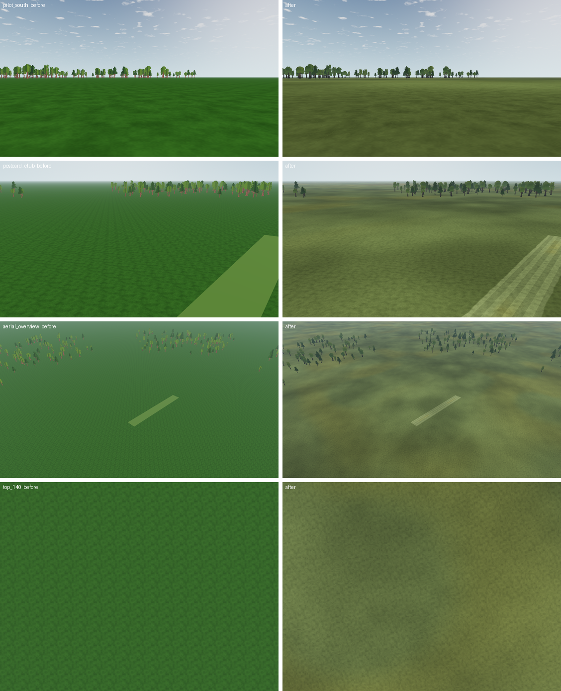
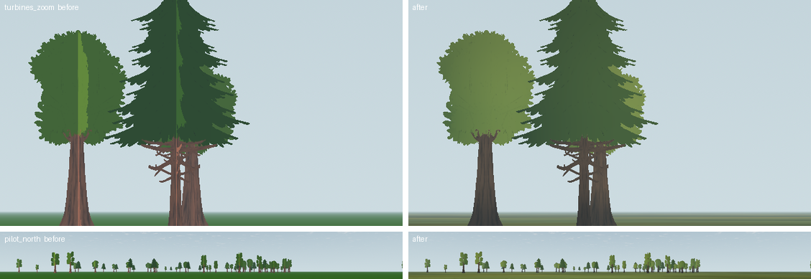
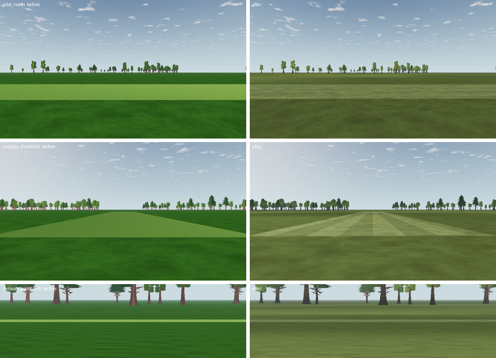

# Landscape improvement: implementation of Phases 0–4 (2026-10-07)

Status: **implemented, measured; waiting for the owner's eye and the landscape track's review.** It implements Phases 0–4 of the [proposal](../README.md) and the far-field patchwork of Phase 5. Mapped steps: G-1, L6b follow-up, L9a/L9b (ground), L9c (surfaces). Steps are not marked done here: the landscape plan's owner decides.

The later [L9c follow-up](../../visual-quality-implementation/L9c/README.md) replaces the lifted planes for contained flat field surfaces. This report records the original Phase 4 implementation.

## What changed

| Phase | Change | Files |
| --- | --- | --- |
| 0 | Card winding: clockwise quads, so the face you see gets the normal toward you | `render/tree_assets.gd` |
| 0 | G-1: the rough ground is a 64 × 64-quad plane (8,192 triangles, one draw); the scenery's interim `subdivide_ground` is removed | `render/field.gd`, `scenery/scenery.gd` |
| 1 | `Spec.GRASS` `#4a7a32` → `#657545`; `RUNWAY_COLOR` `#7b8a5c` (now only the frozen VQ-01a fixture uses it) | `spec.gd` |
| 1, 3 | Tree cards: one crown normal per pixel (ellipsoid in view space, per species), `BACKLIGHT` 0.4, sky lean 0.5, underside clamp −0.5, trunk-base darkening ×0.65, leaf grade `mix(luma, c, 0.6) × 1.0`, bark `luma × 0.65 × (1.22, 0.96, 0.70)`, per-tree tint from the hash | `render/treeline.gdshader` |
| 2 | Anti-tiling (2 `textureGrad` fetches, Hoskins hash, index noise at 1.2 cycles per tile); macro value noise at 37/160/9 m (weights 0.5/0.35/0.15, amplitude 0.25) and dry patches; the pilot pin | `render/ground.gdshader`, `render/field.gd` (`pilot_xz`) |
| 4 | Mown and runway surfaces use the ground shader on their own plane: the rough colour first, then mown turf (value ×1.25, desaturated 15 %) inside a noisy border (0.12–0.6 m); the runway adds 1.5 m mowing stripes (box-filtered square wave, view-dependent ±5 %) and worn touchdown zones 10–30 m from each threshold | `render/ground.gdshader`, `render/ground.gd` (`surface_material`), `render/field.gd` |
| 5 (part) | Far-field patchwork: Voronoi parcels of ~230 m (pasture, lush, straw, stubble, ploughed, young crop) at strength 0.6, borders blended over 80 m, full from 1.3 km, faded out between 1.8 and 3 km | `render/ground.gdshader` |
| — | Evidence views `top_140` (+`_b`, `_c`, off the runway), `runway_threshold`, `runway_zoom_100`, `runway_zoom_300` | `scenery/postcards.gd` |

## Measured against the proposal's targets

SC-03 view set, 1280 × 720, llvmpipe, scenery off; "before" is HEAD `a9fa63b` with the same views.

| Target | Before | After | Pass |
| --- | --- | --- | --- |
| Grass hue 73–82°, saturation 0.43–0.53 (pilot view, near band) | 104°, 0.74 | **77°, 0.52** | ✅ |
| Far-band luminance spread 9–14 levels (`pilot_south`, rows 360–392, x 950–1270, Rec. 709 luma sd) | 3.9 | **10.0** | ✅ |
| Pilot box mean ±5 % (linear Y, bottom rows) | 0.0897 / 0.0893 | 0.0922 / 0.0920 (**+2.8 % / +3.0 %**) | ✅ |
| Tile repetition ≤ 0.30 (top views from 140 m, high-passed autocorrelation, report 01 metric) | 0.97 / 0.97 / 0.84 | **0.13 / 0.14 / 0.13** | ✅ |
| Crown seam ≤ 5 levels (largest column-mean step inside a crown, report 02 metric) | 30.4 | **0.7** | ✅ |
| Front-lit crowns brighter than backlit (mean crown luma, north vs south) | 84.9 < 97.6 (inverted) | **100.9 > 77.9** | ✅ |
| Leaves ≈ hue 85–100°, S 0.4–0.5; bark ≈ (90, 80, 68) | 104°, 0.46; (104, 82, 75) | **86°, 0.44** (deciduous); (83, 76, 69) | ✅ |
| Runway edge step at 100 m (`runway_zoom_100`, local band vs grass beside it) | +96 % (lime) | **+35 %** | readable |
| Runway at 300 m from eye height (`runway_zoom_300`) | a 1 px line, +57 % | lost in the ground variation | ⚠ see below |
| Byte repeat | — | two runs identical | ✅ |
| L6c readability (48 cases), proposed Gate L thresholds | 0 below (SC-03 run) | **1 below:** `l6c-fixed-ground-level` (50° fixture, 24 px airplane over grass) mean ΔE 34.5 → **29.4** (limit 30); game view over grass 46.9–59.0 (limit 40); worst p10 8.9 (limit 8); worst nearly-invisible 20.4 % (limit 30 %) | ⚠ owner's eye |
| L2 rim step from 100 m (limit 4) | 3.0–3.2 | **3.0–3.7** | ✅ |







## Deviations from the proposal (measured reasons)

- **Leaf gain 1.0, not 0.67.** Report 02 had already flagged 0.67 as too dark under its test sky. In the app 0.67 gave near-black crowns (deciduous S 0.31), 0.85 dull ones, and 1.0 the target (H 86°, S 0.44).
- **Macro weights are the spike's (0.5 at 37 m).** The first version put 0.40 on the 160 m octave. That octave hardly varies inside one view band, so the far band stayed at 5.0.
- **The pilot pin removes an offset; it does not fade the amplitude.** Fading the amplitude to zero out to 35–70 m flattened most of what the pilot sees (far band 3.5). Now the shader subtracts the macro value at the station near the pilot, ramps the variation in over the first 35 m, and pins dry patches the same way.
- **Index noise at 1.2 cycles per tile.** The spike's code used 0.6; with this shader 0.6 measured 0.46 and 1.2 measured 0.25. The first `top_140` view framed the runway, and the 3 m stripe period sits exactly on the 33 px lag. The repetition views are now placed off the runway.
- **Phase 4 keeps one lifted plane per surface** instead of signed-distance rectangles in the ground's own pass. It is the same shader and gives the same seamless colour, while the field contract (one named mesh per surface, L5) and the friction rectangles stay unchanged. The 24-bit depth limit past ~300 m remains (G-1 keeps the plane visible). Moving the rectangles into the ground pass is still open.
- **Far-field parcels are subtle and end at 3 km.** Hard-edged parcels at full strength out to the rim broke L2's rim check from 100 m: row steps of 5.1–9.4 levels against a limit of 4 (macro tone alone: 3.0–3.7). They would also shimmer in motion. Softer, weaker parcels faded out from 1.8 km measure 3.0–3.7, the same as no parcels. The far band from altitude still needs Phase 5's forest patches and hills.
- **Runway at 300 m:** from 1.7 m eye height a 12 m mown strip spans ~0.3° and sits inside the macro variation. That is realistic, but the old lime strip was a visible line. The pilot stands 9 m from the runway, so this costs little; it is flagged for the owner's playtest.

## Verification

On a clean worktree of HEAD `22d00c2` plus only these files (the shared tree carries another track's uncommitted physics work, which fails `test_ground_friction` on its own):
- `app/test.sh`: exit 0;
- `app/capture.sh`: exit 0, including the landscape capture checks, L6b/L6c, the readability thresholds and the runway scenario;
- `test_scenery_*`, `test_field_integration` (39 checks), `test_atmosphere` (27), `test_tree_assets` (60): pass;
- `tools/scenery/capture.sh`: every view within budget and byte-repeatable, scenery on and off.

## Not done (left for the next steps)

- The scenery's own trees (`app/scenery/`) are still a saturated green beside the graded treeline: align the scenery palette with the leaf grade.

- Phase 2 anisotropic filtering (needs a frame-time check on the owner's GPU).
- Phase 3 undergrowth skirt; Phase 4 paved option (needs the physics line's `asphalt` friction), markings, the 2-frame shimmer diff; Phases 5 (forest patches, hills), 6, 7, 8.

## Reproduce

```sh
# views (scenery off) into a folder; run once on HEAD and once on the change
LP_NUM_THREADS=2 xvfb-run -a -s "-screen 0 1280x720x24" $(app/get-godot.sh) --path app \
  --script res://scenery/capture_views.gd -- --scenery=off \
  --views=pilot_north,pilot_south,aerial_overview,postcard_club,turbines_zoom,top_140,top_140_b,top_140_c,runway_threshold,runway_zoom_100,runway_zoom_300 \
  --out=/tmp/after
.tools/visual-venv/bin/python tools/scenery/landscape_metrics.py /tmp/before /tmp/after
```

[`landscape_metrics.py`](../../../../tools/scenery/landscape_metrics.py) implements the metrics of reports 01 (repetition, far band) and 02 (seam) on the boxes named in the table. The runway profiles were read by hand from column means of the `runway_zoom_*` views.
