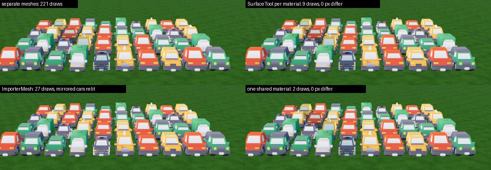
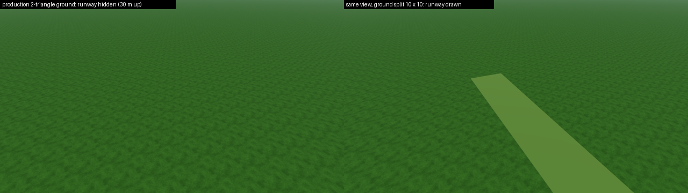
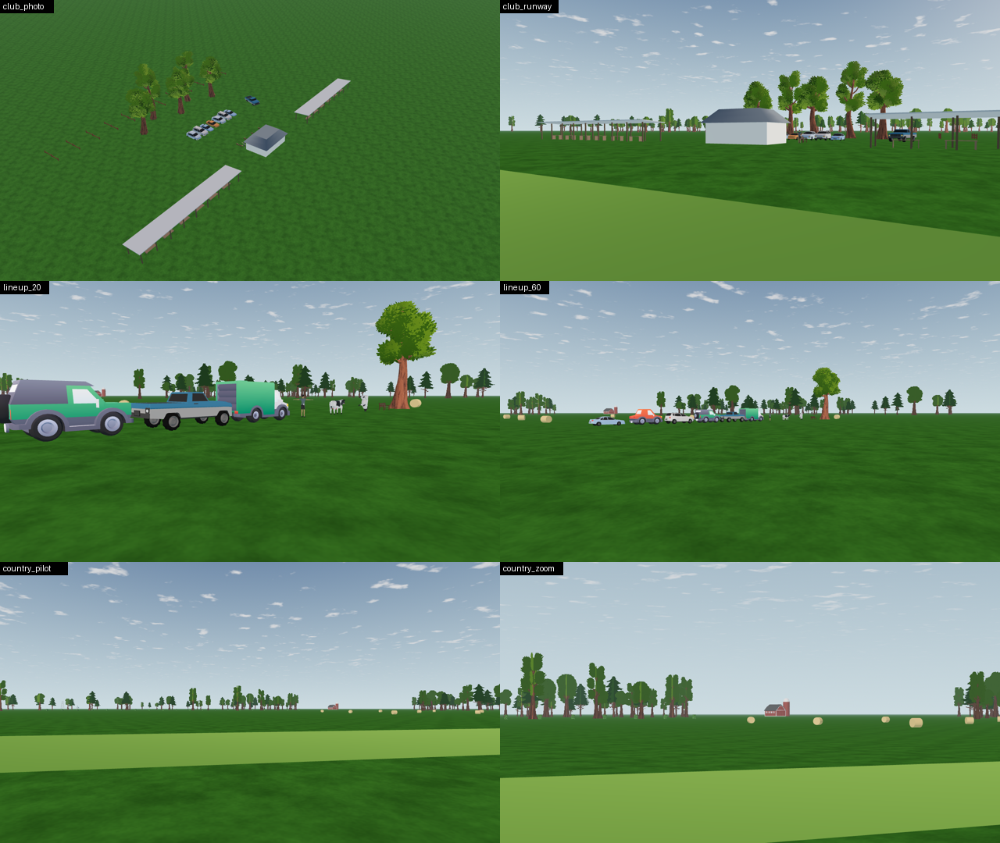

# SC-01 (d): technique probe and style bake-off

Date: **2026-10-07**. Step: SC-01 of [SCENERY-PLAN](../../../SCENERY-PLAN.md). It completes the desk research ([reports 01–04](../../scenery-investigations/01-prop-asset-sources.md)) with measurements in the real renderer: Godot 4.7.2 Compatibility, Mesa llvmpipe, 1280 × 720. **Nothing in `app/` changed.** Probe code: [research/scenery/sc01/](../../../../research/scenery/sc01/).

## What was run

`research/scenery/sc01/run.sh` copies the committed app (`git archive HEAD app`) to a scratch folder and runs `probe.gd` there under Xvfb with `opengl3` and `LP_NUM_THREADS=1`. Five cases:
- **merge:** 40 cars as separate meshes and merged three ways.
- **depth:** turbine flicker and the depth resolution of this renderer.
- **ground:** contact-shadow quads at 6 lifts, 3 distances and 4 camera heights, plus a fog check.
- **groundbug:** 36 views with the production ground and a subdivided one.
- **style:** real candidate models next to the L6a trees in the real field, sky and haze.

`analyze.py` turns the PNGs into numbers ([summary.json](summary.json)); `sheets.py` builds the images below.

**Repeatability:** two full runs, the second from a fresh scratch copy, produced **601 of 601 PNGs byte-identical**. The numbers are identical too, except build times (±5 %).

**Reproduce** (the downloads are not in the repository; their SHA-256 are in [report 01](../../scenery-investigations/01-prop-asset-sources.md#evidence-scratch-only-not-committed)):

```bash
SC01_ASSETS=<folder with the downloads> research/scenery/sc01/run.sh /tmp/sc01-out
.tools/visual-venv/bin/python -I research/scenery/sc01/analyze.py /tmp/sc01-out > summary.json
.tools/visual-venv/bin/python -I research/scenery/sc01/sheets.py /tmp/sc01-out <evidence-dir>
```

## Results

### 1. Merging: SurfaceTool per material, one palette material, compact cells

40 Kenney cars (220 mesh parts, 88,100 triangles), 4 of them mirrored (negative scale), seen from 12 m:

| Variant | Visible draws (cars + ground) | Build time, CPU | Pixels > 24 levels off the separate render |
| --- | --- | --- | --- |
| Separate meshes | 221 | — | reference |
| `ImporterMesh.merge_importer_meshes` (dedupe by surface name) | 27 | 87–89 ms | **3,278**: the mirrored cars are relit |
| `SurfaceTool.append_from`, one tool per material | 9 | 58–59 ms | **0** |
| `SurfaceTool`, one shared material (the palette case) | **2** | 45–50 ms | **0** |



**Additional measured pitfalls:**
- **Vertex colours:** after `SurfaceTool.append_from`, vertices from a mesh without vertex colours become **(0, 0, 0, 1) black** once another merged mesh has colours. All 24 test vertices turned black, in both merge orders. `ImporterMesh` keeps such surfaces apart instead, so they don't merge.
- **Non-uniform scale:** a pavilion roof scaled 7.1 × 1.8 × 4.95 changed shading after the `SurfaceTool` merge, because normals don't get the inverse-transpose. That accounts for the 6,393 differing pixels in the pilot view of the club. Bake non-uniform scales into the mesh before merging.
- **Raw packs barely merge:** the style scene's club fell only from 221 to 52 draws, because every imported model brings its own material instances. The palette step is what makes merging pay.
- **Merged zones lose culling:** in a zoomed 20.7° view that sees one corner, the merged scene cost **78 draws against 32** separate. Zones must be small cells, not the whole club.

This **reverses** report 04's preference for `ImporterMesh`: its winding fix exists, but here it relit the mirrored parts, while `SurfaceTool` reproduced the separate render exactly.

### 2. Distant landmarks: depth is better than the formula predicted

Turbine (tower radius 1.5–2.2 m, one blade straight down across it), FOV 20.7°, six frames with sub-pixel camera jitter. The share is of blade-over-tower pixels where the tower wrongly shows through:

| Distance | Near 0.1 m, gap 3 m | Near 0.1 m, gap 6 m | Near 0.1 m, gap 12 m | Near 0.5 m, gap 3 m |
| --- | --- | --- | --- | --- |
| 1.5 km | 0 | 0 | 0 | 0 |
| 2.5 km | 0 | 0 | 0 | 0 |
| 5 km | **12 % (flickers 0–6 px per frame)** | 0 | 0 | 0 |

- **Better than predicted:** the formula d²/(near·2²⁴) predicts a 15 m depth step at 5 km with near 0.1 m, yet a 6 m gap rendered cleanly.
- **Camera-facing squares** at a known gap are inconclusive: their depth is constant, so ties go to the draw order. Squares 0.25 m apart resolved correctly at 2.5 and 5 km.
- **Size at 5 km:** at FOV 50° a turbine covers about 11 blade pixels; at 20.7°, 36–38.

### 3. Contact-shadow quads: 2 cm lift, alpha blending, near props only

A 20 × 20 m black quad (alpha 0.5) on the **subdivided** ground (see 4). The share of its inner window that is darkened:

| Camera height | 40 m | 180 m | 400 m |
| --- | --- | --- | --- |
| 1.7 m (pilot) | all lifts 100 % | **0 px**: the quad has no screen height | 0 px |
| 10 m | 100 % | 100 % | 0 px |
| 30 m | 100 % | 100 % | 100 % |
| 100 m | 2 mm: **62 %**; ≥ 5 mm: 100 % | 2 mm: 5 %; 5 mm: 25 %; ≥ 2 cm: 100 % | 100 % |

- **A 2 cm lift is enough** for every tested view, up to 100 m camera height and 400 m away. Report 04's "lift ∝ d²" rule (0.06–0.3 m) over-lifts by 3–15×.
- **Fog:** the expected shadowed radiance is L − 0.5·T·G, with G and F solved from the two fogged references (the ground shader writes its own fog, so `fog_enabled = false` does not change it). An **alpha-blended quad matches within −0.5 % at 2 km and −7 % at 400 m**; `blend_mul` is **57–59 % too dark**.
- **Pilot's view:** from 1.7 m, ground shadows beyond about 150 m are invisible, so contact shadows matter only for near props and raised cameras.

### 4. Cross-track finding: the production ground can hide the runway

The field's rough ground is one 40 km PlaneMesh with **two triangles**. In 36 views (1.7, 5 and 30 m high, aimed along the runway), rendering it as is and split 10 × 10:
- In **4 of the 12 views from 30 m, the whole 3 cm-high runway disappeared** (87,000–194,000 pixels). The interpolated depth across the clipped giant triangles is off by more than the lift.
- Splitting the plane even 10 × 10 (still one draw call) restored the runway.
- At 1.7 and 5 m only edge pixels differed (≤ 341 px).
- The same failure hides every flat item lifted above the grass: start-up pads, gravel strips, contact shadows. Report to the landscape track (their file); SC-05 and SC-06 depend on the fix.



### 5. Style bake-off



**Measured sizes after normalising to a real length or height** (triangles in brackets):

| Model | Size W × H × L (m) | Reading |
| --- | --- | --- |
| Quaternius NormalCar1 | 1.88 × **1.23** × 4.4 (2,954) | About 15 % low against a typical sedan's ≈ 1.45 m (estimated): correct the height in SC-04 |
| Quaternius SUV | 2.36 × 1.71 × 4.7 (3,294) | Plausible |
| Quaternius Pickup (Poly Pizza) | 2.37 × 1.89 × 5.3 (**6,432**) | Twice the triangles of the cars: decimate or skip |
| Kenney sedan | 2.59 × **2.24** × 4.4 (2,032) | Toy proportions confirmed: **no Kenney cars** |
| Poly Pizza "Man" | 1.91 wide × 1.78 | **T-pose**: unusable as a spectator; needs Background Posed Humans |
| Poly Pizza sheep | **1.77 tall** × 1.3 | **Imported rotated** (skinned GLB): the pipeline must fix orientation |
| Cow | 0.59 × 1.35 × 2.4 (796) | Plausible |

**What the renders show:**
- **Club from the air (`club_photo`):** framed like the owner's photo, the layout reads: two long shelters, a central pavilion, a car row by the trees. But it sits on uniform grass and looks sparse. The pavilion blockout reads as a placeholder (a plain white box). The club needs worn ground, paths and detail.
- **Line-up at 20 and 60 m:** the Quaternius cars and pickup sit well next to the L6a trees. The Kenney SUV and van clash: cartoon proportions. At 60 m cars read as coloured blobs, and the bales read clearly.
- **In front of the pilot (`country_pilot`, `country_zoom`):** from the pilot's eye the meadow is a thin strip.
  - The barn and silo at 520–530 m are a small red speck at 50° and still small at 20.7°.
  - The hedge at 240 m dissolves into the treeline.
  - The bales at 80–130 m are the only clear scale cue.
  - The front countryside therefore adds little in flight. Its value is tall silhouettes in treeline gaps, near bales, and raised and Home views.
- **Scene totals (raw assets):** club 66,939 triangles, countryside 41,239. Both are within the 150 k scenery budget before any decimation.

## License evidence

- **Quaternius "Realistic Car Pack – Nov 2018":** CC0 read in `License.txt` inside the archive ("CC0 1.0 Universal (CC0 1.0) Public Domain Dedication"); archive SHA-256 `af8f45d6…bdc7`.
- **Still blocked:** Google Drive answered "Quota exceeded" again for the Farm Buildings and Background Posed Humans `License.txt` files. File IDs, for a download in a signed-in browser:
  - Farm Buildings: `1O_kX6fCUCRUsBCKrxpeQU2E0GSJQ6GAf`
  - Background Posed Humans: `1K6M5kb7ugqrPROrSx6O6dUBJA366xq-j`
- Until those are read, Quaternius farm buildings and humans stay at "page says CC0".

## What this does not prove

- **llvmpipe is not a GPU.** Repeatability, draw counts, depth behaviour and pixel results hold for this renderer. Frame time, GPU depth formats and driver clipping must be checked on the owner's hardware (Gate SC). Build times are CPU numbers from this VM.
- **The depth results** are for one turbine shape and one jitter pattern; the shadow results are for one quad size. They set the rules for the next steps; they are not general guarantees.
- **The style verdict is ours,** from renders. Choosing the family (O-3) is the owner's decision; this sheet is the input.
- **No palette atlas was built yet** (SC-04). The style renders use the original materials.
