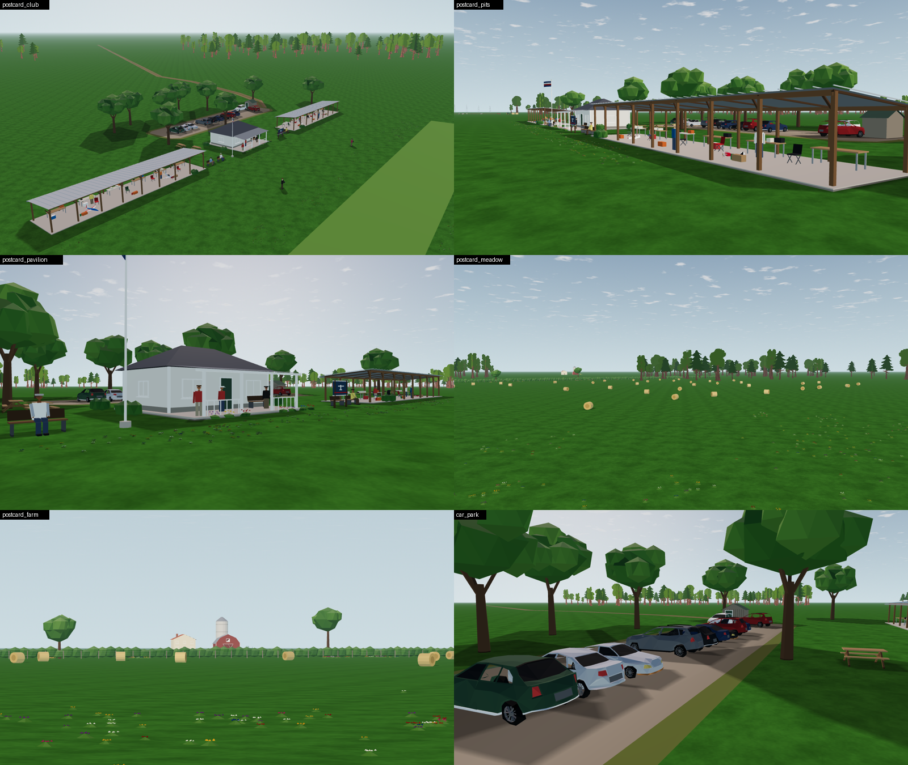
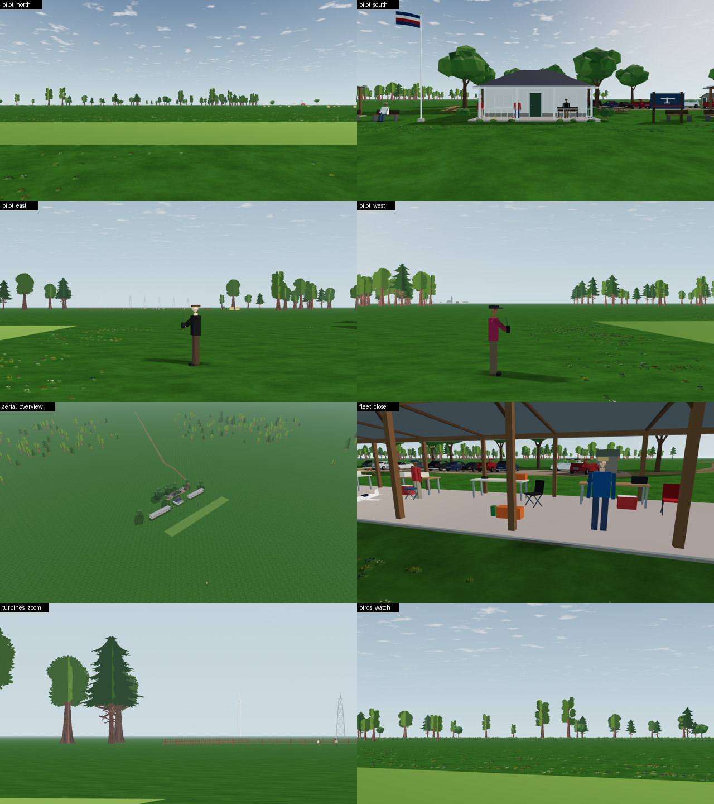
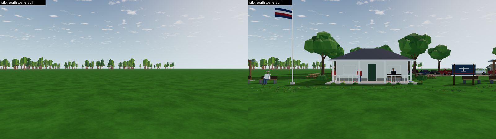
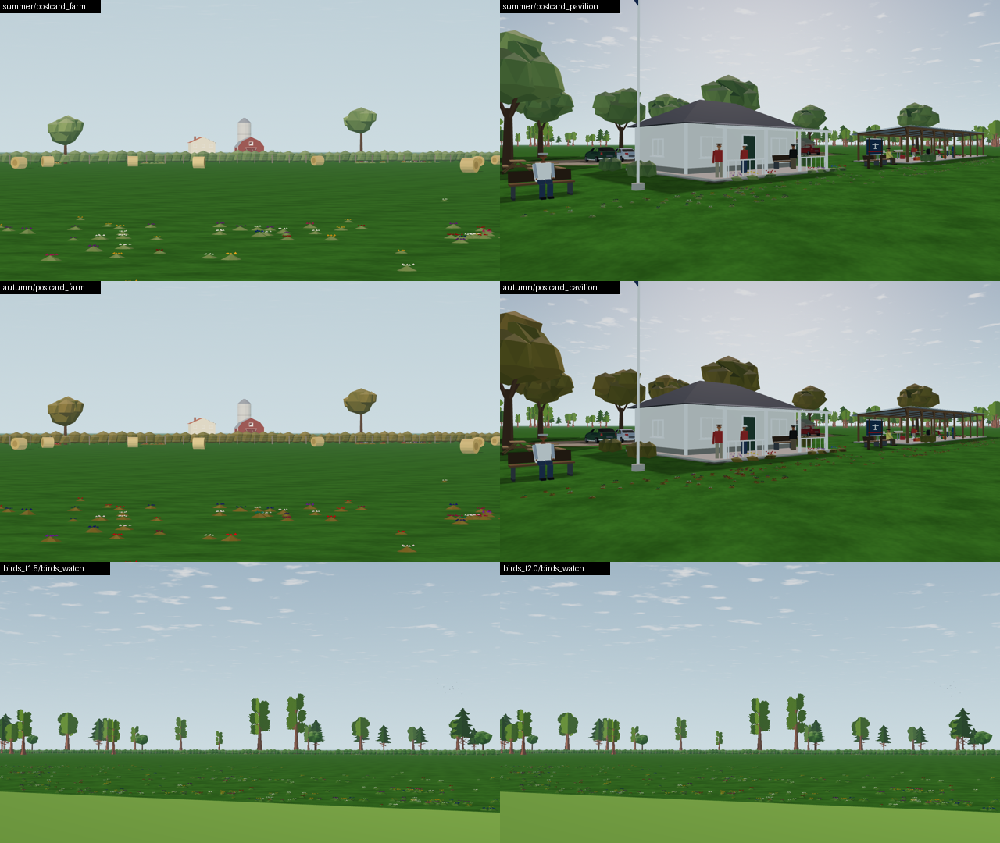

# SC-03: the built scenery — captures, budgets, readability and tests

Date: **2026-10-07**. Evidence for SC-02…SC-24 of [SCENERY-PLAN](../../../SCENERY-PLAN.md) (implementation v1). Renderer: Godot 4.7.2 Compatibility on Mesa llvmpipe, 1280 × 720. These runs prove counts, repeatability and readability metrics; they are **not** GPU performance. Frame time is judged on the owner's hardware at Gate SC.



## How to reproduce

```bash
tools/scenery/capture.sh /tmp/scenery          # off, on, on again; budgets and byte repeats (check_views.py)
.tools/visual-venv/bin/python -I tools/scenery/sheets.py /tmp/scenery <evidence-dir> [theme/bird capture dirs]
OPENRC_SCENERY=on OPENRC_SCENERY_AUDIO=off .tools/visual-venv/bin/python app/tests/treeline_readability.py \
  capture --app app --godot "$(app/get-godot.sh)" --out /tmp/l6c-scenery
python3 tools/scenery/place.py --check --report  # layout current; landmark visibility
```

Themes: add `--scenery_theme=summer|autumn` to a `capture_views.gd` run. Birds: add `--scenery_birds=on --t=<s>`.

## Budgets and repeatability

[captures-summary.json](captures-summary.json): 14 views, scenery off, on, and on again.

| View | Draws added | Primitives added | Shadow-pass draws | Repeat |
| --- | --- | --- | --- | --- |
| **pilot_north** (the flight view) | +30 | +65,148 | 0 | identical |
| **pilot_south** (turning round: the club) | +12 | +51,929 | 0 | identical |
| **pilot_east** (paddock, pylons, wind farm) | +23 | +56,164 | 0 | identical |
| **pilot_west** (village) | +8 | +42,188 | 0 | identical |
| postcard_club (raised, like the photo) | +20 | +92,537 | 0 | identical |
| postcard_meadow | +50 | +40,194 | 0 | identical |
| aerial_overview | +27 | +100,129 | 0 | identical |
| the 7 other views | +11…+24 | +44…+70 k | 0 | identical |

- **Budgets:** in the pilot's views, ≤ +40 draws and ≤ +150 k primitives. All four pilot views are within them.
- **Meadow postcard:** +50 draws, from its many 60 m flower chunks. It is not a pilot view.





## Readability with scenery on (rule 1)

The full L6c run (64 captures: Ugly Stik at 100 m, six attitudes, four backgrounds, game view and 50° fixture) was repeated with `OPENRC_SCENERY=on` ([readability-scenery-on.json](readability-scenery-on.json)). It was compared case by case with the committed L6c baseline:

| | Scenery off (L6c) | Scenery on |
| --- | --- | --- |
| Cases below the proposed Gate L thresholds (mean ΔE ≥ 40 game / ≥ 30 fixture, ΔE p10 ≥ 8, nearly-invisible ≤ 30 %) | 0 of 48 | **0 of 48** |
| Mean ΔE change | — | +0.47 (min −0.09, max +4.30) |

- **Sky, horizon and tree backgrounds:** identical.
- **Ground backgrounds:** improve slightly (e.g. fixed-ground dive 35.1 → 38.4), because the meadow's flower mounds add contrast behind the airplane.
- **The worst ground case is unchanged:** level over grass stays at a 25 % nearly-invisible share.

## Tests (all in `app/test.sh`)

| Test | What it proves |
| --- | --- |
| `test_scenery_loader.gd` | The committed layout validates and matches `tools/scenery/place.py`. 24 mutations are refused: format, field, theme, unknown prefab, `collides=true`, duplicate id, no groups, unit, kind, source, non-numeric, on the runway, pits too close (AMA) and too close to the take-off path (BMFA), parking, a tall prop in the flight box, above the 1:20 approach surface, landmark < 1 km and > 5 km, on a treeline tree, fence style, track surface, flowers on the runway, unbaked fleet aircraft. The switch is off by default and reads CLI/env |
| `test_scenery_build.gd` | **No-op when off:** no node added, ground untouched. **Content:** instances, fleet, rotors and flag, shadows, flowers; one surface per cell. **Size:** ≤ 250 k triangles in total (138 k measured). **Determinism:** two builds byte-identical. **Catalog:** every prefab and model matches its catalog size, rests on the ground, and has unit normals and car paint marks. **Winding:** all cell triangles clockwise toward their normal. **Tiers:** low < balanced < high, landmarks kept. **Themes. Interim G-1:** the ground is subdivided only when scenery attaches |
| `test_scenery_ambience.gd` | Same seed, same samples; peak −6 dBFS; RMS 0.084 FS; seamless loop; looping 16-bit mono stream; quiet (−17 dB) and pausable player |
| `test_scenery_trace.gd` | The real app headless, 2 s, scenery off then on: identical trace rows (only the creation timestamp differs) |

## Themes and birds



- **Themes:** summer pales and yellows the vegetation, autumn bronzes it; buildings, cars and people keep their colours.
- **Birds:** the optional flock (`--scenery_birds=on`) moves between t = 1.5 s and 2.0 s; 511 pixels differ at the 20.7° view toward it. They show as small specks over the treeline, as intended (≥ 300 m away).

## Landmark visibility

`place.py --report` rebuilds the L6b skyline from the treeline's own tree heights:

| Landmark | Azimuth | Skyline | Top | Visible |
| --- | --- | --- | --- | --- |
| Village and church (2.1 km) | 265.5° | 0.00° | 0.83° | yes |
| Wind farm (≈ 4 km) | 80.0° | 0.00° | 1.71° | yes |
| Pylons (1.25–1.6 km) | 88.0° | 0.00° | 1.16° | yes, after moving them: at 126° and 254° they were hidden (skyline 2.2–2.4°) |
| Farmstead silo (0.7 km) | 30.0° | 0.00° | 1.08° | yes |

## Findings worth keeping

- **Vertex colours** reach Compatibility shaders already linearised. Converting them again in a custom shader made the flowers and flag dark.
- **A MultiMesh without per-instance colours** gives the shader vertex `COLOR` with alpha 0. Flower leaves (marked by alpha) took the petal colour; measured 0 green pixels without `use_colors`, 382 with it and white instances.
- **The parked fleet** built live through the model teams' builders costs ~550 ms, ~120 k triangles and 72 surfaces. Baked offline with meshoptimizer LODs it is 2.1–3.8 k triangles per aircraft. `generate_lods` needs an indexed mesh first.
- **Scenery build time:** 93–158 ms across runs on this shared VM's CPU, against the ≤ 150 ms target. Instances and model expansion dominate; turning JSON arrays into packed arrays roughly halved the model cost.
- **Engine-sound leak:** an `AudioStreamGeneratorPlayback` leaks at exit depending on timing. It shows with scenery off too (verbose run); it is the engine sound's, not scenery's.

## What this does not prove

- **GPU frame time** and how the scenery looks on the owner's screen: that is Gate SC.
- **Human readability:** the L6c numbers are proxies. The blinded kit from the scenery-on run (`kit/` in the run's output folder) can be scored with `tests/treeline_readability.py score`.
- **Licenses:** the two Quaternius license files blocked by Drive (Farm Buildings, Posed Humans) are not used: those props are procedural instead.
