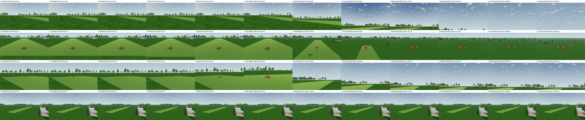
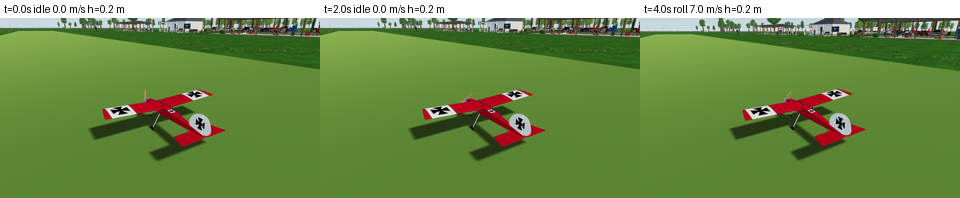

# SC-25: the runway scenario — automatic captures for reviewing changes and sync

Date: **2026-10-07**. Asked by the owner: a fixed, scripted scene with the airplane at the runway threshold ready to take off, captured automatically every time, to compare changes and physics ↔ render sync over time. Step SC-25 of [SCENERY-PLAN](../../../SCENERY-PLAN.md). Renderer: Godot 4.7.2 Compatibility, llvmpipe, 1280 × 720.



## What runs

1. **The scene.** `app/scenery/runway_scenario.gd` builds the production field (sky, haze, treeline, scenery on) and places the Ugly Stik at the runway threshold. It uses the physics team's static-equilibrium runway start (`GroundStart.threshold` + `FlightSession.reset_on_runway`, E3b2), with the engine idling.
2. **The flight.** `app/scenery/takeoff_pilot.gd` flies it tick by tick at the fixed 240 Hz:
   - 2 s at idle;
   - throttle advanced over 2 s;
   - heading held with the rudder, wings level;
   - rotation at 12 m/s, then a pitch hold.
3. **The captures.** 12 instants (0–12 s) from 5 cameras, 51 frames in all:
   - **pilot:** the game's own pilot camera with auto-zoom;
   - **chase:** 7 m behind, 2.2 m up;
   - **side:** a fixed spot 13 m from the threshold that turns to follow;
   - **wide:** fixed and raised, the whole runway;
   - **closeup:** the inspection camera at 0, 2 and 4 s.
4. **The manifest.** Each frame writes a PNG and a row in `scenario.json`:
   - time and tick, phase;
   - position, speed, heading, pitch, roll;
   - commands, rpm, propeller angle;
   - `sim_clock`, the airplane and its shadow on screen, draw calls.
5. **The report.** `tools/scenery/scenario_report.py` writes, per run:
   - filmstrips per camera;
   - `sync.json` (checks below);
   - against the previous run: changed pixels per frame, red heatmaps, state differences, and a verdict (*identical*, *visual-only change* or *physics changed*);
   - `report.html` with all of it.
6. **Where it lives.** `tools/scenery/scenario.sh` keeps `latest/` and `previous/`, plus a light `history/` (manifest, checks, verdict and filmstrips of the newest 30 runs) with a timeline at `history/index.html`.

**Always automatic:**
- **`app/capture.sh` runs it,** and CI runs `capture.sh` on every push, uploading `app/captures/*`.
- **`app/test.sh` flies the same takeoff headless** (`test_scenery_scenario.gd`), so a physics change that breaks the scene fails the tests before any capture.

## Results (this run)

| Sync check | Result |
| --- | --- |
| `sim_clock` = simulation time | worst 0 s |
| Frames on simulation ticks | worst 1.1e-14 s |
| All cameras of an instant share one state | spread 0 |
| Propeller angle = ∫ rpm dt | worst 7.4e-12° |
| Pilot camera centred on the airplane | 0.00 px |
| Shadow under the airplane while rolling (chase) | ≤ 34.7 px |
| Still at the threshold while idling | 3.2e-14 m/s |
| Airborne at the end | 42.4 m at 12 s |
| Runway heading held | ≤ 1.09° |

**The flight** ([flight.json](flight.json)):
- **Idle:** 2,800 rpm at the threshold (N 15, E −47), still.
- **Takeoff:** 7 m/s at 4 s, rotation near 5 s, liftoff at 5.45 s (headless test).
- **Climb:** 13.8° nose-up at about 29 m/s, 42 m high at 12 s.

**Repeatability and change detection:**
- **Two consecutive runs** were identical in 51 of 51 frames. Extracting the pilot into `takeoff_pilot.gd` left every frame byte-identical.
- **A deliberate change** (`--scenery=off`) was reported as **visual-only change**: 48 frames changed, 3 identical (close-ups and empty sky), physics unchanged. The heatmaps marked exactly the shelters, bales and flowers.



## How to use it

```bash
tools/scenery/scenario.sh                      # → app/captures/scenario/latest/report.html (+ history/index.html)
tools/scenery/scenario.sh /tmp/scn -- --aircraft=gp-extra-300s-60 --scenery=off
```

**Reading a report:**
- **A physics change** shows as *physics changed*, with the state differences per frame.
- **A visual change** shows as *visual-only change*, with heatmaps where the image moved.
- **A sync check that fails** makes `scenario.sh`, and with it `capture.sh` and CI, fail.

## Limits

- **llvmpipe:** proves repeatability, counts and sync on this renderer. Frame pacing and the look on a GPU are the owner's review.
- **The scripted pilot** is a simple controller with estimated gains, tuned on the Stik. Other aircraft can be run (`--aircraft=`), but their takeoff is not tuned or tested.
- **Wind:** none yet (M5).
- **The propeller angle** is integrated from the simulated rpm. Live rendering in `main.gd` uses its own accumulator (VQ-05 owns that), so this scenario shows what the physics says, not necessarily what the live game draws.
