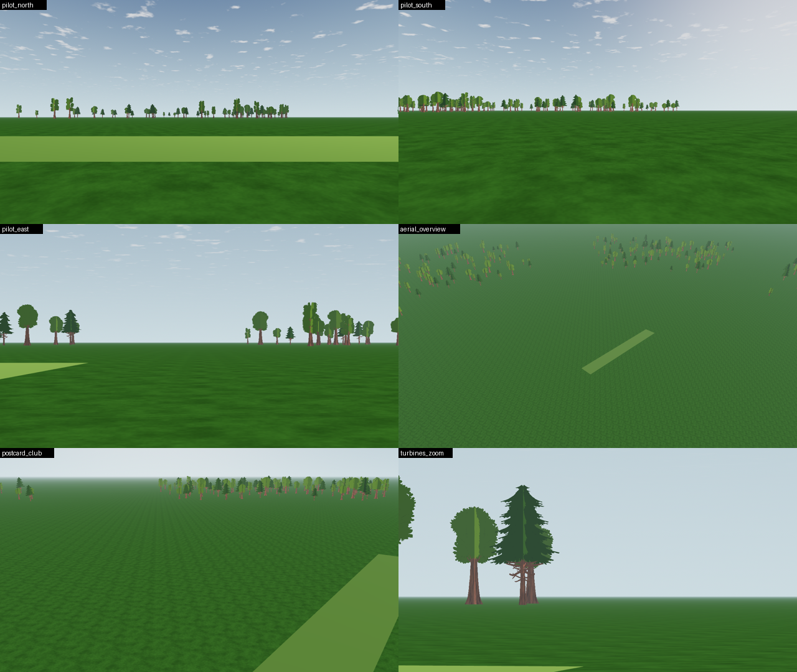
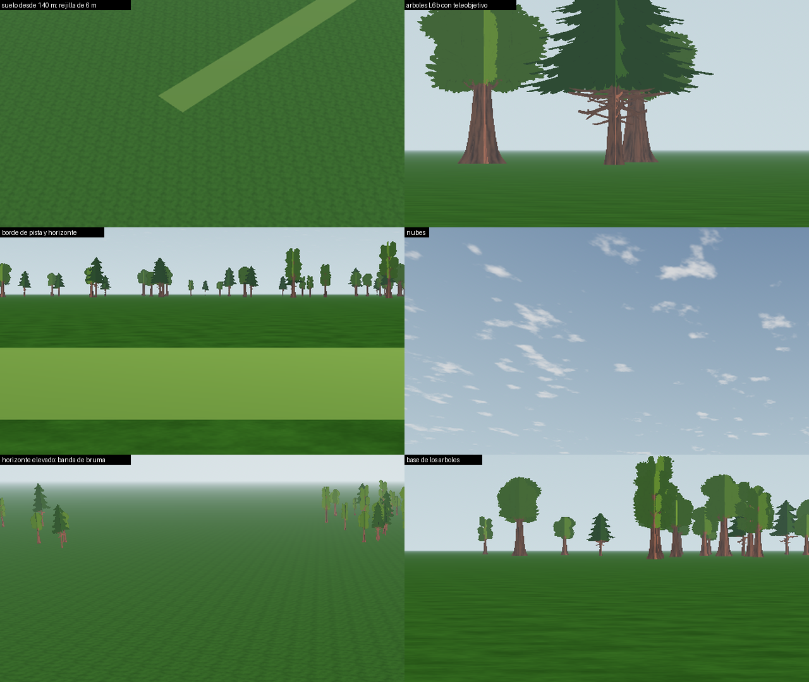
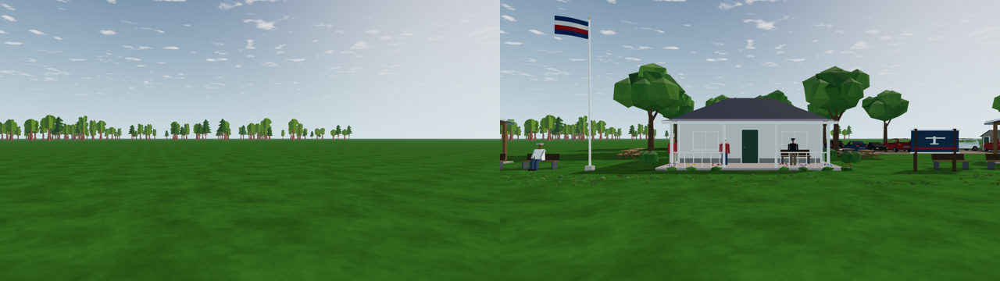

# 05 · Landscape image review (2026-10-07)

What the production landscape looks like today, measured from captures. Written by the scenery track for the landscape and visual-quality tracks: the findings are mapped to their L steps as requests, not edits. Captures:
- the SC-03 view set (`tools/scenery/capture.sh`, 1280 × 720, llvmpipe), scenery **off**: the landscape exactly as it ships;
- the L0b top-down view `capture-land-top` of 2026-10-06.



## Findings, measured

| # | Finding | Measurement | Owner step |
| --- | --- | --- | --- |
| 1 | **The grass is too blue-green and too saturated** ("billiard-table green") compared with a real club field | Sim grass: hue 104–110°, saturation 0.69–0.74 (pilot view). The owner's reference photo: hue 73–80°, saturation 0.43–0.53 | L9b (colour, macro variation) |
| 2 | **The ground is too uniform, and what variation it has repeats.** From altitude the tile repeats as a grid (`details.png`, top left) | Luminance spread at 140 m: sim 4.3 levels against 9–14 in the photo. Top-down autocorrelation peak 0.49 at a 63 px period (`capture-land-top`) | L9b (anti-tiling, macro variation at 37/160 m) |
| 3 | **Tree cards show a hard vertical seam:** one half of the crown lit, the other half dark, from every angle; plainest with a long lens | A step of up to ~50 levels between neighbouring columns inside a crown (16 levels in the column mean of a whole crown) at the 6° view | L6b/L8: cards shaded from a shared crown normal (or baked, unlit) instead of each quad's own plane normal |
| 4 | **Trees stand on the grass with no contact.** A hard line at the trunk base, no shadow, no undergrowth; the treeline reads as pasted on | Visual (`details.png`, bottom right) | L8; the scenery's alpha-blended contact shadows (SC-05, measured clean) can be offered |
| 5 | **The runway is a flat lime band** with hard edges and no texture, mowing stripes or wear | Hue 87°, saturation 0.57, value 0.63 against grass 0.38: plenty of contrast, but synthetic | L9c (surfaces in the shader, mown stripes ≤ half the edge step); paved option O-6 |
| 6 | **The world is a perfectly flat plain.** Raised views end in an even grey-green haze band; nothing breaks the horizon but the treeline | Visual (`postcard_club`, `aerial_overview`) | L7 (far forest strip and hill ring), L13 |
| 7 | **The near ground smears into streaks at grazing angles** (pilot view, bottom of frame) | Visual (`pilot_north`, `pilot_south`) | L11a (near-field grass blades) |
| 8 | **The two-triangle ground can hide the runway** in raised views (SC-01: 4 of 12 views at 30 m) | Measured in SC-01 | G-1 (subdivide the ground). Scenery does it only while on |
| 9 | **Tree trunks are a saturated red-brown;** the scenery's trunks are a darker, duller brown | Visual | L6a palette; scenery palette `trunk` can follow whichever is chosen |
| 10 | **Sky and clouds hold up well.** Debanded gradient, sun-side brightening, small cumulus tufts; slightly uniform in scale | Sky zenith RGB (127, 152, 178), horizon (161, 182, 174) | L4 (optional: two cloud scales) |



## What the scenery changes, and what it does not



**What it changes:** the scenery fills the empty middle ground with objects of known size. That gives scale and life, and the L6c readability numbers stay within the proposed thresholds ([SC-03](../scenery-implementation/SC-03/README.md)).

**What it cannot change:** the base layers set the overall impression, and they are the landscape track's to fix:
- the ground's colour and repetition (findings 1–2);
- the tree seam and grounding (3–4);
- the runway (5);
- the flat world (6).

## Suggested order for the landscape track (largest visible gain first)

1. **Grass colour and macro variation** (L9b, findings 1–2): the cheapest change with the largest effect on every frame.
2. **Tree card shading** (finding 3): a shader change, no new assets.
3. **Runway surface** (L9c, finding 5).
4. **G-1 ground subdivision** (finding 8): one line, fixes a correctness bug.
5. **Tree grounding and near grass** (L8/L11a, findings 4 and 7).
6. **Hills** (L7, finding 6).

Each needs its own A/B capture and the L6c readability re-run: a more natural, less saturated ground changes the airplane's contrast against it.

## Reproduce

```bash
tools/scenery/capture.sh /tmp/scn   # off/, on/, on-repeat/ with views.json
```

Colours are means over fixed boxes of the PNGs; the photo is local only (`references/scenery/`). Tiling is the 2-D autocorrelation of the top-down capture, excluding offsets under 60 px. The numbers are llvmpipe renders and image statistics, not perceptual judgements; the owner's eye decides at Gate L.
