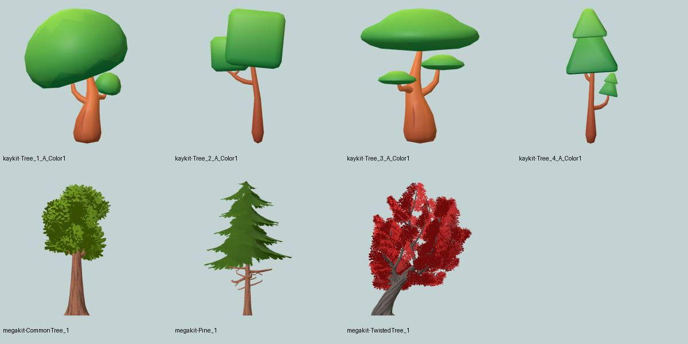

# Revisión de árboles y nuevas fuentes — 2026-10-06

## Decisión visual

Tras la petición de buscar árboles **bonitos y variados**, la selección inicial Kenney deja de ser la familia elegida para L6a. Comparé once siluetas Kenney y rendericé siete modelos de otros packs en Godot 4.7.2 Compatibility. La preferencia por Quaternius es un juicio artístico basado en esas imágenes: ofrece ramas, huecos y bordes de hojas que las copas geométricas simples no tienen. No demuestra todavía legibilidad del avión entre árboles; eso corresponde a L6c.

[Comparación de once Kenney](kenney-review.png). Los colores de Kenney se adaptaron a la paleta provisional del simulador; KayKit y Quaternius conservan sus materiales. No es una comparación de rendimiento ni una puntuación objetiva de belleza.

## Alternativas contrastadas

| Recurso y fuente primaria | Qué aporta | Encaje y limitación comprobada |
| --- | --- | --- |
| [Quaternius Stylized Nature MegaKit](https://quaternius.itch.io/stylized-nature-megakit) | Copas con hojas, pinos, árboles secos y retorcidos; glTF y texturas | **Primera elección para el atlas L6a.** El ZIP Standard descargado declara 68 modelos, no los 116 del conjunto completo. Su `License_Standard.txt` declara CC0. Las escenas Godot y shaders preparados pertenecen a Source; no vienen en Standard. |
| [KayKit Forest Nature](https://kaylousberg.itch.io/kaykit-forest) | Familia coherente de árboles, arbustos, rocas y hierba; glTF/FBX/OBJ | Alternativa estilizada ligera. FREE contiene 100+ modelos; los recolores y contenido EXTRA no deben contarse como gratuitos. Cuatro árboles medidos: 530, 336, 978 y 404 triángulos, una superficie cada uno. CC0 en el archivo descargado. |
| [Tree Sprites, klamtii](https://klamtii.itch.io/tree-sprites) | 30 vistas de árboles, agrupadas de tres en tres: coníferas, frondosas, abedules y secos | Buena alternativa para un horizonte realista; PNG RGBA. Licencia permisiva propia que permite modificación y redistribución, **no etiquetarla como CC0**. Son renders con sombreado existente: no sirven como albedo neutro sin un tratamiento y A/B específicos. No hay mallas 3D para vistas próximas. |
| [Vegetation Pack, Takyin](https://takyin.itch.io/simple-vegetation-pack) | Tres árboles simples, dos pinos, flores, troncos y una planta | Reserva pequeña para comparar variedad; la página declara CC0. No descargado ni medido aquí: no afirmar presupuesto de triángulos, formato importado ni calidad en Godot. |
| [Kenney Foliage Sprites](https://kenney.nl/assets/foliage-sprites) | 50 recursos de follaje, CC0 | Candidato para hierba y plantas en L11. Diferenciar variantes planas y sombreadas; elegir las planas cuando el material deba recibir la luz del campo. No sustituye por sí solo una familia de árboles 3D. |
| [Poly Haven Pine Forest](https://polyhaven.com/collections/pine_forest), [Pine Tree 01](https://polyhaven.com/a/pine_tree_01) | Árboles y superficies realistas, con mapas de material; fuente CC0 | Referencia visual y posible fuente offline. La ficha de Pine Tree 01 indica **17 millones de triángulos**: no importar directamente como árbol del juego. Requiere otra selección/LOD/bake. No se descargó ese modelo. |
| [ez-tree v1.1.0](https://github.com/dgreenheck/ez-tree/tree/v1.1.0) | Generación reproducible por semilla y parámetros; GLB/PNG; código MIT | Alternativa orgánica offline. El ensayo medido de Oak Large produjo 22.566 triángulos: el preset por defecto no cumple el presupuesto de una malla próxima. Las licencias de texturas deben acompañar al código. [Ensayo reproducible y procedencia](ez-tree/README.md): las texturas de hojas exactas de v1.1.0 siguen sin procedencia concluyente; no se incorporan al juego. |

## Archivos revisados realmente

Las fichas publicitarias no sustituyeron la inspección del ZIP:

- [KayKit: URL, upload ID, SHA-256 y tamaño](kaykit.json), [licencia incluida](kaykit-LICENSE.txt).
- [Quaternius: URL, upload ID, SHA-256 y tamaño](megakit.json), [licencia incluida](megakit-LICENSE.txt).
- [klamtii: URL, upload ID, SHA-256 y tamaño](sprites.json), [licencia incluida](sprites-LICENSE.txt), [galería de las 30 siluetas](sprites-review.jpg).
- [Conteos extraídos de los glTF](model-counts.json). Son triángulos indexados de origen; no son draw calls ni una medición GPU.

La [licencia general actual de Quaternius](https://quaternius.com/license.html) es QAL v1.0 y limita la redistribución de assets sueltos. Por eso **no generalizamos CC0 a todo Quaternius**: esta selección conserva la evidencia del paquete Standard exacto que todavía incluye su declaración CC0. Otra descarga o pack debe revisarse de nuevo.

## Aplicación al plan

Elegir `CommonTree_1`, `CommonTree_3` y `Pine_1`: dos copas frondosas de formas distintas y una conífera. Evitar mezclar árboles cúbicos, palmeras y árboles rojos de fantasía en el mismo campo templado solo para aumentar el número de modelos. La variedad de colocación, escala y orientación será estable y se resolverá en L6b.

Cambio de presupuesto justificado: los **GLB de autoría offline** pueden tener hasta 10.000 triángulos; los tres elegidos tienen 6.265, 3.505 y 3.947. No se exportan al juego. El runtime lejano mantiene tres planos cruzados, **6 triángulos y una superficie por árbol**, un atlas de 1024² y hasta tres especies. Las mallas cercanas L8 conservan su límite inicial de 1.000 triángulos y requieren una adaptación separada. Permitir una fuente detallada para generar una imagen no aumenta por sí mismo el coste geométrico de esa imagen en vuelo.

Antes de cerrar L6a: validar derivados con Khronos, comparar fuentes/derivados con el mismo import sin LOD ni compresión destructiva, comprobar albedo sin luz direccional horneada, márgenes/alpha/mips, base del tronco y export limpio. L6b/L6c deben evaluar repetición visible, bruma, contraste del avión y coste de fragmentos transparentes. Seis triángulos no garantizan que un bosque sea barato.
