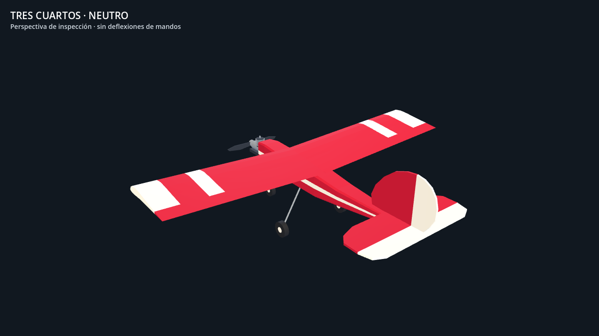

# Jensen .61: referencias ordenadas y corrección del morro

2026-10-05 · Continuación del modelo v1, paso visual D1 del [plan](../UGLY-STIK-PLAN.md).

Los 31 archivos aportados por el propietario están bajo `references/`, agrupados por avión. El [índice de referencias](aircraft-reference-index.md) distingue Jensen .61, Ultra Stick 120 para una posible variante grande y MoJo con identidad pendiente. Se conservaron los 14.083.239 bytes y los 31 hashes SHA-256 del inventario; los informes y manifiestos apuntan a sus nuevas rutas. Los originales permanecen locales e ignorados por git.

## Cambio del modelo

La lectura del plano Jensen realizada en D1 por el desarrollador de física aporta una cota útil: **6,94 in (176,276 mm) entre la cara delantera del cortafuegos F1 y el borde de ataque del ala**. Revisamos visualmente los puntos del cortafuegos y ambos bordes del ala con [su script de lectura](../../research/d1/jensen_plan_cg.py). La cuerda medida de 12,07 in difiere un 0,58 % de los 12 in nominales deducidos de 720 in² / 60 in. Ese control respalda la escala local, aunque no calibra todas las vistas del escaneo.

| Parámetro visual | v1 | v2 |
| --- | ---: | ---: |
| F1 → borde de ataque | 325 mm | 176,276 mm |
| F1, coordenada Z | −440 mm | −291,276 mm |
| Plano de hélice, Z | −557 mm | −408,276 mm |
| Eje de rueda delantera, Z | −400 mm | −251,276 mm |

Se acortaron las tres estaciones delanteras del fuselaje respecto al borde de ataque fijo. El motor, la hélice y el tren delantero se desplazaron con el cortafuegos, conservando sus separaciones de instalación. Las anchuras y alturas todavía son aproximadas. Ala, cola, línea de empuje y tren principal conservan sus parámetros. La fuente editable es [geometry.json](../../assets/aircraft/ugly-stik-60/geometry.json); el [registro de medición](ugly-stik-investigations/evidence/model-v2-nose.json) incluye puntos, hash del PDF, transformación y límites.

Normalizar por la cuerda nominal daría 175,254 mm: aproximadamente 1 mm menos. Se usa una tolerancia visual de 2 mm para esta corrección, como criterio de ingeniería de la lectura y su control local, no como precisión certificada del avión real. La instalación .61 concreta sigue pendiente de selección.

También se eliminaron de `app/spec.gd` las tablas geométricas antiguas, que ya no tenían consumidores. El registro JSON y su copia Godot generada son la fuente actual. Esta revisión no cambia los datos físicos de masa, CG, inercia o aerodinámica del otro frente de desarrollo.

## Evidencia

- `compile_geometry.py --check`: copia generada idéntica a la fuente.
- `app/test.sh`: suite completa aprobada, incluidas **453 comprobaciones del modelo, cero fallos**, y estado final idéntico a 30, 60 y 144 FPS. [Registro de validación y hashes](ugly-stik-investigations/evidence/model-v2-validation.json).
- Las nuevas comprobaciones miden nodos y límites de la malla construida: distancia F1–ala y separaciones de hélice y eje delantero. Restaurar el cortafuegos antiguo en una copia temporal produce tres fallos y salida 1. [Prueba de mutación](ugly-stik-investigations/evidence/model-v2-mutation.json).
- Nueve [capturas de inspección](../../research/ugly-stik/model-v2/captures/manifest.json), con vistas ortográficas, mandos y distancias 20/50/100 m; revisión visual de perfil y tres cuartos. [Captura dentro del simulador](../../research/ugly-stik/model-v2/captures/in-app.png).
- 46 instancias de malla, 2.568 triángulos y cinco materiales, igual que v1. Límites totales neutros: 1,522832 × 0,485100 × 1,198776 m; la longitud incluye hélice y cola, no es una cota confirmada del fuselaje.
- Holgura calculada de hélice/suelo: **96,1 mm**, con tres ruedas rígidas apoyadas; no valida una instalación real ni suspensión. [Cálculo](ugly-stik-investigations/evidence/model-v2-assembly.json).



Reproducir desde la raíz:

```bash
python3 assets/aircraft/ugly-stik-60/compile_geometry.py --check
app/test.sh
python3 research/ugly-stik/model-v1/measure_assembly.py --output docs/research/ugly-stik-investigations/evidence/model-v2-assembly.json
bash research/ugly-stik/model-v2/capture.sh
```

El siguiente paso dimensional es identificar y calibrar el contorno de cola y las estaciones restantes con controles independientes. Perfil, incidencia y diedro siguen necesitando mejor evidencia. Las capturas y los informes v1 permanecen como historial; esta corrección local no convierte toda la malla en una reproducción dimensional exacta.
