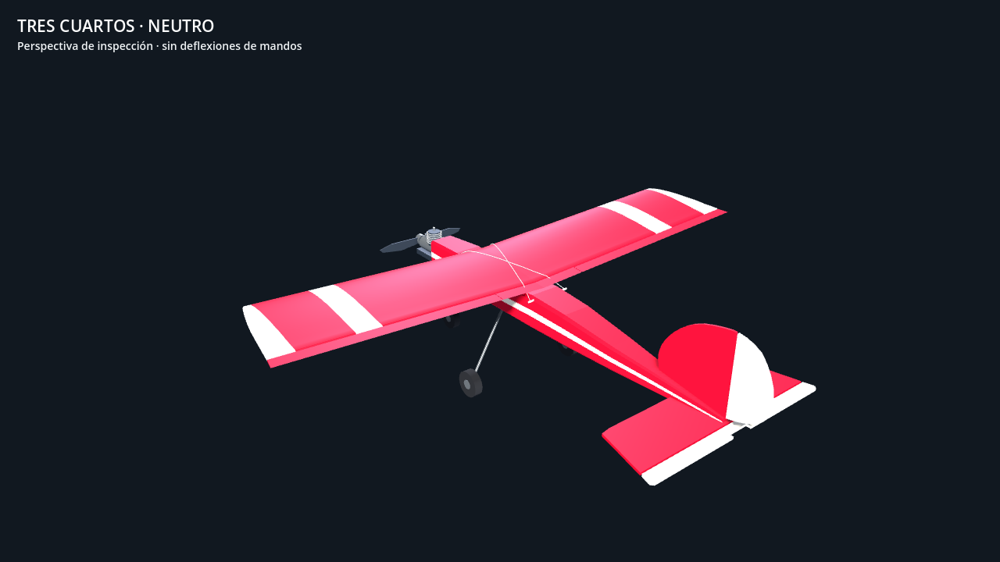

# Jensen Ugly Stik .61 — entrega del modelo v3

2026-10-05 · `jensen-60-nitro-61-v3` · [Plan y aceptación](../UGLY-STIK-PLAN.md).

La v3 integra el fuselaje posterior, empenaje y ala revisados desde los planos Jensen, con superficies articuladas, motor nitro .61 genérico y tren preparado para animación. Está disponible en la aplicación Godot mediante el mismo constructor y adaptador. El trabajo local de implementación del plan está entregado; la lectura por un piloto, el rendimiento en su equipo y el taxi físico siguen pendientes.



## Geometría y procedencia

| Componente | Cambio v3 | Evidencia y límite |
| --- | --- | --- |
| Fuselaje | Techo, vientre y anchuras F4/F5/F6; prolongación hacia empenaje; asiento alar ajustado | [Metrología](ugly-stik-model-v3-metrology.md) y [adopción](../../research/ugly-stik/model-v3/fuselage-adoption.json). Frente y zonas ocultas siguen estimados |
| Estabilizador/elevador | Planta, ubicación y línea de bisagra; elevador con alivio y recorte central en U | [Lecturas y decisiones](../../research/ugly-stik/model-v3/tail-adoption.json). Contorno fino simplificado; el recorte de montaje es una decisión del modelo |
| Deriva/timón | Perfil del avión montado en la hoja 1, bisagra y base; subderiva y patín | Se evita aplicar al avión la escala desconocida de un detalle ampliado. Espesores y tramos inciertos están identificados |
| Ala/alerones | Punta barrida, longitud y profundidad del alerón, sección trazada normalizada, normales suaves | [Informe del ala](ugly-stik-model-v3-wing.md). La costilla de la hoja 2 y el avión montado discrepan en escala; se conserva cuerda nominal, sin inventar un NACA |
| Instalación | Carburador, salida de escape, sujeción cruzada del ala, pivotes de rueda y dirección | [Instalación y entrega a física](ugly-stik-model-v3-installation.md). Equipo visual genérico y sujeción simplificada |

Los anclajes compartidos con física se mantienen: envergadura nominal 1,524 m, cuerda 0,3048 m, borde de ataque Z=−0,115 m y línea de empuje Y=−0,005 m. Las dimensiones exteriores en reposo son aproximadamente **1,522 × 0,436 × 1,315 m**; la proyección del diedro explica que la anchura X no sea idéntica a la envergadura nominal.

La conversión del escaneo guarda puntos, hash, página, resolución y datum. El origen vertical adoptado usa un proxy de la vista lateral: no demuestra la altura real del eje motor. No se extraen masa, inercia ni polares desde la malla.

## Pruebas dimensionales y de movimiento

La sección reservada del fuselaje está en x=2800 px del plano (Z=0,390968 m), entre F5 y F6; no se usó para ajustar las estaciones. Los residuos modelo menos lectura son **−0,032 mm en techo, −0,020 mm en vientre y −1,266 mm en ancho**, dentro de los márgenes declarados de 3/3/6 mm. Son residuos contra un escaneo, no exactitud de fabricación. [Resultado calculado](../../research/ugly-stik/model-v3/dimension-check.json). El contrato también muestrea los triángulos construidos en esa sección.

Las superposiciones de perfil y planta se generan con `check_dimensions.py --overlay` sobre rasterizados locales bajo `references/ugly-stik/model-v3/`. Conservan la misma transformación del dato adoptado, sin estirar cada pieza para ocultar discrepancias. El generador dimensional funciona sin esas imágenes; solo la opción de superposición necesita el material local y Pillow.

El [informe de holguras](../../research/ugly-stik/model-v3/clearance-current.json) pasa **99 pares/poses de cola y 30 de alerones**. Los mínimos informados son cotas inferiores conservadoras de **1,748 mm en cola y 0,681 mm en ala**, por encima del umbral visual de 0,25 mm; no son distancias exactas entre todos los puntos. Las cajas solapadas pasan por comprobaciones de triángulos y contención. Una pieza completamente contenida puede tener distancia positiva entre superficies, por lo que esa distancia sola no certifica separación.

Las uniones fijas fuselaje/estabilizador y fuselaje/deriva se permiten explícitamente. Las poses muestreadas son neutro y extremos, incluidas las nueve combinaciones pitch/yaw; no constituyen una demostración de todos los ángulos continuos. En una copia temporal se redujo la separación de bisagra de cola de 4 mm a cero: el comprobador detectó **24 pares/poses fallidos** y el contrato integrado falló. [Mutación](../../research/ugly-stik/model-v3/clearance-mutation-hinge-gap.json).

## Validación integrada

- Compilador y copia generada coherentes; contrato del modelo: **510 comprobaciones, cero fallos**.
- `app/test.sh` pasa: parseo, unidades, entrada real, modelo, vuelo nivelado inicial e independencia de 30/60/144 fps. Los resultados pertenecen a la revisión de aplicación registrada; la simulación continúa evolucionando en paralelo.
- Clon limpio sin planos ni caché Godot inicial: suite completa, contrato y nueve capturas finales pasan.
- **45 capturas sin recortes** de vértices: nueve de inspección y 36 de orientación. La repetición independiente de orientación produjo **36/36 PNG idénticos**. Procedencia y cámaras están en cada manifiesto.
- Presupuesto actual: **54 mallas, 4.816 triángulos y cinco materiales**. Render de verificación: Mesa llvmpipe, no benchmark de GPU.

El [registro de validación](../../research/ugly-stik/model-v3/validation.json) conserva hashes, comandos y resultados, con sus logs. La [captura dentro de la aplicación](../../research/ugly-stik/model-v3/in-app.png) usa vuelo físico, no la trayectoria scripted. La suite y esa captura informan la discrepancia ya existente de CG de inventario y una advertencia ObjectDB al salir; el contrato aislado del modelo no reproduce esta última. No se ha atribuido su causa ni modificado la simulación para esta entrega.

## Reproducir y revisar

Desde la raíz:

```bash
python3 assets/aircraft/ugly-stik-60/compile_geometry.py --check
python3 research/ugly-stik/model-v3/recompute_us02_metrology.py
python3 research/ugly-stik/model-v3/check_dimensions.py
app/test.sh
bash research/ugly-stik/model-v3/capture.sh \
  --output-dir research/ugly-stik/model-v3/review-new
```

El último comando requiere un destino nuevo, ejecuta dos series y compara PNG antes de publicar. Conserva v1/v2. Para inspección cercana, [comando y cámaras](ugly-stik-model-v3-readability.md). Para puntos de contacto y marcos, regenerar `equipment_handoff.py` cuando cambien los datos físicos.

La [página de revisión](../../research/ugly-stik/model-v3/captures/review.html) está lista para una sesión a 20/50/100 m, seis actitudes y dos fondos. No contiene respuestas humanas inventadas. Esa sesión decidirá si hacen falta cambios de decoración. Motor comercial exacto, certificación dimensional, detalles finos y optimización esperan la evidencia correspondiente. Mini y gigante permanecen fuera de esta entrega.
