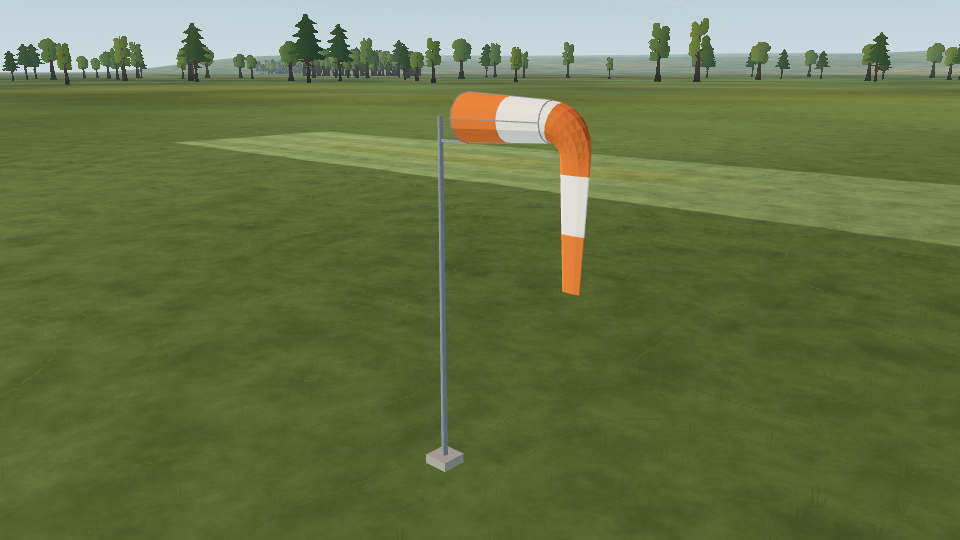

# L10a — calm windsock

**Status (2026-10-08): engineering verification passed; human Gate L remains open.** First bounded slice of [L10](../../../LANDSCAPE-PLAN.md). Wind response remains L15a/M5 work.

## Delivered

The default field now has a windsock 6 m behind and 12 m west of the pilot. Its mast/throat centre is 3.6 m above the flat ground. A folded, hanging tail communicates calm; it does not advertise an invented wind direction. The first three-eighths of the sleeve stays open on a light basket, with an open throat and five orange/cream bands. The placement, mast height, tail opening, folds, colours and fittings are estimates recorded in data or the renderer.

The nominal 2.5 m length, 0.45 m throat and supported fraction follow [FAA AC 150/5345-27E §§3.2.2–3.3](https://www.faa.gov/documentlibrary/media/advisory_circular/150_5345_27e.pdf). This is a visual reference model, not a certified wind indicator. The five-band design is an artistic convention, not a requirement claimed from that AC.

`render/windsock.gd` builds two opaque meshes using the existing scenery `MeshKit` utility: fabric and support. No textures, downloads, shader animation, collision bodies or frame callbacks are added. The mesh centreline is parameterised by cloth length: a straight basket, a quarter bend, then the hanging tail. Cloth faces have outward normals and render on both sides; no engine shadow pass is requested.

The optional `flight_cues` field-data extension accepts one windsock. Existing treeline `objects` and fields without cues retain their contract. Every dimension/position requires provenance; invalid cues fail the whole field load. The conservative envelope must fit on rough ground, avoid runway/mown areas, clear the pilot and stay out of actual visual relief. The 1.5 km flat-radius rule applies only to the renderer's 40 km hill mesh; other rough rectangles remain flat. See the [data contract](data-contract.md).

## Verification

- Committed-field geometry and builder integration: 16 checks for coordinate mapping, actual mesh throat diameter, arc length, rigid support, droop, ground clearance, five bands, normals, independent builds and mesh budget.
- Data contract: 117 checks, including malformed quantities, unknown/reserved IDs, unsupported collisions, cue capacity, placement exclusions and wide flat custom ground. Existing field-loader suite: 161 checks.
- Compatibility captures: close, pilot looking back, and raised overview; cue on/off at frozen simulation time. Two independent default runs match exactly; the same views pass with optional scenery on. Changes stay inside projected mesh bounds and whites do not clip. An invisible-feature control fails the check.
- Every visible cue adds **2 draws and 1,770 triangles**. Software-renderer timing is not hardware performance evidence.
- A fresh local clone at `a6c1e4d4a0c90c4f6160566ffc60075450341d62`, with the landscape changes copied explicitly and imported from scratch, passes the complete cue capture check.
- The three-second flight has **721 identical numeric samples** before/after; only the UTC creation timestamp differs.
- The Linux PCK loads the field, procedural windsock, grass and tree assets from an empty project root. Native Windows/macOS execution is not claimed.

`app/test.sh` completed with exit 0, including flight/model contracts, golden flights and 30/60/144 fps state equality. That run loaded the 14-check geometry script; a subsequent targeted run passed all 16 checks after adding two builder-integration assertions. Static lint retains the same 12 pre-existing warnings and reports no errors. The four synthetic runway/mown priority images and render counters match L9c exactly after removing the unrelated cue from that fixture. The full `app/capture.sh` pipeline was not rerun; its new cue checker and affected priority fixture were exercised directly.

Saved evidence: [capture summary and source hashes](evidence/capture-summary.json), [full test log](evidence/app-test.log), [16-check integration run](evidence/windsock-test.log), [flight comparison](evidence/trace-comparison.json), [priority comparison](evidence/priority-comparison.json), [empty-root pack check](evidence/pack-check.log), [verification scope](evidence/verification.json). Three representative images are retained from the 18 generated captures; all three run manifests are in `evidence/`.



[Pilot looking back](pilot-turn.png) · [Overview with optional scenery](scenery.png)

## Reproduce

```bash
"$(app/get-godot.sh)" --headless --path app --script res://tests/test_windsock_data.gd
"$(app/get-godot.sh)" --headless --path app --script res://tests/test_windsock.gd
"$(app/tests/visual-env.sh)" tools/ground/check_windsock.py \
  --app app --godot "$(app/get-godot.sh)" --out /tmp/l10a-review
```

The capture checker requires a new or empty output directory, rejects engine errors and wrong/missing images, and records source hashes and renderer identity. `app/capture.sh` runs it and includes the report hash in its completion manifest. Synthetic surface/grass/treeline fixtures explicitly remove the unrelated cue before changing their geometry; real default-field coverage includes it.

## Remaining scope

L10 pilot stations and safety barriers are still pending; cars and pit furniture belong to SC-06/07. L15a must connect the windsock to actual simulated wind, including lag and calibrated droop; this calm-only renderer makes no wind-speed claim. Collision belongs to L14. The owner's readability and target-GPU checks remain under Gate L.

All new geometry/tooling is original repository code. Existing `MeshKit` is reused unchanged. No third-party asset or dependency was added.
