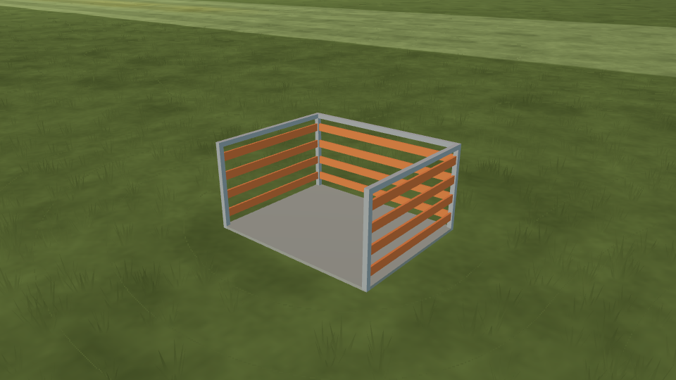

# L10b — pilot station

**Status (2026-10-08): engineering verification passed; human Gate L remains open.** One bounded [L10](../../../LANDSCAPE-PLAN.md) flight cue; broader safety-line fencing remains pending.

## Scope and provenance

The default pilot now stands inside a low three-sided station, open to the south/rear. Its 1.5 m east-west width, 1.2 m north-south depth and 0.75 m height are estimated visual dimensions, informed by the club examples in [field-layout research](../../scenery-investigations/03-rc-field-layout-references.md#markings-and-pads). They are not a safety standard or a claim of physical protection. The concrete pad, galvanized frame, four orange slats per side and colours are original procedural artwork. No downloaded asset or dependency is added.

The station follows the existing pilot datum; neither the pilot camera nor the runway moves. `pilot_station.gd` emits one opaque mesh, with no processing, collision or shadow pass. All fittings remain inside the specified footprint; the rear has no crossing rail. Near grass excludes the pad plus the existing full-clump margin. Surface friction, contacts and flight physics do not consume this visual cue.

The optional field-data array accepts at most one windsock and one station. Position, dimensions and provenance are validated before building. The station must match the flat-ground pilot location, remain below eye height, fit on rough ground and clear runway/mown surfaces. Fields without cues preserve their prior normalized shape. See [data contract](data-contract.md).

## Verification

The focused checks pass: 36 station geometry/grass checks, 161 station-data checks, 119 windsock-data checks, 16 windsock mesh checks and 161 legacy loader checks. Existing field integration, surfaces and near-grass suites also pass. Geometry readbacks cover footprint/height across supported dimensions, open rear and closed sides, finite vertices/normals, deterministic builds and the single-draw budget. On/off captures cover front, rear, raised overview and both runway thresholds from the actual pilot eye; default repeats and scenery-on runs share the same frozen clock. The pilot-view check requires exact pixel equality and rejects a pixel-difference control (one modified image pixel, not a rendered occluder). Visible views must change inside projected mesh bounds; an invisible-feature control must fail.

All 30 station captures and 18 windsock regression captures pass from a clean clone plus the explicit [landscape overlay](evidence/snapshot.json). The station contributes **one draw and 230 triangles** in visible views. Both threshold views remain byte-identical with it on/off, including optional scenery. The pad excludes **49 clumps**, leaving 4,794, and repeat images/counters are exact. No clipped whites appear on the cue.

The [three-second flight comparison](evidence/trace-comparison.json) has 721 identical numeric samples before/after; only the creation timestamp differs. The [Linux PCK check](evidence/pack-check.log) loads the station, windsock, grass and trees from an empty project root. Static lint reports no errors and the same 12 pre-existing warnings. The full `app/capture.sh` pipeline was not rerun; both flight-cue modes were exercised directly. Native Windows/macOS execution is not claimed.

All headless checks completed in the isolated snapshot, including golden flights, flight/model contracts and 30/60/144 fps state equality. The initial `app/test.sh` run exited 124 when the landing maneuver exceeded 60 seconds without an assertion failure. A continuation repeated that test with a 180-second limit and ran every remaining original assertion, exiting 0; prior checks had passed. The repository runner was unchanged. Concurrent uncommitted physics changes were excluded. [Initial log](evidence/app-test-initial.log) · [Continuation log](evidence/app-test-resumed.log) · [Exact continuation script](evidence/resume-checks.sh) · [Verification scope](evidence/verification.json).

Evidence: [station capture summary](evidence/station-summary.json), [windsock regression summary](evidence/windsock-summary.json), [station geometry checks](evidence/test_pilot_station.log), [data checks](evidence/test_pilot_station_data.log). Three representative images are retained; all six manifests and source hashes are in `evidence/`.



[With the optional club scenery](scenery.png) · [Pilot looking at the left runway threshold](pilot-left.png)

The pilot-view assertion applies to the default field, these camera poses and 50-degree vertical FOV. It does not replace the owner's Gate L playtest or target-GPU timing.

## Reproduce

```bash
"$(app/get-godot.sh)" --headless --path app --script res://tests/test_pilot_station_data.gd
"$(app/get-godot.sh)" --headless --path app --script res://tests/test_pilot_station.gd
"$(app/tests/visual-env.sh)" tools/ground/check_windsock.py \
  --cue pilot_station --app app --godot "$(app/get-godot.sh)" --out /tmp/l10b-review
```

The shared flight-cue checker retains its L10a filename for existing callers; omitting `--cue` still checks the windsock. `app/capture.sh` invokes both cue modes and records their completion reports. The grass exclusion remains active in both sides of the station mesh ablation, so that comparison isolates the station geometry.
