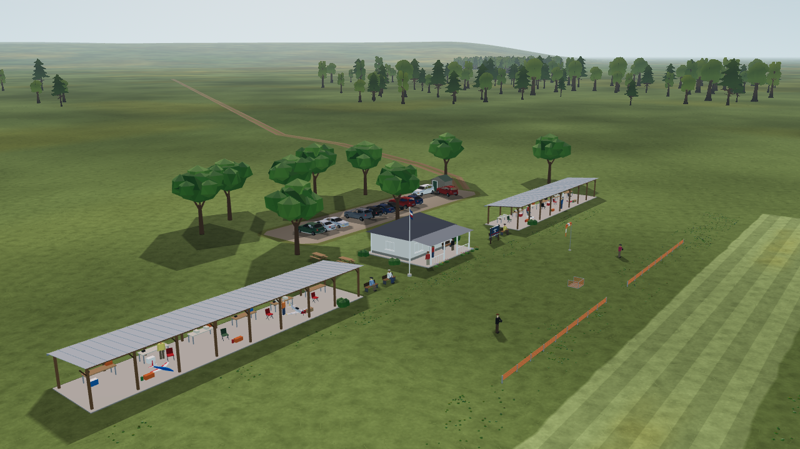

# L10c — flightline barrier and complete-field review

**Status (2026-10-08): engineering verification passed. Gate L and Gate SC remain open.**

The default field now has a low orange-and-grey flightline barrier: 48 m across, 0.65 m high, with a 6 m central opening. Twenty posts, pale caps, footings and four open slats per bay match the pilot station. All dimensions and colours are estimated original procedural artwork, informed by the existing [field-layout references](../../scenery-investigations/03-rc-field-layout-references.md). This is a visual cue, with no collision or claim of physical protection. Aircraft, pilot datum, runway and physics are unchanged.



The barrier uses one opaque mesh, **1 draw and 1,320 triangles** in the default field. Closed box geometry preserves faces from every viewing direction; the largest supported custom barrier remains below 3,000 triangles. The field loader checks provenance, uniqueness, dimensions, the central opening, rough-ground containment and separation from the station, runway, mown areas and windsock. It also keeps the barrier top plus a 5 cm estimated margin below the pilot-to-near-runway-ground sightline. A 0.9 m barrier at the default position is refused; moving it to north 3.5 m restores clearance. Custom flat fields retain their own footprint; only the exact 40 km horizon ground imposes the 1.5 km flat-radius constraint. See [data contract](data-contract.md).

## Visual evidence

Thirty barrier on/off captures cover front, rear, overview and both threshold directions from the pilot eye: a default run, an independent repeat and scenery enabled. Images and GPU counters repeat exactly. Both threshold views preserve all **22,740 protected runway pixels**, including a two-pixel margin. A deliberately changed runway pixel fails the guard; an unrelated pixel changed outside the projected barrier also fails. The polygon is clipped against the camera near plane before projection, because the opposite threshold can be behind the eye. This is a pixel-difference control, not a rendered occluder or a guarantee for every custom camera/field.

The [barrier report](evidence/barrier-summary.json) records one added draw, 1,320 triangles, visible cue pixels confined to projected bounds in inspection views, and no clipped whites. Existing windsock and station modes pass another 48 captures. [L10d](../L10d/README.md) adds 18 shadow captures: **96 cue captures total**, rechecked with the [final checker and its source hash](evidence/capture-check.json). Cue ablation toggles geometry only; the shared contact-shadow mesh stays present. The separate L10d ablation isolates those shadows.

Eight existing scenery postcard/review cameras were rendered twice with a frozen clock: club, pits, pavilion, meadow, north/south pilot views, runway threshold and car park. All 16 PNGs and per-view counters repeat exactly. The [contact sheet](scene-review.png), [first manifest](evidence/scene-first.json), [repeat manifest](evidence/scene-repeat.json) and [image hashes](evidence/scene-first-hashes.json) preserve the review. The club, cars, tables, people, flowers and distant scenery belong to the existing SC track; this step integrates and reviews them without duplicating their assets.

[Default pilot looking left](pilot-left.png). L8 close tree meshes remain pending: current field trees begin around 270 m, outside the proposed 150 m close-mesh zone, and the detailed source trees are not approved ≤1k-triangle runtime LODs.

## Verification and limits

Focused checks pass: **144 barrier-data, 48 barrier-geometry, 121 windsock-data, 163 station-data and 20 contact-shadow checks**. The [three-second trace comparison](evidence/trace-comparison.json) preserves all 721 numeric samples. [Empty-root Linux pack loading](evidence/pack-check.log) verifies the barrier, shadows, field data, grass and tree resources without source-tree fallback. The explicit scenery launcher boots Home headlessly. Static lint retains zero errors and the same 12 existing warnings.

All **145 headless check sections** completed with exit 0, including golden flights, model contracts and identical state hashes at 30/60/144 FPS. The repository runner was unchanged; a [shared-host timeout wrapper](evidence/timeout-wrapper.sh) extended 60-second deadlines to 180 seconds without changing assertions. The final sightline guard was added after this run started, so all affected field/cue tests were repeated against final sources. Concurrent uncommitted physics work was excluded. [Full log](evidence/app-test.log) · [Verification scope](evidence/verification.json) · [Final source hashes](evidence/snapshot.json).

The [final L6c comparison](evidence/readability-comparison.json) repeats 64 captures in a frozen source tree. All metrics in eight groups and 48 attitude cases are exactly equal to the baseline; the blinded 24-image kit remains available for the owner’s playtest.

Human attitude recognition, landing perception and frame-time measurements on the owner's slowest GPU remain Gate L work. Software-renderer counters and deterministic captures do not close those gates. Wind response still depends on L15a/M5; terrain/contact work remains separate. The full capture pipeline and native Windows/macOS execution are not claimed.

## Open the complete field

```bash
app/run-landscape.sh
# Or enter flight directly:
app/run-landscape.sh -- --quick-flight
```

This explicit launcher enables the existing optional scenery and forwards normal Godot arguments; ordinary app startup retains its current scenery policy. Home's selected aircraft and language still work normally.

Reproduce cue verification:

```bash
"$(app/tests/visual-env.sh)" tools/ground/check_windsock.py \
  --cue flightline_barrier --app app --godot "$(app/get-godot.sh)" --out /tmp/l10c-review
```

`app/capture.sh` now runs all four cue modes and hashes their completion reports. No external asset or dependency was added.

The complete-field review reuses the scenery team's cameras unchanged:

```bash
LP_NUM_THREADS=1 xvfb-run -a -s '-screen 0 1280x720x24' \
  "$(app/get-godot.sh)" --path app --resolution 1280x720 \
  --rendering-driver opengl3 --audio-driver Dummy \
  --script res://scenery/capture_views.gd -- --scenery=on \
  --scenery_audio=off --scenery_birds=off --t=0 \
  --views=postcard_club,postcard_pits,postcard_pavilion,postcard_meadow,pilot_north,pilot_south,runway_threshold,car_park \
  --out=/tmp/l10c-complete-field
```
