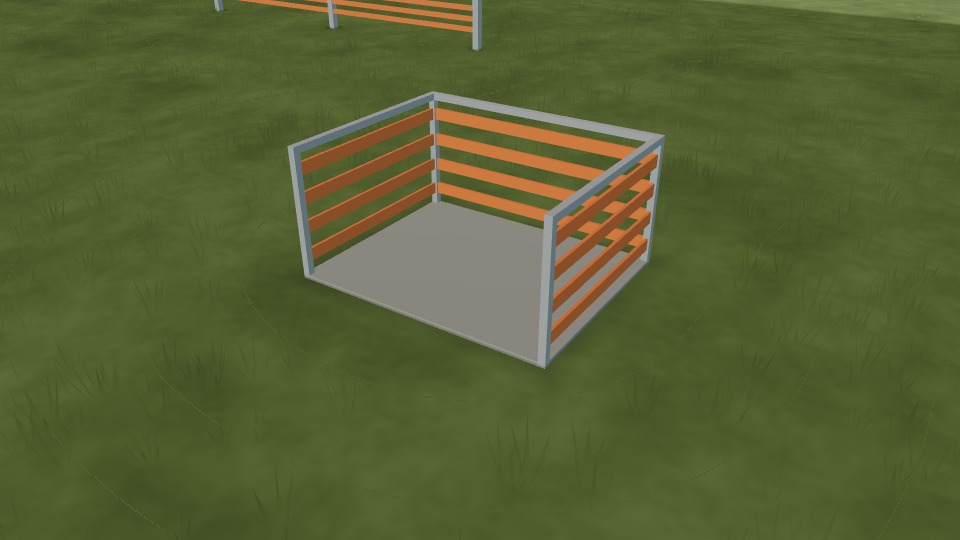

# L10d — soft contact grounding

**Status (2026-10-08): structural and rendered contact checks passed; human Gate L remains open.**

The windsock base, pilot pad and flightline posts now have small feathered contact footprints. A shared post-layout helper keeps each footprint aligned with the actual fence geometry. The fade reaches zero at the outer edge; maximum stored alpha is approximately 0.176. Sizes, opacity and colour are artistic estimates. These are local contact cues, not projected sunlight or physical ambient occlusion. See [design and geometry contract](design.md).



One merged transparent, depth-tested, unshaded mesh costs **1 draw and 1,278 triangles** for the default field. It uses no texture, collision, processing callback or shadow pass. Legacy fields without cues receive no extra node. Custom wider fences use proportionally more footprints; the maximum supported width stays below 2,500 triangles and retains every post footprint.

The focused test passes 20 checks on actual vertices, alpha ranges, placement, material, determinism and independent resources. Eighteen on/off images inspect windsock, station and fence bases in default, independent-repeat and scenery modes. The footprints darken the ground without brightening pixels; visible differences remain inside the near-clipped projected mesh bounds. PNG bytes and counters repeat exactly. Because the merged bounds can cross the camera plane, their screen rectangle may cover much of the image; structural tests establish each footprint's actual size.

[Capture report](evidence/shadows-summary.json) · [Integrated review, trace and pack checks](../L10c/README.md) · [Final capture checker results](../L10c/evidence/capture-check.json).

```bash
"$(app/tests/visual-env.sh)" tools/ground/check_windsock.py \
  --cue contact_shadows --app app --godot "$(app/get-godot.sh)" --out /tmp/l10d-review
```
