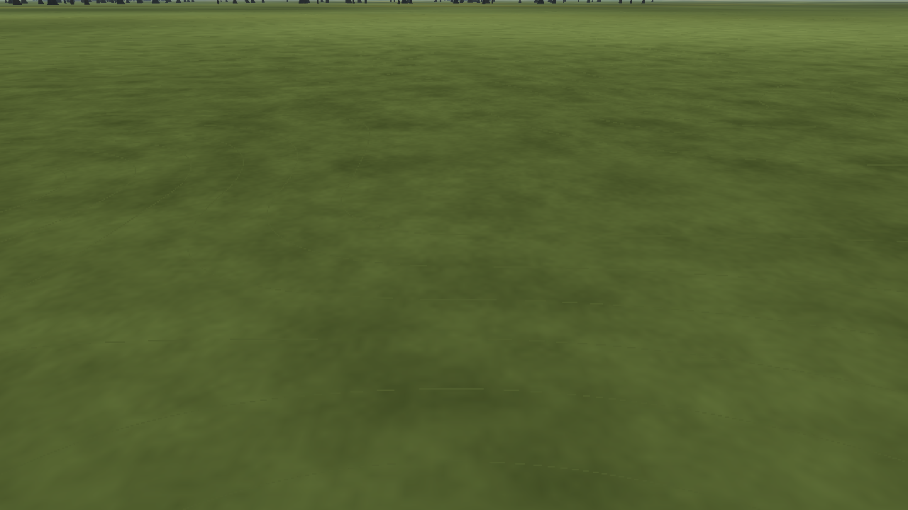
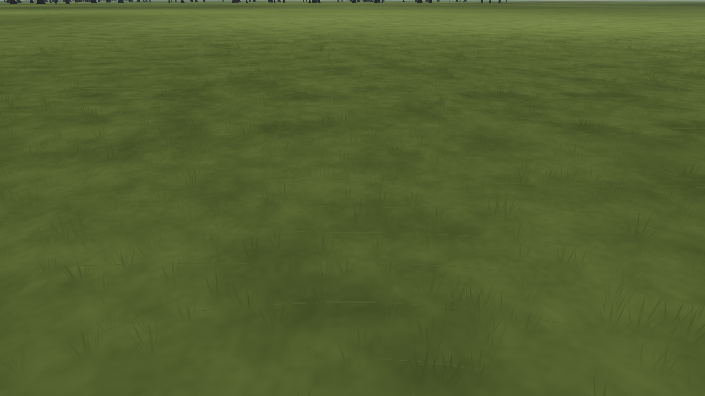

# L11a · Near-field grass and reused flowers

Date: 2026-10-07. **Status: engineering validation passed; owner/GPU acceptance remains open.** Canonical status: [LANDSCAPE-PLAN](../../../LANDSCAPE-PLAN.md). This implements the required near-field scope of [improvement Phase 7](../../landscape-improvement-2026-10-07/README.md).

## Scope and decisions

Seven opaque single-triangle blades form each clump. A committed integer recipe supplies 6,000 unique pilot-relative offsets in a 30 m disk; field construction removes groups outside rough ground or within 0.4 m of any runway/mown rectangle. The generator's density is proportional to 1/r beyond a capped 3 m core. Four quadrant MultiMeshes share one mesh/material, cast no shadows and have bounds expanded for sway. All dimensions, density and colour-tip adjustments are artistic estimates, not measured vegetation.

The ground's existing texture, anti-tiling, macro colour and pilot pin now live in `grass_surface.gdshaderinc`. The ground and blade fragments use that same function and the same texture resource. Upward normals and the existing Lambert direct-light calculation match the ground; cloud shadows and haze also reach the blades. Tips darken by at most 6%.

Geometry shrinks between 22 and 30 m using the greater of pilot planar distance and camera distance. At 30 m the whole triangle collapses; it does not leave a flat footprint that can z-fight. This is a fixed pilot-area patch, not a camera-following vegetation streamer. The distant chase view sees no near grass.

Sway uses the existing `sim_clock`/`wind_vec` globals, with zero amplitude at zero wind. The estimated maximum displacement is 0.035 m at 5 m/s. Frequency 256/1024 Hz closes across the clock wrap. UV.y is zero at roots and one at tips; the quadratic weight keeps roots fixed. Production wind remains zero until M5; this step does not change flight physics or introduce vegetation collision.

L11b reuses the existing SC-16 cushions and SC-17 borders/bushes through the single `Scenery.attach` hook. It creates no second flower asset, placement set or renderer. Scenery remains opt-in under Gate SC. Optional L9d photo detail is deferred as its plan requires a Gate L decision that procedural ground looks too synthetic.

## Evidence

| Proof | Result |
| --- | --- |
| [Headless suite](headless-tests.log) | Baseline and candidate exit 0; candidate 627.37 s. The new grass tests pass 37 checks. |
| [Flight and export integrity](validation.json) | All 721 trace samples unchanged; Linux, Windows and macOS exports pass pack checks. The Linux exported frame matches the editor PNG byte for byte. Native Windows/macOS execution was not tested. |
| [Guarded captures](capture-summary.json) | 28 candidate, 2 scenery and 12 baseline images per process, each repeated independently: all repeats byte-identical. All 12 candidate grass-off views match baseline. |
| Geometry and rendering cost | 4,843 clumps, four chunks, 33,901 total triangles. Sampled maximum: +2 draws and +20,552 submitted primitives. No runway instances; no changed pixels outside the projected grass envelope. |
| Distance fade | The 35 m elevated camera renders identical images with grass on/off. Compiled fade defaults are 22–30 m. |
| [Local seam check](seam-summary.json) | Maximum local mean channel change 0.2621%; FLIP p99 0.05971. A 148-pixel artificial dark seam is rejected at 6.71% and FLIP 0.239. |
| [Aircraft readability](readability-comparison.json) | 64 captures; all 48 pose metric dictionaries exactly match Phase 6. The existing fixed-ground-level mean ΔE 29.54 remains the only marginal case below 30. |
| [Lint](lint.json) | Zero errors, 12 existing warnings. |

| Before | After |
| --- | --- |
|  |  |

Validation used isolated baseline/candidate checkouts based on `f516ff208f50833b80c18f21c32411bce7c9b653`. At integration (`488bc6f`), concurrent app changes added two radio test scripts and their UIDs; runtime inputs were unchanged. No reset or stash was used in the shared repository. The complete `app/capture.sh` wrapper was not rerun as a single command: its L11a and L6c components ran independently, and shell syntax was checked. See [capture methodology](capture-tool.md) for the source guards, clock probes, reused flower checks and measurement limits.

## Reproduce

```sh
python3 tools/grass/place.py --check
python3 tools/grass/test_place.py
app/test.sh
"$(app/tests/visual-env.sh)" tools/grass/check_grass.py \
  --app app --godot "$(app/get-godot.sh)" --out /tmp/l11a-grass \
  --baseline-app /path/to/pre-L11a/app
"$(app/tests/visual-env.sh)" tools/grass/check_grass_seam.py \
  --captures /tmp/l11a-grass/candidate-repeat-1 --out /tmp/l11a-grass/seam-summary.json --self-test
```

## Sources and limits

The retained [Compatibility grass investigation](../../landscape-investigations/05-grass-rendering.md) supplies the opaque geometry choice, radius and draw budget. Godot documents [MultiMesh batching and whole-group culling](https://docs.godotengine.org/en/stable/tutorials/performance/using_multimesh.html) and the [spatial shader coordinate/built-in contract](https://docs.godotengine.org/en/stable/tutorials/shaders/shader_reference/spatial_shader.html). The installed 4.7.2 API was checked for `Shader.get_shader_uniform_list` and `MultiMesh.custom_aabb`; real engine captures check the shader path.

Software rendering can establish repeatability, resource integrity, seam statistics and render counters. It cannot establish target-GPU frame time, motion quality on the owner's display, or human aircraft readability. Gate L and Gate SC remain open.
