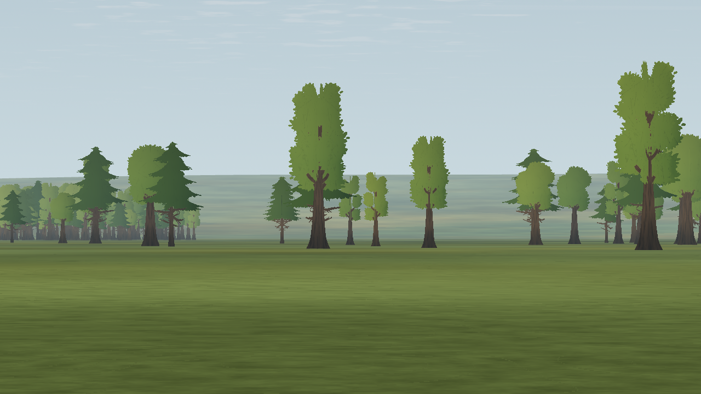

# L15b · Rooted tree sway

Date: 2026-10-08. **Status: rendering engineering-verified; M5 integration and owner/target-GPU acceptance remain pending.** Step prefix: **L**. Canonical status: [LANDSCAPE-PLAN](../../../LANDSCAPE-PLAN.md). This is a rendering preparation for [improvement Phase 8](../../landscape-improvement-2026-10-07/README.md), not delivery of physical wind.

## Scope

The existing 1,680 near/far trees consume `wind_vec` and `sim_clock`. Production still supplies zero wind until M5; this step adds no weather preset, random gusts, simulation loads or scenery changes. Grass already consumes these globals. Windsock, flowers, flags and bushes remain with their existing owners and M5 integration steps.

The current tree mesh consists of three crossed quads, six triangles. Its atlas padding extends below the trunk origin. Nonlinear height bending at only the top/bottom vertices would interpolate motion into that origin; adding subdivisions would change the mesh and risk calm-image parity. A small rigid rotation about the origin instead preserves every triangle, length and interpolated root. The crown centre used for lighting receives the same rotation. This is an intentionally limited card animation, not elastic branch/leaf simulation.

Estimated visual parameters: a 0.24 m centreline lean scale at 10 m/s, quadratic speed response capped above 10 m/s, and a wave multiplier from 0.5 to 1.0. Height selects 205–512 whole cycles per 1,024 seconds; the existing integer tree hash supplies phase. All phases close at the simulation-clock wrap. The horizontal render-frame air velocity points **to** the direction of motion; vertical wind is ignored by this visual response. The world-to-local conversion assumes the current orthonormal tree transforms (translation-only instances in the shipped field). There is no new CPU update per tree. Abrupt changes in supplied wind are not smoothed here; M5 owns the physical field and any future transient response.

The committed card dimensions give a maximum displacement bound of 0.288530 m, including transparent padding. Each sector's culling bounds include the full displacement sphere plus the existing 0.02 m rounding allowance. There are no additional triangles, batches, shadows, textures or third-party assets. `wind_enabled` is a material ablation for capture tools; the grass-only probe disables tree wind while varying the shared clock and wind.

At 1,280 × 720 with vertical FOV, the conservative 0.288530 m bound projects to approximately 0.56 pixels at 400 m / 50° and 2.97 pixels at 400 m / 10°. At the nearest tree (about 272 m), the bounds are 0.82 and 4.36 pixels. These are analytic peak offsets from calm, not measured apparent motion; the 0.5–1.0 multiplier produces roughly half that peak-to-peak range.

## Evidence

| Proof | Result |
| --- | --- |
| [Complete headless suite](headless-tests.log) | Exit 0 after the standalone registration fix (622.77 s); model, physics, UI, flight, trace and frame-rate checks included. |
| [Bounds and source record](validation.json) | 122,643 checks pass; all default card vertices fit the expanded sector bounds for every saturated wind direction/phase. |
| [Flight trace](trace-comparison.json) | All 721 samples match the frozen baseline, excluding creation timestamp. |
| [Runway comparison](runway-final-comparison.json) | All 51 image hashes, complete flight-state fields and render counters match the original frozen baseline. |
| [Exports](exports.log) | Linux, Windows and macOS pack checks pass, including field construction in an empty project. The Linux rendered frame matches the editor PNG byte for byte. Windows/macOS were not launched natively. |
| [Aircraft readability](readability-comparison.json) | 64 guarded captures; all 48 pose metric dictionaries exactly match L11a. The existing marginal fixed-ground-level mean ΔE 29.54 remains unchanged. |
| [Tree-wind capture](capture-summary.json) | 104 candidate images repeat across two processes; all eight calm views match baseline. All 16 east/west motion pairs and seven adjacent preview intervals move only inside the tree mask; renderer counters stay unchanged. |
| [GPU geometry probe](geometry-probe.json) | 201 samples exercise the production shader include; maximum displacement 0.288367 m, six pre-wrap deltas ≤ 0.000220 m. Corrupted-image and static-motion substitutions are rejected. |
| [Grass regression](grass-regression.json) | 28 grass and two scenery images repeat across processes; grass budgets and background isolation pass. |
| [Lint](lint.json) | Zero errors; 12 existing warnings. |

The empty-project export test caught a missing standalone shader-global registration. `Treeline.build` now registers the shared clock before compiling its material, just as the grass builder does. The runway, readability and export checks were repeated after that fix; production main already registered the same globals.

The GPU probe checks raw 1,024 s versus zero as well as the pre-wrap interval, independently of CPU clock wrapping. Root samples encode the same neutral bytes as calm; the decoded ~2.7 mm residual is 8-bit quantization, not measured root drift. Replayed and same-input snapshots prove deterministic rendering, not actual pause/restart lifecycle behavior. See the [capture contract](capture-tool.md).

[Open the sampled motion preview](preview/time-strip.html): eight fixed-camera images at 0.25 s intervals, shown once at their recorded cadence. Replay is explicit; the preview does not loop across a discontinuous cut.

| Calm | 10 m/s test wind |
| --- | --- |
|  |  |

## Reproduce

```sh
app/test.sh
"$(app/tests/visual-env.sh)" tools/trees/check_wind.py \
  --app app --godot "$(app/get-godot.sh)" --out /tmp/l15b-wind \
  --baseline-app /path/to/pre-L15b/app
```

The complete `app/capture.sh` wrapper was not run as a single invocation. Its affected components ran independently; the wrapper syntax and paths were checked. The capture wrapper uses a 600 s process budget for the larger tree-wind roster.

## Sources and limits

[GPU Gems 3, chapter 16](https://developer.nvidia.com/gpugems/gpugems3/part-iii-rendering/chapter-16-vegetation-procedural-animation-and-shading-crysis), §§16.1–16.1.1, distinguishes whole-plant motion from leaf detail and limits deformation around the plant origin. This implementation uses an independently written rigid rotation for sparse cards, rather than copying that chapter's nonlinear bend. The retained [vegetation investigation](../../landscape-improvement-2026-10-07/02-vegetation.md#6-wind-without-time-l15bc) explains the fixed-clock and crown-centre constraints.

Software OpenGL captures prove deterministic output and render counters, not frame time on the owner's GPU or subjective naturalness. Production wind, wind-changing transients, local spatial sampling, physical realism and full Phase 8 acceptance remain open under M5/Gate L. No human approval is inferred from a passing image comparison.
