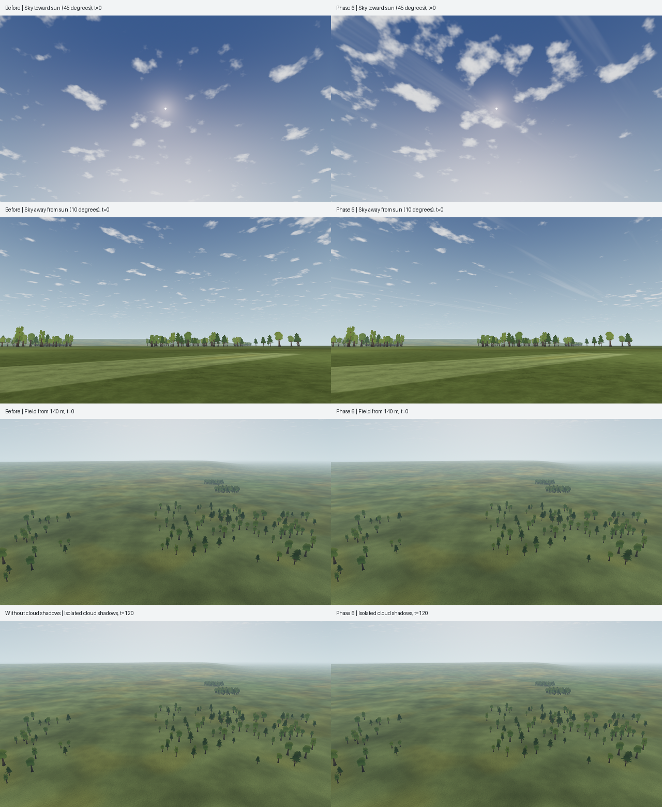

# L4b · Sky and light

Date: 2026-10-07. **Status: implemented and engineering-verified; Gate L review remains open.** Canonical step status: [LANDSCAPE-PLAN](../../../LANDSCAPE-PLAN.md). This implements Phase 6 of the [landscape improvement proposal](../../landscape-improvement-2026-10-07/README.md).

## Scope and review

Phase 5 / L7 already supplied distant forest, hills and visibility presets. Phase 6 extends the sky and adds ground cloud shadows. It keeps the existing sun, haze, exposure, terrain, field data and aircraft physics. Gate L remains a human readability and target-hardware decision.

- **Grouped cumulus:** a coarse coverage octave creates broader gaps in the existing five-octave cloud field. Both sky and ground use the same periodic integer-hash include.
- **Cirrus:** a second angular layer stretches the noise 17:1. It fades into the horizon and blends lightly over the sky.
- **Silver lining:** bounded forward scatter brightens partly transparent cloud edges near the sun.
- **Cloud shadows:** the ground projects toward an estimated 1,500 m deck and reduces direct sunlight by at most 22%. The global displacement reaches rough, mown and runway surfaces and follows the same quantized simulation time as the sky. Ambient light and haze are preserved. [L15d implementation and limitations](../L15d/README.md).
- **Grading:** an optional capture-only comparison uses brightness 1.0, contrast 1.04 and saturation 1.02. Production adjustment remains disabled; this experiment is not L6c acceptance of a global grade.

Production strengths are estimates in `Spec.ATMOSPHERE`: cluster 0.35, cirrus 0.12 and silver 0.18. The shader defaults are zero for controlled legacy comparisons. No external plugin, texture or dependency is added. [Sky details](sky.md).

## Evidence

Validation uses a frozen L7 baseline and a candidate containing only this visual change. Concurrent physics, radio and desktop-delivery work is excluded from that comparison; this task did not reset or stash the shared working tree.



| Check | Result and retained proof |
| --- | --- |
| Production sky/shadow A/B | 94 candidate captures and 30 baseline captures; all repeats byte-identical. Zero-strength candidate matches frozen L7 in 15/15 views. Shadow-off controls change 229,058 / 317,629 ground-crop pixels at 0 / 120 s. [Summary](capture-summary.json), [method](capture-tool.md) |
| Final initialization correction | Registering the global before assigning the ground shader fixes standalone field/pack construction. All 15 enhanced views remain byte-identical. [Parity](initialization-parity.json) |
| Feature ablation | Cirrus and silver lining each change the intended views at production strengths; silver has no effect in the antisun control. [Results](sky-feature-ablation.json), [figure](sky-feature-ablation.png) |
| Cloud density and projection | Two GPU atlases match byte for byte; period and projection error ≤ 1/255, drift-wrap max 5/255, no range failures. Wrong-sign mutation rejected. [L15d probe](../L15d/probe.md) |
| L6c readability | 64 captures, 48 attitude metrics, 24-image blind kit. No new mean-ΔE failures; the existing fixed-ground-level case remains marginal (29.45 → 29.54, threshold 30). Game minimum 43.45; worst p10 8.82, maximum low-contrast share 18.52%. [Before](readability-before.json), [after](readability-after.json) |
| L7 horizon | 42 views repeated twice; byte-identical, maximum rim step 3.992/4 RGB levels, 1–6 forest draws. [Summary](horizon-summary.json) |
| Original L1–L4 reference | 29 captures pass haze, rim, sun, aircraft-shadow and readability gates. Sky drift changes 9,756 pixels; ground ≤ 1 level. The fixture disables cloud shadows to retain its sky/radiance isolation; production shadows have their own control. [Log](reference-captures.log) |
| Physics and runway scenario | All 721 trace samples and metadata except creation time unchanged. Scenario: 51 visually changed frames, no state changes; sync and takeoff checks pass. [Comparison](scenario-comparison.json), [sync](scenario-sync.json) |
| Exports | Linux, Windows and macOS exports and existing pack checks pass. Exported Linux frame is byte-identical to its editor capture. Windows/macOS were not run natively. [Log](exports.log), [validation](validation.json) |
| Full headless suite | `app/test.sh` exits 0 (452.9 s), with no engine/check errors; all 46 atmosphere checks pass. Final states at 30/60/144 FPS match. [Log](headless-tests.log), [validation](validation.json) |
| Static checks | Linter: 0 errors, 12 existing warnings before and after. `git diff --check` and shell syntax pass. |

The final source hashes are in [validation.json](validation.json). The late initialization-order fix and reference-fixture isolation were tested on the final export snapshot; the guarded visual candidate stayed frozen, and the 15-view parity check connects both snapshots. This task made no shared-tree commit; parallel work may commit the shared tree independently. All captures use Compatibility/llvmpipe; they do not measure target-GPU performance.

The retained tools are [documented in the repository](../../../../tools/atmosphere/README.md). Production captures are wired into `app/capture.sh`; their summaries and hashes are part of the complete-run manifest. The reference, atmosphere, probe, readability, horizon and scenario checks were run separately during this step, not as one complete `app/capture.sh` invocation.

## Storage cleanup

The owner requested removal of obsolete repository outputs after the disk filled during validation. Removed 1,636,841,107 bytes (1.64 GB): old captures/logs, stale release builds, the archived three.js prototype's installed dependencies, and 1,156 obsolete imported capture textures. Tracked code, research, aircraft references, worktrees and active dependencies were preserved. [Inventory](storage-cleanup.json).

The retained [compressed reports](removed-capture-reports.tar.xz) contain 1,013 files, including small reports and a bounded excerpt of the old repeated-error log; all archive members were read back. `capture.sh` now creates `captures/.gdignore` before import. A fresh clone produced 29 PNGs with no capture import sidecars. Failed disk-full runs were discarded and successful checks rerun.

## Reproduce

```sh
app/test.sh
"$(app/tests/visual-env.sh)" tools/atmosphere/check_phase6.py \
  --app app --godot "$(app/get-godot.sh)" --out /tmp/l4b-atmosphere --grading
"$(app/tests/visual-env.sh)" tools/atmosphere/check_cloud_probe.py \
  --app app --godot "$(app/get-godot.sh)" --out /tmp/l15d-cloud-probe
"$(app/tests/visual-env.sh)" app/tests/treeline_readability.py capture \
  --app app --godot "$(app/get-godot.sh)" --out /tmp/l4b-readability
```

`check_phase6.py --baseline-app /path/to/frozen/app` also compares the zero-strength candidate against the earlier implementation. That check caught an unwanted ground lighting change during development; restoring the original Lambert fallback fixed the cause. A shader's default path must be checked against the pinned renderer, not inferred from `StandardMaterial3D` defaults.

Full dynamic wind integration remains M5-W04b work. The sky is still an angular layer without chase-camera parallax; this step does not add volumetric clouds or measured weather. Software-renderer captures establish correctness and repeatability, not target-GPU frame times or human acceptance.
