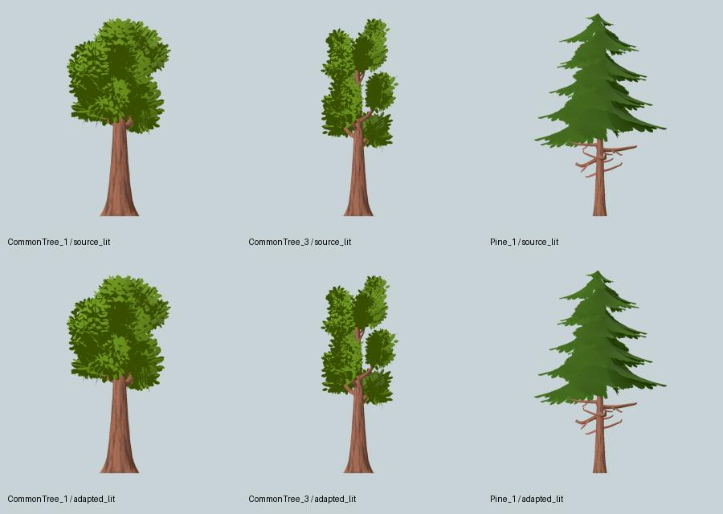
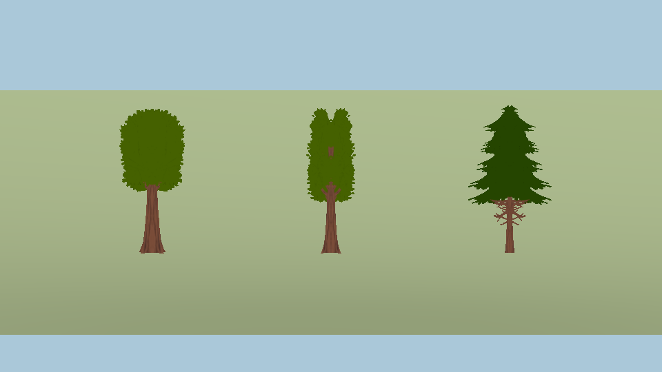

# L6a — fuentes de árboles, atlas y contrato de importación

## Resultado

Tres siluetas de Quaternius Standard sustituyen a la propuesta Kenney tras la [comparación de recursos y licencias](../../tree-resource-review-2026-10-06/README.md): copa ancha, copa estrecha y pino. La geometría detallada se utiliza exclusivamente para autoría offline; el juego recibe un atlas 1024², catálogo, licencia y una factory de cards de seis triángulos/una superficie. **La arboleda aún no está colocada en Inicio ni en vuelo**: L6b es el siguiente paso, y L6c conserva el playtest humano.

Estas cards son una representación lejana. Su albedo no contiene la luz direccional del render de referencia, ni un mapa de normales geométricas; las copas se ven más planas de cerca que la fuente 3D. No se presentan como árboles próximos acabados.

## Fuente y presupuesto

`assets/landscape/PROVENANCE.json` enlaza URL, upload ID, SHA del ZIP, archivos fuente, licencia, receta y SHA del runtime. El ZIP Standard exacto incluye CC0; la licencia general actual del autor es distinta, por lo que no se aplica esta conclusión a otros paquetes. No se publica el ZIP completo.

Los modelos fuente tienen 6.265, 3.505 y 3.947 triángulos. Se cambia el límite de **autoría offline** a 10k, manteniendo seis triángulos por card lejana y el límite inicial de 1k para futuros LOD cercanos L8. No se exportan GLB, texturas fuente ni dependencias npm. Altura canónica 1 m, base en Y=0 y centro X/Z; las alturas físicas de colocación se decidirán como estimaciones en L6b.

## Evidencia técnica

- [Validación Khronos](gltf-validation.json): cero errores en cada GLB adaptado. Se corrige únicamente el pequeño exceso de COLOR_0 del original (máximo 1.00016785 → 1). Se conserva y revisa el warning de tangentes generadas para el normal map del tronco; Godot las genera al cargar.
- [A/B de alpha y color](atlas-analysis.json): mismas cámaras y encuadre de fuente/derivado; umbral IoU >=0.995. Albedo MAE <=0.05/255 y <=0.1% de píxeles comunes con diferencia >2 niveles. Se reportan los máximos y no se ocultan los pocos píxeles de oclusión que cambian al normalizar float32. Estos umbrales son decisiones de ingeniería, no un estudio perceptual.
- [Repetición](repeatability.json): dos proyectos nuevos, **26 archivos derivados y 12 PNG crudos idénticos byte a byte**. [Manifiesto de entradas y salidas](bake-manifest.json). Entorno Godot 4.7.2, Compatibility, Mesa llvmpipe, LP_NUM_THREADS=1; no se promete igualdad entre GPUs.
- [Mips](mip-analysis.json): once niveles inspeccionados; las tres siluetas sobreviven a cutoff 0.5 al menos hasta 32 px por celda (mip 4), sin alpha en el cuarto slot reservado a esos niveles. Los niveles más pequeños se registran, pero no garantizan una silueta reconocible. [Mip 0](mip-00.jpg), [mip 2](mip-02.jpg), [mip 4](mip-04.jpg).
- [Nueve pruebas CPU](atlas-tests.log): cobertura/straight-alpha, inputs corruptos, recorte, cambio de silueta/color y repetición. [60 comprobaciones runtime](tree-tests.log): catálogo, mipmaps, transparencia, UV, una superficie/seis triángulos, recursos independientes y pie del tronco dentro de un texel del suelo.
- [Cuatro rotaciones de cards](cards-000.png): [30°](cards-030.png), [60°](cards-060.png), [90°](cards-090.png). Sin alpha blend ni sombras de card.

## Diagnóstico del horneado

Un prototipo basado en importación de editor asignaba mipmaps diferentes a PNG externos y embebidos. Igualar esas opciones resolvió la mayor parte del A/B, pero persistían pequeñas diferencias del pino al importar proyectos desde cero. Cuatro capturas de un mismo proyecto importado fueron idénticas: el problema estaba en esa ruta de importación, no en variar la cámara entre frames.

La receta final elimina esa dependencia: empaqueta una referencia sin cambios geométricos y el derivado en GLB; los carga con `GLTFDocument`, imágenes embebidas sin compresión, geometría completa, atributos sin compresión y mipmaps explícitos. La pareja de proyectos nuevos verifica la corrección. No se afirma haber aislado una línea interna defectuosa del editor. El atlas **sí** se valida mediante la importación y exportación normales de la app.

## Reproducir y límites

Ver [tools/trees/README.md](../../../../tools/trees/README.md). Tras dos ejecuciones, usar `python3 tools/trees/verify_bakes.py /tmp/tree-bake-A /tmp/tree-bake-B`. El runner falla con entradas diferentes o bytes distintos. La normalización/atlas ocurre fuera de `app/`; solo se copian productos revisados.

La factory desplaza el marco transparente alrededor del pivote, de modo que el tronco visible queda en el suelo. Colocar la base del quad en cero haría flotar el árbol por el padding. L6b debe compartir un mesh por variedad entre sectores, desactivar sombras de cards y medir superficies/pases. El atlas no decide posiciones, densidad, claros ni perfiles de calidad.

**Cierre técnico:** [suite completa en el árbol compartido](headless-shared.log), preservando la actualización concurrente del P-51; [suite completa desde clon limpio](headless-clean.log), [export Linux/Windows/macOS y smoke de vuelo Linux](export-clean.log), [atlas y mipmaps cargados de los tres packs desde un proyecto vacío](pack-mips.log). La revisión añadió rechazo de tamaños booleanos y la comprobación explícita de mips empaquetados. [Linter](lint.json): cero errores, las mismas diez advertencias previas. [Mutación de atlas en copia temporal](repeat-mutation.json): el verificador rechaza bytes que no coinciden con el manifiesto. Los exports usan un commit temporal de validación, no son una publicación ni un commit de la rama compartida. La medición de GPU real y la lectura del avión ante árboles siguen pendientes de L6b/L6c; no se han cambiado física ni golden flights.
