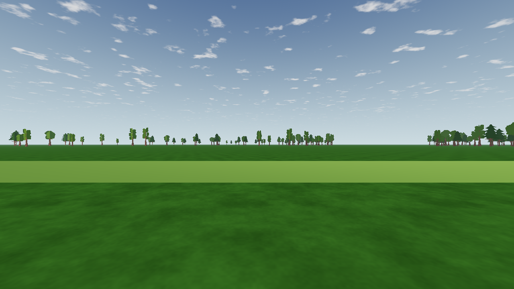

# L6b — arboleda reproducible en Inicio y vuelo

480 árboles del atlas L6a aparecen en el campo compartido: dos frondosas y un pino, con altura estimada de 12–25 m. La distribución offline mantiene claros a 30° y 210°, el corredor este-oeste de pista y ocho sectores de render. No introduce colisiones, relieve ni fuerzas aerodinámicas; la vegetación sigue siendo visual hasta L14. **L6c es el siguiente paso: legibilidad del avión y aceptación humana.**

[Inicio](ui-home-en.png) · [claro de 30°](gap030.png) · [claro de 210°](gap210.png) · [planta de los ocho sectores](overhead.png). Las vistas amplias muestran las cards lejanas, no mallas cercanas aprobadas para L8.

## Datos y contrato

`app/data/fields/default.json` conserva `openrc-field v1`. `objects` admite cero o una arboleda con `{id, type: "treeline", collides: false, positions: {value, unit, kind, source}}`. Cada fila de `value` contiene `[north, east, down]` en metros **relativos a la estación del piloto**; no guarda escala, rotación ni especie. `kind=derived` y `source` identifican la receta y sus estimaciones. Los campos sin objetos siguen admitidos.

`tools/trees/place.py` genera 480 posiciones, semilla 610602, cuadrícula de 0,25 m, radio de 270–570 m y separación mínima de 9 m. Usa densidad irregular para evitar una plantación uniforme. Los claros deliberados incluyen 15 m adicionales para la copa completa. Son decisiones artísticas de este campo, no medidas topográficas ni normas AMA/BMFA.

El loader admite 1–800 posiciones, radio 250–600 m, rejilla de 0,25 m y suelo plano. Rechaza duplicados, booleanos, números no finitos, claves desconocidas, metadata incompleta y `collides=true`. La envolvente de 15 m debe caber en una superficie rough; todas las franjas runway/mown excluyen un corredor infinito este-oeste de semiancho `width/2 + 35 + 15 m`. La validación ocurre antes de crear Inicio o simulación. La estación debe tener down=0 y norte/este dentro de ±1.000.000 m cuando haya árboles.

SHA-256 de las posiciones serializadas en JSON compacto: `9b42b61ff36e5df25ef0245702e4d75965ea805f81de56a1c353fd1f0c722875`. [Receta comprobada](placement.json). `python3 tools/trees/place.py --check` falla si el resultado comprometido difiere; se ejecuta en `app/test.sh`.

## Render y coste

- Ocho `MultiMeshInstance3D`, un mesh/material compartido dentro de cada campo, una superficie y seis triángulos por instancia. Cada nueva escena posee sus recursos mutables. El atlas se comparte como textura.
- Shader sin reloj ni RNG: coordenadas → hash entero → especie, altura y giro. Se observan 168 CommonTree_1, 159 CommonTree_3 y 153 Pine_1. Se mantiene la posición/base visible del atlas de L6a.
- `custom_aabb` incorpora todos los vértices después de escala/giro, incluido padding transparente bajo suelo, más 2 cm para redondeo float32. No hay actualización por frame ni selección dependiente de un perfil de calidad.
- [Medición de viewport](review.json): 4 draws de vegetación en las ocho vistas cardinales, 2 en cada vista de claro y **8 en la vista cenital con todos los sectores**, frente al límite de 24. Se mide por diferencia, mismo viewport/cámara con y sin arboleda. **0 draws de sombras de vegetación**, también con sombras nativas activadas en la auditoría. No se equipara este conteo con FPS o coste de fragmentos.
- 13 PNG y reportes idénticos en dos procesos con Godot 4.7.2 Compatibility, Mesa llvmpipe y LP_NUM_THREADS=1. No se promete identidad entre GPUs ni rendimiento en RTX 3090.

## Fallo encontrado y corregido

La primera lectura GPU encontró identidades distintas: [MultiMesh guarda custom data en 16 bits en Compatibility](https://docs.godotengine.org/en/stable/classes/class_multimesh.html#class-multimesh-method-set-instance-custom-data). Las coordenadas en metros perdían los cuartos de metro a ciertas distancias. Se sustituyeron por cuatro componentes enteros de 0–255 que codifican las dos coordenadas cuantizadas; el shader recupera las mismas posiciones y calcula la identidad. No se guarda apariencia aleatoria en el JSON.

El probe usa la función del shader real y la ruta real de MultiMesh para los 480 puntos. Lee especie, altura y giro como bits blanco/negro, evitando confundir la transferencia de color de un framebuffer con una discrepancia de hash. Las 480 especies coinciden; error máximo de lectura cuantizada de altura 0,000487 m y giro 0,000123 rad. En headless, los getters de instancias del renderer dummy no son evidencia GPU: allí se comprueban posiciones/bounds desde datos; el mismo test con OpenGL verifica transformaciones y bytes reales.

## Verificación y reproducción

- `app/test.sh`: validación de receta, loader, árboles, transición real Inicio → Volar, regresión física y golden flights.
- `app/capture.sh`: importa recursos desde un clon sin caché, conserva las referencias congeladas de atmósfera y añade `tools/trees/check_review.py`; dos revisiones, validación de contadores, identidad y repetibilidad, más pruebas de instancia/bounds en OpenGL. La revisión queda enlazada desde el manifiesto general.
- Revisión aislada: `python3 tools/trees/check_review.py --app app --godot "$(app/get-godot.sh)" --out /tmp/l6b-review`.
- Export Linux/Windows/macOS desde clon nuevo: cada pack se monta desde un proyecto vacío y construye los ocho sectores y las 480 instancias, además de verificar atlas/mips/licencia. El binario Linux pasa la prueba de vuelo trimado; no equivale a ejecutar Windows/macOS.

[Atmósfera norte sin cambios frente a una captura nueva anterior a L6b](atmosphere-parity.json), [suite completa](headless-work.log), [suite desde clon limpio](headless-clean.log), [export y smoke de los tres packs](export-clean.log), [render del binario Linux](openrc-l6b-export-field.png), [9.177 comprobaciones con OpenGL](runtime-gpu.log), [linter sin errores](lint.json), [repetición](repeatability.json) y [mutación de posiciones rechazada](placement-mutation.json). Los commits de los builds son snapshots temporales de validación, no commits ni publicaciones en la rama compartida.

La primera matriz de cierre fue descartada por la guarda de entradas: el plan cambió durante su ejecución. La tanda final se realiza desde un clon congelado, sin editar sus entradas durante las capturas. La comprobación se conserva activa.

El clon sin caché detectó otra dependencia oculta: las capturas necesitaban que tests/editor hubieran importado el atlas. `app/capture.sh` y la revisión aislada ahora importan los recursos antes de ejecutar sus guardas y renders; rechazan cualquier error del motor.

**Cierre final:** [capturas desde clon sin caché](capture-clean.log), [manifiesto del conjunto](capture-set.json), [resumen de las 66 vistas VQ-01b](visual-quality-summary.json) y [métricas piloto registradas](pilot-readability.json). Se completan las 112 capturas existentes más las 13 vistas L6b repetidas dos veces y los tests GPU de instancias. El rendimiento en hardware del propietario y la aceptación humana de L6c siguen pendientes.

Integración en el árbol compartido: [8.217 comprobaciones de árboles y transición Inicio → Volar, cero fallos](headless-shared.log); archivos instalados verificados byte a byte contra la copia validada.
