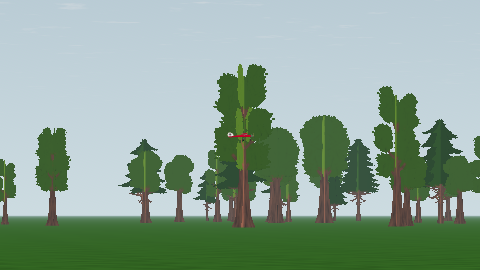

# L6c — lectura del avión ante los árboles: números registrados y kit del playtest

2026-10-06 · Godot 4.7.2 · Compatibility · 1280 × 720 · Linux/Mesa llvmpipe, `LP_NUM_THREADS=1`. **Lectura humana pendiente del propietario**: las capturas no la sustituyen (plan §8). Los números van a Gate L; esta entrega no fija umbrales de aceptación ni cambia la arboleda.

[Borde de copas, cuchillo](game-horizon-knife_left.png) · [hierba, invertido](game-ground-inverted.png) · [cielo, picado](game-sky-dive.png). Son recortes a 1:1 de las capturas de 1280 × 720; las 64 completas se regeneran con `app/capture.sh` en `app/captures/l6c/`.

## Qué se mide y cómo

`tests/treeline_readability.py capture` renderiza **64 casos fijos** con el fixture de inspección sintética de VQ-01b: el Ugly Stik a **100 m de los ojos del piloto**, de lado, morro a la derecha, en **seis actitudes** (horizontal, invertido, cuchillo izquierdo/derecho, 45° arriba, 45° abajo) ante **cuatro fondos**, en **dos vistas**:

| Fondo | Elevación del CG sobre los ojos | Qué hay detrás (medido en la imagen) |
| --- | ---: | --- |
| `sky` | 10° | el cielo de VQ-01b, por encima de las copas |
| `horizon` | 4,1° | el borde de las copas: parte cielo, parte árbol |
| `trees` | 2,3° | copas de la arboleda L6b, sin huecos |
| `ground` | −0,5° | hierba (CG a 0,83 m; la punta del ala en cuchillo queda a 7 cm); los troncos de 300 m asoman tras las filas altas |

| Vista | Autozoom | FOV vertical | Qué representa |
| --- | --- | ---: | --- |
| `game` | sí (por defecto en el juego) | 20,7° | lo que ve el piloto: la envergadura cubre ~30 px |
| `fixed` | no | 50° | el fixture de 50° de L0c/VQ-01b, comparable con los números de 30 m y 3 m |

Por fondo y vista se capturan además dos referencias con el avión oculto: con arboleda (`-noplane`) y sin arboleda (`-notrees`, nuevo `--hide_treeline`, que falla si el campo no tiene objetos que ocultar). La diferencia avión/sin avión da la máscara del avión (L0c); la diferencia con/sin árboles da la **máscara exacta de árboles**; la fila del horizonte sale de la transformación real de la cámara registrada en la evidencia. Con eso cada caso informa de **qué rodea al avión** (árboles / cielo / suelo en el anillo de 6 px) y el runner rechaza un caso cuyo anillo no sea mayoritariamente el fondo que dice (cielo ≥ 90 %, árboles ≥ 60 %, suelo ≥ 60 %, borde ≥ 15 % de cada). Son guardas de identidad del caso, no umbrales de calidad.

Métrica por caso, igual que L0c más dos campos: píxeles del avión, contraste de Weber medio respecto al anillo, fracción de píxeles del avión con |contraste local| < 0,1 («casi invisible»), ΔE76 medio y **ΔE p10** (el decil más bajo: la parte del avión que peor se separa), caja en píxeles y composición del fondo. Todo en `readability-trees.json`; la evidencia nativa de cada captura registra elevación, azimut, visibilidad de árboles, FOV real y transformación de cámara.

## Por qué el azimut 9° y no el norte

El fixture VQ-01b pone el avión al norte (azimut 0). Dos renders anchos (50° de FOV, con y sin árboles, a 1,6° de elevación) hacia el norte y hacia el sur, medidos columna a columna en ventanas de 13 px (la envergadura a 100 m) sobre la banda 0,4°–2,6° de elevación, dan:

| Dirección | Desplazamiento de azimut | Cobertura de árboles | Banda sólida (≥ 90 %) |
| --- | ---: | ---: | --- |
| norte | +0,5° | 0,87 | 1,0°–3,6° |
| norte | **+8,8°** | **0,99** | **0,5°–4,1°** |
| norte | −10,9° | 0,91 | 0,9°–2,3° |
| norte | +11,5° | 0,94 | 0,9°–2,6° |
| sur | +1,9° | 1,00 | −0,1°–2,6° |
| sur | −4,4° | 0,97 | −0,2°–3,0° |

Al norte exacto el avión a 1,6° cae en el borde de un árbol con cielo a su izquierda (49 % árboles / 51 % cielo en la vista del juego; barrido en `azimuth-sweep.json`). El sur es denso pero mira al sol (azimut 225°): avión a contraluz, otro caso que no conviene mezclar con los tres fondos restantes. **Azimut 9°**: misma luz que VQ-01b y una banda sólida de 0,5° a 4,1° que da los cuatro fondos sin cambiar de dirección. Todo esto son valores de diseño sobre la arboleda L6b comprometida; si cambia la distribución, repetir el barrido.

## Resultados

Lectura de las tablas (todo medido en llvmpipe; no es rendimiento ni aceptación humana):

- **Ante los árboles el Stik es más claro que el fondo**, no «rojo sobre verde a −0,18»: Weber +0,61…+0,74 en la vista del juego, ΔE ≥ 55. Las cards L6b son más oscuras que el avión iluminado de frente.
- **El par débil en luminancia es horizontal sobre hierba**: el ala roja vista desde algo más arriba deja un 25 % de píxeles casi invisibles (|contraste local| < 0,1) aunque el Weber medio sea +0,78 (lo elevan las partes blancas); lo rescata ΔE 56 (p10 13), como predijo la investigación 09.
- **En el borde de copas el contraste medio se anula** (−0,13…−0,34): cielo claro y árboles oscuros se compensan en el anillo. Cada píxel sigue separándose (≤ 11 % casi invisible, ΔE ≥ 47). En el fixture de 50° (avión de 24–55 px, no 94–291) el mezclado de píxeles anula el Weber medio también ante árboles y hierba, con ΔE ≥ 31. **En fondos mixtos o blancos pequeños, juzgar por ΔE y su decil bajo, no por el contraste medio.**
- El peor ΔE p10 es 9–10 (cielo y borde de copas: las partes blancas de la librea contra la bruma clara), el mismo punto débil que L1b encontró a 3 m.
- Vista del juego frente al fixture: el autozoom multiplica por ~4 los píxeles del avión y mantiene los ΔE 10–20 puntos más altos; es la vista que ve el piloto y la del kit.

**Umbrales propuestos para Gate L**, deducidos de estos números con margen y pendientes de la lectura humana: ΔE medio ≥ 40 en la vista del juego y ≥ 30 en el fixture de 50°; ΔE p10 ≥ 8 en todos los casos; fracción casi invisible ≤ 30 % como aviso (no como fallo: en el par rojo/verde la separación es cromática). No sustituyen a los umbrales L1b de 30 m y 3 m, que siguen vigentes en `capture.sh`.

### Vista game

| Fondo | Actitud | px | Weber | casi invisible | ΔE medio | ΔE p10 | árboles / cielo / suelo alrededor |
| --- | --- | ---: | ---: | ---: | ---: | ---: | --- |
| sky (10°) | level | 119 | -0.51 | 8 % | 48 | 9 | 0 / 100 / 0 % |
| sky (10°) | inverted | 119 | -0.47 | 7 % | 44 | 9 | 0 / 100 / 0 % |
| sky (10°) | knife_left | 286 | -0.52 | 5 % | 58 | 11 | 0 / 100 / 0 % |
| sky (10°) | knife_right | 288 | -0.52 | 6 % | 56 | 11 | 0 / 100 / 0 % |
| sky (10°) | climb | 115 | -0.47 | 7 % | 44 | 10 | 0 / 100 / 0 % |
| sky (10°) | dive | 121 | -0.47 | 12 % | 44 | 10 | 0 / 100 / 0 % |
| horizon (4.1°) | level | 106 | -0.15 | 8 % | 50 | 9 | 70 / 30 / 0 % |
| horizon (4.1°) | inverted | 106 | -0.19 | 8 % | 54 | 11 | 68 / 32 / 0 % |
| horizon (4.1°) | knife_left | 289 | -0.27 | 5 % | 64 | 19 | 62 / 38 / 0 % |
| horizon (4.1°) | knife_right | 290 | -0.29 | 6 % | 63 | 20 | 62 / 38 / 0 % |
| horizon (4.1°) | climb | 104 | -0.13 | 7 % | 54 | 10 | 78 / 22 / 0 % |
| horizon (4.1°) | dive | 104 | -0.34 | 11 % | 47 | 9 | 54 / 46 / 0 % |
| trees (2.3°) | level | 101 | +0.69 | 12 % | 56 | 14 | 100 / 0 / 0 % |
| trees (2.3°) | inverted | 101 | +0.74 | 8 % | 56 | 14 | 100 / 0 / 0 % |
| trees (2.3°) | knife_left | 288 | +0.70 | 5 % | 65 | 31 | 100 / 0 / 0 % |
| trees (2.3°) | knife_right | 291 | +0.69 | 7 % | 65 | 31 | 100 / 0 / 0 % |
| trees (2.3°) | climb | 99 | +0.61 | 8 % | 55 | 13 | 100 / 0 / 0 % |
| trees (2.3°) | dive | 102 | +0.63 | 6 % | 55 | 13 | 100 / 0 / 0 % |
| ground (-0.5°) | level | 97 | +0.78 | 25 % | 56 | 13 | 14 / 0 / 86 % |
| ground (-0.5°) | inverted | 99 | +0.85 | 14 % | 58 | 12 | 19 / 0 / 81 % |
| ground (-0.5°) | knife_left | 289 | +0.70 | 7 % | 65 | 30 | 26 / 1 / 73 % |
| ground (-0.5°) | knife_right | 290 | +0.68 | 7 % | 65 | 29 | 26 / 1 / 73 % |
| ground (-0.5°) | climb | 94 | +0.75 | 9 % | 58 | 14 | 17 / 0 / 83 % |
| ground (-0.5°) | dive | 94 | +0.71 | 13 % | 53 | 12 | 34 / 1 / 66 % |

### Vista fixed

| Fondo | Actitud | px | Weber | casi invisible | ΔE medio | ΔE p10 | árboles / cielo / suelo alrededor |
| --- | --- | ---: | ---: | ---: | ---: | ---: | --- |
| sky (10°) | level | 28 | -0.46 | 11 % | 36 | 11 | 0 / 100 / 0 % |
| sky (10°) | inverted | 27 | -0.42 | 19 % | 34 | 10 | 0 / 100 / 0 % |
| sky (10°) | knife_left | 55 | -0.50 | 5 % | 50 | 17 | 0 / 100 / 0 % |
| sky (10°) | knife_right | 54 | -0.44 | 6 % | 46 | 14 | 0 / 100 / 0 % |
| sky (10°) | climb | 27 | -0.43 | 7 % | 34 | 11 | 0 / 100 / 0 % |
| sky (10°) | dive | 28 | -0.41 | 11 % | 31 | 10 | 0 / 100 / 0 % |
| horizon (4.1°) | level | 27 | -0.40 | 4 % | 32 | 11 | 47 / 53 / 0 % |
| horizon (4.1°) | inverted | 26 | -0.46 | 8 % | 40 | 11 | 47 / 53 / 0 % |
| horizon (4.1°) | knife_left | 54 | -0.41 | 0 % | 57 | 25 | 48 / 52 / 0 % |
| horizon (4.1°) | knife_right | 54 | -0.41 | 6 % | 54 | 17 | 47 / 53 / 0 % |
| horizon (4.1°) | climb | 26 | -0.53 | 4 % | 41 | 13 | 55 / 45 / 0 % |
| horizon (4.1°) | dive | 27 | -0.39 | 7 % | 35 | 10 | 47 / 53 / 0 % |
| trees (2.3°) | level | 24 | -0.05 | 4 % | 37 | 11 | 91 / 9 / 0 % |
| trees (2.3°) | inverted | 24 | -0.05 | 4 % | 41 | 13 | 92 / 8 / 0 % |
| trees (2.3°) | knife_left | 54 | +0.17 | 7 % | 59 | 30 | 92 / 8 / 0 % |
| trees (2.3°) | knife_right | 54 | +0.22 | 9 % | 56 | 26 | 92 / 8 / 0 % |
| trees (2.3°) | climb | 25 | +0.32 | 0 % | 40 | 11 | 99 / 1 / 0 % |
| trees (2.3°) | dive | 25 | +0.27 | 0 % | 41 | 13 | 97 / 3 / 0 % |
| ground (-0.5°) | level | 24 | +0.11 | 4 % | 34 | 11 | 21 / 5 / 75 % |
| ground (-0.5°) | inverted | 24 | +0.06 | 8 % | 35 | 11 | 20 / 6 / 74 % |
| ground (-0.5°) | knife_left | 54 | -0.09 | 7 % | 58 | 26 | 20 / 13 / 67 % |
| ground (-0.5°) | knife_right | 54 | -0.04 | 2 % | 56 | 20 | 20 / 13 / 67 % |
| ground (-0.5°) | climb | 25 | -0.03 | 16 % | 39 | 10 | 17 / 6 / 77 % |
| ground (-0.5°) | dive | 25 | -0.19 | 12 % | 35 | 11 | 24 / 12 / 64 % |

### Resumen por grupo

| Vista | Fondo | FOV | px min–max | Weber min…max | \|Weber\| min | casi invisible max | ΔE min | ΔE p10 min |
| --- | --- | ---: | ---: | ---: | ---: | ---: | ---: | ---: |
| game | sky | 20.7° | 115–288 | -0.52…-0.47 | 0.47 | 12 % | 44 | 9 |
| game | horizon | 20.7° | 104–290 | -0.34…-0.13 | 0.13 | 11 % | 47 | 9 |
| game | trees | 20.7° | 99–291 | +0.61…+0.74 | 0.61 | 12 % | 55 | 13 |
| game | ground | 20.7° | 94–290 | +0.68…+0.85 | 0.68 | 25 % | 53 | 12 |
| fixed | sky | 50.0° | 27–55 | -0.50…-0.41 | 0.41 | 19 % | 31 | 10 |
| fixed | horizon | 50.0° | 26–54 | -0.53…-0.39 | 0.39 | 8 % | 32 | 10 |
| fixed | trees | 50.0° | 24–54 | -0.05…+0.32 | 0.05 | 9 % | 37 | 11 |
| fixed | ground | 50.0° | 24–54 | -0.19…+0.11 | 0.03 | 16 % | 34 | 10 |

## Kit del playtest humano (pendiente)

`app/captures/l6c/kit/` (copiado en [kit/](kit/)): las 24 imágenes de la vista del juego renombradas `01.png`…`24.png` en un **orden fijo** (`random.Random(20261006)`) que no depende del nombre del caso; sin sidecars; la clave en `kit/key/answer-key.json`, aparte; `index.html` muestra una imagen cada vez con los seis botones (teclas 1–6), guarda en el navegador y descarga `responses.csv`; `responses-template.csv` para rellenar a mano; filas `flight-pass` y `flight-turn` para la pasada y el viraje en vuelo (nota 1–5 y comentarios).

Puntuación: `"$(app/tests/visual-env.sh)" app/tests/treeline_readability.py score responses.csv --kit <carpeta del kit>` escribe `responses-results.json` con aciertos por fondo, matriz de confusión por actitud, filas en blanco y las notas de vuelo; **PASS con ≥ 22/24 y ninguna fila en blanco** (objetivo inicial del plan §8, umbral de diseño, no validación estadística). Si falla, el plan manda reducir densidad/contraste de la arboleda o abrir huecos antes de añadir detalle.

## Verificación y reproducción

- `app/test.sh`: `tests/test_visual_evidence.gd` (97 comprobaciones: elevación/azimut válidos e inválidos, autozoom explícito, poses por defecto idénticas a VQ-01b, posición a elevación negativa y azimut 90°), análisis de todos los scripts, suite completa.
- `app/capture.sh`: `tests/test_treeline_readability.py` (10 pruebas sin Godot: inventario, fila del horizonte, composición, guardas, kit ciego y determinista, puntuación) y la tanda de 64 capturas con medición y kit; el manifiesto general enlaza `l6c/l6c-run-manifest.json` por SHA.
- Aislado: `"$(app/tests/visual-env.sh)" app/tests/treeline_readability.py capture --app app --godot "$(app/get-godot.sh)" --out /tmp/l6c`.
- **Cierre (worktree congelado de HEAD `03ca027` con solo estos cambios, aislado de la edición concurrente del tren de aterrizaje):** [suite completa](headless-snapshot.log) (564 ok, 0 fallos), [tanda L6c aislada](l6c-run.log) y [`capture.sh` completo](capture-snapshot.log) (112 + 13 + 64 capturas, umbrales L1b de 30 m y 3 m intactos, manifiesto completo); las dos tandas L6c son **byte-idénticas** en las 64 imágenes, contadores, métricas y kit ([repeatability.json](repeatability.json)). Datos: [readability-trees.json](readability-trees.json), [manifiesto](l6c-run-manifest.json), [barridos de azimut y elevación](azimuth-sweep.json).
- Las 66 capturas VQ-01b y las referencias anteriores no cambian: los valores por defecto de `synthetic_pose` reproducen la pose anterior exactamente (prueba en `test_visual_evidence.gd`); `--hide_treeline` y los argumentos nuevos solo actúan cuando se piden.
