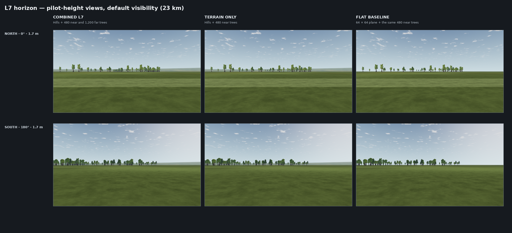

# L7 · A horizon with depth

Date: 2026-10-07. **Status: implemented and engineering-verified; human/GPU review remains open.** Canonical status: [LANDSCAPE-PLAN](../../../LANDSCAPE-PLAN.md). This delivers Phase 5 of the [improvement proposal](../../landscape-improvement-2026-10-07/README.md), using a visual-only slice of L13a. Gate L remains open.

## Review and scope

Phases 0–4 and far-field parcel colour already existed. The next independent step was L7: distant forest, hills and visibility presets. The earlier package still has unresolved L9c lifted surfaces/shimmer work, one small-airplane readability case below its proposed threshold, and pending human/GPU review. L7 does not close those items. L8 near-tree meshes remain unnecessary for this field: its nearest trees are beyond 250 m.

- **Forest:** 1,200 trees in twelve patches at 600–1,500 m, sharing the existing eight sector MultiMeshes. All 480 near positions and their species/height/rotation remain unchanged. Position packing now reaches the negative south/west coordinates; far-only mip alpha compensation helps preserve leaf coverage. [Forest proof](forest.md).
- **Hills:** one contiguous mesh replaces the default 40 km rough plane. Its 43,201 vertices / 84,960 triangles include the flat near disk, the generated hill rows and the outer square boundary. No stacked hill plane, skirts, collision, runtime noise or simulation changes. Smaller/custom rectangles retain their plane geometry.
- **Data:** 25 × 1,440 integer samples, height unit 1/256 m, SHA-256 checked before mesh construction. The profile is generated offline with Python stdlib integers. Its first and last radial rows and east/west scenery corridors are exactly zero. Heights fade in from 1.5–3 km, fade out at 5–6 km and reach at most 101.05 m. All dimensions and shapes are design estimates. [Generator and shape review](generator.md).
- **Visibility:** `-- --visibility=default`, `hazy` or `clear` selects 23, 12 or 40 km. This affects atmosphere rendering only. Default keeps the existing calibration. Clear uses an inverse-distance artificial rim fade (3–20 km parameters); the natural exponential haze still dominates through the near hills. A distance-space fade produced a 12-level band. The inverse-distance correction passes the same four-level full-band gate; see the capture evidence.

The default pilot and rough-surface centers coincide. This first hill profile follows the rough-surface center and is selected for the 40 km footprint; a future field with an offset pilot needs its own explicit horizon placement contract. Hills remain visual-only, as L7 specifies; collision and a float64 terrain sampler belong to L12/L13.

## Proof

Validation isolates these changes on base `45c4d7749524c0996361cfcabf7f076a9af7c1fd`. Other developers' uncommitted physics, radio and desktop-delivery work is excluded. No reset, stash or commit was performed in the shared repository.

| Check | Result |
| --- | --- |
| `test_horizon.gd` | 19 checks: exact height readback, SHA mutation rejection, flat near disk, winding/normals, no internal boundary edges or periodic seam cracks, one surface, atmosphere equality at all three presets |
| Forest | Five Python placement tests, ten far-forest checks, 28,626 runtime tree checks; 1,680 CPU/GPU identities match. Thirteen GPU PNGs and reports repeat byte for byte; at most eight vegetation draws, zero shadow draws |
| Field integration | Home and flight build independent resources with identical geometry and field data; small overlapping rectangles retain the L5 contract |
| Flight trace | All 721 samples and aircraft/physics metadata of a 3 s flight are byte-identical to the baseline; only `created_utc` differs |
| Runway scenario | 51 frames, identical simulation state: 49 visually changed and two unchanged. Scenario verdict: `visual-only change`; synchronization and takeoff checks pass |
| Fresh-clone export | Linux, Windows and macOS builds pass; empty-project pack probes load the hill checksum, hill mesh, tree atlas and all 1,680 placements without loose source files |
| Full headless suite | `app/test.sh` exits 0 in the isolated clone, including every script parse, golden flights, keyboard/radio input, flight checks and frame-rate independence. [Log](headless-tests.log). Final rim-shader change also passes 19 horizon and 27 atmosphere unit checks |
| Horizon captures | [42 views × two runs](capture-summary.json), images and manifests byte-identical. Default/hazy/clear full-band rim maxima: 3.258 / 1.145 / 3.988 levels (limit 4); all 38 default images equal the pre-rim-fix images. Scene totals: 1–6 draws, at most 90,278 primitives. Stale-success summary is removed before a new run; failed-run mutation checked |
| L6c readability | 64 guarded captures complete. All 48 mean ΔE values equal the baseline: game minimum 43.45, minimum ΔE p10 8.88, worst low-contrast share 20.4%. The existing fixed-ground-level case remains 29.45 vs the proposed 30 threshold; no additional misses. [Before](readability-before.json) / [after](readability-after.json) |

The hill mesh built in about 79 ms in the initial headless probe. This is a one-time CPU measurement, not a frame-time or target-hardware claim. The first five production postcards preserved draw counts while adding 76,768 triangles (84,960 replacing 8,192). Final combined capture counts belong in the capture report.



[Raised-view comparison at 140 m](capture-before-after.png).

## Reproduce

```sh
python3 tools/terrain/gen_terrain.py --check
python3 tools/trees/place.py --check
python3 tools/trees/test_place.py
app/test.sh

python3 tools/trees/check_review.py --app app --godot "$(app/get-godot.sh)" --out /tmp/l7-trees
"$(app/tests/visual-env.sh)" tools/terrain/check_horizon.py --app app --godot "$(app/get-godot.sh)" --out /tmp/l7-horizon
"$(app/tests/visual-env.sh)" app/tests/treeline_readability.py capture --app app --godot "$(app/get-godot.sh)" --out /tmp/l7-readability
tools/scenery/scenario.sh /tmp/l7-scenario
app/export.sh
```

Run release checks in a fresh clone. For an exact physics comparison, use baseline and candidate with the same physics revision; remove only the trace's `created_utc` line before comparing. Do not compare an evolving shared physics checkout against an earlier flight.

## Limits and next work

Software OpenGL establishes deterministic rendering and measured budgets, not frame time on the owner's GPU or a human readability result. Gate L stays open. The engine uses custom `FOG` instead of built-in object fog for this material ([Godot 4.7.2 source](https://github.com/godotengine/godot/blob/4.7.2-stable/drivers/gles3/shaders/scene.glsl#L2187)); the explicit rim treatment therefore belongs in the ground shader.

One headless Home→Fly tree test emitted an `AudioStreamGeneratorPlayback` shutdown warning (identified with `--verbose`); the full suite reports no engine errors. This remains an audio-lifecycle observation, not evidence of a tree resource leak.

No external assets or dependencies were added; the generated JSON is about 165 kB uncompressed. The optional real skyline (L17) is deferred. L13a's full physical grid, masks and physics integration are still pending.

The next proposal phase is Phase 6 (cloud grouping and sky/light experiments); the earlier L9c surface/filtering debt remains separately visible in the landscape plan. Preserve aircraft readability and complete the owner/GPU review before treating the field as accepted.
