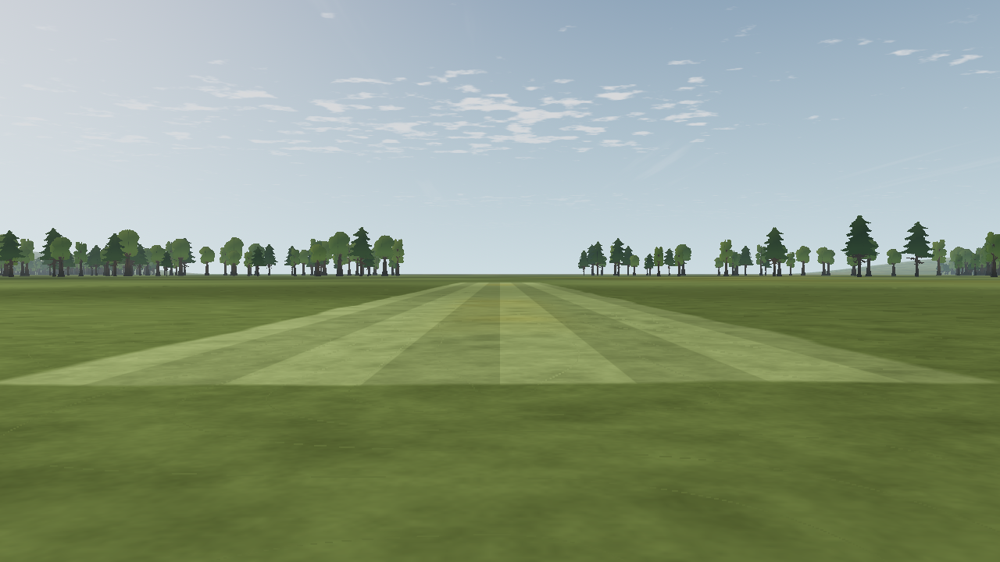

# L9c · Field surfaces in the ground pass

Date: **2026-10-07**. Status: **ground-pass integration engineering-verified; shimmer acceptance open**. Step prefix: **L**.
Canonical status: [LANDSCAPE-PLAN](../../../LANDSCAPE-PLAN.md).

## Change

The default runway is painted by the rough ground's shader. Its separate plane,
previously raised 3 cm, is removed. Contained mown rectangles use the same path.
This removes the competing depth surfaces while keeping the grass colour,
1.5 m mowing stripes, noisy border, touchdown wear, cloud shadows and haze.
The renderer reads the existing field rectangles; physics and field data do not change.

The CPU orders mown surfaces before runways and uploads at most 32 rectangles.
This is an estimated render batch limit, not a new field-format restriction.
A union bounding box skips the surface loop outside the field. Each surface's
colour is derived from the original grass, so overlapping mown/runway areas
do not multiply brightness twice. The filtered border blends over the underlying
surface instead of exposing a rectangular patch of rough grass.

Both rectangle edges use integrated interval coverage, preserving coverage when
a strip becomes smaller than a pixel. The existing 0.2 m artistic border feather
remains. Mowing stripes retain their integrated square-wave filter. Pixel
footprints are evaluated before spatially varying branches, then passed into
the surface function; derivatives inside divergent branches are avoided.

The entire field retains its existing separate planes if there are more than 32
coloured rectangles, any rectangle lacks a containing rough surface, or a
rectangle on the L7 mesh extends outside its flat 1,500 m disk. Nothing is
silently truncated or moved onto hills. This fallback preserves valid custom
layouts, including a runway without any rough surface. The L5 data contract
remains unchanged; render nodes no longer include merged runway/mown meshes.

## Evidence

| Check | Result |
| --- | --- |
| [Full headless suite](headless-tests.log) | `app/test.sh` exits 0: script parsing, aircraft/model, physics, input/UI, flight traces and 30/60/144 fps checks. |
| [Surface contract](field-surfaces.log) | 19 checks: default batch, NED coordinates, reversed priority, exactly 32 rectangles, overflow, missing/uncontained rough surface and hill-boundary fallbacks. |
| [Home/flight integration](field-integration.log) | Independent field instances, custom rectangles, transition parity and existing error handling pass. |
| [Guarded surface captures](capture-summary.json) | Fresh-clone Compatibility run: 24 default and four priority images repeat byte for byte in separate processes. The disabled-surface mutation is rejected. Runway priority pixels exactly match; the mown ring changes 23,040 pixels. |
| [Six-view A/B](view-comparison.json) | Five views save one draw and two primitives; the south-facing view remains byte-identical with unchanged counters. No added asset download. |
| [Flight trace](trace-comparison.json) | All 721 samples and non-timestamp metadata match the baseline. |
| [Runway scenario](runway-comparison.json), [synchronization](runway-sync.json) | All 51 flight-state records match; 44 images change and seven remain identical. Takeoff still passes. |
| [Readability](readability-comparison.json), [full metrics](readability-after.json) | 64 guarded captures; all 48 pose metrics exactly match L11a. The prior marginal fixed-ground-level mean ΔE remains unchanged. |
| [Clean-clone tests](clean-clone-tests.log), [scenery smoke](clean-clone-scenery.log) | Only this change was applied to a fresh local clone. Surface tests and two rendered scenery-on views pass. |
| [Exported pack](pack-check.log) | Linux PCK loads the field, hills, trees and grass from an empty project. No native Windows/macOS run was attempted. |
| [Lint](lint.json) | Zero errors; 12 existing warnings. |

The complete capture wrapper was not run as one invocation. The affected runway,
readability and new surface checks run independently; `app/capture.sh` now invokes
the surface checker and includes its summary hash in the run manifest.
The baseline is commit `38e72809ff06ae0def8da5ee68e3a2adeb0b9011`.
The full-suite and trace comparisons preceded concurrent DATA-3 metadata edits;
the fresh-clone visual proof applies only this landscape change. Captured render
and tool source hashes match the working files.

## Motion measurement boundary

The [controlled capture manifests](default-repeat-1.json) record **34.5% Weber
contrast** at the 100 m runway edge. Surface-on/off pairs
separate the runway contribution from the moving grass texture. Repeated processes
and a disabled-surface control guard against stale captures and a missing runway.
A custom mown rectangle, declared after the runway, verifies both GPU contribution
and runway priority ([fixture manifest](priority-repeat-1.json)). Both
[disabled-surface](disabled-surface-run.json) and
[raw-stripe](unfiltered-stripe-run.json) controls are retained.

The half-pixel residual metric also contains expected camera motion. At oblique
100 m, it changes from about 0.269 without the stripe filter to 0.233 with it;
at 300 m, about 0.721 to 0.696. Neither supports the proposed 25% reduction gate.
Those comparisons remain observations, **not a passing no-shimmer test**. The
checker does not enforce an unsupported motion threshold; L9c's motion acceptance
remains open. An end-on view also suppresses the view-dependent stripe cue, so it
cannot establish stripe filtering by itself.

| Before | Ground pass |
| --- | --- |
|  |  |

## Reproduce

```sh
app/test.sh
"$(app/tests/visual-env.sh)" tools/ground/check_surfaces.py \
  --app app --godot "$(app/get-godot.sh)" --out /tmp/l9c-surfaces
tools/scenery/scenario.sh /tmp/l9c-scenario -- --scenery=off
"$(app/tests/visual-env.sh)" app/tests/treeline_readability.py capture \
  --app app --godot "$(app/get-godot.sh)" --out /tmp/l9c-readability
```

Use fresh output folders for guarded captures. Run the scenario before and after
the change using the same root to produce its comparison.

## References and limits

- [Improvement Phase 4](../../landscape-improvement-2026-10-07/README.md)
  and [surface investigation](../../landscape-improvement-2026-10-07/04-runway-surfaces-benchmarks.md)
  define the appearance and filtering approach.
- [Godot shading-language reference](https://docs.godotengine.org/en/stable/tutorials/shaders/shader_reference/shading_language.html#global-arrays):
  uniform arrays have no initializer and require bounded indexing. The CPU fills
  both arrays and supplies a count; the shader bounds its loop independently.
- No new assets, dependencies or licences. Code is part of the existing MIT project.
- Software OpenGL measures repeatability and render counts, not target-GPU frame
  time or pilot acceptance. Gate L remains open. Asphalt, L10 cues and M5 wind
  remain separate steps; the legacy custom-field fallback still uses lifted planes.
