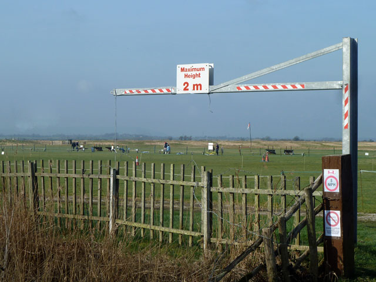
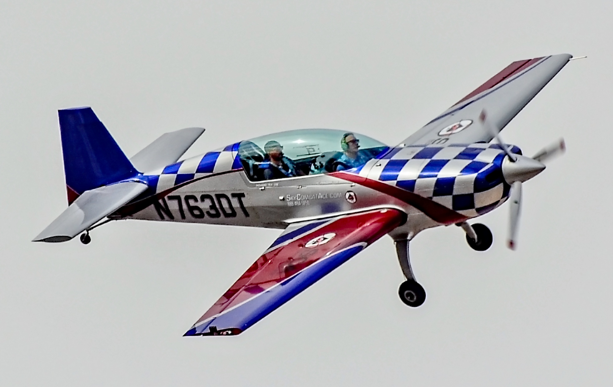

# Referencias visuales de VQ-01b

2026-10-06. Hoja de trabajo para L5/L6 y VQ-02. Las fotografías son referencias de composición y acabado; no se usan como texturas ni se incorporan al juego. Los originales descargados no se han modificado; autores, licencias, URLs y SHA-256 están en [sources.json](references/sources.json).

## Campo RC y horizonte

**Model aircraft airfield**, Robin Webster, 11-03-2012. [Fuente y atribución](https://commons.wikimedia.org/wiki/File:Model_aircraft_airfield_-_geograph.org.uk_-_2843002.jpg), [CC BY-SA 2.0](https://creativecommons.org/licenses/by-sa/2.0/). Original sin modificaciones.

Pregunta para L6: ¿cómo se alternan masas de vegetación, claros y superficie abierta sin ocultar el avión? Referencia para la jerarquía del campo y para evitar una pared continua de árboles. La toma declara focal equivalente de 83 mm: **no** sirve para deducir el FOV del piloto, dimensiones, distancias, color calibrado ni exposición del simulador.

## Pintura y cabina

**N763DT Extra EA-300L**, Tomás Del Coro, 12-05-2022. [Fuente y atribución](https://commons.wikimedia.org/wiki/File:N763DT_Extra_EA-300L.jpg), [CC BY-SA 2.0](https://creativecommons.org/licenses/by-sa/2.0/). Original descargado sin modificaciones.

Pregunta para VQ-02: ¿cómo separan el brillo de la pintura, los reflejos de la cabina y las zonas oscuras los volúmenes del avión? Es un avión real biplaza, no el modelo RC Extra 300S .60: no se emplea para modificar su geometría, proporciones o física. Los reflejos de la foto no son valores de roughness medidos.

## Tres encuadres de aceptación

| Encuadre propio | Caso reproducible | Qué revisar después de L5/L6/VQ-02 |
| --- | --- | --- |
| Piloto | 30 m de altura inicial, t=1,5 s, autozoom activado/desactivado, pareja sin avión | Silueta y contraste local; vegetación fuera de la trayectoria; diferencia entre distancia al piloto y altura |
| Pasada baja | 3 m de altura inicial, t=1,5 s; misma pareja y sombra desactivada | Lectura frente a suelo/bruma y borde de pista, sin contar sombra como parte del avión |
| Inspección | Stik/Extra a 20/50/100 m del ojo, seis actitudes, FOV vertical 50° y luz iguales | Diferencia entre caras superior/inferior y orientación; mismo encuadre entre modelos; no es una prueba de manejo |

La galería de capturas del ensayo conserva los encuadres y manifiestos reales. Las distancias de inspección, los ángulos de prueba (10° sobre el ojo; ascenso/descenso ±45°) y la selección de actitudes son decisiones del fixture, no mediciones de un vuelo. Los casos cercanos ya existentes (`capture-physics-inspect`, `capture-inspect`) sirven para revisar detalles del acabado que no deben dominar la vista normal del piloto.

No se añaden HDRI, mapas de materiales ni dependencias en esta fase. Las muestras CC0 ensayadas para los siguientes pasos siguen documentadas en [el ensayo de materiales](../../visual-quality-material-trial-2026-10-06.md) y [el ensayo de naturaleza](../../visual-quality-nature-trial-2026-10-06.md).
