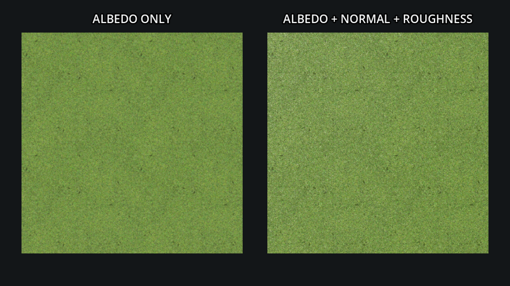

# Ensayo práctico de material PBR para L9 y VQ-02

Fecha: 2026-10-06. El ensayo comprueba que un material PBR CC0 pequeño se puede mostrar con `StandardMaterial3D` en la versión y renderer fijados para el simulador. Es un muestrario visual lado a lado; no mide paridad de píxeles, rendimiento ni lectura durante un vuelo.



## Recurso, licencia y procedencia

Se descargó una vez el paquete **Grass001 1K-JPG** desde el endpoint oficial de [ambientCG](https://ambientcg.com/view?id=Grass001). La página indica dimensiones aproximadas de 1,4 × 1,4 m. La [licencia oficial](https://docs.ambientcg.com/license/) declara CC0 1.0 Universal para los archivos descargables. Consulta: 2026-10-06.

Descarga: `https://ambientcg.com/get?file=Grass001_1K-JPG.zip`, HTTP 200, redirigió a `https://acg-download.struffelproductions.com/file/ambientCG-Web/download/Grass001_lmIxuoR7/Grass001_1K-JPG.zip`. El ZIP descargado midió 10 710 313 bytes; SHA-256 `902f447a64171c8099589642d5bf2d1d6e52c40e94d957eb78eae722084b0cfb`. No se conserva el ZIP completo: solo se guardaron los tres mapas usados, junto a la captura y el fixture reproducible.

El ZIP no traía un archivo de licencia. El [manifiesto de procedencia](../../research/visual-quality/material-trial/assets/provenance.json) guarda la URL oficial de CC0, la fecha verificada, la procedencia de descarga y hashes por mapa.

| Archivo conservado | Uso | Dimensión | Bytes | SHA-256 |
| --- | --- | ---: | ---: | --- |
| `assets/Grass001_1K-JPG_Color.jpg` | Albedo | 1024 × 1024, RGB | 1 764 300 | `b9b6d61bc3b6137b868a3447eef18737896acd26d58fe2f4b83ce8c0e9d3f8ad` |
| `assets/Grass001_1K-JPG_NormalGL.jpg` | Normal OpenGL (+Y) | 1024 × 1024, RGB | 2 338 245 | `eef0b56db5f00a6fcb3d0e0f8463e4e141e88aa85b26527a04d617b75a4ab5d2` |
| `assets/Grass001_1K-JPG_Roughness.jpg` | Roughness, canal rojo | 1024 × 1024, gris | 823 623 | `8810effd44756341170d551501b7d0c645dc2395dbce46a8c7f1e61045258a06` |
| `captures/grass001-albedo-vs-pbr.png` | Captura Godot | 1280 × 720, RGBA | 1 338 599 | `ee17eeb9327bbfb031fec4f6ed1555a61d96b527de019b593be5bb4e056bfc5b` |

El directorio del ensayo ocupa aproximadamente 6,27 MB en total. Las licencias y hashes anteriores describen los archivos fuente y la captura, no una aprobación de su apariencia en el campo del simulador.

## Fixture y resultado observado

El proyecto aislado está en [`research/visual-quality/material-trial/`](../../research/visual-quality/material-trial/). Se ejecutó Godot `4.7.2.stable.official.ed1daf0bf`, renderer **Compatibility**, controlador OpenGL 3 sobre Xvfb/Mesa llvmpipe. La escena pone dos `PlaneMesh` de 2,7 × 2,7 m con orientación, UV, cámara ortográfica y luz direccional iguales. Cada plano cubre el mismo recorte del mismo mapa; las instancias se ven juntas para facilitar la comparación.

- Izquierda: `StandardMaterial3D`, mapa Color, rugosidad base `1.0`, sin normal.
- Derecha: los mismos ajustes, más `NormalGL`, `normal_enabled = true`, `normal_scale = 1.0` y Roughness en canal rojo.
- Escala: el origen declara un tile aproximado de 1,4 m; `uv1_scale = 2.7 / 1.4` repite el tile unas 1,93 veces sobre cada plano. Es un único encuadre frontal, sin desplazamiento de cámara, animación ni vuelo.
- Carga normal: el script usa `Image.load()`, genera mipmaps y crea `ImageTexture`; asigna el archivo `NormalGL` directamente a `StandardMaterial3D.normal_texture`. No hay importador ni archivo `.import` de Godot en este fixture, no se invierte el canal Y y la intensidad queda en `1.0`. Por esta ruta se registra el ajuste de uso en el material, no se valida el preset del importador de texturas de Godot.

En la captura, el panel completo deja ver más relieve fino y variación de iluminación que el panel de albedo solo. La diferencia es apreciable en este acercamiento con luz direccional. No se aisló el efecto de roughness respecto del normal, ni se calculó una métrica de imagen. Aunque la geometría, la pose y la iluminación se mantuvieron iguales, esta disposición con dos instancias sirve como muestra ilustrativa, no como prueba de paridad de un mismo objeto en ambas condiciones.

## Qué cambia en la validación de L9 y VQ-02

Para **L9b**, el ensayo confirma que los tres mapas se pueden usar en Compatibility y que el relieve superficial añade señal visual a escala cercana. La repetición del tile a su escala aproximada sigue visible; por tanto, este resultado no reduce la prueba de autocorrelación ni justifica retirar el ensayo de antitiling del paso. Evalúa también filtros/mips y distancia con el mismo encuadre fijado antes de escoger valores.

Para **L9c**, si se evalúa este recurso en el campo, mantener las zonas de pista, mown y rough atadas a sus rectángulos del modelo de campo. La captura no evalúa bordes, contraste de pista o coherencia con fricción: comprobarlos juntos, con y sin textura, y preservar el borde de pista como señal dominante.

Para **VQ-02**, repetir el método sobre el acabado individual del Stik o del Extra: el mismo objeto, pose, UV/tangentes, luz y cámara, comparando albedo solo con normal y roughness. Mantener los acercamientos y las distancias de 20/50/100 m del plan, y añadir una pasada con movimiento para revisar estabilidad temporal. Esta muestra justifica hacer ese A/B; no demuestra que los mapas mejoren la lectura del avión ni que todos los acabados los necesiten.

## Receta de reproducción

Desde la raíz del repositorio, con `xvfb-run` instalado:

```sh
trial_tmp=$(mktemp -d /tmp/openrc-material-trial.XXXXXX)
mkdir -p "$trial_tmp/project"
cp -R research/visual-quality/material-trial/. "$trial_tmp/project/"
timeout 30s env TRIAL_OUTPUT="$trial_tmp/capture.png" LIBGL_ALWAYS_SOFTWARE=1 \
  xvfb-run -a -s '-screen 0 1280x720x24' \
  .tools/Godot_v4.7.2-stable_linux.x86_64 \
  --path "$trial_tmp/project" \
  --rendering-method gl_compatibility --rendering-driver opengl3 --quit-after 120
file "$trial_tmp/capture.png"
sha256sum "$trial_tmp/capture.png"
```

El script [`capture.gd`](../../research/visual-quality/material-trial/capture.gd) crea la escena y guarda la imagen desde el viewport tras `RenderingServer.frame_post_draw`; usa `TRIAL_OUTPUT` para que cada ejecución escriba en el directorio recién creado. El límite es 120 frames y 30 s. Copiar el proyecto a `/tmp` mantiene fuera del repositorio los archivos `.godot` e importaciones temporales. En esta máquina Godot reportó OpenGL Compatibility sobre llvmpipe; no se usó esa ejecución para medir coste o FPS y no sustituye una validación en GPU real.
