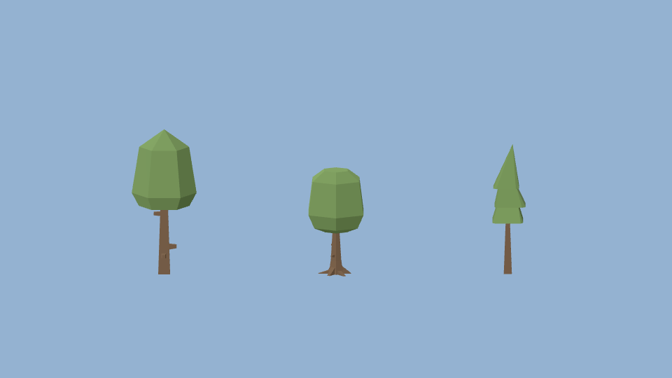

# Ensayo práctico: Kenney, glTF Transform, Khronos y MultiMesh

2026-10-06. **Decisión: adaptar esta muestra como candidato de L6a/L8.** La selección ya tiene licencia, archivos pequeños e importación probada; quedan atlas, escala de campo, lectura en vuelo y export. No se implementó L6 en la app.

Se usaron realmente **glTF Transform 4.5.0**, **glTF Validator 2.0.0-dev.3.10**, Godot **4.7.2-stable Compatibility** y Pillow/NumPy del entorno visual existente. Node 24.19.0 y npm 11.17.0; dependencias locales con lockfile, sin instalación global ni addon runtime. Linux/Xvfb, Mesa 25.2.8, llvmpipe LLVM 20.1.2, 960 × 540, MSAA 4×. Son pruebas de archivos/render, **no rendimiento de la RTX 3090**.

## Fuente concreta y selección

[Kenney Nature Kit](https://kenney.nl/assets/nature-kit) declara CC0. Se descargó su ZIP oficial y se conservaron solo `tree_default`, `tree_oak`, `tree_pineTallA` y `License.txt`. La página etiqueta la publicación como 1.0 y el texto incluido dice 2.1: se identifica la descarga por **SHA-256**, no se inventa una versión que resuelva esa discrepancia. [Procedencia y hashes](../../research/visual-quality/nature-trial/provenance.json), [licencia original](../../research/visual-quality/nature-trial/source/License.txt).

La necesidad era una familia de tres siluetas simples por debajo de 1.000 triángulos, sin dependencia runtime. Kenney satisface esa parte con poca adaptación; ez-tree queda como alternativa si la apariencia facetada falla en L6c. No hace falta instalar Blender ni portar un generador para descubrirlo.

## Mediciones y fallos encontrados

| Archivo | Triángulos | Superficies | Original | Tras `weld` |
| --- | ---: | ---: | ---: | ---: |
| tree_default.glb | 114 | 2 | 9.428 B | 8.708 B |
| tree_oak.glb | 196 | 2 | 14.644 B | 13.444 B |
| tree_pineTallA.glb | 78 | 2 | 7.200 B | 6.700 B |

1. **Los tres originales fallan Khronos** con `SCENE_NON_ROOT_NODE`: un nodo referenciado como raíz también figura como hijo de `tmpParent`. Godot los importa, pero eso no acredita conformidad glTF. Tras leer/escribir con glTF Transform `weld`, los tres derivados tienen **cero errores y cero warnings**; quedan avisos informativos de UV sin uso y nodo vacío. [Informes completos](../../research/visual-quality/nature-trial/evidence/validation.json).
2. El total pasa de 31.272 a 28.852 bytes, **−7,7 %**. Se conservan triángulos y superficies. La captura original y la reescrita son **idénticas byte a byte** en este encuadre. El interés principal es normalizar/validar la fuente; este ahorro de bytes no demuestra una mejora de FPS.
3. **Dos superficies por árbol no caben automáticamente en 24 draws.** Una escena sintética con 8 grupos × 3 especies × 20 árboles, todos visibles, da **48 draws / 62.080 primitivas**. Un adaptador específico reúne los colores en vértices y conserva normales/índices: **24 draws / 62.080 primitivas**. Los grupos del ensayo no son todavía los sectores del campo. Sin suelo, avión, sombras, alfa ni pases adicionales; tampoco prueba culling de sectores.
4. Esa unión conserva la imagen hasta **1 nivel por canal de 8 bits** (media absoluta 0,0111 en el muestrario y 0,0434 en los grupos). El guard compara píxeles, no exige PNG idéntico para esta representación distinta. [Comparación numérica](../../research/visual-quality/nature-trial/evidence/pixel-comparison.json).
5. **Material importado no equivale a material adecuado.** El GLB enumera `KHR_materials_unlit`, pero no lo aplica a estos materiales. Godot importa sombreado por píxel, `metallic=1`, `roughness=1`: hojas y corteza llegan como metal. La variante artística cambia a `metallic=0` y una paleta provisional (`#66824b` hojas / `#68513c` corteza), conservando geometría. No se atribuye esa mejora al optimizador ni se declara una paleta final.
6. El primer adaptador oscurecía colores al llamar `srgb_to_linear()`. En esta prueba Compatibility se conserva el albedo importado directamente en `COLOR`; el A/B bajó de 54 a **1 nivel** de diferencia máxima. El [flag de color sRGB](https://docs.godotengine.org/en/4.7/classes/class_basematerial3d.html#class-basematerial3d-property-vertex-color-is-srgb) solo actúa en Forward+/Mobile. No trasladar esta receta entre backends sin repetir el A/B.
7. **Seis capturas repetidas en dos procesos** son idénticas entre repeticiones; [resultado](../../research/visual-quality/nature-trial/evidence/repeatability.json). El runner usa un proyecto/importación temporales, exige directorio de salida vacío, revisa código de salida/errores y limita frames. Los archivos originales inválidos solo se toleran en el A/B diagnóstico para el error conocido; ningún derivado con errores pasa.



[Original](../../research/visual-quality/nature-trial/evidence/repeat-1/source.png) · [unión conservando materiales](../../research/visual-quality/nature-trial/evidence/repeat-1/merged-colors.png) · [480 instancias](../../research/visual-quality/nature-trial/evidence/repeat-1/multimesh-merged.png) · [contadores y materiales importados](../../research/visual-quality/nature-trial/evidence/repeat-1/result.json).

## Cómo cambia el trabajo de implementación

- **L6a:** empezar por estos tres derivados validados. Ajustar paleta, material dieléctrico y altura/datum; las alturas originales de malla (~1,23–1,71 unidades) no son alturas botánicas. Preservar la traslación de raíz de −0,05 donde exista. Generar el atlas 1024² y probar bordes/mips antes de ampliar la familia. El bake todavía no se ha hecho.
- **L6b:** una superficie/material por grupo de cards; ocho sectores × hasta tres especies ⇒ hasta 24 draws del pase visible. Medir pases reales después de activar sombras/efectos. No confundir número de nodos MultiMesh con número de draws.
- **L8:** usar el adaptador de color solo para esta clase de árbol opaco, estático y sin texturas; construir el recurso final offline. Reutilizarlo en un avión articulado destruiría contratos que el ensayo no cubre. Probar LOD, frustum y correspondencia card/malla antes de integrar.
- **Pipeline de assets:** `inspect → validator fuente → transformación acotada → validator derivado → importación Godot → A/B → export limpio`. [La CLI](https://gltf-transform.dev/cli) recomienda elegir transformaciones según el contenido; no ejecutar `optimize` con Draco/WebP/flatten por defecto. [Khronos Validator](https://github.com/KhronosGroup/glTF-Validator) valida estructura; no decide si el árbol se ve bien ni si distrae al piloto.

## Reproducción

Desde la raíz, con Node/npm instalados. No se necesita volver a descargar el pack: las tres fuentes y licencia están versionadas. Instalar tooling local con el lockfile:

```bash
npm ci --prefix research/visual-quality/nature-trial
python3 research/visual-quality/nature-trial/run.py \
  --godot .tools/Godot_v4.7.2-stable_linux.x86_64 \
  --tools research/visual-quality/nature-trial \
  --out /tmp/openrc-nature-reproduction
.tools/visual-venv/bin/python research/visual-quality/nature-trial/compare.py \
  /tmp/openrc-nature-reproduction
```

`--out` debe ser nuevo/vacío. El entorno Pillow/NumPy se obtiene mediante [visual-env.sh](../../app/tests/visual-env.sh) si no existe. [run.py](../../research/visual-quality/nature-trial/run.py) verifica hashes de entrada y versión CLI; [probe.gd](../../research/visual-quality/nature-trial/probe.gd) conserva todos los parámetros y reconstruye los derivados en temporal. El lockfile fija también Khronos. Las capturas pueden cambiar entre drivers; la repetición y los A/B deben hacerse dentro del mismo entorno.

**Pendiente:** atlas con padding/mips/alpha scissor, cuatro azimuts/dos elevaciones del campo, escala física etiquetada, lectura humana, export Linux/Windows/macOS, memoria y frametimes en hardware real. Estos ensayos resuelven decisiones de autoría; no cierran los gates de L6 ni VQ-06.
